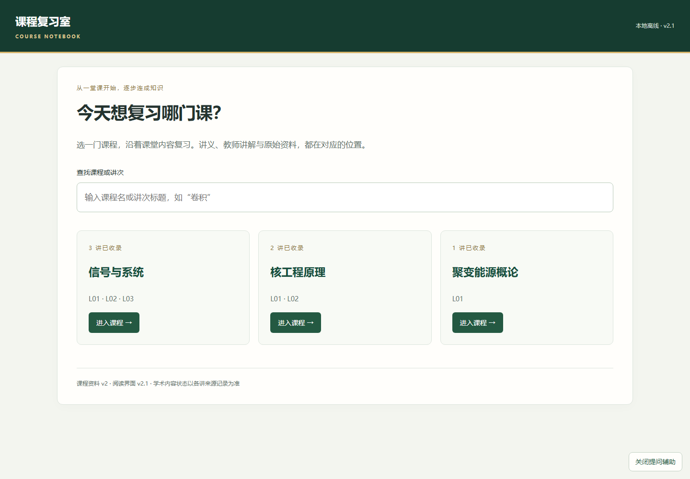
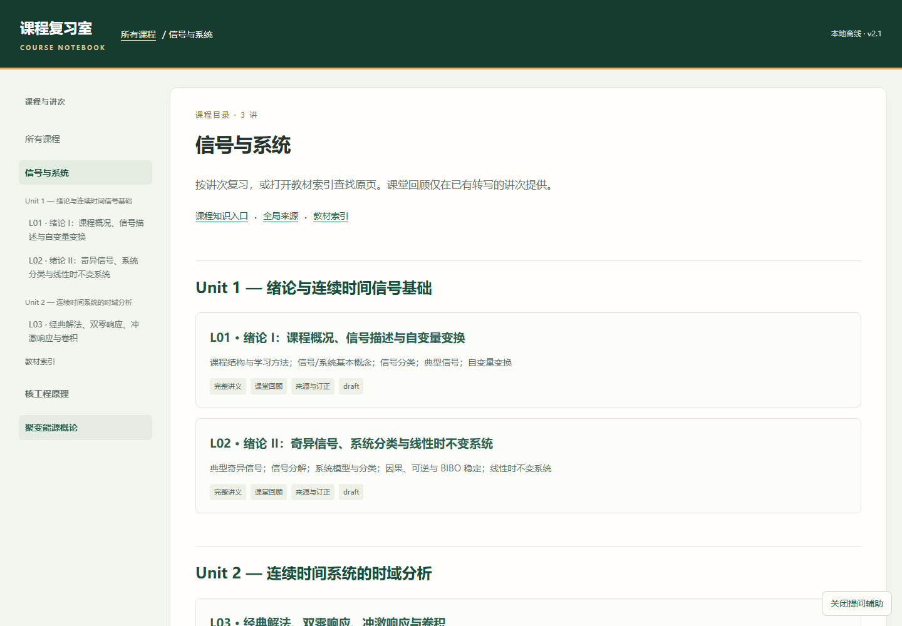

# 课程复习室

**把课件、课堂转写和教材整理成可以从头到尾复习的课程资料。**

面向清华大学工程物理系，以及学习相同或相近课程的同学。按课程、讲次和主题阅读讲义，回顾教师讲解，在需要时回到课件、教材和原音核对。

## 开始使用

**只想阅读：** 到 [Releases](https://github.com/zhyu-24/course-study-room/releases/latest) 下载 **course-study-room-offline.zip**，完整解压，双击根目录的 **index.html**。

选课程 → 选讲次 → 从本讲目录开始复习。无需安装 Python、Node.js 或 Codex，无需登录或启动服务器；公式与图片随包保存，可以断网阅读。请保留完整目录结构，不要只复制一个 HTML 文件。

**希望通过 Git 更新：** 先安装 Git 与 [Git LFS](https://git-lfs.com/)，再执行：

~~~sh
git lfs install
git clone https://github.com/zhyu-24/course-study-room.git
cd course-study-room
git lfs pull
~~~

教材与音频使用 Git LFS。GitHub 的普通 **Code → Download ZIP** 可能仅包含这些大文件的指针，请优先下载上面的离线整包，或使用 Git LFS 克隆。

## 适合哪些场景

| 你想做什么 | 怎么用 |
|---|---|
| 从头复习一堂课 | 打开“完整讲义”，按主题阅读解释、推导和例题 |
| 回顾老师怎么讲 | 有课堂转写的讲次可切到“课堂回顾” |
| 核对结论和疑点 | 打开“来源与订正”，查看依据及未确认项 |
| 查教材原页 | 在课程目录打开“教材索引” |
| 换课或复习下一讲 | 使用左侧导航或正文底部的前后讲入口 |
| 用窄窗口阅读 | 展开“课程与讲次”“本讲目录”面板 |

当前有 **信号与系统 L01–L04、核工程原理 L01–L03、聚变能源概论 L01**。随课程推进增量更新；实际收录与课堂覆盖范围以各讲来源记录为准。

## 不懂的地方，怎样问 AI

这是**默认关闭的可选辅助功能**，不影响正常阅读。

1. 点击右下角“提问辅助”。
2. 选中文字或公式，点击“就此提问”；图片先放大，再点“询问这张图”。
3. 写下问题，点击“复制问题与定位”，粘贴到 Codex 对话发送。

例如，选中“阶跃如何形成窗口”，问：“这里的加窗和取单边是什么意思？”材料会带上课程、讲次、主题、原文和文件路径，公式保留原始 LaTeX。

**不会自动发送资料。** 没有 Codex 也能完整使用课程阅读；其他 AI 若无本地文件访问能力，不会仅凭路径就取得文件。辅助层可随时关闭，缺失或出错不阻止阅读。详见[使用说明](AI_Course_Archive_v2/optional/question-helper/README.md)。

## 资料范围与可信度

- 区分课件、教师整理稿、教材依据与补充推导，不把 AI 补讲写成教师原话。
- 缺录音、转写或教材时说明材料边界，不伪造课堂内容。
- **draft** 表示仍可能存在错误或待核查项；阅读体验认可不等于逐条学术审定。
- 原音定位可用，不代表所有片段都已核听。
- 本项目是同学间的学习辅助与学术交流资料，**不是学校或院系发布的官方教材、标准答案或课程通知**。

发布者已确认取得此次公开课程资料所需的转载许可。第三方教材、教师课件和录音的权利仍归原权利人，项目不将其重新许可为自有作品。具体边界见[资源与署名说明](docs/RESOURCES.md)。

## 补充与维护

只阅读不需要构建。维护者以 Markdown 为唯一内容底稿，请不要直接修改 HTML 中的教学正文。

~~~text
课程名/
├─ Course_Index.md              课程与讲次导航
├─ Global/                     教材索引、来源与原件
└─ Lectures/Lxx/
   ├─ Lecture_Notes.md          完整复习讲义
   ├─ Transcript_Corrected.md   有转写时的忠实整理稿
   └─ Lecture_Source_Map.md     来源、覆盖范围和疑点
~~~

准备 Python 3.11 或更新版本，在项目根目录运行：

~~~sh
python AI_Course_Archive_v2/scripts/build_portal.py
~~~

项目自带 Markdown 和 KaTeX 依赖。生成器读取既有图片、音频和底稿；新增素材的核验与整理方法见[维护文档](AI_Course_Archive_v2/README.md)。不带提问辅助的构建：

~~~sh
python AI_Course_Archive_v2/scripts/build_portal.py --without-helper
~~~

维护者发布流程见[更新与同步](docs/PUBLISHING.md)。欢迎通过 Issues 指出具体课程、讲次、主题及依据，帮助核查错误。

## 免费共享与非商业使用

本项目仅用于学术交流，帮助清华大学工程物理系及其他学习类似课程的同学更好地学习课程。**原创代码与学习内容免费公开，不设置付费门槛。**

允许依照[项目许可](LICENSE)进行个人学习、非商业教学交流、修改与分享，并保留署名和来源。拒绝冒名占有、删除来源后据为己有，以及未经许可的售卖、付费打包、商业课程捆绑等盈利使用。

本项目采用**源码公开、免费非商业共享**条款；不声称是允许商业使用的标准开源许可证。第三方资料与组件保留各自权利和许可证，详见[第三方声明](THIRD_PARTY_NOTICES.md)。

