# 信号与系统 L01 · 课程地图、典型信号与波形运算

本讲按约79分钟原始转写与65页课件重建。开场课程要求也保留；末段课件中未详细讲解的例题与微积分图，单独标为课件自学和补充推导。有录音，但本轮未完成核听；关键识别/表述疑点可从课堂回顾定位原音。

正文依据课件与已注明的课堂材料编写；额外解释标为“补充推导”或“教材补充”。本版尚未经过逐项人工学术复核。

[来源、覆盖与疑点](Lecture_Source_Map.md)

## 1. 怎样学这门课：先建立课程地图

这门课用数学模型研究信号及系统对信号的作用。前半程主要是连续时间系统，后半程主要是离散时间系统；两边都经历“时域描述→变换域分析→应用”。傅里叶变换把信号联系到频率成分，拉普拉斯变换扩大分析工具，离散部分进一步学习Z变换、DTFT、DFT与FFT。第一章提供共同语言，不宜只当成名词目录。

教师建议先预习教材、再听讲做笔记、课后先复习再做作业。课件是课堂提示，不替代书中的连续论证。参考书可以帮助看同一问题的不同组织方式，英文术语有利于后续读专业材料；AI可辅助讨论，但需要用教材、条件和计算检验答案。

本班课件推荐郑君里等第四版（2024），教师说第三版也可使用但习题有少量差异。**当前归档教材确认为第三版上册**。讲义中的教材定位以实际第三版为准，不把第四版推荐书目信息当成已归档版本。

课程图将傅里叶/拉普拉斯、信号空间、变换应用及滤波联系起来，教师明确本学期不覆盖教材第11、12章全部内容。学习时既要能做代数运算，也要理解波形和工程含义；Python、MATLAB可用于画图和数值验证，不能代替概念判断。

课程要求按原课堂保留：平时作业15%、课堂参与5%、期中40%、期末40%；本年度取消通常的大作业。教师提到的“挑战任务替代考试”仍在考虑中，不是已经生效的规则。作业要求手写后上传，一般次周一23:59前提交，节假日可能调整，迟交按80%计；前后半学期作业还有相应考试前的补交边界。完整日历在PPT p.8，其中11月13日标为期中；转写中个别日期不一致，日程仍须以课程通知核准。课堂强调独立思考与诚信，不接受复制答案或临近结课讨分。

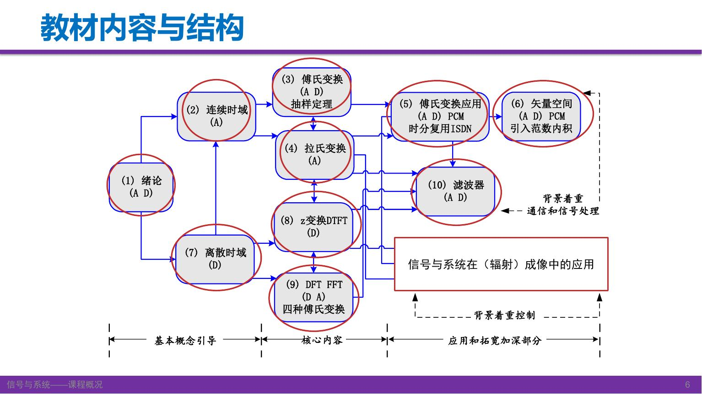

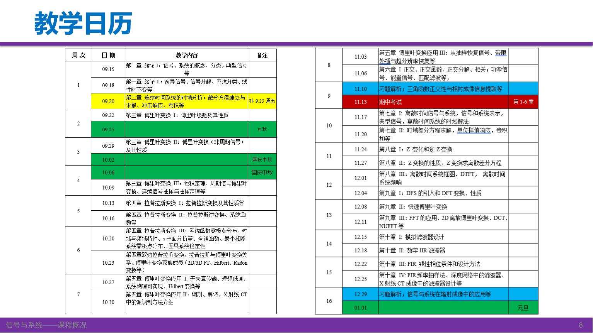

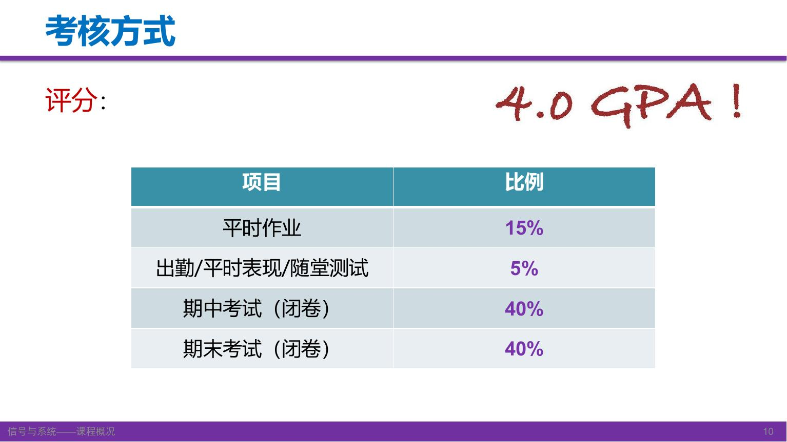

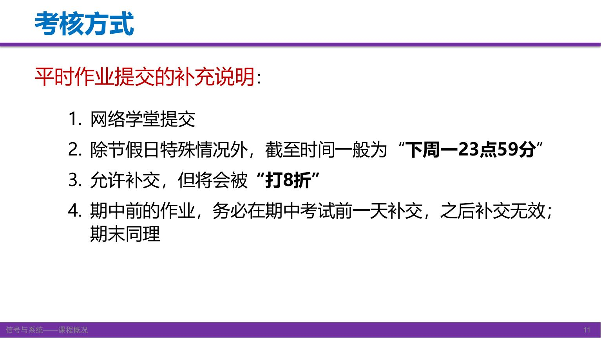

自测：本课程为什么同时强调解析式和波形？

解析式便于推导和计算，波形揭示时间、幅度和结构；两者互相核查。例如自变量乘2代表时间压缩，而不是幅度乘2。

[回到教师讲解](Transcript_Corrected.md#T01) · [来源与覆盖](Lecture_Source_Map.md)

## 2. 信号、消息、信息：载体与含义分开

信号是随时间或空间变化、用于承载消息的物理量或其数学表示。消息是传递的内容；信息可理解为接收者获得的新认识。相同的物理信号是否带来新信息，与接收者已有知识有关。教师用日常消息作直观说明，并非在这里推导严格的信息熵公式，也不能把“字数少”直接等同于“信息量大”。

语音例子把空气压力变化表示为 \(x(t)\)，横轴时间、纵轴声压或其对应电压，因此是一维信号。灰度图可写成 \(I(x,y)\)，两个空间坐标为自变量，亮度为函数值。彩色图可写成 \((R(x,y),G(x,y),B(x,y))\)：它有三个通道，但仍以两个空间坐标定位，不应把RGB三个分量误称为三个空间维度。

信号分析关注性质、分解和特征；信号处理对信号作变换以满足任务，例如去噪、滤波；传输关注信号如何从一处到另一处。课程主要研究分析方法并接触处理和传输应用。PPT p.22–26的烽火、电报、卫星、北斗和太空算力插图属于这一背景延伸，转写没有逐图详细解释，不能据此补造讲授过程。

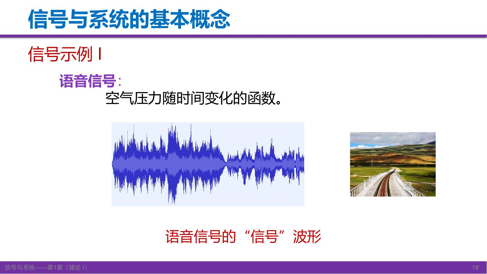

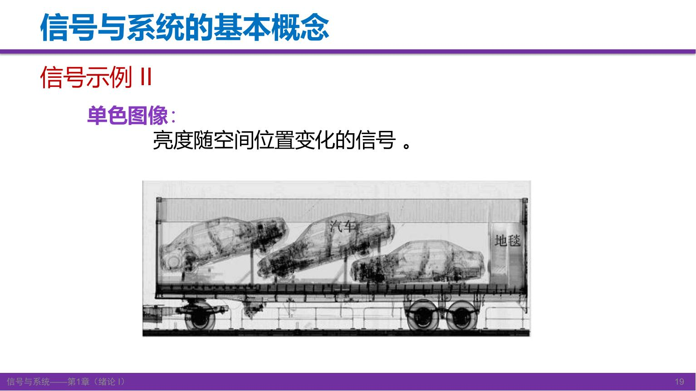

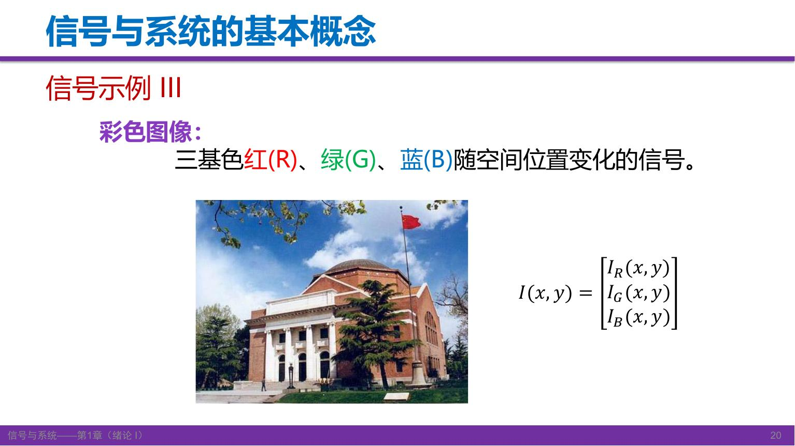

自测：彩色照片为何可称二维三通道信号？

像素位置由x、y两个自变量决定；每个位置有R、G、B三个分量。自变量维数与输出分量数不同。

[回到教师讲解](Transcript_Corrected.md#T08) · [来源与覆盖](Lecture_Source_Map.md)

## 3. 系统：从框图看输入怎样成为输出

系统由相互作用、相互依赖的组成部分构成，整体完成某种功能。研究时可以把系统分成子系统，也可以把多个环节视为一个整体，关键是明确输入、输出和边界。

广播通信框图从信息源开始：传感器把消息转为可处理信号，发送设备经信道传递，接收设备取得信号，转换器恢复供使用的消息。数字处理框图则是“防混叠滤波→A/D→数字处理→D/A→平滑滤波”。**读图提示：** 中间计算处理的是离散数字表示，输入输出仍可能是连续物理量；A/D前后的对象与D/A前后的对象不能不加区分。

电路侧重内部电压、电流和元件关系；网络常侧重连接结构；系统侧重整体功能及输入输出关系。这些词在实际语境中可能交叉使用，不能只凭名称认定不同物理对象。系统也不限于电系统，还可按自然/人工/混合、物理/概念等角度讨论。

**分析**是给定系统模型与激励，求响应并解释其意义；**综合/设计**是给定功能或响应要求，构造实现它的系统。教师用滤波任务说明后一类问题，并指出课程以后会接触滤波器。CT例子把信号获取、处理和图像形成联系起来，说明信号与系统研究并非只用于通信。这里不把CT示意扩写成课堂已经推导过重建算法。

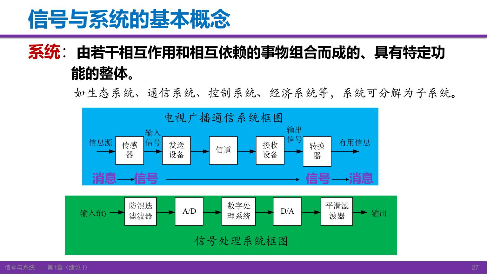

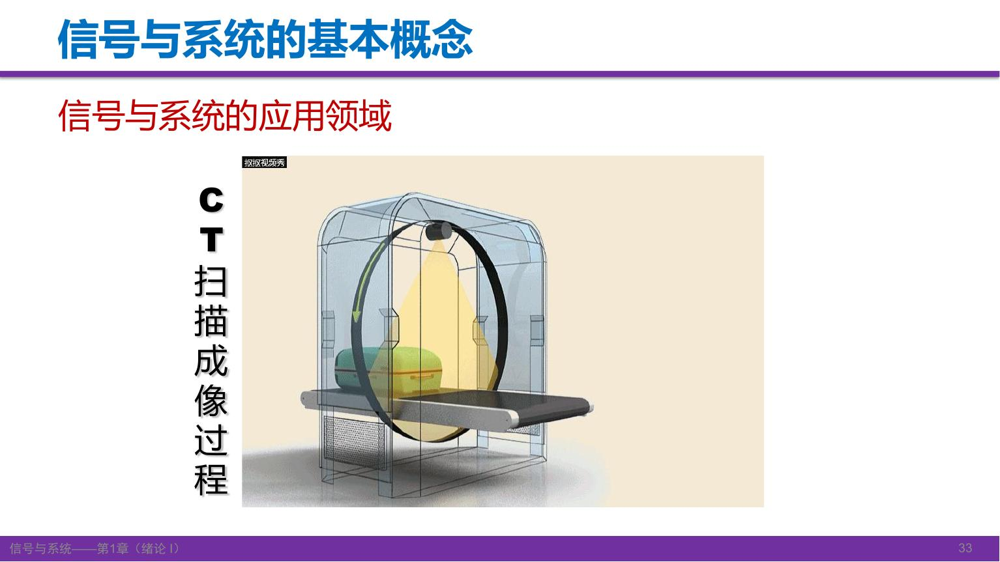

自测：已知滤波器求输出，与要求压制噪声而设计滤波器，分别是什么问题？

前者是系统分析，后者是系统综合/设计。分析还需解释计算结果的物理意义。

[回到教师讲解](Transcript_Corrected.md#T11) · [来源与覆盖](Lecture_Source_Map.md)

## 4. 分类先问：自变量连续，还是函数值连续

确定性信号的取值可由确定规则描述；随机信号用统计规律描述，不能把“看起来乱”当成唯一标准。伪随机序列可能外观随机但由确定算法生成。本课主要从确定性信号开始，概率统计为随机信号的后续分析提供语言。

连续时间与离散时间按**定义域**分类：连续时间信号在连续的时间范围内定义，允许函数值存在跳变；离散时间信号只在规定的离散时刻定义，其他时刻不是“值为0”，而是通常没有定义。抽样关系写成
\[
x[n]=x_c(nT_s),\qquad n\in\mathbb Z.
\]
\(T_s\)是抽样间隔，\(n\)为样本序号，包含0和负整数；横轴从实际时间换成序号不改变样本值。

| 时间 | 幅度 | 本课名称 |
|---|---|---|
| 连续 | 连续取值 | 模拟信号 |
| 离散 | 连续取值 | 抽样信号 |
| 连续 | 离散取值 | 量化信号 |
| 离散 | 离散取值 | 数字信号 |

“抽样”改变时间取值集合，“量化”改变幅值集合，两步作用不同。阶梯状波形可能在每一个时刻都有定义，所以不能看见台阶就判为离散时间信号。

课件p.43三个图的判别过程：第一图是连续时间锯齿，虽然有跳变仍属于连续时间；第二图只在离散时刻给值，幅值未限定为某几个等级，所以判离散时间；第三图同时只取1、2、3三个幅值，判数字信号。后两图只画有限片段，不能单凭当前片段保证全序列周期性。

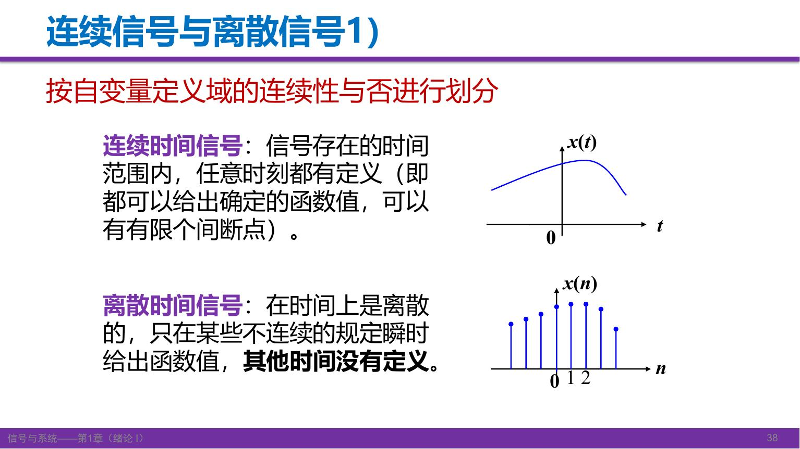

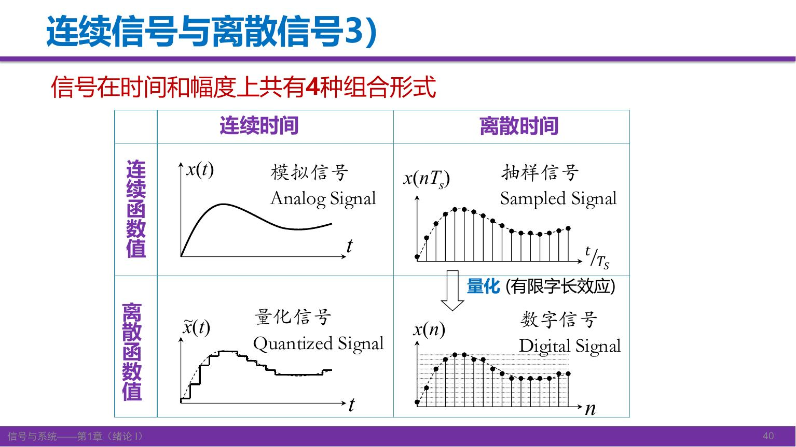

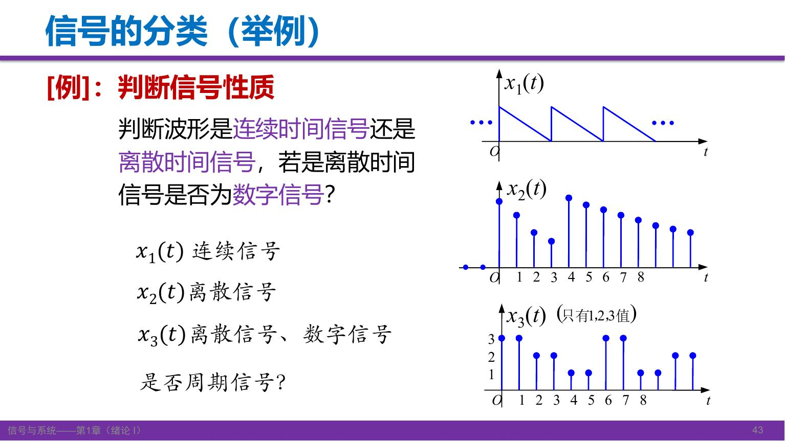

自测：一条有跳跃的阶梯曲线是否一定是离散时间信号？

不一定。先看是否对所有时间定义，再看幅值是否离散。跳跃是函数连续性问题，与时间定义域是否离散不同。

[回到教师讲解](Transcript_Corrected.md#T15) · [来源与覆盖](Lecture_Source_Map.md)

## 5. 周期性及本讲暂不展开的分类

连续时间周期信号要求存在 \(T>0\)，使所有定义域内相应时刻满足 \(x(t+T)=x(t)\)。若存在最小正周期，称为基本周期。离散时间周期信号要求存在正整数 \(N\)，使 \(x[n+N]=x[n]\) 对所有整数 \(n\) 成立。

**补充推导：** 对 \(x[n]=e^{j\omega_0n}\)，周期条件为 \(e^{j\omega_0N}=1\)，即 \(\omega_0N=2\pi k\)，所以须能找到整数 \(N>0,k\)。这解释了为何不能把连续正弦周期公式算出的任意实数直接当成离散序列周期。

教师用周期延拓说明周期与非周期信号之间的联系：取一段波形反复排列可构造周期波形，令重复间隔越来越大可研究孤立波形的极限。这是一种分析思想，不是“所有非周期信号实际有一个无穷大周期”的严格定义。

课件还列出能量/功率、一维/多维、因果/非因果信号。能量与功率的完整条件留待后续；本讲不伪造已经讲过的推导。因果信号在此通常指 \(t<0\) 时为0的信号，应与系统因果性区分，系统因果性将在后讲说明。

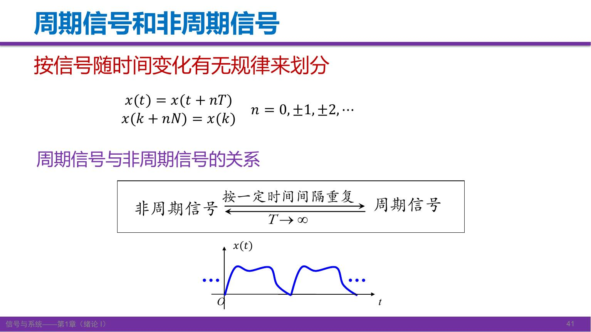

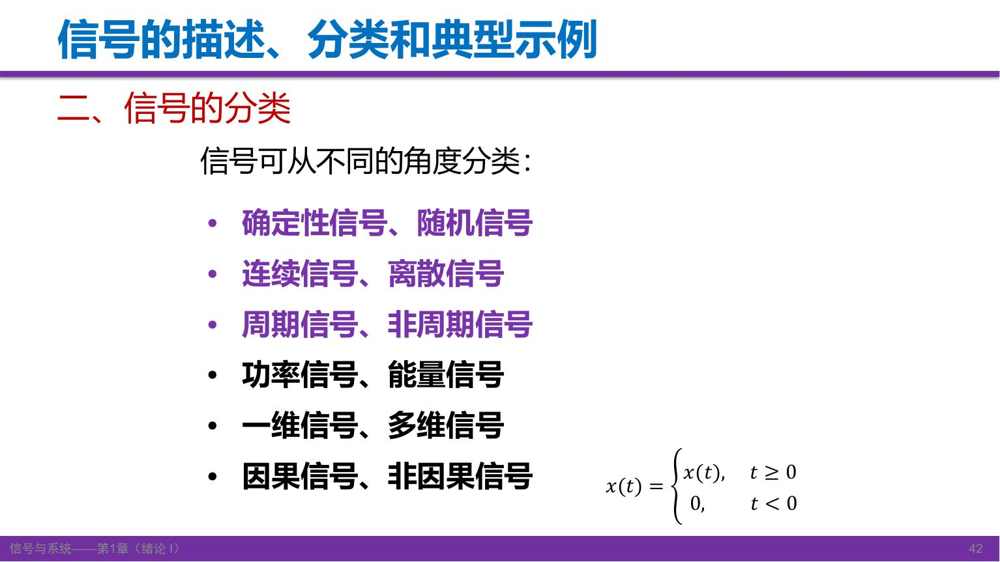

自测：周期条件为什么不能只检查几个相邻点？

周期性要求对全定义域成立；有限局部重复只是线索。离散信号还要求周期是正整数。

[回到教师讲解](Transcript_Corrected.md#T17) · [来源与覆盖](Lecture_Source_Map.md)

## 6. 常数、正弦与实指数：参数控制波形的哪里

直流信号 \(x(t)=A\) 对所有时间保持同一幅度。正弦类信号可写作 \(x(t)=K\sin(\omega t+\theta)\)，\(K\)控制幅度、\(\omega\)控制变化速度、\(\theta\)控制初始相位。\(\omega\ne0\)时基本周期 \(T=2\pi/|\omega|\)，频率 \(f=1/T\)；余弦可看作相位不同的正弦，不能漏掉角频率与频率间的 \(2\pi\)。

实指数 \(x(t)=Ke^{\alpha t}\) 中，\(\alpha>0\)随时间增长，\(\alpha<0\)衰减，\(\alpha=0\)变为常数。单边衰减信号还指定起始时刻：
\[
x(t)=\begin{cases}0,&t<0,\\e^{-t/\tau},&t\ge0,\end{cases}\qquad\tau>0.
\]

**教材补充（第三版印刷p.8–9，PDF p.24–25）：** 在 \(t=\tau\) 时，幅度为 \(e^{-1}\approx0.368\)，因此时间常数越大，衰减越慢。若把“衰减快慢”只记成指数前面有负号，就无法区分两条都衰减却速率不同的曲线。

“单边”意味着负时间被置零，不能只写 \(e^{-t/\tau}\) 却默认为负时间也为零。写公式时同时写参数条件和时间范围，波形才被完整确定。

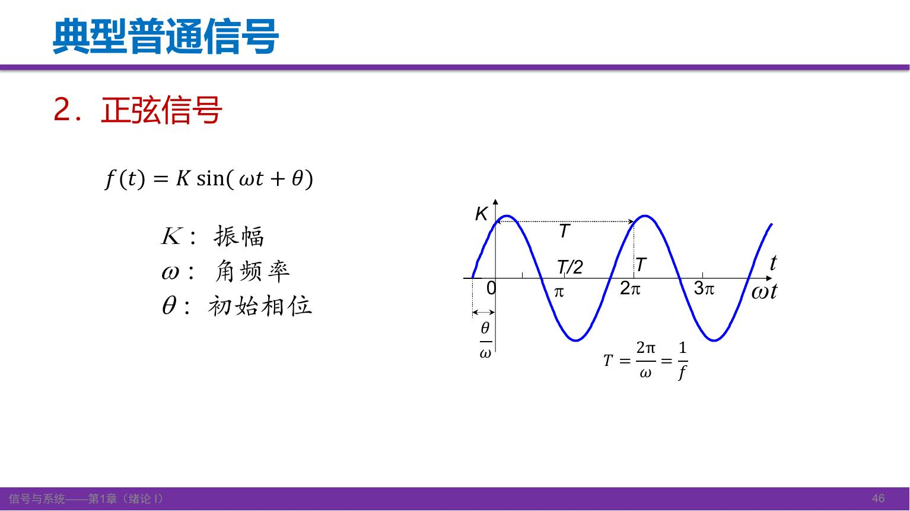

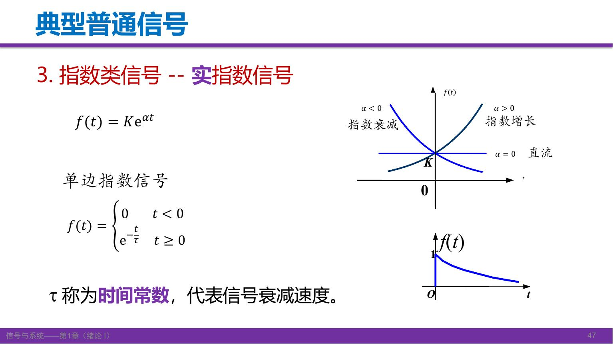

自测：时间常数增大一倍，信号衰减更快还是更慢？

更慢。到达原幅度1/e需要的时间正是τ；τ增大意味着相同衰减程度要等待更久。

[回到教师讲解](Transcript_Corrected.md#T19) · [来源与覆盖](Lecture_Source_Map.md)

## 7. 虚指数与复指数：欧拉公式要会双向使用

工程中用 \(j\) 表示虚数单位，\(j^2=-1\)。虚指数
\[
e^{j\omega_0t}=\cos(\omega_0t)+j\sin(\omega_0t)
\]
可看成复平面单位圆上的旋转向量，实部和虚部分别为余弦与正弦。模恒为1；\(\omega_0\ne0\)时周期为 \(2\pi/|\omega_0|\)。

**补充推导：** 把正负频率的欧拉公式相加，正弦项抵消；相减，余弦项抵消，于是
\[
\cos\omega_0t=\frac{e^{j\omega_0t}+e^{-j\omega_0t}}2,\qquad
\sin\omega_0t=\frac{e^{j\omega_0t}-e^{-j\omega_0t}}{2j}.
\]
教师强调从虚指数认出正余弦、从正余弦认出虚指数两种能力都要熟练，这会贯穿傅里叶分析。

一般复指数为 \(Ke^{st}\)，其中 \(s=\sigma+j\omega_0\)。展开得
\[
Ke^{st}=Ke^{\sigma t}\cos\omega_0t+jKe^{\sigma t}\sin\omega_0t.
\]
实部和虚部带有同一个指数包络：\(\sigma<0\)衰减，\(\sigma>0\)增长，\(\sigma=0\)退化为等幅虚指数。波形在振荡并不自动代表周期；若包络变化，通常不能经过固定时间完全重复。转写中的“负指数”在这段实际对应课件p.49“复指数”，已据公式订正。

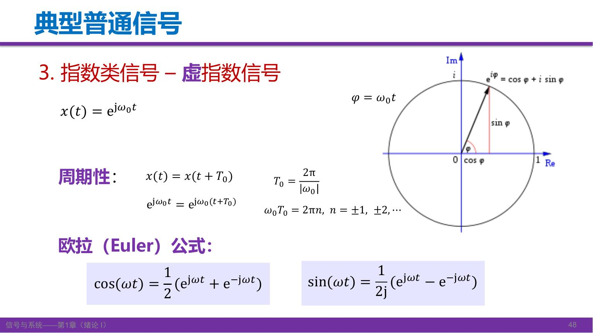

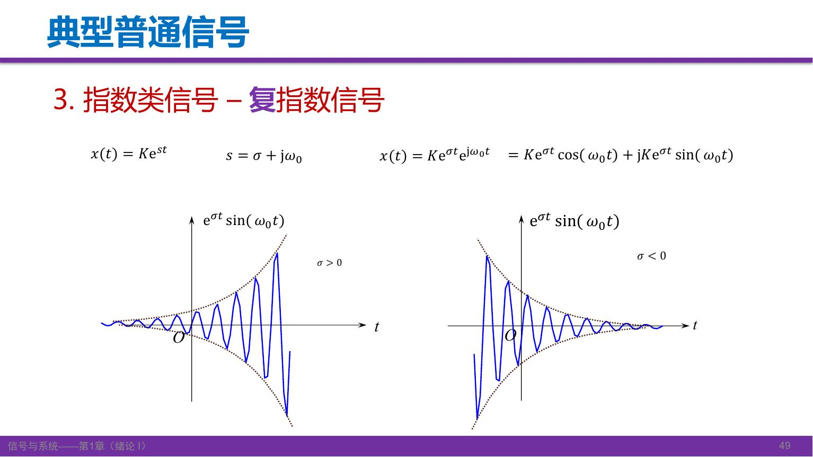

自测：σ<0的复指数虽然振荡，是否仍是周期信号？

通常不是。相隔一个正弦周期后相位重复，但指数包络改变，所以整个信号并未重复。

[回到教师讲解](Transcript_Corrected.md#T20) · [来源与覆盖](Lecture_Source_Map.md)

## 8. Sa、sinc与高斯：会读形状，也会读归一化

\[
\operatorname{Sa}(t)=\begin{cases}\sin t/t,&t\ne0,\\1,&t=0.\end{cases}
\]
零点为 \(t=k\pi\)（非零整数k），它是偶函数，中心主瓣最高为1，两侧振荡幅值逐渐减小。\(t=0\)的值来自极限，不是把0/0当作普通除法。教师口头“周期振荡”应理解为有振荡外观，**Sa本身不满足周期定义**。

课件采用归一化 \(\operatorname{sinc}(t)=\sin(\pi t)/(\pi t)=\operatorname{Sa}(\pi t)\)，其非零整数点为零点。不同书籍可能把sinc用于不同归一化，遇到符号先查定义。本课给出的积分性质为 \(\int_0^\infty\operatorname{Sa}(t)dt=\pi/2\)，\(\int_{-\infty}^{\infty}\operatorname{Sa}(t)dt=\pi\)。教师此处要求掌握使用，不要求课堂完成收敛性证明。

“抽样信号”这一函数名不要与“对任意连续信号抽样得到的离散序列”混淆。教师用矩形脉冲与傅里叶变换的联系作预告，具体幅度和尺度将在后续按变换约定计算。

高斯钟形脉冲写成 \(x(t)=Ee^{-(t/\tau)^2}\)，取 \(\tau>0\)。它关于原点对称，峰值E，\(t=\tau\)时为E/e，\(t=\tau/2\)时为约0.78E；参数τ控制宽度。课上只作简要介绍，本节参数解读由课件和教材PDF p.27补足。

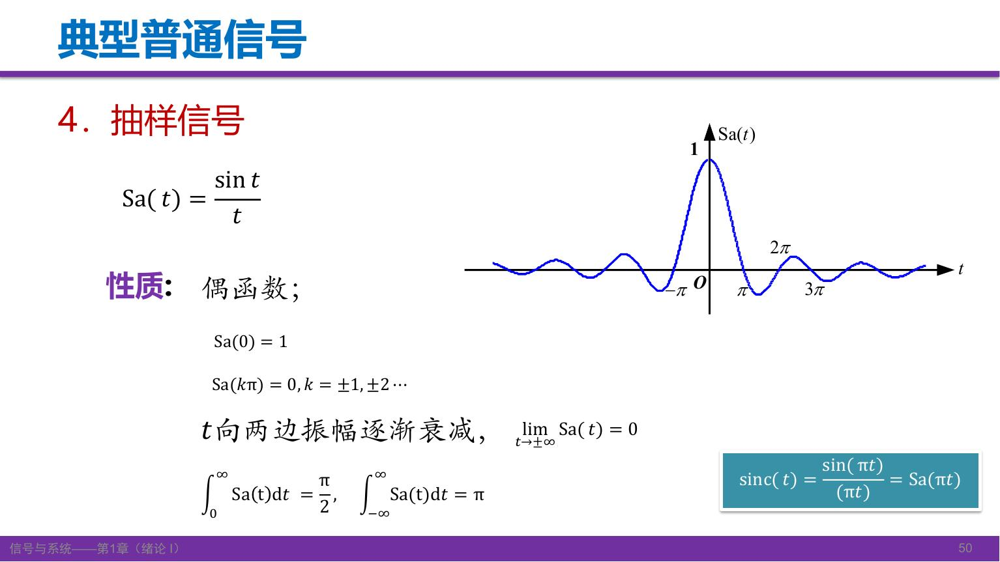

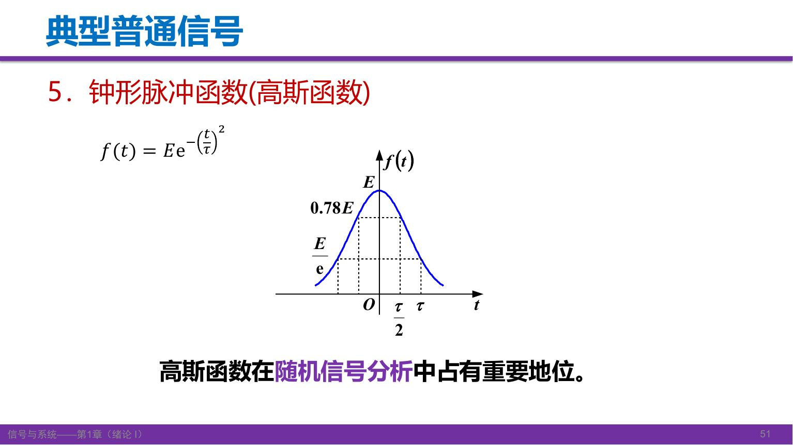

自测：Sa与本课sinc的第一个正零点各在哪里？

Sa(t)在π；sinc(t)=Sa(πt)在1。两者归一化不同，不能只记名称。

[回到教师讲解](Transcript_Corrected.md#T22) · [来源与覆盖](Lecture_Source_Map.md)

## 9. 平移、反褶与尺度：用特征点避免方向错误

信号的自变量运算改变波形在时间轴上的位置和尺度；函数值运算改变幅值或建立其他信号。先区分 \(f(2t)\) 与 \(2f(t)\)：前者时间压缩，后者纵向放大。

平移：\(y(t)=f(t-\tau)\)。原来发生在 \(u=t_0\) 的特征，现在满足 \(t-\tau=t_0\)，所以发生于 \(t=t_0+\tau\)。\(\tau>0\)右移/延迟，\(\tau<0\)左移/超前。口头“往前往后”容易混，使用方程比依赖方向词可靠。

反褶：\(y(t)=f(-t)\)，特征点 \(t_0\to-t_0\)，左右镜像、幅值不变。课堂说物理器件不能实现，需理解为任意未知、全时间信号的实时反演需要未来信息；已经存储的有限序列可以倒序读取，并不矛盾。

尺度：\(y(t)=f(at)\)，\(a\ne0\)，特征点 \(t_0\to t_0/a\)。\(|a|>1\)压缩，\(0<|a|<1\)扩展，宽度变为原来的 \(1/|a|\)；\(a<0\)还反褶。课件p.56的三条斜坡在1、1/2、2处达到同样高度，说明变的是时间，不是峰值。

**补充推导：通用特征点法。** 对 \(y(t)=f(at+b)\)，令旧自变量为u，则每个原特征点映射到
\[
t=\frac{u-b}{a}.
\]
先列端点、拐点、跳变点，再变换横坐标，最后按新时间从小到大连接，幅度保持。这个方法能同时检查支撑区间和方向。

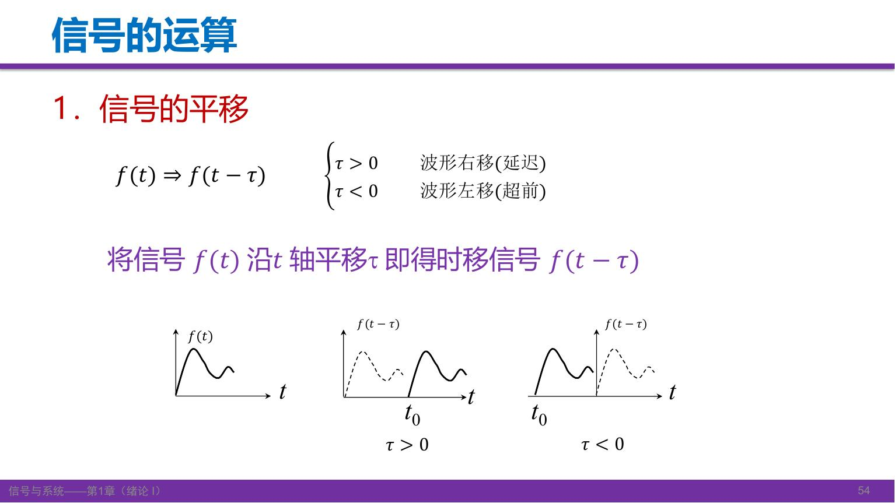

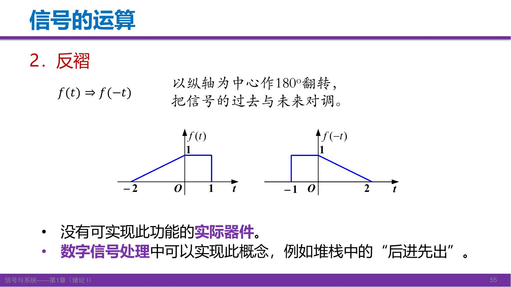

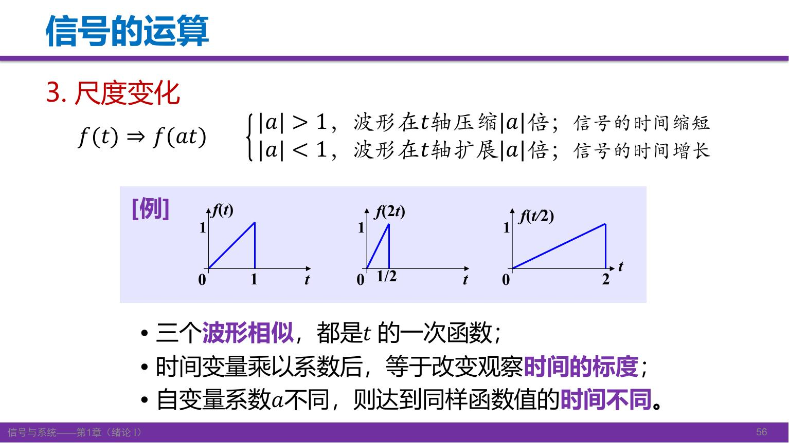

自测：f(2t)的峰值是否变成原来两倍？

不会。原峰值对应的时刻除以2，峰值仍相同；2f(t)才是幅值乘2。

[回到教师讲解](Transcript_Corrected.md#T25) · [来源与覆盖](Lecture_Source_Map.md)

## 10. 组合变换例题：把中间每一步写出来

**课堂主要例题（PPT p.58）：** 原三角波支撑在[-1,2]，峰值在u=1处为2，求 \(f(-t-1)\)。用 \(u=-t-1\)，得 \(t=-u-1\)：

| 原特征u | −1 | 1 | 2 |
|---|---:|---:|---:|
| 新时刻t | 0 | −2 | −3 |
| 原幅值/新幅值 | 0 | 2 | 0 |

按新时间排序，波形从(-3,0)升到(-2,2)，再降到(0,0)，其余为0。两种操作路线均可达到它：先把f(t)延迟1成f(t−1)，再将整个函数的t换成−t；或者先反褶得到g(t)=f(−t)，再将g超前1，得到g(t+1)=f(−t−1)。

**重要条件：** “可以换次序”是指调整每一步参数后可到达同一目标，不表示保持相同平移量任意交换仍相等。原转写末尾有f(−t+1)的混乱表达，整理稿保留编者注，正确路线由原课件图与逐步代入确定。

**课件自学＋补充推导（p.59）：** 原图为 \(f(u)=u\)（0≤u≤2），区间外0，求 \(f(4-2t)\)。先解 \(0\le4-2t\le2\)，得 \(1\le t\le2\)；在此区间输出为4−2t，从(1,2)下降到(2,0)。也可先反褶、再压缩2倍、最后右移2：\(f(t)\to f(-t)\to f(-2t)\to f[-2(t-2)]\)。

**课件自学＋补充推导（p.60）：** 已知g(t)=f(2−2t)，反求f。令u=2−2t，解t=1−u/2，所以 \(f(u)=g(1-u/2)\)。原g图的t=0,1,2分别映到u=2,0,−2，时间方向反转并拉宽2倍。原图在t=1有跳变，恢复后的u=0仍有跳变，只是左右侧互换；不要把跳变连成一条连续斜线。

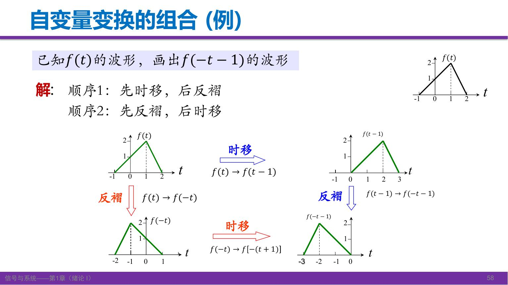

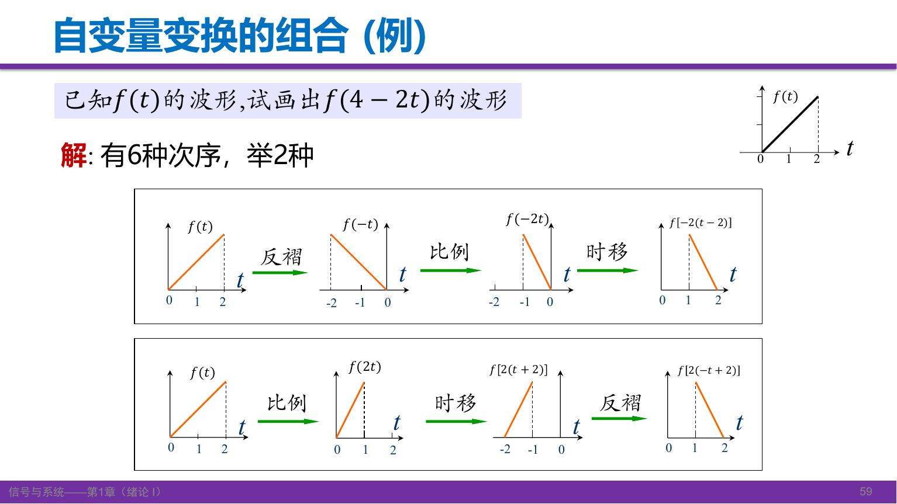

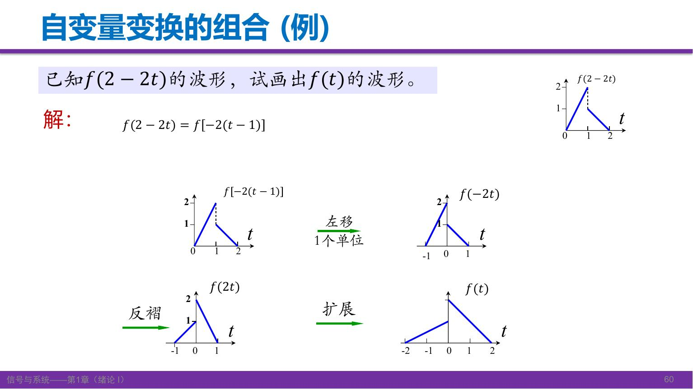

自测：从g(t)=f(−t)到f(−t−1)，应该把g左移还是右移1？

左移1：g(t+1)=f(−t−1)。若右移1则g(t−1)=f(−t+1)，不是题目目标。

[回到教师讲解](Transcript_Corrected.md#T28) · [来源与覆盖](Lecture_Source_Map.md)

## 11. 微分、积分、相加与相乘：课件自学部分

转写末尾教师将其余图形内容留作自学，下面保留原图并补足步骤，不写进教师整理稿冒充课堂推导。

微分 \(y(t)=df/dt\) 读的是局部变化率；积分 \(z(t)=\int_{-\infty}^{t}f(\lambda)d\lambda\) 读的是累积面积，积分变量应与上限t区分。p.61原图在−τ到0线性升到1，0到τ恒为1，τ以后降为0。前一段斜率为1/τ，平台斜率0；τ处的向下跳变在广义导数中还对应负冲激，原简图没有完整表示它，不能将图中普通函数部分当成全部导数。

**补充推导：** 对这条原波形，累积积分为
\[
z(t)=\begin{cases}0,&t<-\tau,\\(t+\tau)^2/(2\tau),&-\tau\le t<0,\\t+\tau/2,&0\le t<\tau,\\3\tau/2,&t\ge\tau.\end{cases}
\]
第一段由三角形面积得二次函数，平台段积分线性增加，信号结束后总面积保持1.5τ。图上0处0.5τ与最终1.5τ可以用面积直接验算。

两信号相加、相乘都是同一时刻的对应值运算。p.62相加的例子表现叠加干扰；相乘的例子表现调制。不要把逐点相乘等同于卷积：卷积是后续涉及位移、乘积与积分的另一种运算，这里仅作预告。

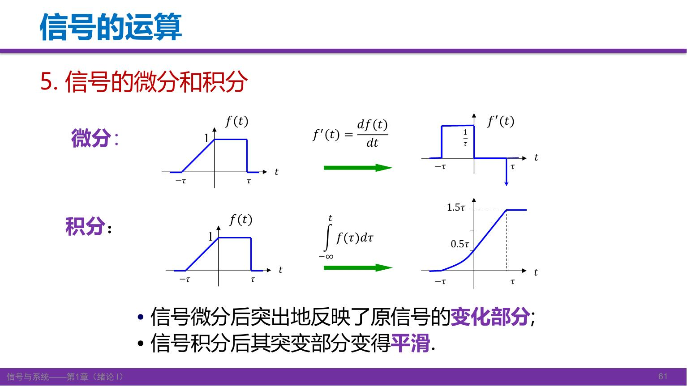

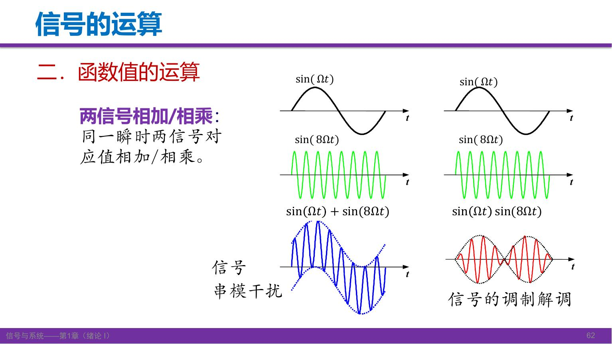

自测：原信号在某段为零，累积积分是否也必须为零？

不一定。积分保存此前累积的面积；信号结束后可保持非零常数。

[来源与覆盖](Lecture_Source_Map.md)

## 12. 作业、教材对应和复习出口

课件p.64作业为 **1-3、1-4、1-5，1-10(a)(b)(c)，1-12单号小题**；预习§1.4–§1.8。课堂最后确认有画图相关作业，但未逐题口述，题号以课件所列为证据。

当前第三版上册已核页：印刷p.40/PDF p.56有1-3及1-4开头，p.41/PDF p.57接续1-4并列1-5，p.42/PDF p.58有1-10与1-12。其中1-4是变换次序练习，1-10含三角波、阶梯波和半周期正弦图；这些定位直接来自当前版本原页，不由题号猜测。第四版尚未归档，不能宣称跨版题面逐字相同。

教材主题定位：信号与系统PDF p.17–20；分类p.20–24；典型波形p.24–27；运算p.27–31。课堂只简略解释的步骤，可用本讲补充推导后再回页核验。

读完后应能自己做三件事：给一条波形按正确的轴分类；从参数解释正弦、指数和Sa的形状；把任意 \(f(at+b)\) 的端点和拐点映射出来。下讲从阶跃、冲激等信号继续，尚不熟悉冲激时可先理解普通分段波形，并将第11节跳变导数说明作为连接点。

[教材目录入口](../../Global/Textbook_Index.md) · [实际第三版作业页](../../Global/Raw/信号与系统_第三版_郑君里_上.pdf#page=56)

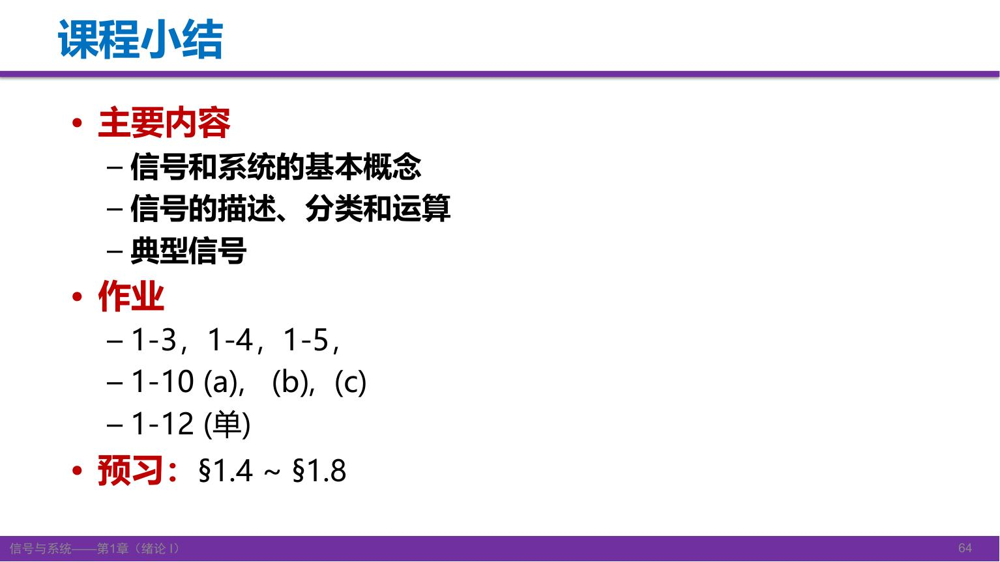

自测：本讲讲义里的自测和PPT指定作业有什么关系？

自测检验本节理解，由编者编写；指定作业来自PPT p.64，两者分开，完成自测不代表已交作业。

[回到教师讲解](Transcript_Corrected.md#T28) · [来源与覆盖](Lecture_Source_Map.md)

