# 绪论 II：从冲激信号走到线性时不变系统

这堂课要解决的问题是：**复杂输入经过一个系统以后，会产生什么输出？** 前半堂学习便于表示复杂信号的基本单元，后半堂说明哪些系统允许我们把这些单元的响应组合起来。把两部分连起来，才理解为什么单位冲激如此重要。

本讲义以 54 页课件和完整课堂转写为主，核查第三版教材 §1.4–§1.8。按课堂主线展开，同时补足必要计算步骤。标作“补充推导”的部分为编者展开；原音尚未核听，因此涉及疑似口误时保留说明。本讲义与课堂回顾均为待人工复核的 draft。

建议先连续读完讲义，遇到抽象处点开课件图，再做每节自测。想回顾教师如何解释，可点击“课堂回顾”。[教材目录与题目入口](../../Global/Textbook_Index.md) · [本讲来源与订正](Lecture_Source_Map.md#source-overview)

## 1. 先接上上一讲：变换的是自变量

开场回顾平移、尺度变化与反折。信号有函数表达式，也有波形图；变换表达式时，必须能说明波形发生了什么。

若 \(g(t)=f(t-1)\)，原来出现在 \(t=0\) 的特征，要等到新变量满足 \(t-1=0\)，即 \(t=1\) 才出现，所以是**延时 1**。同样，\(f(2t)\) 在时间轴上压缩为原来的一半，\(f(-t)\) 关于纵轴反折。

**补充推导：反折与平移不能不加调整地交换。** 对已经形成的 \(g(t)=f(t-1)\) 反折，得到 \(g(-t)=f(-t-1)\)。若先构造 \(h(t)=f(-t)\)，再把它延时 1，则 \(h(t-1)=f(-t+1)\)，两者不同。可以选择不同操作路径，但需要相应调整平移方向和距离。原转写“可以交换顺序”的口语不能直接当作交换律。

普通信号也要熟悉：常数信号、正弦、实指数、复指数、抽样函数与高斯函数。尤其是

\[
e^{j\theta}=\cos\theta+j\sin\theta,\qquad
\cos\theta=\frac{e^{j\theta}+e^{-j\theta}}2,\qquad
\sin\theta=\frac{e^{j\theta}-e^{-j\theta}}{2j}.
\]

这组欧拉关系把正弦振荡与复指数联系起来，之后进行变换域分析时会反复使用。教师本节只回顾抽样信号，未展开它名字的由来。

> 本节的两条主线：把复杂信号分成简单信号；研究允许组合和时移响应的 LTI 系统。前者给“积木”，后者给“怎样组装”的规则。

来源：S1 PDF p.1–3；S2 00:00–08:24。[课堂回顾 T01–T02](Transcript_Corrected.md#T01)

自测：f(t−2) 再反折，结果是什么？

把整个新函数的自变量 \(t\) 换成 \(-t\)，得到 \(f(-t-2)\)，不能直接把括号整体取负写成 \(f(-t+2)\)。

## 2. 斜变、阶跃、符号函数：用简单函数搭波形

“奇异”在这里不是神秘，而是指函数本身或相关导数、积分出现不连续等特殊性质。这些是从实际过程抽象出来的理想模型。例如斜变函数本身在零点连续，但斜率在那里改变。

### 2.1 斜变如何截平

单位斜变（ramp）信号为

\[
R(t)=\begin{cases}0,&t<0,\\t,&t\ge0.\end{cases}
\]

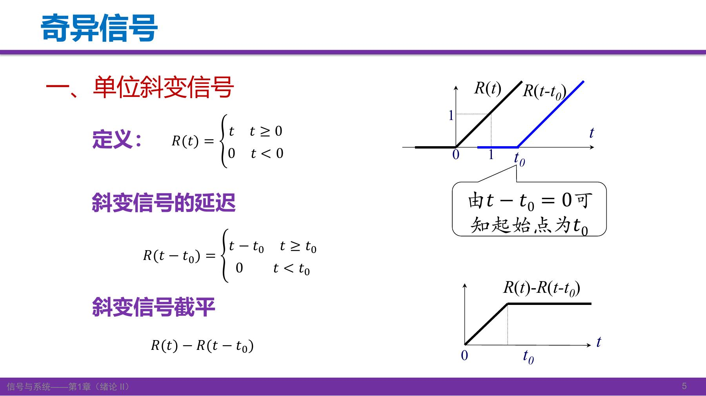

\(R(t-t_0)\) 在 \(t=t_0\) 才开始向上爬升。两者相减，第二条斜线在 \(t_0\) 后抵消第一条的继续增长。

**补充推导**（设 \(t_0>0\)）：

\[
R(t)-R(t-t_0)=
\begin{cases}
0,&t<0,\\
t,&0\le t<t_0,\\
t-(t-t_0)=t_0,&t\ge t_0.
\end{cases}
\]

读图时应看到三个区间：未开始、线性上升、保持不变。相减并没有让信号在 \(t_0\) 后变成零，而是让它的**斜率**变成零。

### 2.2 阶跃如何形成窗口

单位阶跃为 \(u(t)=0\;(t<0)\)、\(u(t)=1\;(t>0)\)。跳变点 \(t=0\) 单独约定，本课程课件可留作无定义或取 \(1/2\)；计算涉及该点时要说明采用哪种约定。

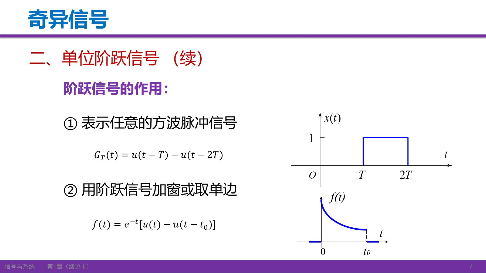

设 \(T>0\)。\(u(t-T)\) 在 \(T\) 打开，减去 \(u(t-2T)\) 则在 \(2T\) 关闭，所以

\[
G_T(t)=u(t-T)-u(t-2T)
\]

只在 \(T<t<2T\) 为 1，其他非边界时刻为 0。判断表达式时，不妨分别代入窗口左侧、内部和右侧三个时刻。

将窗口乘到已有信号上，就只保留窗口内的部分。例如

\[
f(t)=e^{-t}[u(t)-u(t-t_0)]
\]

在 \(0<t<t_0\) 等于衰减指数，其余非边界时刻为零。“相减搭窗口，相乘截信号”是不同的两个操作。

### 2.3 符号函数

\[
\operatorname{sgn}(t)=\begin{cases}1,&t>0,\\-1,&t<0,\end{cases}
\qquad \operatorname{sgn}(t)=2u(t)-1\quad(t\ne0).
\]

它保留自变量的正负信息，是奇函数。教师用绝对值作口头说明；**补充写全**为 \(|t|=t\operatorname{sgn}(t)\)，在零点也可按 \(\operatorname{sgn}(0)=0\) 延拓。原稿涉及某个积分变换名称的识别不清，不影响这里的恒等式，未据此扩展课程内容。

来源：S1 PDF p.4–8；G1 PDF p.31–34 / printed p.15–18。[课堂回顾 T03–T06](Transcript_Corrected.md#T03)

自测：怎样表示只在 2&lt;t&lt;5 时等于 3 的矩形脉冲？

\(3[u(t-2)-u(t-5)]\)。括号决定支持区间，前面的 3 决定幅值。端点值随阶跃的零点约定。

## 3. 单位冲激：宽度趋零，面积保持不变

### 3.1 不能把冲激当作普通的“一个无限高的点”

课件先用直觉描述 \(\delta(t)\)：除零点外为零，全轴积分为 1。教师同时强调，这种描述方便但不足以给出严格定义。它应通过**广义极限或对测试函数的作用**理解，不能使用普通函数的点值运算去随意计算 \(\delta(0)\) 或 \(\delta^2(t)\)。

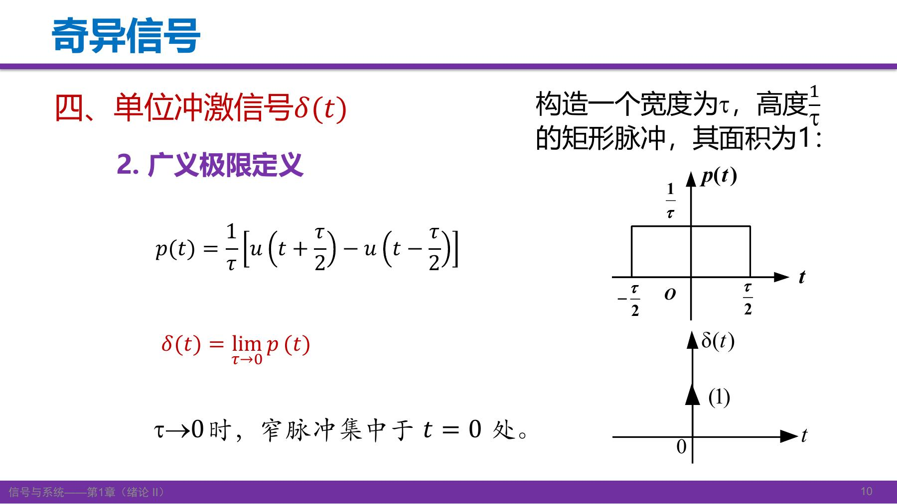

宽为 \(\tau\)、高为 \(1/\tau\) 的矩形脉冲可写成

\[
p_\tau(t)=\frac1\tau\left[u\left(t+\frac\tau2\right)-u\left(t-\frac\tau2\right)\right].
\]

它的面积始终为 \((1/\tau)\tau=1\)。当 \(\tau\to0^+\)，脉冲越来越窄、高度越来越大，但面积不丢失。课件还列出归一化三角脉冲、双边指数、高斯、抽样函数等逼近方式；关键是采用适当的归一化族与广义极限，不是任意面积为 1 的函数都自动趋于冲激。

更稳妥的表达是：对适当测试函数 \(\phi\)，

\[
\int_{-\infty}^{\infty}\phi(t)\delta(t)\,dt=\phi(0).
\]

课程层面先要求抽样点附近连续；涉及冲激导数时还需相应光滑性。

### 3.2 RC 充电例子：巨大峰值不等于巨大电荷

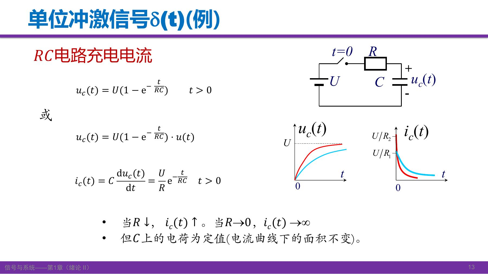

电容最初无电压，接上恒压 \(U\)，在 \(t>0\) 时

\[
u_C(t)=U(1-e^{-t/(RC)}),\qquad
i_C(t)=C\frac{du_C}{dt}=\frac UR e^{-t/(RC)}.
\]

这里电压记作 \(u_C\)，不要和阶跃 \(u(t)\) 混淆。电阻越小，初始电流 \(U/R\) 越大，时间常数 \(RC\) 越小，充电越快。

**补充推导：**

\[
\int_0^\infty i_C(t)\,dt
=\frac UR\int_0^\infty e^{-t/(RC)}dt
=\frac UR(RC)=CU.
\]

因此在理想化极限中得到的是强度为 \(CU\) 的冲激电流，而不一定是单位冲激。这说明冲激图上括号中的数表示**积分强度**，不是箭头的有限高度。

### 3.3 冲激的位置与强度

\(K\delta(t-t_0)\) 的位置为 \(t_0\)，强度为 \(K\)。对包含 \(t_0\) 的积分区间，其积分为 \(K\)；不包含冲激位置则为零。边界恰好落在冲激处时需单独约定，不能直接套用“完整包含”的结果。

来源：S1 PDF p.9–15；G1 PDF p.34–39。[课堂回顾 T07–T09](Transcript_Corrected.md#T07)

自测：2δ(t−3) 与 δ(t−3) 的区别是什么？

位置都在 \(t=3\)，前者全轴积分为 2，后者为 1。区别是强度，不是普通函数意义的有限幅值。

## 4. 冲激的筛选、展缩与微积分关系

### 4.1 先筛选，再积分抽样

若 \(x\) 在 \(t_0\) 附近连续，课程使用

\[
x(t)\delta(t-t_0)=x(t_0)\delta(t-t_0).
\]

这仍是一个冲激信号，只是强度由 \(x(t_0)\) 决定。再做全轴积分，才得到一个数：

\[
\int_{-\infty}^{\infty}x(t)\delta(t-t_0)\,dt
=x(t_0)\int_{-\infty}^{\infty}\delta(t-t_0)dt=x(t_0).
\]

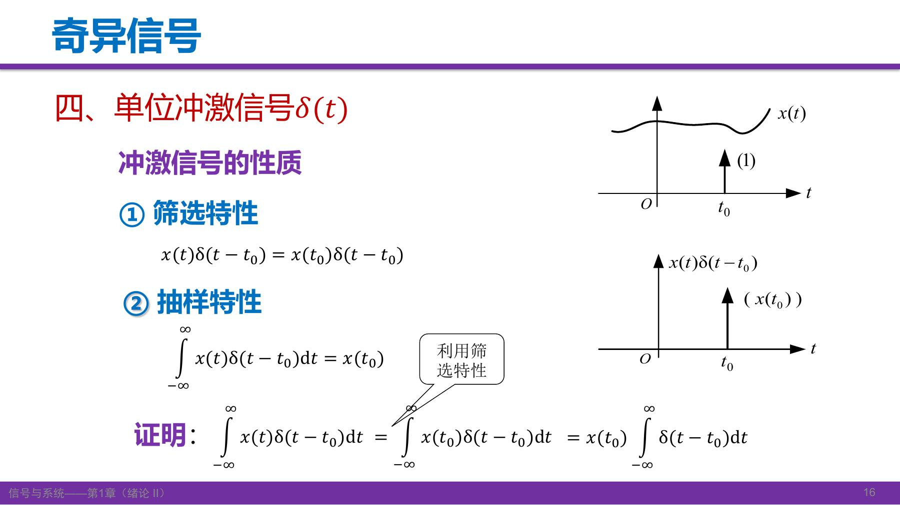

**补充例：** \(e^{-t}\delta(t-2)=e^{-2}\delta(t-2)\)；其全轴积分为 \(e^{-2}\)。不要在乘法这一步就把 \(\delta\) 丢掉。

### 4.2 展缩为什么是绝对值

\[
\delta(at)=\frac1{|a|}\delta(t),\qquad a\ne0.
\]

**补充推导，展开课件变量替换：** 对测试函数 \(\phi\)，令 \(s=at\)。当 \(a>0\)，积分上下限不换序：

\[
\int_{-\infty}^{\infty}\phi(t)\delta(at)dt
=\frac1a\int_{-\infty}^{\infty}\phi(s/a)\delta(s)ds
=\frac1a\phi(0).
\]

当 \(a<0\)，原来的 \(-\infty\) 变成 \(+\infty\)，上下限倒转带来负号：

\[
\frac1a\int_{+\infty}^{-\infty}\phi(s/a)\delta(s)ds
=-\frac1a\phi(0)=\frac1{|a|}\phi(0).
\]

两种情形合起来就是绝对值。取 \(a=-1\) 得 \(\delta(-t)=\delta(t)\)，所以冲激是偶的。

注意：单独把自变量换为 \(at\)，积分强度会变成 \(1/|a|\)。若希望压缩之后面积仍为 1，还要乘 \(|a|\)。原稿中“压缩之后值变大”的口语没有区分这两种操作，不能替代公式。

### 4.3 阶跃的导数为何出现冲激

\[
\int_{-\infty}^{t}\delta(\tau)d\tau=u(t),\qquad
\frac{du(t)}{dt}=\delta(t).
\]

积分上限尚未越过零点时累积为零，越过后累积为 1。这是广义函数意义的关系。

**补充推导：** 对矩形脉冲 \(u(t-T)-u(t-2T)\) 求导，得到 \(\delta(t-T)-\delta(t-2T)\)。开启处是正跳变，关闭处是负跳变，冲激强度分别等于跳变量。

来源：S1 PDF p.16–18、22；G1 PDF p.37–38，特别是 p.37 对连续性与展缩的说明。[课堂回顾 T10–T11](Transcript_Corrected.md#T10)

自测：δ(−2t) 等于什么？积分 ∫(t²+1)δ(t−3)dt（全轴）呢？

前者为 \(\tfrac12\delta(t)\)，绝不是负的冲激。后者抽样 \(t=3\)，得到 \(3^2+1=10\)。

## 5. 冲激偶：负号从哪里来

冲激偶定义为 \(\delta'(t)=d\delta(t)/dt\)。课件从矩形窄脉冲先求导、再取极限解释其来源：左边上跳产生正冲激，右边下跳产生负冲激，间距趋零而强度变化，形成冲激的导数。图中的“一正一负”是广义极限示意，不能把同一点两个无穷大普通数直接相减。

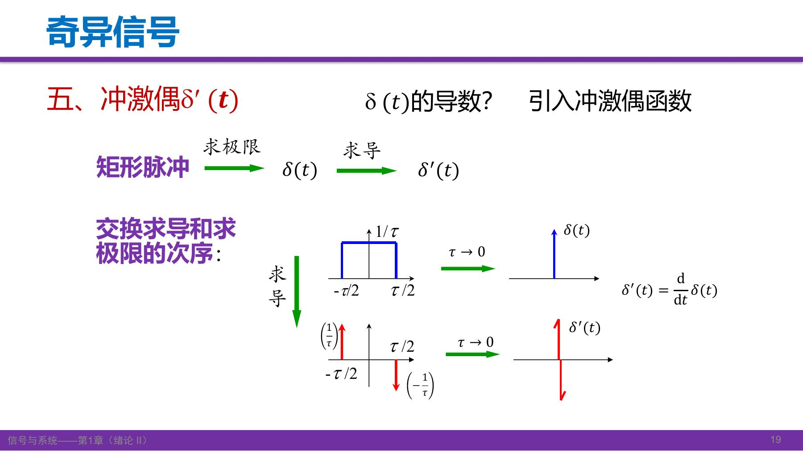

### 5.1 先推乘积关系

教师用已经熟悉的 \(f(t)\delta(t)=f(0)\delta(t)\) 出发。对它求导，按广义导数的乘积法则：

\[
f'(t)\delta(t)+f(t)\delta'(t)=f(0)\delta'(t).
\]

再把 \(f'(t)\delta(t)\) 换成 \(f'(0)\delta(t)\)，移项得

\[
\boxed{f(t)\delta'(t)=f(0)\delta'(t)-f'(0)\delta(t).}
\]

这里要求 \(f\) 在冲激位置有足够的光滑性。**补充推导：** \(\delta'\) 对常数测试函数的作用为零，因此全轴积分意义下 \(\int\delta'(t)dt=0\)。对上式积分便得到

\[
\boxed{\int_{-\infty}^{\infty}f(t)\delta'(t)dt=-f'(0).}
\]

这个负号来自分部积分/导数转移，而不是来自函数奇偶性的猜测。

### 5.2 两种移位写法不要混

**教材核对：** G1 PDF p.40 / printed p.24 的式(1-47)为

\[
\int_{-\infty}^{\infty}f(t)\delta'(t-t_0)dt=-f'(t_0).
\]

课件 PDF p.20 写的是另一种形式：

\[
\int_{-\infty}^{\infty}\delta'(t)f(t-t_0)dt=-f'(-t_0).
\]

**补充推导：** 令 \(g(t)=f(t-t_0)\)，则 \(g'(0)=f'(-t_0)\)，第二式就来自 \(-g'(0)\)。公式本身并不矛盾；但课件配套条件写在 \(t=t_0\)，与这一表达式实际取样的 \(-t_0\) 不一致，应在取样点附近满足光滑条件。旧笔记把整条移位公式搁置，现已用变量替换补清。

### 5.3 奇偶与关系链

\(\delta\) 为偶，\(\delta'\) 为奇。不要被“冲激偶”的名称误导成“偶函数”。

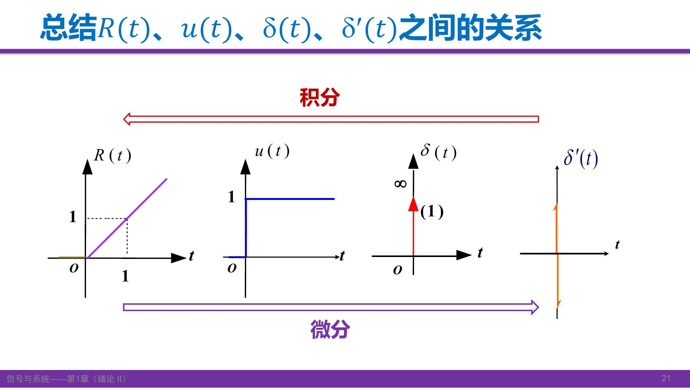

\[
R(t)\xrightarrow{d/dt}u(t)\xrightarrow{d/dt}\delta(t)\xrightarrow{d/dt}\delta'(t).
\]

反方向用从负无穷开始的积分，并留意积分常数/边界约定。教师还用 \(\delta+k\delta'\) 说明，仅靠“零点外为零、面积为 1”的直觉条件不足以唯一刻画冲激；要看它对测试函数的作用。

来源：S1 PDF p.19–22；G1 PDF p.39–41。[课堂回顾 T12–T14](Transcript_Corrected.md#T12)

自测：为什么 tδ′(t)=−δ(t)？

把 \(f(t)=t\) 代入乘积式，\(f(0)=0\)、\(f'(0)=1\)，所以结果为 \(-\delta(t)\)。这也说明不能把 \(t\delta'(t)\) 错当成 \(0\)。

## 6. 三种基础分解：平均值、复数、对称性

分解不是改变原信号，而是选择便于分析的组成部分。不同任务需要不同“积木”。

### 6.1 直流与交流：交叉功率为什么消失

对周期为 \(T\) 的信号，在一个周期上定义

\[
f_D=\frac1T\int_{t_0}^{t_0+T}f(t)dt,\qquad f_A(t)=f(t)-f_D.
\]

直流是平均值，交流是去掉平均值之后的变化部分。因此 \(\frac1T\int_{t_0}^{t_0+T} f_A(t)dt=0\)。非周期信号不能不说明区间，就把任意一段平均当成唯一的全局直流分量。

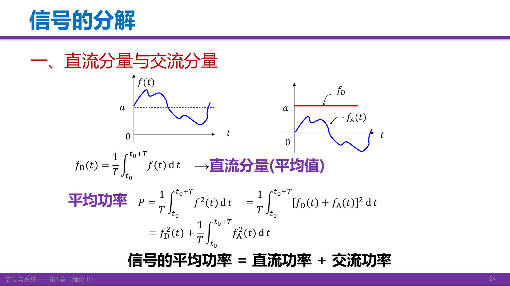

**补充推导，展开课件省略项：** 对实信号，按单位电阻归一化平均功率，

\[
\begin{aligned}
P&=\frac1T\int_{t_0}^{t_0+T}[f_D+f_A(t)]^2dt\\
 &=f_D^2+\frac{2f_D}{T}\int_{t_0}^{t_0+T}f_A(t)dt
   +\frac1T\int_{t_0}^{t_0+T}f_A^2(t)dt\\
 &=P_D+P_A.
\end{aligned}
\]

这是因为交流部分均值为零，不是任意两个信号相加都能直接把功率相加。

### 6.2 实部与虚部：分清 fᵢ 与 jfᵢ

设 \(f=f_r+jf_i\)，共轭为 \(f^*=f_r-jf_i\)。相加消去虚部，相减消去实部：

\[
f_r=\frac{f+f^*}{2},\qquad f_i=\frac{f-f^*}{2j},\qquad
jf_i=\frac{f-f^*}{2}.
\]

课件用“虚部分量”指 \(jf_i\)。原稿“相减取一半就是虚部”的口语省略了这个区别。复信号是计算工具，可同时表达振幅与相位等信息，不必把它理解成直接测到一个“虚电压”。

### 6.3 偶分量与奇分量

\[
f_e(t)=\frac{f(t)+f(-t)}2,\qquad
f_o(t)=\frac{f(t)-f(-t)}2,\qquad f=f_e+f_o.
\]

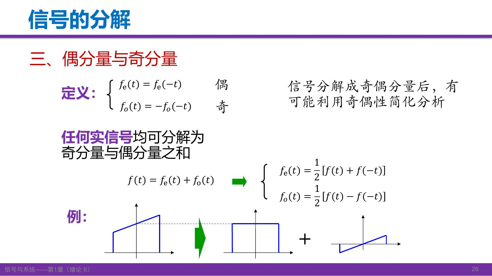

**补充推导：** 把 \(t\) 换成 \(-t\)，可直接验证 \(f_e(-t)=f_e(t)\)、\(f_o(-t)=-f_o(t)\)。相加时反折项抵消，恢复原函数。读图时分别检查偶分量左右镜像是否相同、奇分量反折后是否变号，最后叠加是否恢复原图。

来源：S1 PDF p.23–26；G1 PDF p.41–45。[课堂回顾 T15–T16](Transcript_Corrected.md#T15)

自测：f(t)=2+sin t 的直流/交流分量和奇/偶分量分别是什么？

按一个周期平均，直流为 2、交流为 \(\sin t\)；按全轴奇偶性，偶分量为 2、奇分量为 \(\sin t\)。本例两种分解碰巧一致，但定义不同，不能普遍等同。

## 7. 从小矩形到冲激积分：本堂课的连接点

### 7.1 先用有限宽度的矩形逼近

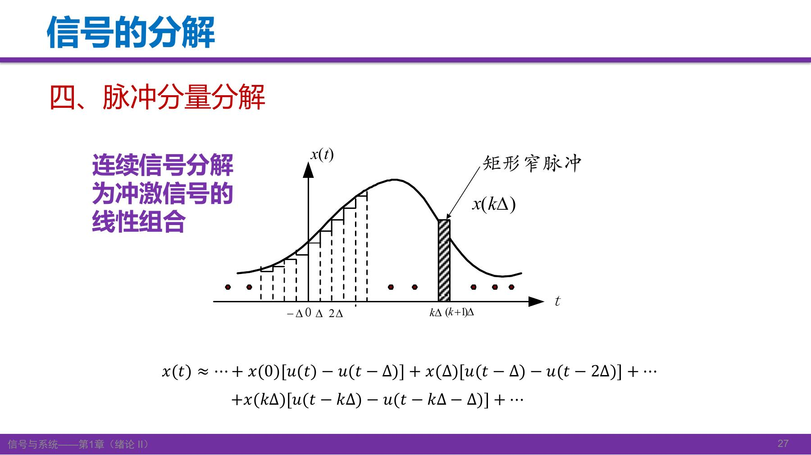

把时间轴划成宽度 \(\Delta>0\) 的小区间。在 \([k\Delta,(k+1)\Delta)\) 内，用左端点值 \(x(k\Delta)\) 近似整段信号。第 \(k\) 个小矩形为

\[
x(k\Delta)\,[u(t-k\Delta)-u(t-k\Delta-\Delta)].
\]

所有矩形相加，得到

\[
x(t)\approx\sum_{k=-\infty}^{\infty}x(k\Delta)
[u(t-k\Delta)-u(t-k\Delta-\Delta)].
\]

\(t\) 仍是待观察信号的自变量；\(k\) 只是枚举每条矩形。有限宽时是近似，不应提前写成严格等号。

### 7.2 除以宽度，构造单位面积脉冲

对每一项乘除同一个 \(\Delta\)：

\[
x(t)\approx\sum_k x(k\Delta)
\underbrace{\frac{u(t-k\Delta)-u(t-k\Delta-\Delta)}{\Delta}}_{\text{宽为}\Delta\text{、面积为1的脉冲}}
\Delta.
\]

当 \(\Delta\to0\)，用连续位置 \(\tau\) 代替 \(k\Delta\)，单位面积脉冲趋向 \(\delta(t-\tau)\)，求和趋向积分：

\[
\boxed{x(t)=\int_{-\infty}^{\infty}x(\tau)\delta(t-\tau)d\tau.}
\]

这里 \(t\) 是输出表达式留下来的变量，\(\tau\) 是积分掉的哑变量。对固定 \(t\)，冲激抽取 \(\tau=t\) 的值，因此积分又等于 \(x(t)\)。课件讲的是通常连续信号的表示；遇到间断点须说明取值/广义意义，不能用这句口语跳过条件。

### 7.3 为什么不是“绕了一圈什么也没做”

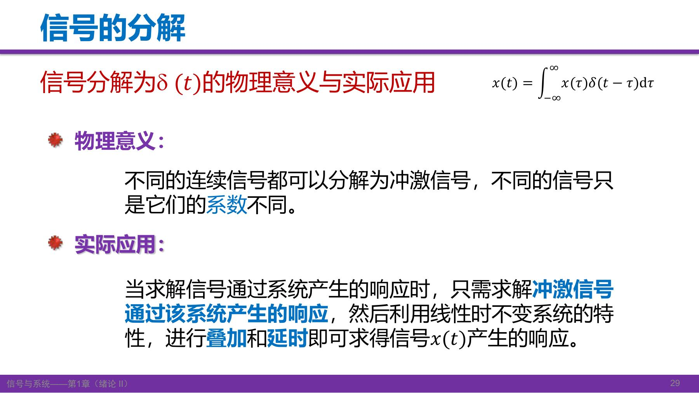

分解前，每个输入都像一个全新的问题。分解后，所有输入都由**同一种冲激的时移**构成，区别只是权重 \(x(\tau)\)。若系统既线性又时不变，知道一个单位冲激的响应，便可以按时移和加权叠加组合其他输入的响应。

**补充连接（为后续卷积作准备，并非本讲已完成的卷积计算）：** 设单位冲激响应为 \(h(t)\)，则时移冲激对应 \(h(t-\tau)\)。在交换积分与系统作用合法的条件下，组合得到 \(y(t)=\int_{-\infty}^{\infty}x(\tau)h(t-\tau)d\tau\)。本堂课先理解这条思路，具体卷积方法留到后续。

正交分解、傅里叶变换及分形等在这里用于展示分解角度；课件 p.30 只预告正交函数分量，未在本讲推导正交理论。

来源：S1 PDF p.27–30；G1 PDF p.43–46。[课堂回顾 T17–T18](Transcript_Corrected.md#T17)

自测：积分中的 x(τ) 是新的时间函数输出吗？为什么需要时不变性？

对每个固定的 \(\tau\)，\(x(\tau)\) 是该位置冲激的权重。时不变性让不同位置的冲激响应由同一个 \(h\) 平移得到；仅有线性时，一般还需要知道系统对各个时刻冲激的不同响应。

## 8. 怎样从系统和框图得到方程

模型是实际系统在一定条件下的数学抽象，不同物理系统可能有相同的数学模型。连续系统常用微分方程，离散系统常用差分方程。输入也称“激励”，输出也称“响应”；\(x,e\) 常记输入，\(y,r\) 常记输出。

### 8.1 汽车例子：先识别输入输出

牵引力为 \(f(t)\)，速度为 \(v(t)\)，阻力为 \(\rho v(t)\)，质量为 \(m\)。依牛顿定律，

\[
m\frac{dv}{dt}=f(t)-\rho v(t),\qquad
\frac{dv}{dt}+\frac\rho m v=\frac1m f(t).
\]

同样的一阶结构也会出现在简单电路模型中。这正是数学工具可以跨物理对象复用的原因。

### 8.2 连续框图：加法、增益、积分、反馈

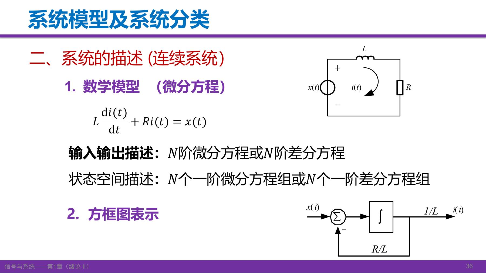

课件的 RL 方程为 \(L\,di/dt+Ri=x(t)\)。为清楚识别每个方框，可等价改写成

\[
\frac{di}{dt}=\frac1L x(t)-\frac RL i(t).
\]

**补充读图过程：** 输入先乘 \(1/L\)，反馈电流乘 \(R/L\)，在求和点相减，所得是 \(di/dt\)；通过积分器得到电流 \(i(t)\)。积分器的初值决定初始电流。另一种等价画法是先计算 \(x-Ri\)，再经过 \(1/L\) 和积分器。

> 课件原图的 \(1/L\) 与 \(R/L\) 标注位置容易混读，按某些连线解释不能同时得到图上方程。此处保留原图并提供方程确定的等价读法，不把不清楚的增益位置当作已核准框图。

### 8.3 离散框图：延时就是取前一个样点

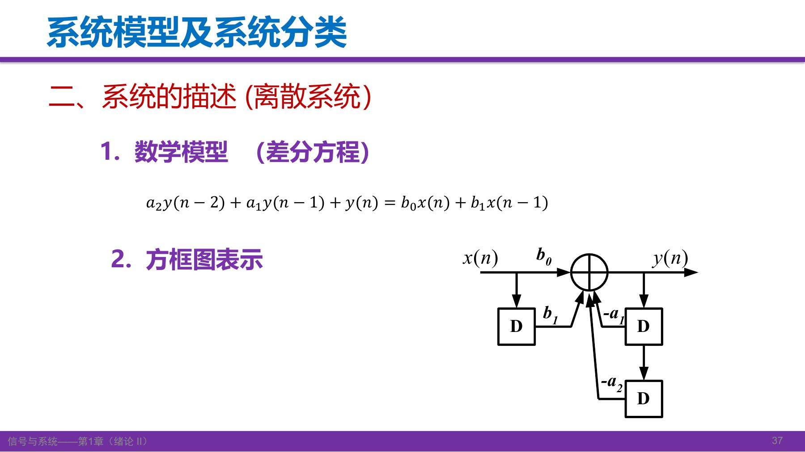

设 \(D\) 表示延迟一拍，则输入支路分别提供 \(b_0x(n)\)、\(b_1x(n-1)\)，反馈支路提供 \(-a_1y(n-1)\)、\(-a_2y(n-2)\)。把求和点每一条支路写出：

\[
y(n)=b_0x(n)+b_1x(n-1)-a_1y(n-1)-a_2y(n-2).
\]

移项后就是课件的差分方程。先按箭头方向读每个支路，再处理正负号，比试图直接“看出答案”可靠。

教师明确区分两种要求：一般不会要求从复杂物理电路直接建模，但**给定框图，要会写输入输出关系和相应微分/差分方程**。这是本讲重要学习要求，不能只保留“系统可用方程描述”的一句总结。

来源：S1 PDF p.31–34；G1 PDF p.46–49。[课堂回顾 T19](Transcript_Corrected.md#T19)

自测：若 y(n)=x(n)+0.5y(n−1)，反馈支路是什么？

输出经过一个 \(D\) 形成 \(y(n-1)\)，再乘 0.5，正向加回输入求和点。反馈不必都是负号，以方程或求和点标记为准。

## 9. 系统分类：每个性质都回到它的定义

系统可以同时属于多种类别，不能用一个性质代替另一个。连续/离散按信号时间变量区分；即时（无记忆）系统在当前时刻只依赖当前输入，动态（有记忆）系统还涉及其他时刻或状态。集总/分布参数则与模型是否需要空间分布有关，本课此处仅作分类介绍。

### 9.1 因果性：有没有索取未来的输入

因果系统当前输出只依赖过去和当前输入。判断 \(t\) 时刻的输出，需要检查表达式索取的输入时刻是否超过 \(t\)。

| 输入输出关系 | 逐步判断 | 结论 |
|---|---|---|
| \(r(t)=e(t)+e(t-2)\) | 只取当前 \(t\) 与过去 \(t-2\) | 因果 |
| \(r(t)=e(t)+e(t+2)\) | 需要 \(t+2\) 的未来输入 | 非因果 |
| \(y(t)=x(-t)\) | 当 \(t<0\)，\(-t>t\)，要取未来输入 | 在全时间轴上非因果 |
| \(y(t)=\cos(t+1)x(t)\) | 余弦只是已知系数，输入只取 \(x(t)\) | 因果、即时；同时是时变系统 |

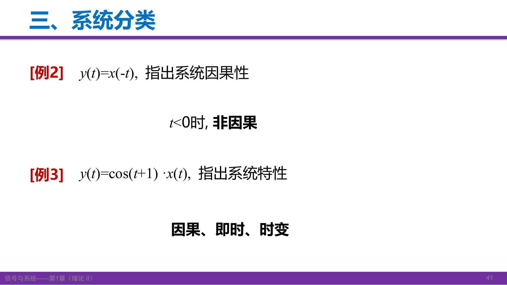

**补充说明：** 判断全系统因果性不能只检查某个正时刻；要求对所有允许时刻成立。原转写把反折例的 \(t<0\) 说成“因果”，与课件相反；这里按课件及 \(-t>t\) 的直接判断订正，原话是否口误仍待核听。

对称滑动平均会用到当前点两侧的数据，因此可能非因果；过去数据的单边滑动平均可以因果。不能把所有滑动平均一概归为非因果。预先录好的数据可离线处理，所以非因果并不等于“毫无用途”。

### 9.2 可逆性：输出是否丢失了信息

\(y=2x\) 可由 \(x=y/2\) 恢复，是可逆的。\(y=x^2\) 对不限制正负的实输入不可逆，因为 \(x\) 与 \(-x\) 输出相同。**补充条件：** 若题目限制输入非负，平方在这个受限集合上可逆；因此可逆性也与允许的输入集合有关。

### 9.3 BIBO 稳定性：量词不能丢

稳定的要求是：**每一个有界输入都产生有界输出**。证明不稳定，只要找出一个反例；证明稳定，要给出覆盖所有有界输入的界。

例一，\(y(t)=tx(t)\)。取全轴有界输入 \(x(t)=1\)，输出为 \(t\)，无界，因此不稳定。

例二，\(y(t)=e^{x(t)}\)。对任意有界实输入，设 \(|x(t)|\le B<\infty\)，则 \(|y(t)|=e^{x(t)}\le e^B\)，与时间无关的有限上界存在，因此 BIBO 稳定。指数形式看起来“增长快”不是否定稳定性的理由，因为指数自变量是有界输入，而不是无界时间。

来源：S1 PDF p.35–40；G1 PDF p.49–53。[课堂回顾 T20–T21](Transcript_Corrected.md#T20)

自测：因果系统必然稳定吗？即时系统必然时不变吗？

都不必然。\(y=tx(t)\) 只取当前输入，因果且即时，但不稳定、时变。这几个性质回答的是不同问题。

## 10. 线性：对象是整个输入信号，不是时间 t

若系统记为 \(H\)，线性要求对任意允许输入 \(x_1,x_2\) 和标量 \(a_1,a_2\)，

\[
H[a_1x_1+a_2x_2]=a_1H[x_1]+a_2H[x_2].
\]

其中包含均匀性（数乘可提出）和叠加性（加法可拆开）。取零输入必须得到零输出；这是必要条件，不是充分条件，例如平方系统零输入也输出零，却仍非线性。

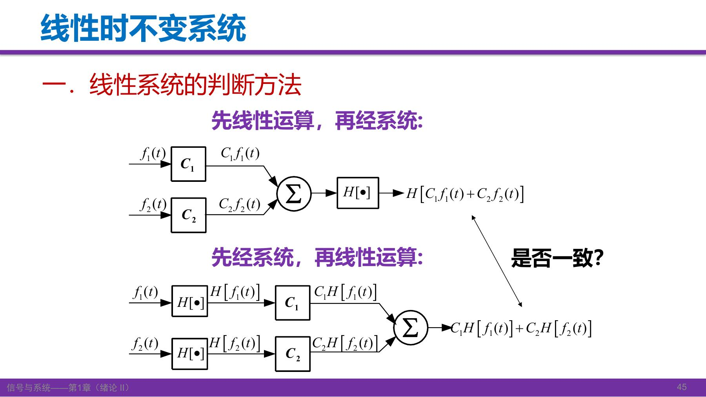

### 10.1 y(t)=tx(t) 为什么仍然线性

设 \(y_1=tx_1\)、\(y_2=tx_2\)。组合输入 \(x_3=a_1x_1+a_2x_2\) 经过系统后，

\[
y_3=t(a_1x_1+a_2x_2)=a_1tx_1+a_2tx_2=a_1y_1+a_2y_2.
\]

虽然 \(t\) 在变，但对输入信号的数乘与加法，系统仍按比例响应。**“含有 t”只能提醒检查时变性，不能据此判非线性。**

### 10.2 y(t)=2x(t)+3 为什么不是线性系统

最快的方法：输入为零，输出仍为 3，必要条件不满足。

课件也给出了叠加反例：\(x_1=1\to y_1=5\)，\(x_2=2\to y_2=7\)，但 \(x_1+x_2=3\to9\)，不等于 \(5+7=12\)。代数里“直线关系”的说法不能取代这里的线性算子定义。

### 10.3 初始状态必须分开

课件区分零输入响应 \(y_{zi}\) 和零状态响应 \(y_{zs}\)：

\[
y(t)=y_{zi}(t)+y_{zs}(t).
\]

教材 G1 PDF p.51 明确指出：常系数线性微分方程描述的系统在**零起始状态**下，其输入输出关系满足这里的叠加与均匀性质。非零初始状态引起的响应应单独处理。

原稿用 \(2x+3\) 类比拆分，同时出现“3 也是线性的”的说法。固定映射 \(H[x]=3\) 不满足线性定义；这里可理解的意图是“把输入相关部分和独立部分分开处理”，不能说两部分作为输入输出映射都线性。详细双零法在后续课程学习。

来源：S1 PDF p.41–45；G1 PDF p.51。[课堂回顾 T22](Transcript_Corrected.md#T22)

自测：H[x]=x² 为什么不线性，即使 H[0]=0？

\(H[2x]=4x^2\)，但 \(2H[x]=2x^2\)，对一般非零输入不相等，均匀性失败。只检查零输入不足以证明线性。

## 11. 时不变：比较两个操作的次序

时不变不是“输出恒定”，而是相同输入晚到 \(t_0\)，输出也只晚到 \(t_0\)，形状不额外改变。若 \(H[x(t)]=y(t)\)，比较

\[
\underbrace{H[x(t-t_0)]}_{\text{先移输入，再过系统}}
\quad\text{和}\quad
\underbrace{y(t-t_0)}_{\text{先过系统，再移整个输出}}.
\]

对所有允许输入和时移都一致，才是时不变。公式中的输入记号与时间系数须分清。

### 11.1 cos(x(t)) 与 x(t)cos t 的区别

第一种系统 \(y(t)=\cos(x(t))\)：输入延时后得到 \(\cos(x(t-t_0))\)，原输出延时后也是这个表达式，所以时不变。它非线性，因为零输入输出为 1。

第二种系统 \(y(t)=x(t)\cos t\)：

\[
H[x(t-t_0)]=x(t-t_0)\cos t,
\]
\[
y(t-t_0)=x(t-t_0)\cos(t-t_0).
\]

两者一般不同，所以时变。**只延时输入时，不应同时把系统自己的 \(\cos t\) 改掉；延时整个输出时，才把整个输出表达式里的 t 都替换。**

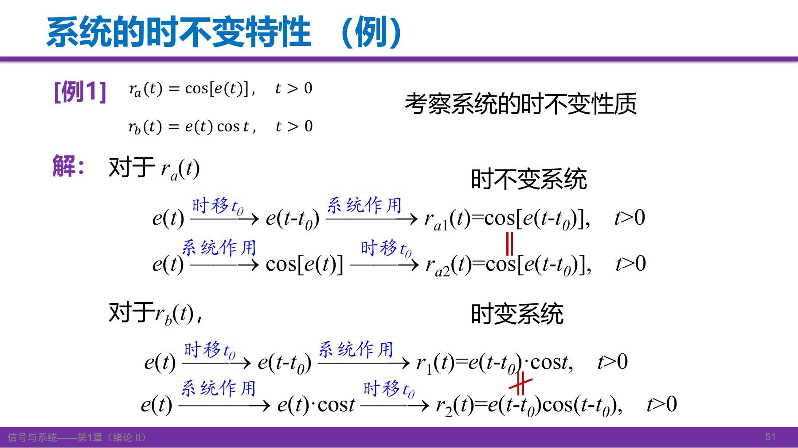

课件例子标有 \(t>0\)，这里的判别取输入与时移均有定义的共同范围；不据此凭空添加 \(u(t)\) 门控。若题目另加固定开机时刻或非零初始条件，应重新检查其影响。

### 11.2 再看 y(t)=tx(t)

它的线性已经证明；时不变性要另外判断：

\[
H[x(t-t_0)]=tx(t-t_0),\qquad y(t-t_0)=(t-t_0)x(t-t_0).
\]

两者一般不等，因此是**线性时变系统，不能称为 LTI**。LTI 是线性与时不变同时成立。

教师强调题目出现“线性时不变系统”时要主动用上这两个条件，而不是把它当作题干装饰。参数是否随时间变化可以帮助判断，但最终仍以两条路径为准。

来源：S1 PDF p.46–49；G1 PDF p.51–52。[课堂回顾 T23](Transcript_Corrected.md#T23)

自测：y(t)=x(t−2) 是不是 LTI？

是。线性组合经固定延迟后仍为组合；输入再延时 \(t_0\) 与输出延时 \(t_0\) 都得到 \(x(t-2-t_0)\)。这里“有时间移动”不等于“时变”。

## 12. LTI 的微分性质，以及后续要学的方法

### 12.1 差商中同时用到了 L 和 TI

已知 \(e(t)\to r(t)\)，时不变性给出 \(e(t-\Delta t)\to r(t-\Delta t)\)。再用线性作差并除以常数 \(\Delta t\)：

\[
\frac{e(t)-e(t-\Delta t)}{\Delta t}
\longrightarrow
\frac{r(t)-r(t-\Delta t)}{\Delta t}.
\]

当求导存在且系统与极限交换合法时，让 \(\Delta t\to0\)，得到

\[
\frac{de(t)}{dt}\longrightarrow\frac{dr(t)}{dt}.
\]

同样思路可用于高阶导数。若涉及阶跃或冲激，用广义导数理解，同时保持零状态/边界条件一致。

### 12.2 积分的下限不能忽略

课件 p.50 将积分写为从 0 到 \(t\)。教材 p.52 的图则从 \(-\infty\) 积分。通常在相关积分存在、采用一致零状态等条件下，后者可表为

\[
\int_{-\infty}^t e(\tau)d\tau
\longrightarrow
\int_{-\infty}^t r(\tau)d\tau.
\]

若输入与响应在负时间均为零，才可直接把这两个下限改成 0。对一般双边信号，“从 0 积分也总能交换”不成立。

补充推导：一个固定延迟的反例，说明为何要写条件

取 LTI 延迟系统 \(H[x](t)=x(t-a)\)，\(a>0\)，令 \(J_0x(t)=\int_0^t x(s)ds\)。则

\[
H[J_0x](t)=\int_0^{t-a}x(s)ds,\qquad
J_0[H x](t)=\int_{-a}^{t-a}x(s)ds.
\]

两者差一段 \(\int_{-a}^{0}x(s)ds\)，通常不为零。若 \(x\) 在负时间为零，这个差才消失。因此添加条件比机械记住课件简写更可靠。

### 12.3 方法地图

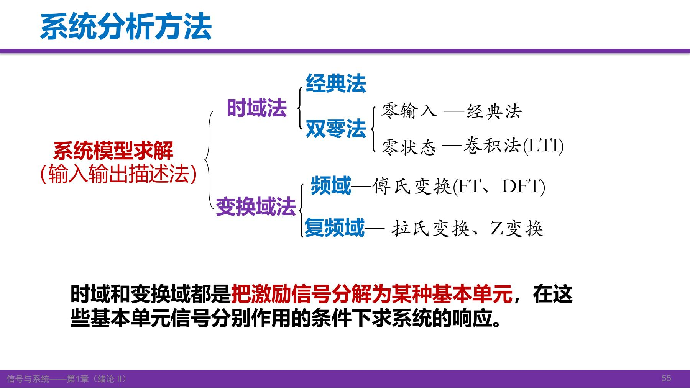

输入输出描述关注激励与响应之间的关系；状态变量描述还能给出系统内部状态。系统求解大致分为：

- 时域经典法：解微分方程，用齐次解、特解及初始条件确定响应。
- 双零法：零输入响应与零状态响应分开；后者将引出卷积。
- 变换域法：傅里叶、拉普拉斯及 Z 变换，把问题换到更便于求解的域。

本讲建立对象和基本性质，尚未完整教授这些方法。它们共通的思路仍是：选择适当基本信号，先研究基本响应，再重组。

来源：S1 PDF p.50–52；G1 PDF p.51–55。[课堂回顾 T24–T25](Transcript_Corrected.md#T24)

自测：微分性质的差商证明分别在哪一步使用时不变与线性？

从原响应得到时移后的响应时使用 TI；把两次输入相减、再乘 \(1/\Delta t\) 时使用 L。最后还需满足取极限的条件。

## 13. 本讲收束：作业、自检和需要留意的地方

### 作业与教材位置

课件指定：1-14(3,5,7)、1-18(c)、1-20、1-23、1-24；另举一个 LTI 系统和一个非线性时变系统，并说明理由。预习第 2 章。

当前归档的**第三版上册**中，1-14 指定小题和 1-18(c) 图形在 PDF p.59 / printed p.43；1-20、1-23、1-24 在 PDF p.60 / printed p.44。已核对这些页上的题号和题面，但未取得第四版对应页，不宣称两个版本完全相同。

[打开第三版作业页 p.59](../../Global/Cache/10d306ff84e86b481416f9078618de2a72fb0edecc87269348c3caa143c05915/p-059.png) · [打开第三版作业页 p.60](../../Global/Cache/10d306ff84e86b481416f9078618de2a72fb0edecc87269348c3caa143c05915/p-060.png)

作业前可检查自己是否能够：

1. 用阶跃写窗口，用冲激表示跳变的导数。
2. 解释冲激强度，推导展缩的绝对值和冲激偶的负号。
3. 从有限矩形求和走到冲激积分，并说清 \(t\) 与 \(\tau\) 的角色。
4. 从框图写方程，对系统分别判断因果、可逆、稳定、线性和时不变。
5. 使用 LTI 微分性质时先说明初始状态与必要条件。

### 本讲不应背错的几件事

- “零输入零输出”只能排除某些非线性系统，不能单独证明线性。
- 冲激是偶的，冲激偶是奇的；\(\delta(at)\) 的系数为 \(1/|a|\)。
- \(y=tx(t)\) 同时是线性、时变、因果、即时和 BIBO 不稳定，各结论互不替代。
- 时不变判别中，“只延时输入”与“延时整个输出”的替换范围不同。
- 课件公式和教师口语也需要检查适用条件，不能因版面正式就默认无条件成立。

### 尚待核听的边界

原音可在“课堂回顾”中播放；本次未核听。原稿有关变换顺序、反折因果性、固定常数项线性等语句，已在讲义给出可靠数学说明，但是否为 ASR 误识别或教师口误尚不确定。课件 p.33 框图标注、p.20 条件与 p.50 积分下限的处理详见来源记录。课末相对日期与调课口语仅作为历史记录，不推算当前截止日期。

来源：S1 PDF p.53–54；S2 01:27:40–末段；G1 PDF p.59–60。[课堂回顾 T25](Transcript_Corrected.md#T25) · [重要订正](Lecture_Source_Map.md#corrections)
