# 连续时间系统的时域分析：从微分方程到卷积

给定系统、输入和起始状态，怎样求输出？本讲先用微分方程直接求解，再利用线性与时不变性，把输入分解为冲激，由冲激响应组合出输出。复习时应能完成二阶方程例题，分清两种响应分解，并用图解和性质计算卷积。配套教材为第三版，使用第四版时需核对习题题面。

[来源与订正](Lecture_Source_Map.md)

## 1. 先把问题放回 LTI 框架

信号分析关心信号怎样表示、有何性质；系统分析更关心激励 \(e(t)\) 经过系统后产生怎样的响应 \(r(t)\)。本讲只讨论连续时间系统的时域分析，后续才转到傅里叶与拉普拉斯等变换域方法。

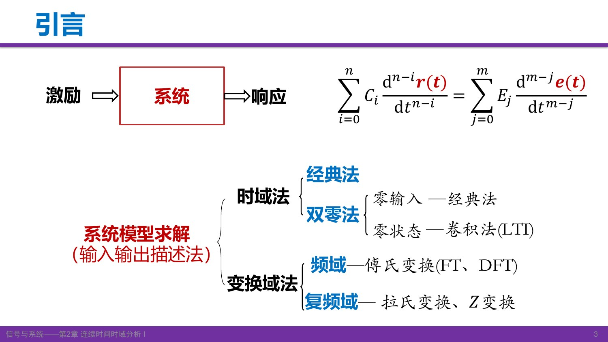

图中“零输入—经典法，零状态—卷积法”是一条常用解题路线，并非说零状态响应不能由微分方程求解。双零法先按响应的起因拆分，再分别求解。

课堂开头回顾了两个基础：线性意味着缩放、叠加可传到输出；时不变意味着输入平移多少，零状态输出也平移多少。上讲的冲激筛选性质给出

\[
e(t)=\int_{-\infty}^{\infty}e(\tau)\delta(t-\tau)\,d\tau.
\]

这里 \(t\) 是观察时刻，\(\tau\) 是积分中的时间标签。它既是筛选公式，也把一个信号写成一系列移位冲激的加权叠加；本讲的卷积公式正从这里出发。

[对应课堂 T01–T03](Transcript_Corrected.md#T01) · [来源](Lecture_Source_Map.md)

自测：知道输入和微分方程，能唯一确定全响应吗？

通常还需要系统起始状态。只给输入与系统、同时规定初始静止，才能唯一确定相应的零状态响应。

## 2. 建模的依据与本课要求

连续时间线性常系数系统可用输入输出微分方程描述：

\[
\sum_{i=0}^{n}C_i r^{(n-i)}(t)=\sum_{j=0}^{m}E_j e^{(m-j)}(t),\qquad C_0\ne0.
\]

\(C_i,E_j\) 为常数；\(r^{(k)}\) 表示 \(k\) 阶导数。离散时间模型中的对应工具是差分方程。对电路，建模依据是元件关系、连接方式与 KVL/KCL：

\[
v_R=Ri_R,\qquad i_C=C\frac{dv_C}{dt},\qquad v_L=L\frac{di_L}{dt}.
\]

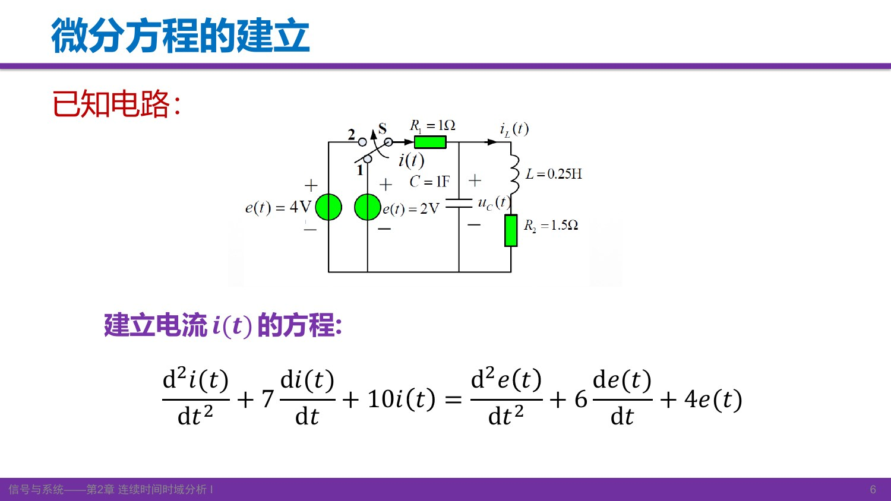

图中电源经开关接入电阻及储能网络。课件给出的结果为

\[
i''+7i'+10i=e''+6e'+4e.
\]

教师明确降低了复杂电路列式要求：**不要求从这类复杂电路独立列出方程，但要求拿到方程后会求解。** 感兴趣者可练习列式；不能因此把后面的求解也当作选学。

[对应课堂 T04–T05](Transcript_Corrected.md#T04) · [来源](Lecture_Source_Map.md)

自测：模型中的二阶导数是否代表输入必须是二次多项式？

不是。微分阶次描述系统关系；输入可以是常数、指数、阶跃或其他信号。输入的具体形式决定特解如何选取。

## 3. 经典法：齐次解、特解、初始条件

### 3.1 齐次解由系统特征根决定

先把右端置零。令 \(r_h=Ae^{at}\)，则每求导一次就乘以 \(a\)，从而把微分方程化成特征方程：

\[
C_0a^n+C_1a^{n-1}+\cdots+C_n=0.
\]

若 \(n\) 个根 \(a_k\) 互异，

\[
r_h(t)=\sum_{k=1}^{n}A_k e^{a_kt}.
\]

教师用指数在求导后保持形式解释这种尝试；复根对应的指数可组合成正弦、余弦，因此“指数形式”不只指实数指数衰减。

共轭根 \(\alpha\pm j\beta\) 的实解为 \(e^{\alpha t}(B\cos\beta t+C\sin\beta t)\)。若根 \(a\) 重复 \(q\) 次，该部分要写成 \((A_0+A_1t+\cdots+A_{q-1}t^{q-1})e^{at}\)，不能仍只写一个指数。重根会改变齐次解的形式，因此求出特征根后还要检查重数。

### 3.2 特解由代回方程配平得到

| 右端函数形式 | 通常尝试的特解形式 |
|---|---|
| 常数 | 常数 \(B\) |
| \(p\) 次多项式 | 一般 \(p\) 次多项式 |
| \(e^{at}\) | \(Be^{at}\) |
| 正弦或余弦 | \(B\cos\omega t+C\sin\omega t\) |

这些是待定系数法的常用候选。**特解系数靠方程两边恒等来确定，不靠初始条件。** 若候选与齐次解重合，应乘适当的 \(t\) 次幂后再试；若模型右端含输入导数，应先写出实际右端再选形式。

### 3.3 合成完全解，再求剩余系数

\[
r(t)=r_h(t)+r_p(t).
\]

按课件的分解习惯，齐次部分称自由响应，特解部分称强迫响应。给定 \(r(0^+),r'(0^+),\ldots,r^{(n-1)}(0^+)\)，代入完全解及其导数得到 \(n\) 个代数方程，确定 \(A_k\)。**自由响应的函数形状由系统决定，但它的系数可以同时受输入与起始状态影响。** 因而不能把自由响应直接等同于零输入响应。

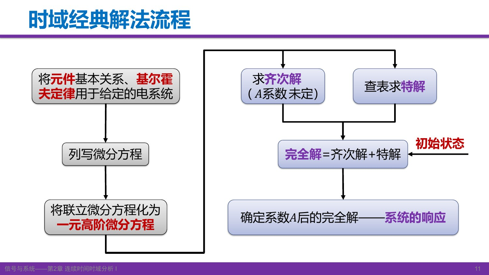

读图时注意两条支路先汇合成完全解，初始条件随后用于确定齐次项的系数，而不是用来猜特解。

[对应课堂 T06–T09](Transcript_Corrected.md#T06) · [来源](Lecture_Source_Map.md)

自测：输入为指数，是否总可直接设同指数的特解？

不能无条件照抄。若该指数已是齐次解的一部分，直接代入会被齐次算子消掉，需要乘 \(t\) 的适当次幂。

## 4. 起始点：为什么必须区分 0− 与 0+

\(0^-\) 是激励加入前的起始状态，\(0^+\) 是激励加入后的初始条件。它们虽都靠近零时刻，却可能因冲激作用而不同。时域解法通常求 \(t>0\) 的表达式，需要代入的是 \(0^+\) 条件；现实中已知的往往是 \(0^-\) 状态。

系统状态是：配合系统模型和未来输入，足以确定未来响应的一组最少独立数据。对本课的 \(n\) 阶常系数方程，通常可用输出及前 \(n-1\) 阶导数的适当状态数据表示。

对 \(r'+ar=b\delta(t)\)，假设 \(r\) 只含有限跳变而无冲激本身，对零点两侧积分：

\[
r(0^+)-r(0^-)+\lim_{\varepsilon\to0}\int_{-\varepsilon}^{\varepsilon}ar(t)\,dt=b,
\]

得到 \(r(0^+)-r(0^-)=b\)。若右端只有有界阶跃而无冲激，该一阶模型的 \(r\) 不跳变。电容电压连续也需要“无冲激电流”这一条件，不能说任何情况下都不会突变。

在处理起始点时，\(\delta\) 是由积分性质定义的广义函数，不是普通的有限跳变函数。后续单边拉普拉斯法可以直接引入 \(0^-\) 数据，**并非忽略跳变，而是把其作用纳入计算。**

[对应课堂 T09–T10、T13](Transcript_Corrected.md#T09) · [来源](Lecture_Source_Map.md)

自测：零状态是否保证输出的 0+ 值为零？

不保证。零状态约束激励加入前的系统状态；冲激输入或直接传递可使输出在零点出现跳变乃至奇异项。是否连续要看方程。

## 5. 完整例题：二阶方程的经典解法

课件 p.12 给出

\[
r''+3r'+2r=t^2+t,\qquad r(0)=1,\quad r'(0)=0.
\]

题面没有输入冲激，本例按所给零点初始条件求 \(t\ge0\) 解。

**第一步，齐次解。** 特征方程 \(a^2+3a+2=(a+1)(a+2)=0\)，所以

\[
r_h=A_1e^{-2t}+A_2e^{-t}.
\]

**第二步，特解。** 设 \(r_p=B_1t^2+B_2t+B_3\)，则 \(r_p'=2B_1t+B_2\)、\(r_p''=2B_1\)。代入得

\[
2B_1t^2+(6B_1+2B_2)t+(2B_1+3B_2+2B_3)=t^2+t.
\]

比较系数：\(2B_1=1\)，\(6B_1+2B_2=1\)，\(2B_1+3B_2+2B_3=0\)，所以

\[
r_p=\frac12t^2-t+1.
\]

**第三步，初始条件确定齐次项系数。**

\[
A_1+A_2+1=1,\qquad-2A_1-A_2-1=0.
\]

解得 \(A_1=-1,A_2=1\)，因此

\[
\boxed{r(t)=-e^{-2t}+e^{-t}+\frac12t^2-t+1.}
\]

复算时先验 \(r(0)=1\)、\(r'(0)=0\)，再验方程。教师特别要求动手写：听懂每一步不等于能够独立求出系数。

[对应课堂 T11–T12](Transcript_Corrected.md#T11) · [来源](Lecture_Source_Map.md)

自测：如果初始值改变，哪些系数要重算？

方程和右端不变，所选特解 \(r_p\) 不变；改变的是由初始条件确定的 \(A_1,A_2\)。

## 6. 双零法与 RC 例题：同一响应的两种分解

| 分解方式 | 第一部分 | 第二部分 | 区分依据 |
|---|---|---|---|
| 经典法 | 自由响应 \(r_h\) | 强迫响应 \(r_p\) | 解的函数形式 |
| 双零法 | 零输入 \(r_{zi}\) | 零状态 \(r_{zs}\) | 响应产生的原因 |
| 长时间行为 | 瞬态部分 | 稳态部分 | 随时间的表现 |

零输入响应：外加激励置零，只保留原有起始储能。零状态响应：激励前状态置零，只看外加激励的作用。在线性系统中，

\[
r=r_{zi}+r_{zs},\qquad
r_{zi}=\sum A_{zi,k}e^{a_kt},\qquad
r_{zs}=\sum A_{zs,k}e^{a_kt}+r_p.
\]

因此自由响应系数是 \(A_k=A_{zi,k}+A_{zs,k}\)。零状态响应本身也可以含齐次形式的项；“起始无储能”不意味着“没有自由响应”。瞬态与自由响应也不能无条件画等号，衰减与否取决于系统和输入。

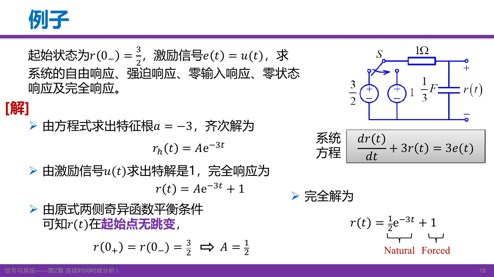

图中 \(R=1\Omega,C=1/3\mathrm F\)，输出为电容电压，时间常数 \(RC=1/3\)。课件模型为

\[
r'+3r=3u(t),\qquad r(0^-)=\frac32.
\]

这里没有冲激电流，故 \(r(0^+)=3/2\)。对 \(t>0\)，特解为 1、特征根为 −3，所以

\[
r= Ae^{-3t}+1,\quad A=\frac12,
\qquad r(t)=\frac12e^{-3t}+1.
\]

再按响应产生的原因拆分同一个结果。 零输入时 \(r_{zi}'+3r_{zi}=0\)，保留 \(3/2\) 初值；零状态时 \(r_{zs}'+3r_{zs}=3\)，初值为零。因此在 \(t\ge0\)：

\[
\begin{aligned}
r_{zi}&=\frac32e^{-3t},&r_{zs}&=1-e^{-3t},\\
r_h&=\frac12e^{-3t},&r_p&=1,\\
r&=r_{zi}+r_{zs}=r_h+r_p=1+\frac12e^{-3t}.
\end{aligned}
\]

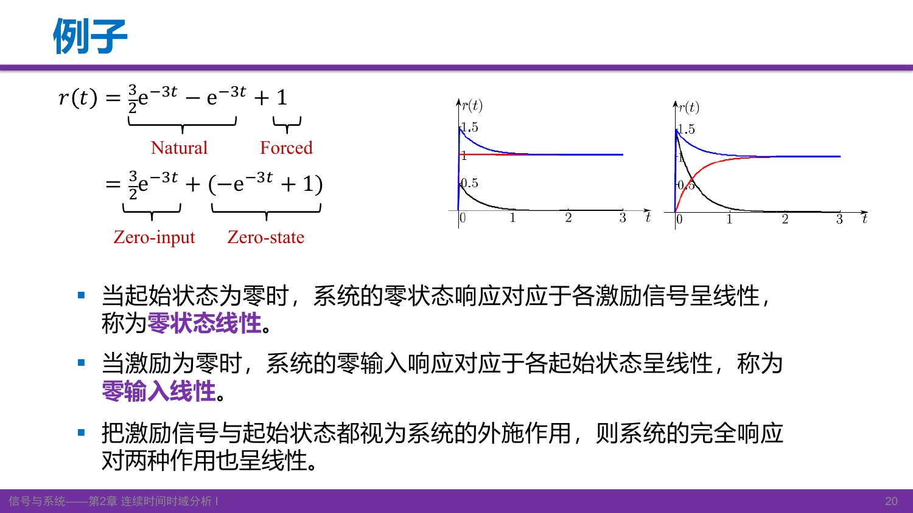

读图：全响应从 1.5 衰减到 1。右图的零输入从 1.5 衰减到 0，零状态从 0 上升到 1；两者相加仍是全响应。左图自由项的初值却是 0.5。这一差别就是两种分解不能混用的直接证据。

[对应课堂 T14–T17](Transcript_Corrected.md#T14) · [来源](Lecture_Source_Map.md)

自测：本例零状态响应中的自由项是哪一项？

是 \(-e^{-3t}\)，而非零输入响应 \((3/2)e^{-3t}\)。它用来使零状态响应在起点满足零初值。

## 7. 零状态线性与固定初始状态

前面的RC例题还能说明：只缩放输入与同时缩放输入、初始状态，得到的结果不同。

课件另取 \(RC=1/2\) 的例子，不要与前面的 \(RC=1/3\) 混淆。对 \(t\ge0\)，

\[
r_{zs}[u]=1-e^{-2t},\qquad r_{zs}[5u]=5(1-e^{-2t});
\]

初始电压从 2 变为 10 时，零输入响应也从 \(2e^{-2t}\) 变为 \(10e^{-2t}\)。这分别是零状态对输入线性、零输入对初始状态线性。

如果只把输入变为 5 倍，却固定初始电压仍为 2，则

\[
r_1=1-e^{-2t}+2e^{-2t},\qquad
r_2=5(1-e^{-2t})+2e^{-2t}\ne5r_1.
\]

此时“从输入到全响应”的映射带着固定的非零自由演化项，不能直接套零状态齐次性；若输入和起始状态一同缩放，全响应才随之缩放。

课件“零输入从 \(0^-\) 到 \(0^+\) 不跳变”的说法在这里指系统本身不发生额外切换、无外加奇异激励的状态延续。用 \(u(t)\) 把观察区间截到 \(t\ge0\) 是书写约定，不应把人为截断产生的分布导数误当成零输入系统真实受了冲激。

[课堂衔接](Transcript_Corrected.md#gap) · [来源](Lecture_Source_Map.md)

自测：输入扩大5倍，要让全响应也扩大5倍，还要怎样处理？

起始状态也要扩大 5 倍；或者一开始就规定零状态，此时没有额外的零输入项。

## 8. 冲激响应、阶跃响应与卷积公式的来源

零状态响应只由外加输入引起。选择冲激和阶跃作为输入，可以得到两种特别有用的典型响应。

冲激响应 \(h(t)\)：系统对 \(\delta(t)\) 的**零状态响应**。阶跃响应 \(g(t)\)：系统对 \(u(t)\) 的零状态响应。测试输入固定后，二者体现系统本身的特性。

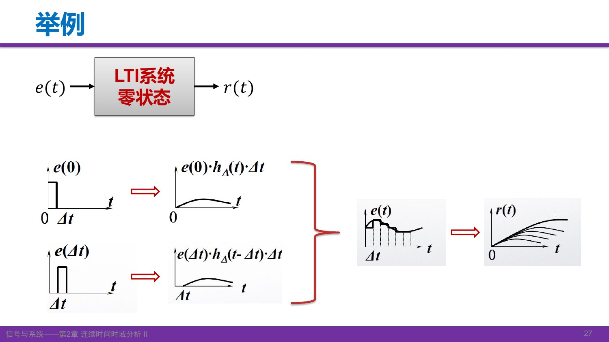

图左把输入切成窄脉冲。每一块的高度约为 \(e(\tau)\)、宽度为 \(\Delta\)，面积是 \(e(\tau)\Delta\)。当宽度趋零，以归一化窄脉冲逼近冲激，得到

\[
e(t)=\int_{-\infty}^{\infty}e(\tau)\delta(t-\tau)\,d\tau.
\]

由 \(\delta(t)\mapsto h(t)\)，依次利用时不变性和线性：

\[
\delta(t-\tau)\mapsto h(t-\tau),\qquad
e(\tau)\delta(t-\tau)d\tau\mapsto e(\tau)h(t-\tau)d\tau.
\]

把所有时刻的贡献相加，得到

\[
\boxed{r_{zs}(t)=\int_{-\infty}^{\infty}e(\tau)h(t-\tau)\,d\tau=e*h.}
\]

这是 LTI 零状态输入输出关系。在相应积分或广义函数卷积存在的条件下，知道 \(h\) 就知道所有输入的零状态响应；如果系统原来有储能，全响应还要加 \(r_{zi}\)。这也不能推广为“所有任意系统都由一个 \(h\) 完全描述”。

### 因果条件怎样改变积分限

若输入是因果信号，则 \(e(\tau)=0\) 对 \(\tau<0\) 成立；若系统因果，则 \(h(t-\tau)=0\) 对 \(\tau>t\) 成立。因此对 \(t>0\)，

\[
r_{zs}(t)=\int_0^t e(\tau)h(t-\tau)\,d\tau.
\]

零点存在冲激时需按广义函数与端点约定处理，不能把只适用于普通函数的积分端点规则机械套用。

因 \(u\) 是冲激的累积积分，在卷积存在时

\[
g(t)=h*u=\int_{-\infty}^{t}h(\lambda)d\lambda,\qquad h=g'
\]

（含奇异项时导数在分布意义下理解）。这把两种典型响应联系起来。

[对应课堂 T18–T20](Transcript_Corrected.md#T18) · [来源](Lecture_Source_Map.md)

自测：输入因果，但系统非因果，能直接把上限改成 t 吗？

不能。输入因果只保证下限可从 0 开始；上限能截到 \(t\) 还需要 \(h(t)=0\) 对负时间成立。

## 9. 冲激响应的时域求法：保留 u(t)，平衡奇异项

对因果常系数系统，冲激加入前为零状态；\(t>0\) 时冲激及其导数都为零，因此冲激响应的普通函数部分满足齐次方程。它虽有自由演化的形式，**仍是由外加冲激引起的零状态响应**。教师用“冲激瞬时改变储能”解释这一点；对含直接传递的数学模型，还应保留零点的奇异响应，不能全部归结为储能。

课件 p.30–31 例题：

\[
r''+4r'+3r=e'+2e.
\]

令输入 \(e=\delta\)，响应 \(r=h\)，得到

\[
h''+4h'+3h=\delta'+2\delta.
\]

特征根为 −1、−3。按本例因果、初始静止条件设

\[
h(t)=q(t)u(t),\qquad q=A_1e^{-t}+A_2e^{-3t}.
\]

**不能漏掉 \(u(t)\)**，因为它携带起始点信息。分布求导给出

\[
h'=q'u+q(0)\delta,\qquad
h''=q''u+q'(0)\delta+q(0)\delta'.
\]

其中 \(q(0)=A_1+A_2\)，\(q'(0)=-A_1-3A_2\)。普通项因 \(q\) 满足齐次方程而相消，剩下

\[
(A_1+A_2)\delta'+(3A_1+A_2)\delta=\delta'+2\delta.
\]

比较系数得到 \(A_1+A_2=1\)、\(3A_1+A_2=2\)，所以

\[
\boxed{h(t)=\frac12(e^{-t}+e^{-3t})u(t).}
\]

这也说明 \(h(0^-)=0\) 并不要求 \(h(0^+)=0\)：本例右极限为 1。

### 何时含冲激及其导数

设方程输入最高导数阶次为 \(m\)，输出为 \(n\)，最高系数非零。对因果初始静止解，通常分成普通的右侧齐次项与零点奇异项：

\[
h(t)=q(t)u(t)+\sum_{k=0}^{m-n}D_k\delta^{(k)}(t)\quad(m\ge n).
\]

\(m<n\) 时没有这种直接奇异项；\(m=n\) 有 \(\delta\) 项；\(m>n\) 的最高奇异阶次为 \(m-n\)，低阶项系数可能为零。重根时 \(q\) 含指数乘多项式。

求和必须包含零阶项，也就是 \(\delta\) 本身。以上表达针对常系数因果模型；对其他系统仍需根据其定义范围和性质确定响应形式。

[对应课堂 T20–T23](Transcript_Corrected.md#T20) · [来源](Lecture_Source_Map.md)

自测：为什么不能把 A₁、A₂ 都由 h(0−)=0 直接定为零？

它们描述冲激作用后的响应；零点冲激会改变右侧初始条件。应平衡方程中的 \(\delta,\delta'\) 等项，或等价地推导跳变条件。

## 10. 图解卷积：反折、平移、相乘、积分

\[
(f_1*f_2)(t)=\int_{-\infty}^{\infty}f_1(\tau)f_2(t-\tau)\,d\tau.
\]

固定一个 \(t\)，在 \(\tau\) 轴上操作：先把 \(f_2(\tau)\) 反折成 \(f_2(-\tau)\)，再右移 \(t\) 得到 \(f_2(t-\tau)\)；与 \(f_1(\tau)\) 点乘，对乘积积分。这得到一个时刻的输出值。不断改变 \(t\)，才得到完整输出函数。不要把“对 \(\tau\) 积分”和“让 \(t\) 从左到右扫描”混成同一件事。

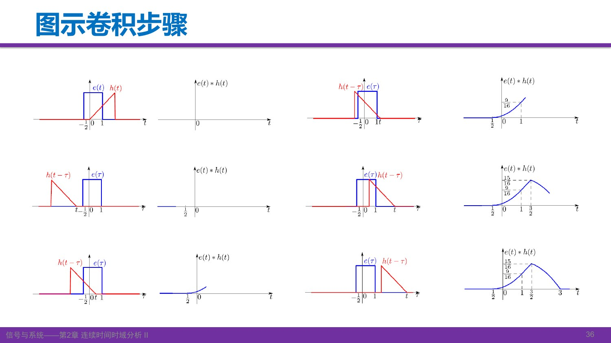

图中固定矩形覆盖 \([-1/2,1]\)，原斜坡覆盖 \([0,2]\)。反折平移后的斜坡从左侧进入矩形，重叠面积从零增大，经过峰值后减小，最后在 \(t=3\) 离开；首次接触在 \(t=-1/2\)。右列每个点都是当时乘积曲线的面积，不能直接拿两个原函数在同一 \(t\) 的值相乘。

### 积分区间是交集，输出支撑看端点之和

若两函数的支撑分别位于 \([A,B]\)、\([C,D]\)，则

\[
\tau\in[A,B],\qquad t-\tau\in[C,D]\iff\tau\in[t-D,t-C].
\]

因此非空重叠区间为

\[
\boxed{\max(A,t-D)\le\tau\le\min(B,t-C).}
\]

下限取大，上限取小；若下限超过上限，结果为零。输出可能非零的范围位于 \([A+C,B+D]\)。本课非负且填满区间的例子呈现宽度相加；一般应说支撑包含关系，不能忽略抵消或空洞。

教师与学生从图中归纳出“变长、变平滑”。这对本课矩形和斜坡例子成立，也是许多平滑核的作用；并非卷积的无条件性质，\(f*\delta=f\) 就没有变宽或平滑。

[对应课堂 T24–T28、T32](Transcript_Corrected.md#T24) · [来源](Lecture_Source_Map.md)

自测：支撑为 [−1,1] 与 [0,3]，输出可能非零在哪里？

在 \([-1,4]\) 内。固定 \(t\) 的积分范围则是 \([\max(-1,t-3),\min(1,t)]\)，不是这个输出区间本身。

## 11. 两个 RL 例题：阶跃输入与截断指数输入

### 11.1 阶跃输入

课件给出 \(L=1\mathrm H,R=1\Omega\) 的串联 RL 电路，输出为电流：

\[
i'+i=e(t),\qquad h(t)=e^{-t}u(t).
\]

初始静止、输入 \(e(t)=u(t)\) 时，

\[
i_{zs}(t)=\int_0^t e^{-(t-\tau)}d\tau
=e^{-t}\int_0^t e^\tau d\tau=1-e^{-t}\quad(t>0).
\]

全时间表达为 \(i_{zs}(t)=(1-e^{-t})u(t)\)。两个阶跃因子共同限制 \(0\le\tau\le t\)。课件 p.38 图旁写 \((-\infty,t)\)，这是只看因果冲激响应时可用的上限形式；结合本例输入后，有效非零积分区间仍为 \([0,t]\)。

### 11.2 截断指数输入

现在系统不变，输入改为

\[
e(t)=e^{-t/2}[u(t)-u(t-2)].
\]

它从 0 开始按指数下降，到 2 时截断。对 \(t\ge0\)，

\[
i_{zs}(t)=e^{-t}\int_0^{\min(t,2)}e^{\tau/2}\,d\tau.
\]

当 \(0\le t\le2\)，上限为 \(t\)，结果为 \(2(e^{-t/2}-e^{-t})\)；当 \(t>2\)，上限为 2，结果为 \(2(e-1)e^{-t}\)。因此

\[
\boxed{i_{zs}(t)=\begin{cases}
0,&t<0,\\
2(e^{-t/2}-e^{-t}),&0\le t\le2,\\
2(e-1)e^{-t},&t>2.
\end{cases}}
\]

等价的阶跃形式为

\[
2(e^{-t/2}-e^{-t})u(t)
-2(e^{-t/2}-e^{-(t-1)})u(t-2).
\]

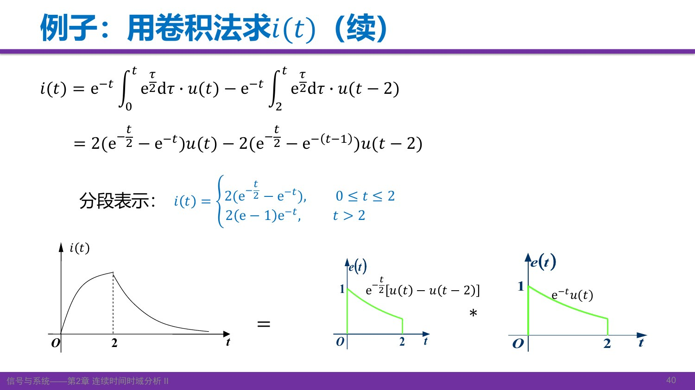

读图：输入在 2 时归零，输出仍有指数尾部，这是储能延续的表现。对输出求导可以找到峰值： 前一段导数在 \(t=2\ln2\) 为零，真实峰值在 \(2\ln2\approx1.386\)，不是在截断时刻 2；课件曲线是示意图，应以公式为准。两段公式在 \(t=2\) 连续。

课后需要把该例独立算一遍，检查积分限、分段结果和波形是否相互吻合。指定教材作业见本讲末尾。

[对应课堂 T29–T31](Transcript_Corrected.md#T29) · [来源](Lecture_Source_Map.md)

自测：为什么输入归零后输出不立即归零？

\(h\) 有无限长的衰减尾部。零状态描述的是激励前没有储能，不代表输入作用期间不能储能、停激励后不能继续响应。

## 12. 有限支撑例题：矩形与斜坡

课件 p.42：\(f_1(t)=1\) 对 \(|t|<1\)，其余为零；\(f_2(t)=t/2\) 对 \(0\le t\le3\)，其余为零。波形的端点取值不影响本例普通积分。

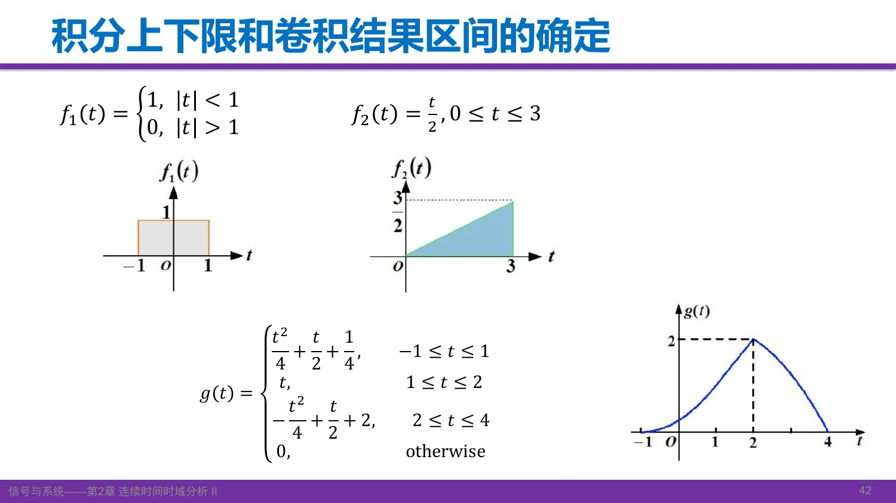

先用非零区间的交集确定积分限。 取 \(f_1(\tau)\) 为固定函数，则

\[
g(t)=\int_{\max(-1,t-3)}^{\min(1,t)}\frac{t-\tau}{2}\,d\tau
\]

只在下限不大于上限时计算。支撑端点之和给出四个分界点 −1、1、2、4。分别代入积分上下限：

| t 的区间 | 积分下限 | 积分上限 | 结果 |
|---|---|---|---|
| \(-1\le t\le1\) | −1 | t | \((t+1)^2/4\) |
| \(1\le t\le2\) | −1 | 1 | \(t\) |
| \(2\le t\le4\) | \(t-3\) | 1 | \(-t^2/4+t/2+2\) |
| 其余 | 无重叠 | 无重叠 | 0 |

首段的积分为 \([t\tau/2-\tau^2/4]_{-1}^{t}\)，其余同理。复算结果在 −1、1、2、4 连续，在 2 达到最大值 2。接下来学习卷积性质后，还可以用更简洁的方法计算这类结果。

[对应课堂 T32–T33](Transcript_Corrected.md#T32) · [来源](Lecture_Source_Map.md)

自测：为什么分界点不是只有 −1 和 4？

−1、4 决定首次接触和最后离开；1、2 决定重叠区间哪一侧由固定端点限制，积分限发生变化，所以也必须分段。

## 13. 卷积代数性质与系统框图

在相关卷积存在、交换积分次序合法的条件下：

\[
f_1*f_2=f_2*f_1,
\]
\[
f_1*(f_2+f_3)=f_1*f_2+f_1*f_3,
\]
\[
f_1*(f_2*f_3)=(f_1*f_2)*f_3.
\]

交换律可令 \(\lambda=t-\tau\) 换元证明；分配律由积分的线性直接得到；结合律在二重积分可换序时成立。实用上常把矩形或冲激等简单函数选作移动函数。

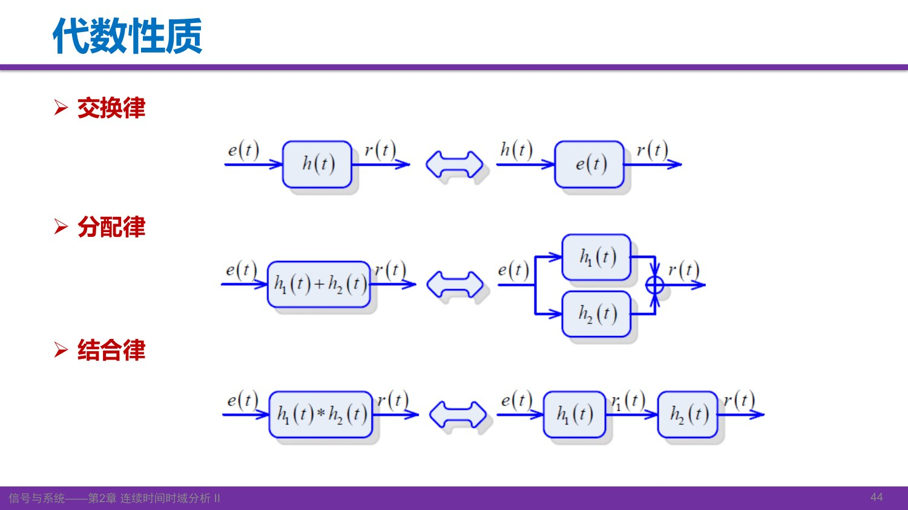

第一行说明 \(e*h=h*e\)：把 \(h\) 当信号，把 \(e\) 当另一系统的冲激响应，数学上的零状态输出相同；不保证这个新系统一定具有原系统的物理可实现性。第二行两路接收同一输入，再把输出相加，所以并联等效冲激响应为 \(h_1+h_2\)。第三行先经过 \(h_1\) 再经过 \(h_2\)，输出 \((e*h_1)*h_2=e*(h_1*h_2)\)，级联等效响应为 \(h_1*h_2\)。

本课单输入单输出 LTI 框图的级联次序可交换。若是真实电路直接相接，前后级可能互相加载，应先确认单个模块模型仍适用；也不能把上述结论套给任意非线性、时变或带独立初始状态的系统。

教师用这三种框图解释信号与系统的紧密联系，并预告：在适当变换条件下，时域卷积会变成频域或复频域的乘法。本讲只把它作为后续课程的动机。

[对应课堂 T34–T36](Transcript_Corrected.md#T34) · [来源](Lecture_Source_Map.md)

自测：两个模块先级联，再与第三个模块并联，等效 h 是什么？

在本节条件下为 \(h=h_1*h_2+h_3\)，不能写成 \(h_1h_2+h_3\)。

## 14. 微积分性质和冲激卷积：把难积分变成平移

### 14.1 微分、积分为什么可以移入

若满足微分与积分交换的条件，或在适用的分布卷积框架中，

\[
\frac{d}{dt}(f_1*f_2)
=\int_{-\infty}^{\infty}f_1(\tau)f_2'(t-\tau)d\tau
=f_1*f_2'=f_1'*f_2.
\]

记 \((If)(t)=\int_{-\infty}^{t}f(\lambda)d\lambda\)，在积分存在且换序合法时，

\[
I(f_1*f_2)=f_1*(If_2)=(If_1)*f_2.
\]

积分式的关键一步是交换 \(\lambda\) 与 \(\tau\) 的积分顺序，再令内层变量 \(v=\lambda-\tau\)，上限从 \(t\) 变为 \(t-\tau\)。这样内层积分正是 \((If_2)(t-\tau)\)。**上限是 t，不是正无穷**；积分到正无穷通常只剩一个数。

当边界条件允许时还可组合使用，例如

\[
f_1*f_2=f_1'*(If_2).
\]

对高阶导数、重复累积积分可相应推广，但负阶记号表示累积积分，不是普通幂；每次仍需检查存在性和边界项。下一节专门说明失效情况。

### 14.2 与冲激、阶跃的卷积

由筛选性质及微分性质：

\[
\begin{aligned}
f*\delta&=f,\\
f*\delta(t-t_0)&=f(t-t_0),\\
f*\delta'&=f',\\
f*u&=If,\\
\delta(t-a)*\delta(t-b)&=\delta(t-a-b).
\end{aligned}
\]

课堂问答：\(\delta\) 是偶分布，\(\delta'\) 是奇分布。与移位冲激卷积会产生相应的时间平移。导数含跳变时应保留冲激项。

### 14.3 矩形与斜坡：一边求导、一边积分

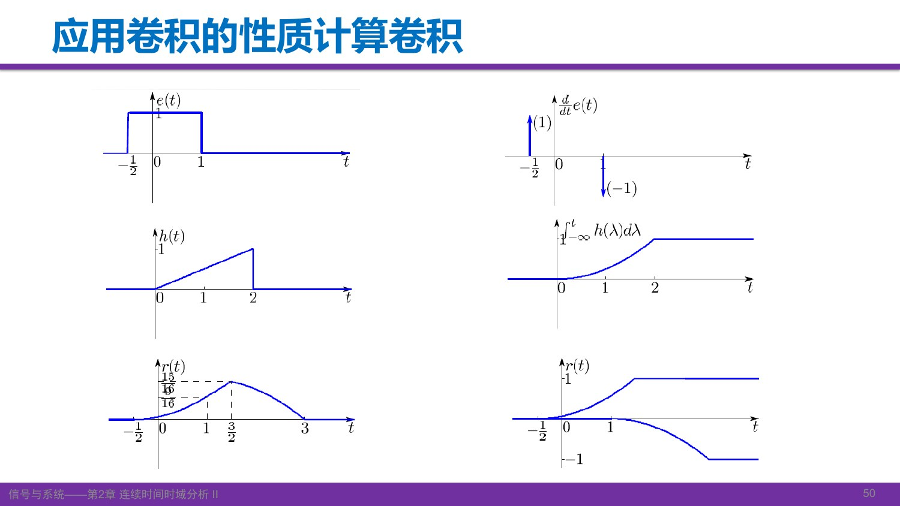

这张图延续 p.36，**与 p.42 的端点不同**：\(e(t)=u(t+1/2)-u(t-1)\)，\(h(t)=t/2\) 对 \(0\le t\le2\)，其余为零。于是

\[
e'=\delta(t+1/2)-\delta(t-1),\qquad
H(t)=Ih(t)=\begin{cases}0,&t<0,\\t^2/4,&0\le t\le2,\\1,&t>2.\end{cases}
\]

根据微积分性质，\(r=e*h=e'*H=H(t+1/2)-H(t-1)\)。这就是图右两条曲线相加的含义：一条提前半单位，另一条延后一单位后取负。

结果按 \(-1/2,1,3/2,3\) 分段：

\[
r(t)=\begin{cases}
0,&t<-1/2,\\
(t+1/2)^2/4,&-1/2\le t\le1,\\
3t/4-3/16,&1\le t\le3/2,\\
1-(t-1)^2/4,&3/2\le t\le3,\\
0,&t>3.
\end{cases}
\]

峰值为 \(15/16\)，与课件图相符。

### 14.4 双极性矩形与单位矩形

课件 p.52 中，\(f=1\) 于 \([0,1)\)，\(f=-1\) 于 \([1,2)\)，其余为零；\(h=u(t)-u(t-1)\)。先积分 \(f\) 得三角形

\[
F(t)=\begin{cases}t,&0\le t\le1,\\2-t,&1\le t\le2,\\0,&\text{其他},\end{cases}
\]

再用 \(h'=\delta(t)-\delta(t-1)\)，有 \(g=F*h'=F(t)-F(t-1)\)，因此

\[
g(t)=\begin{cases}
t,&0\le t\le1,\\
3-2t,&1\le t\le2,\\
t-3,&2\le t\le3,\\
0,&\text{其他}.
\end{cases}
\]

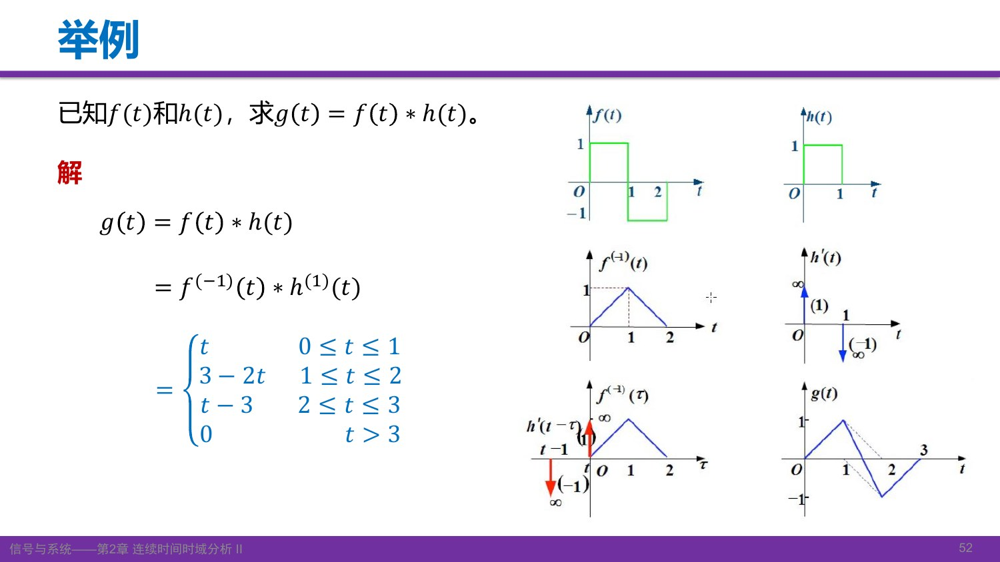

图中蓝色三角形减去右移 1 的三角形，得到先正后负的输出。面积检验：\(\int f=0\)，所以输出总面积也为零。教师指出也可以交换求导、积分的对象，选择更简单的一边。

[对应课堂 T37–T41](Transcript_Corrected.md#T37) · [来源](Lecture_Source_Map.md)

自测：f 与 δ(t−2)−δ(t−5) 卷积，是否还要分段积分？

无需重新积分，直接为 \(f(t-2)-f(t-5)\)。若要求分段表达式，再按平移后波形的端点整理。

## 15. 重要限制：微分再积分会丢掉常数

课件 p.53 的反例是 \(\operatorname{sgn}(t)*\delta(t)\)。直接用冲激筛选得

\[
\operatorname{sgn}*\delta=\operatorname{sgn}(t).
\]

若不检查条件，机械地“一边求导、一边积分”，会得到

\[
(\operatorname{sgn})'*I\delta=(2\delta)*u=2u(t),
\]

而 \(\operatorname{sgn}(t)=2u(t)-1\)（零点按一致约定或分布意义），两者相差常数 1。

从微积分基本关系可以看出缺少的边界项。 对适当可积、分段光滑的函数，若 \(f(-\infty)\) 存在，

\[
\int_{-\infty}^{t}f'(\lambda)d\lambda=f(t)-f(-\infty).
\]

符号函数在负无穷的极限为 −1，因此积分回去得到的是 \(\operatorname{sgn}(t)+1=2u(t)\)。分部积分的另一个表达为

\[
f'*G=\big[f(\tau)G(t-\tau)\big]_{-\infty}^{\infty}+f*G',
\]

这里需保证各项定义良好。只有相关边界项为零，才可放心把 \(f*g\) 改写为 \(f'*Ig\)。不能只看到两个形式像“微分、积分抵消”就省略检查。

这个反例说明，微分后能否通过积分恢复原函数，取决于下端点条件。满足零边界之后，还须确认卷积、积分和换序本身合法，才能使用混合微积分性质。

[对应课堂 T41–T43](Transcript_Corrected.md#T41) · [来源](Lecture_Source_Map.md)

自测：把 sgn 求导再从负无穷积回来，得到什么？

得到 \(2u(t)\)，比原符号函数多 1。微分丢失的常数由下端点条件决定，不能凭形式自动恢复。

## 16. 作业与下一讲预习

本讲要求：掌握经典解法；理解零输入与零状态；理解 \(h,g\) 的定义；重点练习卷积定义、图解与性质。复杂电路建模要求已降低，时域求 \(h,g\) 不是后续最常用的工具，但能帮助理解起始状态和物理过程。

教师要求动手完成课堂二阶方程练习、重算截断指数卷积例题，并自行推导卷积的微分、积分性质。不要用“把所有题型刷遍”代替理解这些知识点。

### 指定作业（课件 p.58；以下为第三版实际页码）

| 作业 | 要求 | 教材位置与题目线索 |
|---|---|---|
| 2-4 | 必做 | PDF p.103 / 印刷 p.87；三组齐次方程与 \(0^+\) 条件，求零输入响应 |
| 2-6 | 必做 | PDF p.103–104 / 印刷 p.87–88；\(r''+3r'+2r=e'+3e\)，输入阶跃，给 \(0^-\) 状态，求全响应及各分量 |
| 2-7、2-8 | 选做 | PDF p.104 / 印刷 p.88；电路切换及初始状态题 |
| 2-12 | 必做 | PDF p.104–105 / 印刷 p.88–89；由两种输入的完全响应推零输入响应，再求第三种输入的完全响应 |
| 2-13 (1)、(5) | 必做 | PDF p.105 / 印刷 p.89；阶跃与指数、指数与因果正弦的卷积 |
| 2-18 | 必做，按课件更正 | PDF p.105 / 印刷 p.89；课件明确把激励更正为 \(e(t)=2e^{-3t}u(t)\)，原第三版页为 \(u(t-1)\) |
| 2-19 (b) | 必做 | 波形在 PDF p.105，题干在 p.106 / 印刷 p.89–90；\(f_1(t)=1+u(t-1)\)，\(f_2(t)=e^{-(t+1)}u(t+1)\)，求卷积波形与积分 |

以上页码对应第三版，使用第四版时需核对题面。尤其 2-19(b) 的第一个信号在负时间也为 1，不可漏成普通因果阶跃；它与上一节边界项问题正好有关。

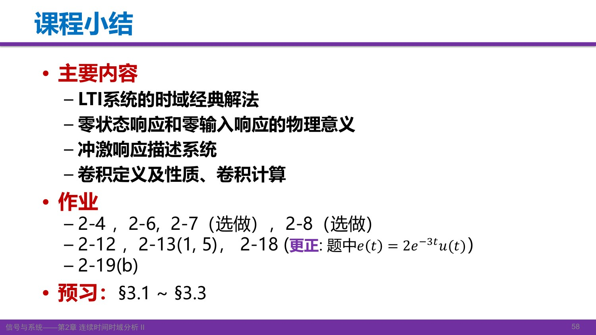

### 未讲内容与预习

课件第54–56页用冲激响应分析因果性与稳定性，留待下次讲解，课前可先自学。第57页汇总了本章学习要求。

课件预习范围：**§3.1–§3.3**。复习本讲时，先掌握经典法、双零分解和卷积这条主线。

[对应课堂 T44](Transcript_Corrected.md#T44) · [教材导航](../../Global/Textbook_Index.md) · [来源与订正](Lecture_Source_Map.md)

自测：本讲的四个关键问题

1. 全响应已知非零初始状态时，为什么通常不能只写 \(e*h\)？——还缺零输入响应。
2. 为什么自由响应不等于零输入响应？——零状态中也有齐次形式部分，其系数由输入与零状态条件共同确定。
3. 卷积积分限怎么找？——写出两个因子对 \(\tau\) 的非零条件，求交集，按端点变化分段。
4. 一边求导、一边积分前查什么？——卷积存在、边界项消失以及微积分交换是否合法，特别注意负无穷处的非零常数。

