# 傅里叶级数：从 LTI 响应到周期信号的频谱

> 本讲日期来自转写头部：2026-09-22 上午9:50。开头补完第二章的因果性与稳定性，随后讲授 Ch3_1 的傅里叶级数、频谱、对称性、矩形脉冲与有限项逼近。课件48页已逐页核对；原音长86分29.4秒，尚未实际核听。转写45:10附近包含休息及课堂演示的衔接，未提供演示视频，不虚构其过程。资料保持 draft。

这堂课的主问题是：**为什么把信号拆成不同频率的正弦波会更容易分析？怎样从波形得到每个频率的幅度和相位？** 复习应做到：会推系数、会写完整展开式、会画单双边谱，并能解释改变周期、脉宽或截断阶次时发生什么。

- [忠实课堂回顾与原音定位](Transcript_Corrected.md)
- [来源、逐页覆盖与重要订正](Lecture_Source_Map.md)
- [原课件](Raw/Ch3_1.pdf)；[教材定位索引](../../Global/Textbook_Index.md)

正文沿课堂主线整理。源材料直接支持的定义/公式为来源事实，课堂解释为教师讲授；标有“补充推导”“教材补充”的段落是编者补足，不冒充教师原话。存在歧义时在当地注明；原页保留原样。

## 1. 从上讲接续：卷积描述的是零状态 LTI 响应

经典法将微分方程的解写成齐次解加特解；双零法按响应起因拆成零输入响应与零状态响应。前者关注解的数学结构，后者把初始储能与外部激励分开。求特解可用配平，但确定总解中的任意常数仍须初始条件。

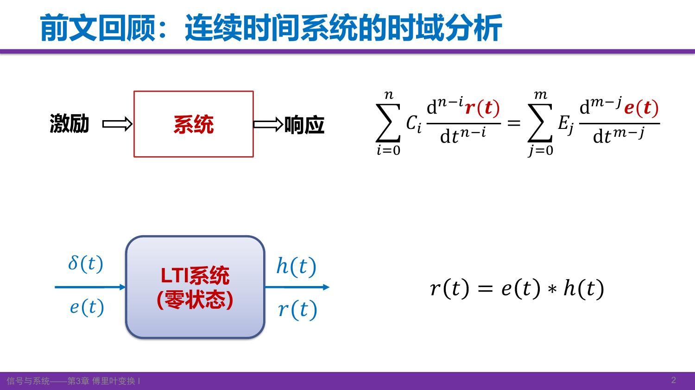

图中下方框图明确标有“LTI系统（零状态）”。若单位冲激的零状态响应为 \(h(t)\)，则

\[
e(t)=\int_{-\infty}^{\infty}e(\tau)\delta(t-\tau)\,d\tau,
\qquad r_{zs}(t)=\int_{-\infty}^{\infty}e(\tau)h(t-\tau)\,d\tau=e*h.
\]

时间平移使 \(\delta(t-\tau)\) 对应 \(h(t-\tau)\)，线性使各加权响应可以积分叠加。每固定一个 \(t\) 算出一个数，让 \(t\) 变化才得到整个输出函数。卷积的反折、平移、相乘、积分是计算步骤；用 \(f*\delta=f\) 等性质常能减少积分。

**原页订正**：课件p.5把冲激分解的上限写成 \(t\)。一般的冲激筛选表达应取全实轴；不在冲激恰落积分端点时无说明地使用它，以免引入端点取值约定。它与下一节因果卷积上限可以取 \(t\) 的理由不同。

[课堂 T01–T02](Transcript_Corrected.md#T01) · [来源与订正](Lecture_Source_Map.md)

自测：系统有初始储能时，能直接用 e*h 代表全部输出吗？

不能。它表示零状态响应；总响应还应加零输入响应。先明确所研究的输入—输出映射及初始条件。

## 2. 用冲激响应判断因果性与 BIBO 稳定性

这是本讲05:05–12:01补讲的第二章收尾内容。新课件没有重印判据，相关旧页可查[上一讲课件p.54–56](../L03/Raw/Ch2.pdf#page=54)。这里由本讲转写确定“本次已讲”，不回改上讲实际授课记录。

对零状态连续时间 LTI 系统，因果性等价于

\[h(t)=0\quad(t<0).\]

若成立，卷积变为

\[r(t)=\int_{-\infty}^{t}e(\tau)h(t-\tau)\,d\tau.\]

当 \(\tau>t\) 时，\(t-\tau<0\)，核为零；所以输出只用现在和过去的输入。**补充说明必要性**：因果系统在输入冲激到来之前不能产生其零状态响应，因此 \(h(t)\) 在负时间必须为零。这里“因果信号”是描述负时间为零的波形，不是说任意波形自身构成系统。

BIBO 的意思是有界输入产生有界输出。对以普通函数冲激响应表示的卷积系统，其充要条件是

\[\int_{-\infty}^{\infty}|h(t)|\,dt<\infty.\]

课堂给出充分性的估计。若 \(|e(t)|\le M\)，

\[
|r(t)|\le\int_{-\infty}^{\infty}|e(\tau)|\,|h(t-\tau)|\,d\tau
\le M\int_{-\infty}^{\infty}|h(v)|\,dv.
\]

注意不能漏掉输入界 \(M\)，且必须是**绝对可积**；正负抵消后的积分有限不足以控制任意输入。充要判据涉及所有有界输入，不能只试一个阶跃就断定稳定。课堂未展开必要性证明；含冲激直通项的系统要用相应广义解释，不能把 \(\delta\) 当普通函数取绝对值积分。

**编者例子（不冒充课堂未识别的指图例）**：\(h=e^{-t}u(t)\) 因果且绝对积分为1；\(h=u(t)\) 因果但不稳定，单位阶跃输入得到 \(t u(t)\)；\(h=e^t u(-t)\) 非因果但绝对积分为1，稳定。因果性与稳定性是两件事。

[课堂 T03–T05](Transcript_Corrected.md#T03)

自测：h(t) 处处有界，就能保证系统稳定吗？

不能。\(u(t)\) 处处有界却不绝对可积。系统的 BIBO 判据要求冲激响应的绝对积分有限，不是只看峰值。

## 3. 为什么换到频域：复指数把时间变量分离出来

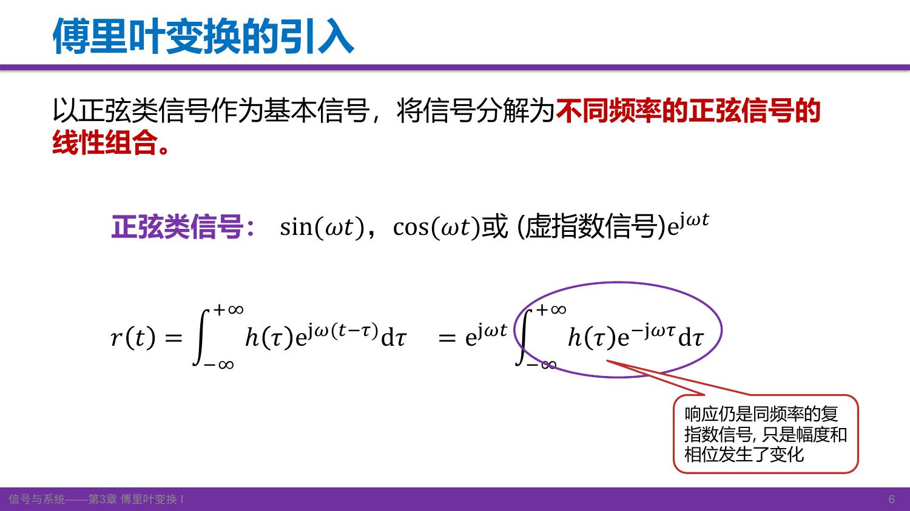

卷积中 \(t\) 和积分变量 \(\tau\) 同时出现在 \(e(t-\tau)\) 中。若输入选为全时间复指数 \(e(t)=e^{j\omega t}\)，便有

\[
r(t)=\int_{-\infty}^{\infty}h(\tau)e^{j\omega(t-\tau)}\,d\tau
=e^{j\omega t}\underbrace{\int_{-\infty}^{\infty}h(\tau)e^{-j\omega\tau}\,d\tau}_{H(j\omega)}.
\]

这一步的关键是 \(e^{j\omega(t-\tau)}=e^{j\omega t}e^{-j\omega\tau}\)：负号必须保留。积分不再含 \(t\)，输出仍是同频复指数，只乘一个复数 \(H(j\omega)\)。它的模决定幅度缩放，辐角决定相位变化。若 \(h\) 绝对可积，该积分存在；更一般的情形须另查收敛条件。

对实系统的全时间正弦输入，或适用的正弦稳态分析，同样可读成“同频率，改变幅度与相位”。**条件补足**：若输入在0时刻才接入 \(\cos\omega t\,u(t)\)，输出通常还有启动暂态，不能一概只写同频余弦。虚指数模恒为1也不等于任意系统都稳定；教师在转写24:33明确区分了两种“稳定”。

信号分析由“波形随时间怎样变化”转为“包含哪些频率”；系统分析由繁复卷积转为观察不同频率的幅相变化。这正是引入频谱、带宽、滤波、调制等概念的入口。

[课堂 T07–T10](Transcript_Corrected.md#T07) · [课件p.5–7、11](Raw/Ch3_1.pdf#page=5)

自测：这一推导要求系统的 h(t) 本身是复指数吗？

不要求。利用卷积交换次序，把输入选为复指数即可。系统的 \(h(t)\) 可为其他函数，但定义 \(H(j\omega)\) 的积分必须具有适用意义。

## 4. 本章在课程中的位置与“变换”的用处

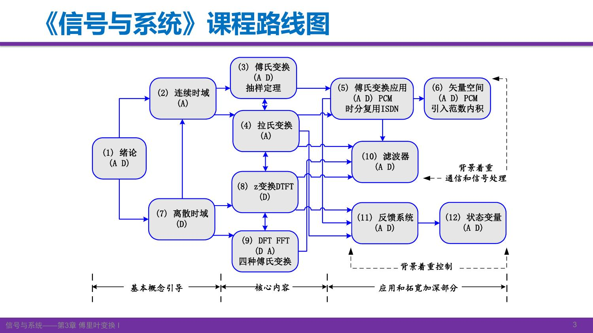

本章从傅里叶级数出发，引出傅里叶变换及性质，再讨论周期/抽样信号、卷积定理、抽样定理。之后学习拉普拉斯变换，回到通信应用与矢量空间；离散部分又连接 Z 变换、DTFT、DFT/FFT。图上箭头表示方法之间的联系，不意味着它们是同一个公式。

教师强调本章是核心，特别要求长期记住卷积定理与抽样定理；本讲只作引导，不把后续完整定理列为已授。学习目标不是重复微积分课程的全部收敛性证明，而是把数学工具用于分析信号和系统。

课件p.8–10以傅里叶的热传导研究、变形金刚和蝴蝶图示说明“换一种表示以取得好处”。教师又用 Radon 变换与 CT 成像说明理论可能早于应用，用 FFT 将直接计算的 \(O(N^2)\) 降到典型 \(O(N\log N)\) 的例子说明计算工具的重要性。这些是课堂背景说明；轶事与历史归属未做独立考据，不用作学术结论。

**编者概念校正**：“可逆才叫变换”是课堂帮助理解的说法，不是一般数学术语的定义。傅里叶分析关心在合适函数空间和条件下进行分析与重建；非单射映射也可称变换。

[课堂 T06、T11–T15](Transcript_Corrected.md#T06)

自测：从时域换到频域，信号真的变成了另一件物理对象吗？

在可重建的分析框架中，是同一信号的另一种表示。优势在于频率组成和系统的频率选择作用更容易辨认。

## 5. 三角形式：用正交性求系数

设 \(f(t)\) 是周期为 \(T_1\) 的实信号，\(\omega_1=2\pi/T_1\)。本课程把直流直接写作 \(a_0\)，不是另一种常见约定中的 \(a_0/2\)：

\[f(t)=a_0+\sum_{n=1}^{\infty}\big[a_n\cos(n\omega_1t)+b_n\sin(n\omega_1t)\big].\]

在任意完整周期上积分，所有非零整数次正余弦的积分都为零，所以

\[a_0=\frac1{T_1}\int_{t_0}^{t_0+T_1}f(t)\,dt.\]

**补充完整推导步骤**：把展开式两边乘 \(\cos(m\omega_1t)\) 再积分。不同次数的余弦互相正交，正弦与余弦也正交；只有 \(n=m\) 的余弦项留下，且

\[\int_{t_0}^{t_0+T_1}\cos^2(m\omega_1t)\,dt=T_1/2\quad(m\ge1).\]

因此

\[a_n=\frac2{T_1}\int_{t_0}^{t_0+T_1}f(t)\cos(n\omega_1t)\,dt,\qquad
b_n=\frac2{T_1}\int_{t_0}^{t_0+T_1}f(t)\sin(n\omega_1t)\,dt.\]

这里的2来自基函数平方积分为 \(T_1/2\)，不是积分本身永远等于 \(1/2\)。可取 \([0,T_1]\) 或 \([-T_1/2,T_1/2]\)，选择使分段最少、对称性最清楚的区间。

教师反复提醒：“写傅里叶级数展开”包括**求系数与代回完整展开式**两步，只交一个系数积分没有完成任务。

[课堂 T16–T18](Transcript_Corrected.md#T16) · [课件p.13](Raw/Ch3_1.pdf#page=13) · [教材PDF110](../../Global/Cache/10d306ff84e86b481416f9078618de2a72fb0edecc87269348c3caa143c05915/p-110.png)

自测：为什么直流系数是1/T₁，而 aₙ、bₙ 是2/T₁？

常数基函数1的平方积分为 \(T_1\)，非零整数次正余弦的平方积分为 \(T_1/2\)。归一化不同，直流也不能跟着非零频率一起“减半”。

## 6. 狄利克雷条件与跳变点的重建值

本讲讨论的是**一个周期内**的傅里叶级数条件：有限个间断点、有限个极大/极小值，以及 \(\int_{t_0}^{t_0+T_1}|f(t)|dt<\infty\)。对通常的分段光滑、具有有限单侧极限的工程信号，这是一套常用充分条件，不是判断一切形式傅里叶分析能否成立的必要条件清单。

**教材补充/条件澄清**：在连续点，级数收敛到 \(f(t)\)；在有限跳变点，标准傅里叶部分和的极限为

\[\frac{f(t^-)+f(t^+)}2.\]

单点如何赋值不改变系数，不能要求级数在任意指定的跳变点值都与原函数相等。不同于周期级数的一周期可积条件，非周期信号的常见傅里叶变换充分条件涉及全实轴积分。

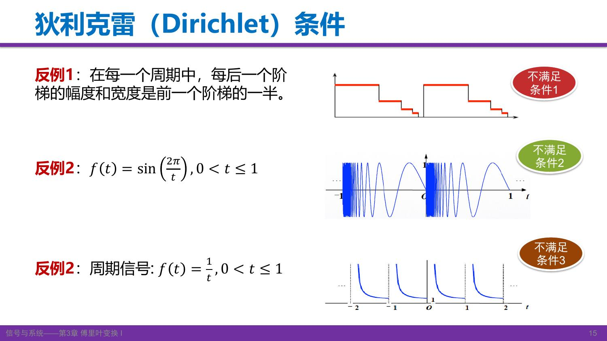

第一图每个台阶的宽度和高度依次减半，展示无限多个间断点；第二图 \(\sin(2\pi/t)\) 在0附近振荡越来越密，展示无限多个极值；第三图 \(1/t\) 在 \(0<t\le1\) 的周期延拓不满足绝对可积条件。**不能据“不满足充分条件不一定失败”反推这三个例子都成功**：第三例连直流积分 \(\int_0^1dt/t\) 都发散，不具有本讲定义的普通傅里叶级数系数。原转写47:58把它们一并说成“也有傅里叶变换”，已列待核听。

[课堂 T19](Transcript_Corrected.md#T19) · [教材PDF111](../../Global/Cache/10d306ff84e86b481416f9078618de2a72fb0edecc87269348c3caa143c05915/p-111.png)

自测：周期方波在跳变点取上平台值，傅里叶重建也必须取这个值吗？

不必须。重建极限取左右极限平均值。修改有限个单点的值不改变积分系数。

## 7. 紧缩形式、幅度谱与相位谱

将同一次谐波的正余弦合并：

\[a_n\cos x+b_n\sin x=c_n\cos(x+\varphi_n),\qquad
c_n=\sqrt{a_n^2+b_n^2},\quad\varphi_n=\operatorname{atan2}(-b_n,a_n).\]

依据是展开右边得到 \(a_n=c_n\cos\varphi_n\)、\(b_n=-c_n\sin\varphi_n\)。普通 \(-\arctan(b_n/a_n)\) 需要补象限、处理分母为0；\(c_n=0\) 的谱线相位无定义。另一种紧缩式为 \(d_n\sin(x+\theta_n)\)，其中 \(d_n=c_n\)、\(\theta_n=\operatorname{atan2}(a_n,b_n)\)。课件p.17根号内把 \(a_n^2\) 排成了 \(a_n^n\)，此处按合角公式订正。

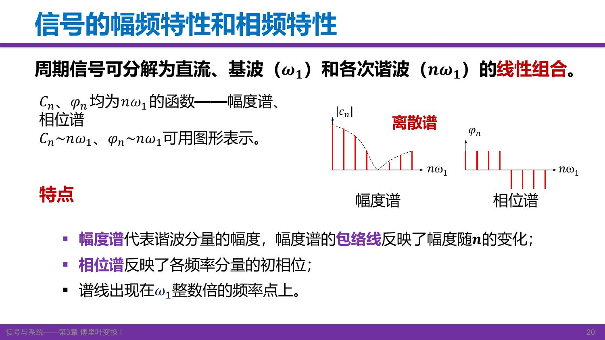

在 \(0,\omega_1,2\omega_1,\ldots\) 上画出直流、基波和各次谐波的谱线。非零频率谱线高度为 \(c_n\)，相位为 \(\varphi_n\)；直流系数仍用有符号的 \(c_0=a_0\) 单独处理。谱线的位置离散，图中虚线包络只是辅助看幅度变化，并不表示这些频点之间也存在连续谱。

课件p.18–19的矩形脉冲从0延续到标记0.3的位置，并非以原点为中心的偶脉冲，因此一般同时有 \(a_n,b_n\) 和非平凡相位。**补充推导**：幅值1、每周期在 \(0<t<d\) 非零时，

\[a_0=d/T_1,\quad a_n=\frac{\sin(n\omega_1d)}{n\pi},\quad b_n=\frac{1-\cos(n\omega_1d)}{n\pi}.\]

再按合角关系得到其幅相谱。它与后文居中脉冲不同的时间原点会影响相位，不能看到“矩形”就一律写 \(b_n=0\)。

[课堂 T20–T21](Transcript_Corrected.md#T20) · [课件p.16–20](Raw/Ch3_1.pdf#page=16)

自测：aₙ=-1，bₙ=0 时，相位是0吗？

非负幅度为1，相位应为 \(\pi\)（或与其等价的 \(-\pi\)）。直接算 \(\arctan 0\) 会丢失负实轴的象限。

## 8. 锯齿波例题：先看奇偶，再分部积分

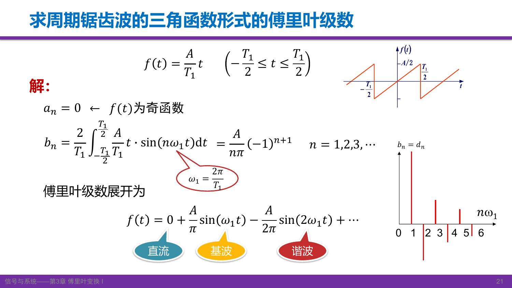

题设为一个周期内 \(f(t)=At/T_1\)，\(-T_1/2<t<T_1/2\)，再周期延拓。端点左右极限是 \(\pm A/2\)，所以这里 \(A\) 是峰峰值，不是单边峰值。它是奇信号，故 \(a_0=a_n=0\)。

**补充课堂略去的积分步骤**：利用奇乘奇为偶，

\[
b_n=\frac{4A}{T_1^2}\int_0^{T_1/2}t\sin(n\omega_1t)\,dt
=\frac{4A}{T_1^2}\left[-\frac{t\cos(n\omega_1t)}{n\omega_1}+\frac{\sin(n\omega_1t)}{(n\omega_1)^2}\right]_0^{T_1/2}
=\frac{A}{n\pi}(-1)^{n+1}.
\]

所以

\[f(t)=\frac A\pi\left[\sin\omega_1t-\frac12\sin2\omega_1t+\frac13\sin3\omega_1t-\cdots\right].\]

图中正负交替的 \(b_n\) 是**带符号系数**，非负幅度则是 \(|b_n|=A/(n\pi)\)（设 \(A>0\)）。正弦紧缩相位在 \(b_n>0\) 时为0，在负值时为 \(\pi\)。课件把 \(b_n=d_n\) 直接并列，需结合符号约定读，不能把幅度画成负数。跳变点的重建取0。

[课堂 T22](Transcript_Corrected.md#T22) · [教材PDF116](../../Global/Cache/10d306ff84e86b481416f9078618de2a72fb0edecc87269348c3caa143c05915/p-116.png)

自测：锯齿波是奇函数，为什么还有第二次谐波？

奇函数只消去直流和余弦项，不消去偶数次正弦。只有另外满足半波反对称时，偶次谐波才消失。

## 9. 指数形式：分析用负号，重建用正号

欧拉公式给出

\[\cos x=\frac{e^{jx}+e^{-jx}}2,\qquad\sin x=\frac{e^{jx}-e^{-jx}}{2j}.\]

代入三角级数，同一次谐波成为

\[a_n\cos(n\omega_1t)+b_n\sin(n\omega_1t)
=\frac{a_n-jb_n}{2}e^{jn\omega_1t}+\frac{a_n+jb_n}{2}e^{-jn\omega_1t}.\]

定义 \(F_0=a_0\)，对 \(n\ge1\) 有 \(F_n=(a_n-jb_n)/2\)、\(F_{-n}=(a_n+jb_n)/2\)，正负频率合并为

\[\boxed{f(t)=\sum_{n=-\infty}^{\infty}F_n e^{jn\omega_1t}},\qquad
\boxed{F_n=\frac1{T_1}\int_{t_0}^{t_0+T_1}f(t)e^{-jn\omega_1t}\,dt}.\]

**补充核验方法**：将重建式乘 \(e^{-jm\omega_1t}\) 并在一个周期积分，\(n\ne m\) 时为0，\(n=m\) 时为 \(T_1\)，正好提取 \(F_m\)。这是正负号搭配的来源。不能在约定不变时把两个号同时写成负号。

写解答时应明确 \(T_1\)、\(\omega_1\)、系数各分支（尤其 \(n=0\)），最后写展开式。\(F_n\) 一般是复数；“幅度”是 \(|F_n|\)，不是带符号实系数或整个复数。

[课堂 T23–T25](Transcript_Corrected.md#T23) · [课件p.22–23](Raw/Ch3_1.pdf#page=22) · [教材PDF113](../../Global/Cache/10d306ff84e86b481416f9078618de2a72fb0edecc87269348c3caa143c05915/p-113.png)

自测：f(t)=3cos(ω₁t+π/3) 的 F₁ 和 F₋₁ 是多少？

\(F_1=\tfrac32e^{j\pi/3}\)，\(F_{-1}=\tfrac32e^{-j\pi/3}\)，其余为0。两项相加才重建这个幅度为3的实余弦。

## 10. 单边谱、双边谱与负频率

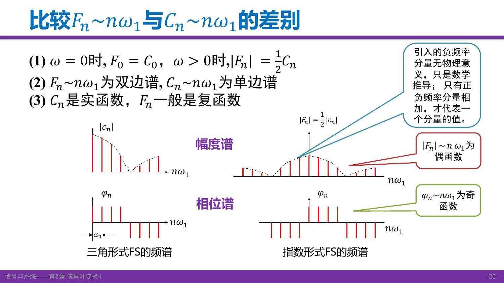

对**实信号**，\(F_{-n}=F_n^*\)。因此非零频率处

\[|F_n|=|F_{-n}|=c_n/2,\qquad \arg F_{-n}=-\arg F_n\pmod{2\pi}.\]

幅度谱为偶对称；相位可取为奇对称，但零谱线无定义，在 \(\pm\pi\) 分支上须按模 \(2\pi\) 理解。直流 \(F_0=a_0\) 不减半。对复信号不能不加条件地套用共轭对称性。

负频率来自 \(e^{\pm j\omega t}\) 两个相反方向的复平面旋转。每一对

\[F_ne^{jn\omega_1t}+F_{-n}e^{-jn\omega_1t}=2\operatorname{Re}\{F_ne^{jn\omega_1t}\}\]

构成一个实谐波。课堂把它称为数学表示引入的量，意在说明不必把负号当成另一种实正弦振动速度；不能因此认为它可以从重建式中删除。课件p.29的矢量图表示这种共轭配对，旋转的是含时间因子的谐波分量，不是常数系数在自行随时间变化。

[课堂 T26、T28](Transcript_Corrected.md#T26)

自测：把所有非零频率谱线减半，为什么功率没有少一半？

因为单边余弦幅度 \(c_n\) 的平均功率为 \(c_n^2/2\)；双边两项贡献 \(2(c_n/2)^2=c_n^2/2\)。比较功率必须同时考虑表示形式与两侧谱线。

## 11. 完整例题：从已知三角式画出两种幅相谱

课件p.26题设：

\[f(t)=1+\sin\omega_1t+2\cos\omega_1t+\cos(2\omega_1t+\pi/4).\]

先合并同频项，令 \(\alpha=\arctan(1/2)\)：

\[f(t)=1+\sqrt5\cos(\omega_1t-\alpha)+\cos(2\omega_1t+\pi/4).\]

\(\alpha\approx0.147584\pi\)，课件 \(0.15\pi\) 只是近似。单边谱：直流1，基波幅度 \(\sqrt5\)、相位 \(-\alpha\)，二次谐波幅度1、相位 \(\pi/4\)。

用欧拉公式分别拆开，得到下表，其他 \(F_n=0\)：

| n | 系数 Fₙ | 幅度 | 相位 |
|---|---|---|---|
| −2 | \(\tfrac12e^{-j\pi/4}\) | \(1/2\) | \(-\pi/4\) |
| −1 | \(1+j/2\) | \(\sqrt5/2\) | \(+\alpha\) |
| 0 | \(1\) | \(1\) | \(0\) |
| 1 | \(1-j/2\) | \(\sqrt5/2\) | \(-\alpha\) |
| 2 | \(\tfrac12e^{j\pi/4}\) | \(1/2\) | \(+\pi/4\) |

完整指数展开为 \(f(t)=\sum_{n=-2}^{2}F_ne^{jn\omega_1t}\)，系数如表。

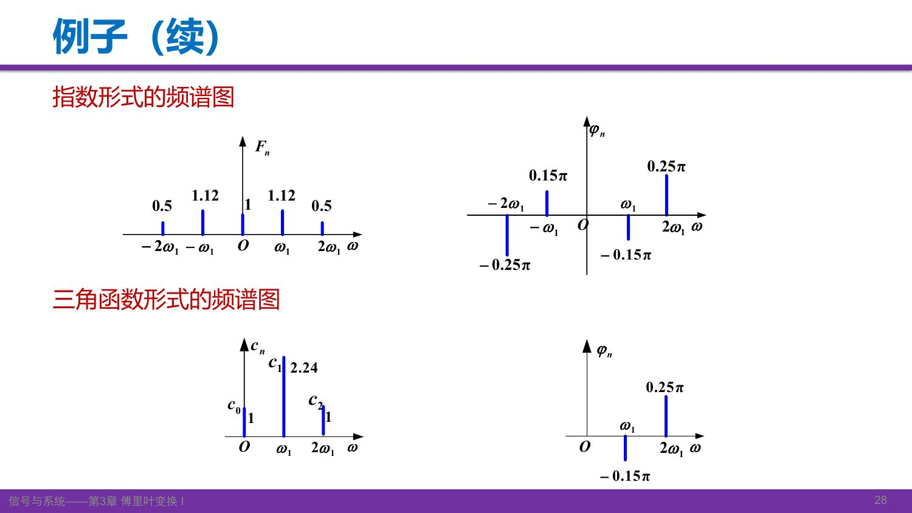

看图时先核横坐标：上图多出 \(-\omega_1,-2\omega_1\)，非零频率高度各为下图一半，0频保持1。再核相位：左右互为相反数。图上1.12、2.24是四舍五入值，精确答案用根式。

[课堂 T27](Transcript_Corrected.md#T27) · [课件p.26–28](Raw/Ch3_1.pdf#page=26)

自测：只看本题 F₁=1−j/2，能直接判断基波幅度为1吗？

不能。双边幅度 \(|F_1|=\sqrt5/2\)，实余弦的单边幅度是其两倍 \(\sqrt5\)。实部1不是幅度。

## 12. 帕塞瓦尔方程：平均功率在两种表示中一致

对一周期平方可积信号，

\[P=\frac1{T_1}\int_{t_0}^{t_0+T_1}|f(t)|^2\,dt
=\sum_{n=-\infty}^{\infty}|F_n|^2.\]

对实信号还可写成

\[P=a_0^2+\frac12\sum_{n=1}^{\infty}(a_n^2+b_n^2)=a_0^2+\frac12\sum_{n=1}^{\infty}c_n^2.\]

**补充推导**：对有限和平方后积分，交叉项因正交性消失；直流项平方平均仍为 \(a_0^2\)，每个余弦/正弦平方平均为其幅度平方的一半。对适用的平方可积信号再取均方极限。指数形式中 \(e^{jn\omega_1t}\) 的模平方为1，于是每条谱线贡献 \(|F_n|^2\)。

教师以“能量守恒”帮助理解，本式准确描述的是周期信号的**平均功率**（按归一化负载约定）；非零周期信号全时间能量通常无限。上一例 \(P=1+5/2+1/2=4\)，双边检验也为 \(1+2(5/4)+2(1/4)=4\)。

[课堂 T29](Transcript_Corrected.md#T29) · [课件p.30](Raw/Ch3_1.pdf#page=30)

自测：为何式中用 |f|²，而课件写 f²？

课件讨论实信号，二者相同。推广到复信号必须用模平方，才能表示非负功率并使用正交内积。

## 13. 四种对称性：奇偶与奇次谐波不是同一件事

| 波形条件 | 可直接消去的项 | 指数系数特征（实信号） |
|---|---|---|
| 偶对称 \(f(-t)=f(t)\) | \(b_n=0\) | \(F_n\) 实且偶；可能为负 |
| 奇对称 \(f(-t)=-f(t)\) | \(a_0=a_n=0\) | \(F_n=-jb_n/2\) 纯虚且奇 |
| 半波反对称（奇谐）\(f(t+T_1/2)=-f(t)\) | 直流及全部偶次谐波 | \(F_{2k}=0\)，含 \(k=0\) |
| 半周期重复（偶谐）\(f(t+T_1/2)=f(t)\) | 全部奇次谐波 | 相对所选 \(T_1\)，\(F_{2k+1}=0\) |

偶谐是课件列出的补充类型，课堂仅简略带过；若 \(T_1\) 原本声称为最小周期，半周期重复意味着需要重新确定基波。

**补充推导**：偶信号乘正弦为奇函数，对称区间积分为0；奇信号乘余弦同理。半波反对称时将系数积分拆成两半并平移，第二半是第一半乘 \(-e^{-jn\pi}=-(-1)^n\)，总因子为 \(1-(-1)^n\)，偶数次全部消失。这不要求信号关于原点为奇函数。

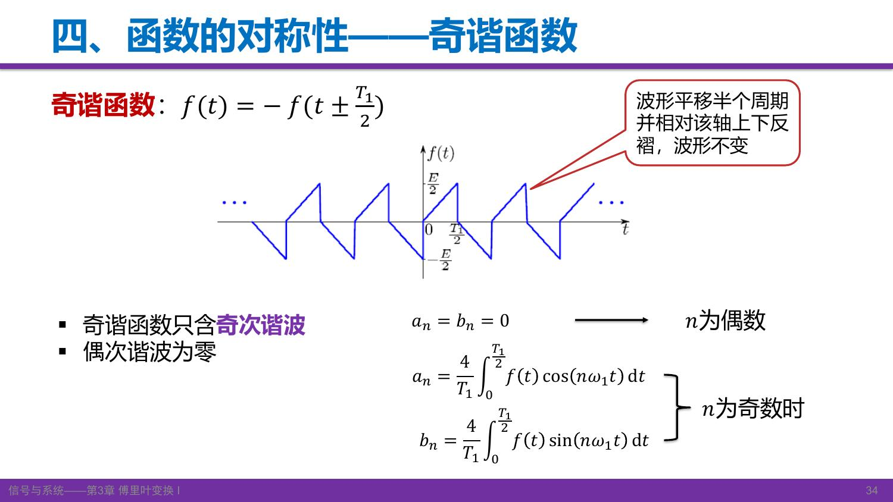

图上把波形沿时间轴平移半周期，再上下反转，正好与原波形重合。判定前要看清选定的时间原点；同一个形状平移后可能失去奇偶对称，但半波关系仍可保留。

**课件/教材符号校正**：若 \(c_n,d_n\) 约定为非负幅度，偶信号应取 \(c_n=|a_n|\)，奇信号取 \(c_n=|b_n|\)；不能直接写成带符号系数。课件p.33“\(c_n\)和\(F_n\)为虚数”不成立，纯虚的是 \(F_n\)，幅度 \(c_n\) 始终为实数。教材PDF115–116亦有带符号幅度写法，使用时保持本讲统一约定。

[课堂 T30](Transcript_Corrected.md#T30) · [教材PDF115–116](../../Global/Raw/信号与系统_第三版_郑君里_上.pdf#page=115)

自测：偶函数能含奇次谐波吗？

能，例如 \(\cos\omega_1t\)。偶函数说的是时间反折；奇次谐波说的是整数频率编号。不要把“偶函数”读成“只含偶次谐波”。

## 14. 核心例题：居中周期矩形脉冲

设 \(E>0\)、\(0<\tau<T_1\)。一周期内 \(|t|<\tau/2\) 时 \(f(t)=E\)，其余为0，再周期延拓。

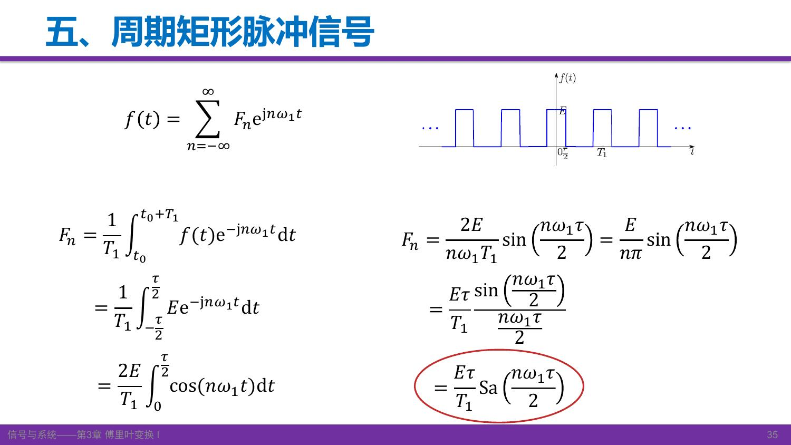

从定义出发，非零区间是**脉宽** \(\tau\)，不是整个周期 \(T_1\)：

\[F_n=\frac E{T_1}\int_{-\tau/2}^{\tau/2}e^{-jn\omega_1t}\,dt.\]

当 \(n\ne0\)，虚部由奇对称相消，

\[F_n=\frac{2E}{T_1}\int_0^{\tau/2}\cos(n\omega_1t)dt
=\frac{2E}{n\omega_1T_1}\sin\frac{n\omega_1\tau}{2}
=\frac{E\tau}{T_1}\operatorname{Sa}\!\left(\frac{n\omega_1\tau}{2}\right).\]

定义 \(\operatorname{Sa}(x)=\sin x/x\)，并取连续延拓 \(\operatorname{Sa}(0)=1\)，于是该式也覆盖 \(F_0=E\tau/T_1\)。前面的 \(E\tau\) 是单个脉冲面积，除以周期得到平均值。

完整展开：

\[f(t)=\sum_{n=-\infty}^{\infty}\frac{E\tau}{T_1}\operatorname{Sa}\!\left(\frac{n\pi\tau}{T_1}\right)e^{jn\omega_1t}.\]

三角形式为

\[a_0=E\tau/T_1,\quad b_n=0,\quad a_n=2F_n\ (n\ge1),\qquad f(t)=a_0+\sum_{n=1}^{\infty}a_n\cos(n\omega_1t).\]

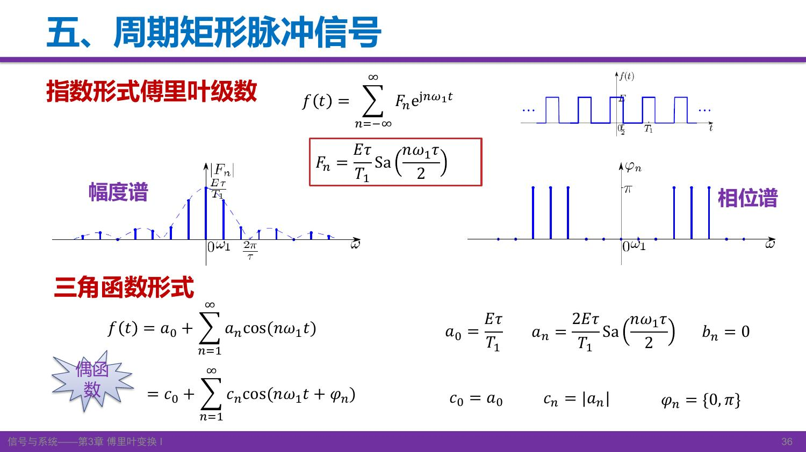

\(F_n\) 为实数不意味着相位都为0。\(F_n>0\) 时取0，\(F_n<0\) 时取 \(\pi\) 或 \(-\pi\)，零系数相位无定义；幅度谱是 Sa 的绝对值。图中有符号包络、非负幅度谱和相位谱应分开读。

[课堂 T31–T33](Transcript_Corrected.md#T31) · [教材PDF122–123](../../Global/Raw/信号与系统_第三版_郑君里_上.pdf#page=122)

自测：占空比 τ/T₁=1/2，直流与第二次谐波是多少？

\(F_0=E/2\)，\(F_2=(E/2)\operatorname{Sa}(\pi)=0\)。非零偶次谐波消失，但这是单极性矩形脉冲，直流仍存在，不能说它本身半波反对称。

## 15. 周期、脉宽、频带宽度：分别固定什么？

将连续频率辅助函数写为 \(G(\omega)=E\tau\operatorname{Sa}(\omega\tau/2)\)，则 \(F_n=G(n\omega_1)/T_1\)。这让两个尺度分开了：

| 改变量及固定条件 | 谱线间隔 | 包络及直流 |
|---|---|---|
| 固定 E、τ，增大 T₁ | \(2\pi/T_1\) 变小，谱线更密 | 系数包络整体按 \(1/T_1\) 变低；包络零点位置不变 |
| 固定 E、T₁，减小 τ | 间隔不变 | 直流 \(E\tau/T_1\) 降低；第一零点向外，主瓣更宽 |
| 固定 E、T₁，增大 τ | 间隔不变 | 直流升高；第一零点向内，主瓣更窄 |

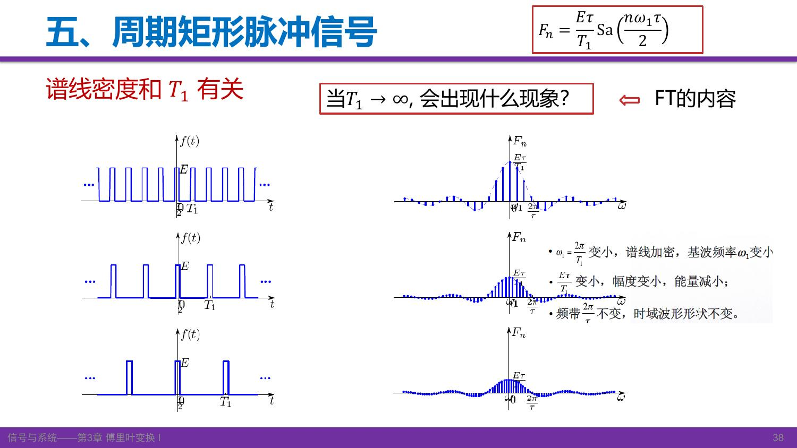

图中左侧脉冲逐渐稀疏，右侧谱线却逐渐密集。注意这不是“信号越稀疏，谱线也越稀疏”。固定脉宽时，第一包络零点始终为 \(2\pi/\tau\)。原转写01:11:28同时出现“不变”和“过零点会发生变化”，此处按公式与课件p.38订正为不变。

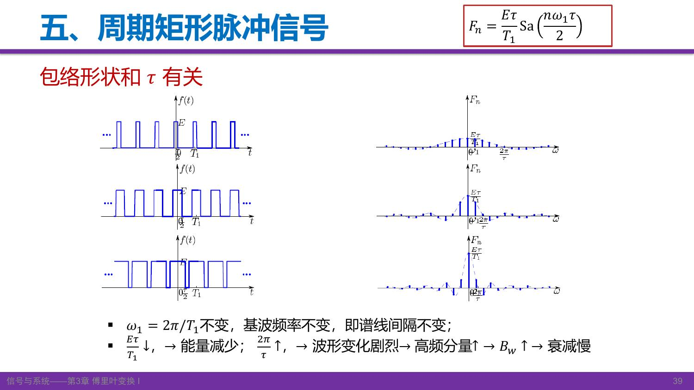

零点满足 \(\omega=2k\pi/\tau\)，其中 \(k\ne0\)。课件p.37把0也列入零点，需剔除：0处是最大值。包络零点不一定落在 \(n\omega_1\) 的格点上；只有 \(n\tau/T_1\) 为非零整数时，该谐波才恰好缺失。

**比例说法的边界**：固定 \(\tau,T_1,n\) 时，\(F_n\) 对 \(E\) 线性；改变 \(\tau\) 或 \(T_1\) 还会改变 Sa 的自变量，不能说“每条固定编号谱线都简单正比于脉宽、反比于周期”。例如 \(F_1=(E/\pi)\sin(\pi\tau/T_1)\)，在占空比从1/2增至1时反而下降到0。

矩形脉冲频谱一般无限延伸，工程上可用第一零点给出**单边主瓣带宽**

\[B_\omega=2\pi/\tau\quad(\mathrm{rad/s}),\qquad B_f=1/\tau\quad(\mathrm{Hz}).\]

两侧零点之间的总宽度是其两倍。课堂还提到按幅度降到最大值1/10等阈值定带宽；带宽须说明采用哪个标准，不能把该阈值当普适定义。窄脉冲的相对高频成分更丰富，不表示所有高频谱线绝对幅度都增大。

**下讲预告及补充澄清**：固定单脉冲形状令 \(T_1\to\infty\)，谱线变密、\(F_n\) 变小，但 \(T_1F_n\) 对应有限的 \(G(\omega)\)，由此引出连续频谱。不能直接把未缩放的“级数包络”说成同幅度的傅里叶变换。若固定 \(T_1\) 令 \(\tau=T_1\)，信号为常数 \(E\)，则 \(F_0=E\)、\(F_{n\ne0}=0\)，不是无限大的级数系数；常数的广义傅里叶变换为冲激是另一种表示。

[课堂 T34–T36](Transcript_Corrected.md#T34)

自测：脉宽不变，周期变成两倍，第一包络零点和谱线间隔各怎样变化？

第一零点仍为 \(2\pi/\tau\)，不变；间隔减半，谱线变密；包络高度尺度减半。不要把包络零点和谱线间隔混为同一个量。

## 16. 双极性对称方波：先核幅值，避免差一倍

课件p.41示意图标出 \(+E,-E\)，并具有偶对称和半波反对称，故无直流、无正弦、无偶次谐波。课堂对此页只简略提示课下理解。

**源内冲突**：该页公式前因子写 \(2E/\pi\)，对应的实际平台应为 \(\pm E/2\)；教材PDF120–121正是 \(\pm E/2\) 的图及此公式。按课件图示 \(\pm E\) 应为 \(4E/\pi\)。不能把图与式不加说明地并用。

为消除歧义，以下**补充推导**令平台幅值为 \(\pm A\)，在 \(|t|<T_1/4\) 为 \(+A\)，另半周期为 \(-A\)。把它写作高度 \(2A\)、占空比1/2的单极性脉冲减去常数 \(A\)，于是

\[a_0=0,\quad b_n=0,\quad a_n=\frac{4A}{n\pi}\sin\frac{n\pi}{2},\]

\[f(t)=\frac{4A}{\pi}\left[\cos\omega_1t-\frac13\cos3\omega_1t+\frac15\cos5\omega_1t-\cdots\right].\]

代 \(A=E\) 得课件图对应结果；代 \(A=E/2\) 得教材与课件文字公式。只代入单极性脉冲的 \(\tau=T_1/2\) 而不处理负平台，会漏直流修正或幅度因子。

[课堂 T37](Transcript_Corrected.md#T37) · [教材PDF120](../../Global/Cache/10d306ff84e86b481416f9078618de2a72fb0edecc87269348c3caa143c05915/p-120.png)

自测：平台为 ±A 的方波，其总平均功率是多少？

时域处处 \(f^2=A^2\)（跳变点不影响积分），故 \(P=A^2\)。这可用来核对频域系数是否漏了倍数。

## 17. 有限项逼近、最小均方误差与 Gibbs 现象

设保留到第 \(N\) 次谐波，

\[S_N(t)=a_0+\sum_{n=1}^N[a_n\cos n\omega_1t+b_n\sin n\omega_1t],\quad\varepsilon_N=f-S_N.\]

一周期均方误差为

\[\mathcal E_N=\frac1{T_1}\int_{t_0}^{t_0+T_1}|\varepsilon_N(t)|^2dt
=P-a_0^2-\frac12\sum_{n=1}^N(a_n^2+b_n^2)
=\sum_{|n|>N}|F_n|^2.\]

**补充解释“最小”**：在固定的这些基函数张成的空间内，傅里叶系数使误差与所有保留基函数正交；任取另一组系数，相当于在正交残差外再加一个非零误差分量，平方范数只会增加。它是均方意义最优，不保证每一点误差同时最小。

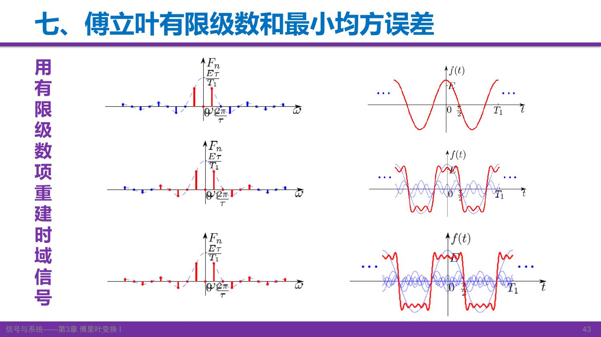

图右由很圆滑的曲线逐渐接近平台和陡边。低频确定大尺度轮廓，高频有助于形成边缘；如果某个分量的幅度或相位错了，重建形状也会变。对于上一节 \(\pm A\) 方波，只留基波时

\[\mathcal E_1=A^2-\tfrac12(4A/\pi)^2=A^2(1-8/\pi^2)\approx0.18943A^2.\]

增加到三次谐波，继续减去 \(\tfrac12(4A/(3\pi))^2\)，误差降为约 \(0.09937A^2\)。奇次项数和最高谐波次数不要混淆：基波、三次、五次是3个非零项，最高次数为5。

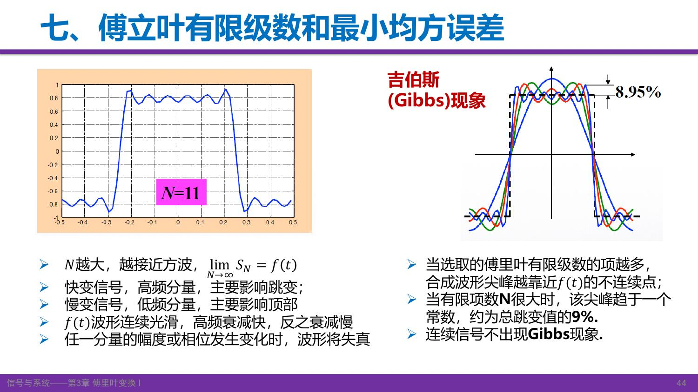

对具有跳变的分段光滑信号，采用通常的傅里叶部分和截断时，项数增多使振铃区域收窄、尖峰靠近跳变点，但极限过冲约为**总跳变量的8.95%**。不是任何有限阶都恰好9%，不是所有振荡都叫 Gibbs，也不是“无穷多个频率”本身就足以推出固定9%过冲。\(\pm A\) 方波总跳变量是 \(2A\)，极限越过平台的高度约 \(0.17898A\)。

均方误差下降与局部过冲不消失并不矛盾：振铃占据的区间越来越窄。跳变点本身的重建极限取左右平均值。课堂提示预平滑等办法可减轻振铃；代价是边缘被钝化或采用不同的重建方式。课件“光滑则高频衰减快”用于常见分段光滑信号的比较；\(1/n\) 是有跳变波形的典型衰减量级，不是所有不连续函数的无条件定理。

[课堂 T38–T41](Transcript_Corrected.md#T38) · [教材PDF120–122](../../Global/Raw/信号与系统_第三版_郑君里_上.pdf#page=120)

自测：增加阶次能让方波跳变附近的最大过冲比例趋于0吗？

通常傅里叶部分和不能。过冲极限约为跳变量的8.95%，但区域收窄；一周期均方误差仍可趋于0。它们衡量的是不同的误差性质。

## 18. 本讲收束、四种分析与作业

课堂最后把本讲放回四种傅里叶分析的框架。下表是**课堂预告的规范化整理**，后两项留待离散时间部分系统学习：

| 时间信号 | 常用工具 | 频域表示 |
|---|---|---|
| 连续时间、周期 | 连续时间傅里叶级数 FS | 离散谱线，系数一般不周期 |
| 连续时间、非周期 | 傅里叶变换 FT | 连续频率变量，一般不周期 |
| 离散时间、非周期 | DTFT | 连续频率变量、周期性频谱 |
| 离散时间、周期 | DFS（与一个周期的DFT相联系） | 离散且周期的系数 |

本讲需要能独立完成：写三角与指数形式及系数；判断对称性；换算单双边幅相谱；推导矩形脉冲；区分谱线间隔与主瓣宽度；用 Parseval 检验功率；解释有限项逼近和 Gibbs 现象。傅里叶变换的完整推导、卷积定理与抽样定理仍是后续内容。

### 课堂作业（不等同于编者自测）

课件p.47指定 **3-4、3-5、3-6、3-9**；p.45提示课下推导周期锯齿、三角、半波余弦、全波余弦，注意对称性。当前归档是第三版上册，课件推荐第四版，以下为第三版实际题面，不宣称已核第四版题面。

| 题号 | 已核验的题设与要求 | 原页 |
|---|---|---|
| 3-4 | 周期三角信号，0和T处为0、T/2处为E；求级数并画频谱 | [PDF187 / 印刷171](../../Global/Cache/10d306ff84e86b481416f9078618de2a72fb0edecc87269348c3caa143c05915/p-187.png) |
| 3-5 | 居中半波余弦；求级数；给E=10 V、f=10 kHz画幅度谱 | [同页](../../Global/Cache/10d306ff84e86b481416f9078618de2a72fb0edecc87269348c3caa143c05915/p-187.png) |
| 3-6 | 每周期从E线性降到0的锯齿；求指数形式级数并大致画频谱 | [同页](../../Global/Cache/10d306ff84e86b481416f9078618de2a72fb0edecc87269348c3caa143c05915/p-187.png) |
| 3-9 | 周期余弦切顶脉冲；求级数、直流及基波/k次谐波幅度，θ任意值、60°、90°三种情形 | [题干PDF187](../../Global/Cache/10d306ff84e86b481416f9078618de2a72fb0edecc87269348c3caa143c05915/p-187.png) · [题图PDF189 / 印刷173](../../Global/Cache/10d306ff84e86b481416f9078618de2a72fb0edecc87269348c3caa143c05915/p-189.png) |

3-9提示式是有效脉冲区内 \(i(t)=I_m[\cos(\omega_1t)-\cos\theta]/(1-\cos\theta)\)，必须结合题图在 \(|\omega_1t|\le\theta\) 的截取与周期延拓；不能把余弦提示式直接当成全时间波形。解题时先选周期、写分段、用对称性，再算系数和画谱。

预习 **§3.4–§3.7**。01:25:56转写提醒“周日的还有一个题”与本次作业一起于**下周一晚上**提交；依本讲日期推算为 **2026-09-28晚**，具体截止时刻未给。该“周日的一个题”未报题号，不擅自指认为旧讲某题。15:08另提下周二再上课及之后的间隔，作为课堂口头安排保留，以课程正式通知为准。

[课堂 T42–T44](Transcript_Corrected.md#T42) · [课件作业原页](Raw/Ch3_1.pdf#page=47)

复习出口：拿到陌生周期波形，第一步做什么？

先标清周期、幅度、时间原点与一周期分段；检查奇偶和半波对称，再选择最方便的系数公式。算出后核直流、共轭对称、特殊参数和功率，最后写完整展开式及所要求的幅相谱。

