# 傅里叶变换：连续频谱、典型信号与运算性质

上一讲把周期信号写成离散谐波的叠加。这一讲把周期逐渐拉长，观察谱线如何变密，由此得到连续时间傅里叶变换。随后用指数、矩形、三角、升余弦和高斯脉冲建立波形与频谱的直觉，再把平移、展缩、调制、微分和积分变成频域中的简单运算。

学习的重点有两层：能够说明一个频谱为什么具有这样的形状；面对新信号，能够选用已有变换对和性质完成计算。正、逆变换的符号与归一化系数贯穿整讲。

[课堂回顾](Transcript_Corrected.md) · [来源与订正](Lecture_Source_Map.md)

## 1. 从离散谐波到连续频谱

周期为 \(T_1\) 的信号具有基波角频率 \(\omega_1=2\pi/T_1\)，指数形式傅里叶级数为

\[
f_{T_1}(t)=\sum_{n=-\infty}^{\infty}C_n e^{jn\omega_1t},\qquad
C_n=\frac1{T_1}\int_{-T_1/2}^{T_1/2}f_{T_1}(t)e^{-jn\omega_1t}\,dt.
\]

“求傅里叶级数展开”既要求算出系数，也要求把系数放回展开式。只列 \(C_n\) 还没有完成展开。这里用 \(C_n\) 区别于连续频谱 \(F(\omega)\)；课件也把系数记为 \(F(n\omega_1)\)。

以幅值 \(E\)、脉宽 \(\tau\) 的周期矩形脉冲为例，

\[
C_n=\frac{E\tau}{T_1}\operatorname{Sa}\!\left(\frac{n\omega_1\tau}{2}\right),\qquad
\operatorname{Sa}(x)=\frac{\sin x}{x},\quad\operatorname{Sa}(0)=1.
\]

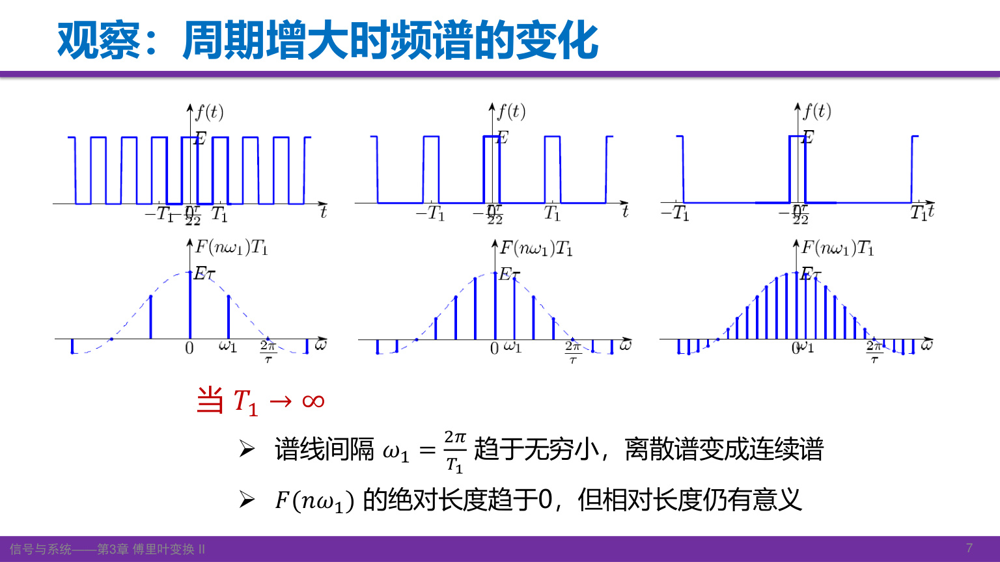

保持单个脉冲形状不变，增大重复周期，脉冲之间越来越远；在有限的观察区间内，最终只剩一个脉冲。与此同时，谱线间距趋于零，单根谱线系数也按 \(1/T_1\) 缩小。图中纵轴特意使用 \(T_1C_n\)，因此包络保持有限，不能把图上的高度直接当成 \(C_n\)。

连续频谱描述的是频率分布的密度。频率区间 \(d\omega\) 对重建信号的贡献为 \(F(\omega)e^{j\omega t}d\omega/(2\pi)\)，不再是周期信号中一根谐波的有限幅度。

[课堂 T01–T03](Transcript_Corrected.md#T01) · [来源](Lecture_Source_Map.md)

自测：保持脉宽与幅值不变，把周期加倍，哪两个量减半？

基波角频率（谱线间隔）减半，系数包络的整体尺度也减半。\(T_1C_n\) 的包络保持不变。这里比较的是同一连续频率处的包络，而非声称每个固定编号 \(n\) 的系数恰好减半，因为其 Sa 自变量也会变化。

## 2. 正、逆变换以及 2π 的来源

当 \(T_1\to\infty\)、\(n\omega_1\to\omega\) 时，定义

\[
F(\omega)=\lim_{T_1\to\infty}T_1C_n
=\int_{-\infty}^{\infty}f(t)e^{-j\omega t}\,dt.
\]

逆变换来自级数求和的连续极限。先用 \(1/T_1=\omega_1/(2\pi)\) 改写：

\[
\sum_n C_ne^{jn\omega_1t}
=\frac1{2\pi}\sum_n(T_1C_n)e^{jn\omega_1t}\omega_1
\longrightarrow\frac1{2\pi}\int_{-\infty}^{\infty}F(\omega)e^{j\omega t}\,d\omega.
\]

这里 \(\omega_1\) 成为频率积分的小区间，求和变成积分。于是本课程采用

\[
\boxed{F(\omega)=\mathcal F\{f(t)\}=\int_{-\infty}^{\infty}f(t)e^{-j\omega t}\,dt},
\qquad
\boxed{f(t)=\frac1{2\pi}\int_{-\infty}^{\infty}F(\omega)e^{j\omega t}\,d\omega}.
\]

正变换指数取负号，逆变换取正号；\(1/(2\pi)\) 在逆变换前。不是看到“正变换”就给指数加正号。

不同文献可以采用不同归一化方式。例如使用普通频率 \(\nu=\omega/(2\pi)\) 时，令 \(\widetilde F(\nu)=F(2\pi\nu)\)，便有

\[
\widetilde F(\nu)=\int f(t)e^{-j2\pi\nu t}\,dt,\qquad
f(t)=\int\widetilde F(\nu)e^{j2\pi\nu t}\,d\nu.
\]

也可以把两边的前因子都取为 \(1/\sqrt{2\pi}\)，但这时变换后的函数数值发生变化。查变换表之前，先确认频率变量、指数符号和系数约定；不能把不同约定下的性质直接混用。

[课堂 T04–T06](Transcript_Corrected.md#T04) · [来源](Lecture_Source_Map.md)

自测：用普通频率时，逆变换前的 \(1/(2\pi)\) 到哪里去了？

变量代换给出 \(d\omega=2\pi\,d\nu\)，恰好消去逆变换前因子；指数也必须同步改成 \(j2\pi\nu t\)。

## 3. 频谱、存在条件与信号重建

一般而言，\(F(\omega)\) 为复函数，可以写成 \(F(\omega)=|F(\omega)|e^{j\varphi(\omega)}\)。幅度谱非负，相位谱记录各频率分量的相位关系。频谱为零处相位没有定义；实频谱的负值不能画成“负幅度”，而应由幅度和 \(\pi\) 相位共同表达。

绝对可积

\[
\int_{-\infty}^{\infty}|f(t)|\,dt<\infty
\]

是正变换积分存在的一个充分条件。恢复函数的逐点值还涉及局部正则性；在常见的分段光滑情形，跳变点的反演值取左右极限的平均。充分条件不等于必要条件：有些信号要在均方或广义函数意义下讨论变换，不能因绝对不可积就直接判定“没有傅里叶变换”。本讲的常数、符号函数和阶跃属于后者。

在适当函数空间中，傅里叶变换具有唯一性和可逆性。普通可积函数的变换不能区分只在零测集上不同的取值，因此“一一对应”应按几乎处处相等理解。知道完整的复频谱，可以反演信号；只知道幅度谱通常不够。

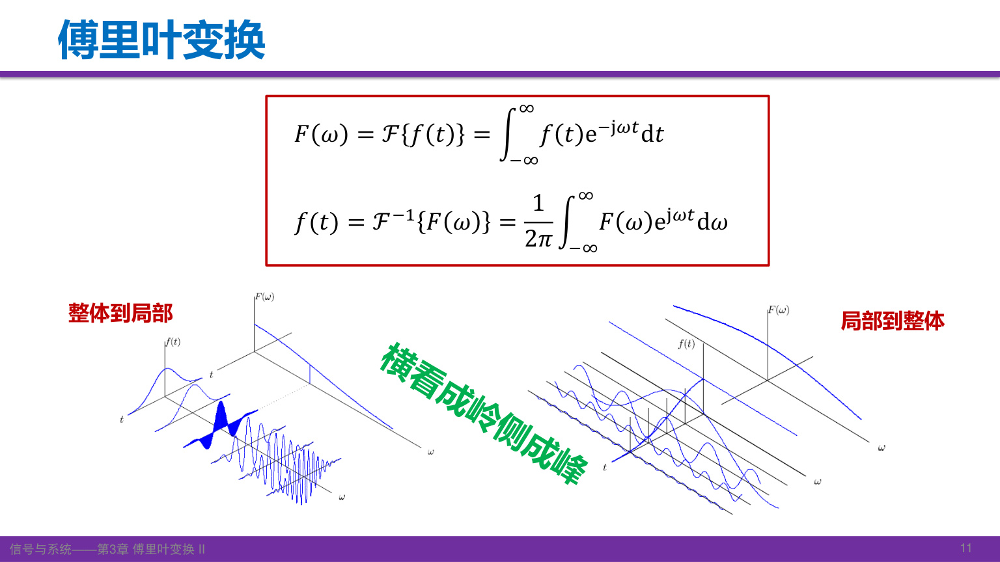

图的两种观察方向对应分析与合成：求某一 \(\omega\) 的频谱，需要综合所有时刻的信号值；求某一 \(t\) 的信号值，需要叠加所有频率的贡献。频域测量、信号重建和后续的快速卷积，都利用这种对应关系。FFT 是离散变换的快速算法，本讲只作应用引导。

连续频谱不意味着每个频率都非零，例如理想带限信号在带外为零。周期信号的线谱通常用功率分布描述；一般非零周期信号的总能量无限，不宜直接套用有限能量脉冲的能量说法。

[课堂 T07–T11](Transcript_Corrected.md#T07) · [来源](Lecture_Source_Map.md)

自测：已知一个脉冲的幅度谱，能否确定它出现的时刻？

不能。时间平移不改变幅度谱，却会改变相位谱；没有相位信息，至少无法区分这一类信号。

## 4. 单边与双边衰减指数

取实数 \(a>0\)。单边指数 \(f(t)=e^{-at}u(t)\) 的变换直接按定义求得：

\[
F(\omega)=\int_0^\infty e^{-(a+j\omega)t}\,dt=\frac1{a+j\omega},\qquad
|F(\omega)|=\frac1{\sqrt{a^2+\omega^2}},\quad
\varphi(\omega)=-\arctan\frac\omega a.
\]

\(a>0\) 保证无穷远处指数衰减。若去掉阶跃，把 \(e^{-at}\) 延伸到整个实轴，它在负时间方向发散，不能用上述普通积分。

双边衰减指数是 \(e^{-a|t|}\)，负半轴实际为 \(e^{at}\)。分两段积分：

\[
F(\omega)=\int_{-\infty}^{0}e^{(a-j\omega)t}\,dt+
\int_0^\infty e^{-(a+j\omega)t}\,dt
=\frac1{a-j\omega}+\frac1{a+j\omega}
=\frac{2a}{a^2+\omega^2}.
\]

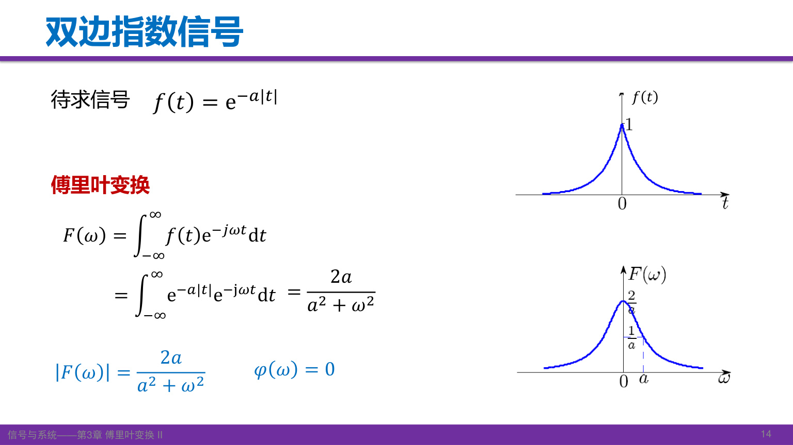

这是正实数，因此幅度谱就是它本身，相位为零。时域越窄，对应频谱越宽：增大 \(a\)，衰减更快，而频谱的特征宽度随 \(a\) 增大。单边指数的频谱一般是复数；双边指数由于实偶对称性，虚部抵消。

[课堂 T12–T13](Transcript_Corrected.md#T12) · [来源](Lecture_Source_Map.md)

自测：两个指数信号的 \(F(0)\) 分别是什么？

单边为 \(1/a\)，双边为 \(2/a\)，恰好分别等于各自波形下面的面积。

## 5. 矩形脉冲与 Sa 频谱

令 \(E>0,\tau>0\)，居中的矩形脉冲为

\[
r_\tau(t)=E\left[u(t+\tau/2)-u(t-\tau/2)\right].
\]

其频谱为

\[
R_\tau(\omega)=E\int_{-\tau/2}^{\tau/2}e^{-j\omega t}\,dt
=\frac{2E\sin(\omega\tau/2)}\omega
=E\tau\operatorname{Sa}(\omega\tau/2).
\]

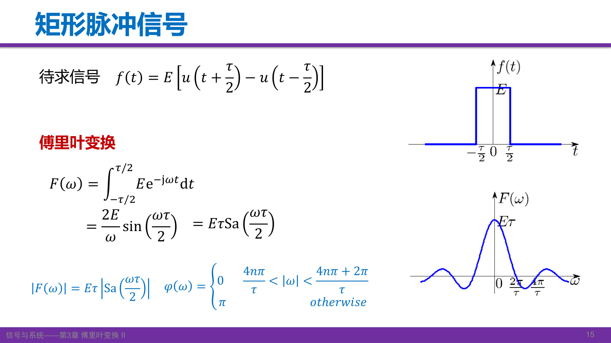

图中 Sa 曲线含正、负旁瓣，它是实频谱 \(R_\tau\)，不是非负幅度谱。正确幅度谱为 \(E\tau|\operatorname{Sa}(\omega\tau/2)|\)；频谱正值处相位为零，负值处为 \(\pi\)（模 \(2\pi\)）。

原点应取极限，得到 \(R_\tau(0)=E\tau\)。零点为

\[
\omega=\frac{2k\pi}{\tau},\qquad k=\pm1,\pm2,\ldots
\]

不能把 \(k=0\) 列入零点。首个正零点是 \(2\pi/\tau\)，主瓣两零点之间的宽度是 \(4\pi/\tau\)。用普通频率表示的首零点带宽为 \(1/\tau\)。三者含义不同，使用“带宽”时须说明约定。矩形脉冲不严格带限，旁瓣一直延伸。

[课堂 T14](Transcript_Corrected.md#T14) · [来源](Lecture_Source_Map.md)

自测：固定面积，将脉冲宽度缩短一半，频谱中心高度和首零点如何变化？

固定 \(E\tau\) 时中心高度不变；首零点频率加倍，频谱展宽。固定幅值时则中心高度也减半。

## 6. 三角脉冲为什么对应 Sa 的平方

峰值为 \(E\)、支撑区间为 \([-\tau,\tau]\) 的三角脉冲为

\[
q(t)=\begin{cases}E(1-|t|/\tau),&|t|<\tau,\\0,&\text{其他}.
\end{cases}
\]

令 \(p(t)=u(t+\tau/2)-u(t-\tau/2)\) 为单位高度、宽 \(\tau\) 的矩形脉冲。卷积 \(p*p\) 等于两个矩形的重叠长度，原点高度为 \(\tau\)，所以

\[
q(t)=\frac E\tau(p*p)(t),\qquad
Q(\omega)=\frac E\tau\left[\tau\operatorname{Sa}(\omega\tau/2)\right]^2
=E\tau\operatorname{Sa}^2(\omega\tau/2).
\]

这利用了时域卷积对应频域相乘，是后续卷积定理的一个直接应用。前因子来自卷积峰值的归一化，不能只把两个 Sa 相乘而丢失幅值。

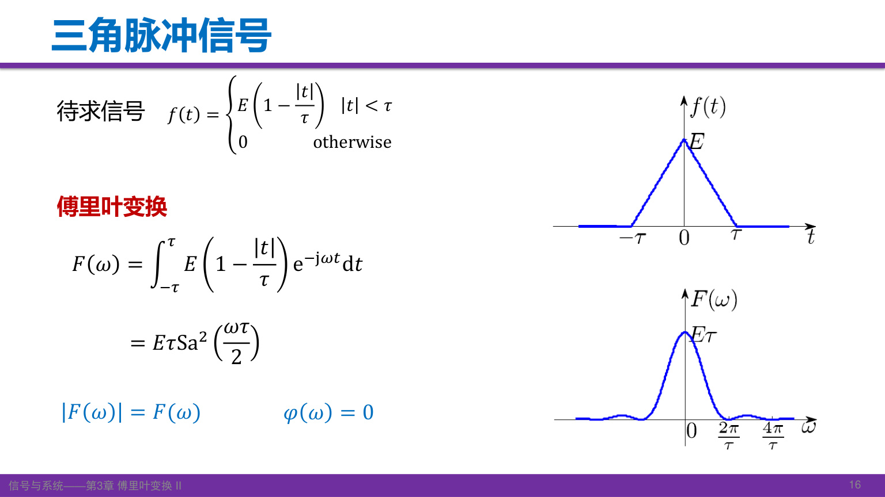

三角脉冲面积为 \(E\tau\)，与 \(Q(0)\) 一致；频谱非负，非零处相位为零。注意本节的总底宽为 \(2\tau\)，课末作业图的总底宽为 \(\tau\)，两幅图的同名参数含义不同。

[课堂 T15](Transcript_Corrected.md#T15) · [来源](Lecture_Source_Map.md)

自测：单位高、宽为 \(\tau\) 的两个矩形卷积，三角形的峰值是否为1？

不是，峰值为重叠区间长度 \(\tau\)。要得到峰值 \(E\)，需整体乘 \(E/\tau\)。

## 7. 升余弦脉冲与高频衰减

对称升余弦脉冲在两端平滑落到零：

\[
c(t)=\begin{cases}\dfrac E2[1+\cos(\pi t/\tau)],&|t|\le\tau,\\0,&\text{其他}.
\end{cases}
\]

用宽 \(2\tau\) 的矩形窗 \(w(t)\) 写成 \(Ew/2+(E/2)w\cos(\pi t/\tau)\)。由 \(W(\omega)=2\tau\operatorname{Sa}(\omega\tau)\) 与频移性质，得到

\[
C(\omega)=E\tau\operatorname{Sa}(\omega\tau)
+\frac{E\tau}{2}\left[\operatorname{Sa}(\omega\tau-\pi)+\operatorname{Sa}(\omega\tau+\pi)\right]
=\frac{E\tau\operatorname{Sa}(\omega\tau)}{1-(\omega\tau/\pi)^2}.
\]

\(\omega=\pm\pi/\tau\) 处是可去奇点，极限为 \(E\tau/2\)，不是频谱发散；\(C(0)=E\tau\)。分子中的参数为 \(\omega\tau\)。

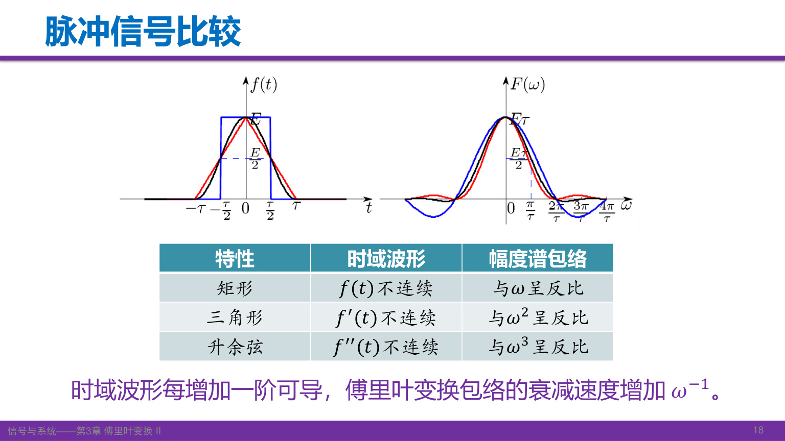

对本讲这组有限支撑、分段光滑的脉冲：矩形本身跳变，频谱包络按 \(1/|\omega|\) 衰减；三角脉冲连续但一阶导数跳变，按 \(1/\omega^2\) 衰减；升余弦脉冲及其一阶导数连续，二阶导数在连接处跳变，按 \(1/|\omega|^3\) 衰减。

原因可由分部积分理解：每当边界项消失，并且导数满足相应可积条件，就可再提出一个 \(1/(j\omega)\)。因此更平滑的衔接通常减少高频旁瓣。该规律有正则性与边界条件，不能无条件推广到任何“可导一次”的函数。

[课堂 T16–T17](Transcript_Corrected.md#T16) · [教材原页](../../Global/Cache/10d306ff84e86b481416f9078618de2a72fb0edecc87269348c3caa143c05915/p-140.png) · [订正依据](Lecture_Source_Map.md)

自测：升余弦频谱在 \(\omega=\pi/\tau\) 的分母为零，为什么没有无穷大？

分子同时趋于零。从移位 Sa 的求和式直接代入，只有一个 \(\operatorname{Sa}(0)\) 项保留，结果为 \(E\tau/2\)。

## 8. 符号函数：借助衰减因子求广义变换

\(\operatorname{sgn}(t)\) 在正半轴为1，负半轴为−1，原点可取0；它不绝对可积。引入 \(a>0\) 的辅助信号

\[
s_a(t)=\operatorname{sgn}(t)e^{-a|t|},\qquad
S_a(\omega)=\frac1{a+j\omega}-\frac1{a-j\omega}
=\frac{-2j\omega}{a^2+\omega^2}.
\]

令 \(a\to0^+\)，在广义函数意义下得到

\[
\operatorname{sgn}(t)\ \longleftrightarrow\ 2\operatorname{pv}\frac1{j\omega}.
\]

课程常简写为 \(2/(j\omega)\)。其中 pv 表示在零频率奇点两侧对称取主值；不能把它当成在 \(\omega=0\) 有普通函数值的表达式，也不能用“逐点令 \(a=0\)”代替整个广义极限。

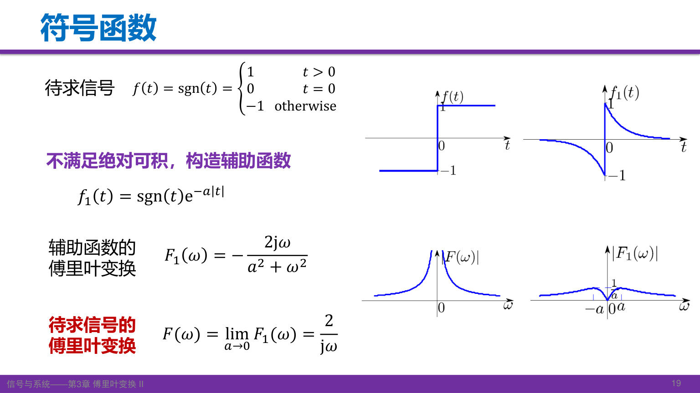

辅助信号是实奇函数，频谱为虚奇函数。这既帮助理解图形，也能检查计算中的符号是否合理。

[课堂 T18](Transcript_Corrected.md#T18) · [来源](Lecture_Source_Map.md)

自测：为什么先乘上衰减指数再取极限？

乘衰减指数后普通积分收敛，可先算出明确的频谱，再研究它的广义极限；原符号函数的普通绝对积分不收敛。

## 9. 冲激、直流、冲激偶与阶跃

利用冲激的抽样性质，

\[
\mathcal F\{\delta(t)\}=\int\delta(t)e^{-j\omega t}\,dt=1.
\]

时域冲激对应等幅的全频谱；反过来，\(\mathcal F^{-1}\{\delta(\omega)\}=1/(2\pi)\)，因此

\[
\delta(t)\longleftrightarrow1,\qquad 1\longleftrightarrow2\pi\delta(\omega).
\]

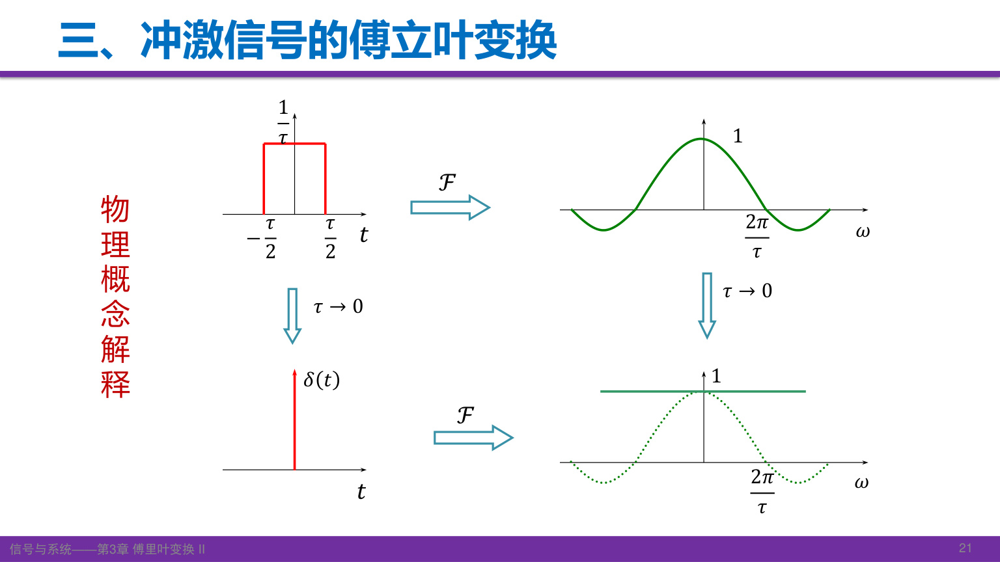

宽 \(\tau\)、高 \(1/\tau\) 的矩形脉冲面积恒为1，其频谱为 \(\operatorname{Sa}(\omega\tau/2)\)。当 \(\tau\to0\)，固定有限 \(\omega\) 处趋于1，首零点移向无穷远。若保持高度为1而缩短宽度，面积趋于零，就得不到单位冲激。

从广义反演式 \(\delta(t)=(1/2\pi)\int e^{j\omega t}d\omega\) 求导可得

\[
\delta'(t)\longleftrightarrow j\omega.
\]

该反演积分是分布恒等式，不是普通反常积分在 \(t\ne0\) 时逐点“振荡抵消”、在原点取“无穷值”的定义。

阶跃可分解为 \(u(t)=\tfrac12+\tfrac12\operatorname{sgn}(t)\)，于是

\[
\boxed{u(t)\longleftrightarrow\pi\delta(\omega)+\operatorname{pv}\frac1{j\omega}}.
\]

零频率冲激不能遗漏。它对应阶跃分解中的常数部分；若只保留 \(1/(j\omega)\)，逆变换得到的是 \(\operatorname{sgn}(t)/2\)。

[课堂 T19–T22](Transcript_Corrected.md#T19) · [来源](Lecture_Source_Map.md)

自测：\(3\) 和 \(3\delta(t)\) 的频谱各是什么？

分别为 \(6\pi\delta(\omega)\) 与常数3。时域和频域的冲激变量不能混写。

## 10. 高斯脉冲与时频集中

高斯脉冲的傅里叶变换仍属于高斯函数族：

\[
g(t)=Ee^{-(t/\tau)^2}
\quad\longleftrightarrow\quad
G(\omega)=\sqrt\pi E\tau e^{-(\omega\tau/2)^2},\qquad\tau>0.
\]

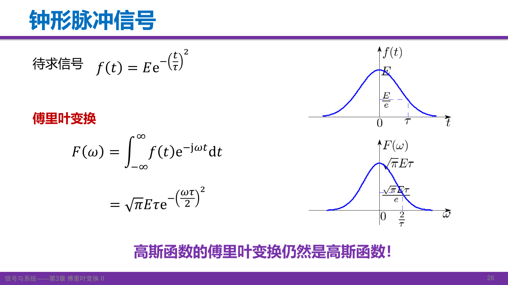

图中时间轴特征宽度为 \(\tau\)，频率轴特征宽度为 \(2/\tau\)。所谓“形状不变”是指都为高斯形状，幅值和尺度一般不同。原点值 \(\sqrt\pi E\tau\) 等于时域面积。

高斯函数适合说明“主要集中”和“严格有限”的区别：它在时域、频域都衰减得很快，主要能量能集中在有限区间，但两边均不是严格有限支撑。对通常讨论的非零可积信号，不可能同时严格限时和严格带限。局部处理与频域扩散之间的权衡，也是窗口、插值和滤波设计会遇到的问题。

[课堂 T23–T25](Transcript_Corrected.md#T23) · [来源](Lecture_Source_Map.md)

自测：高斯脉冲时域宽度加倍，频域的特征宽度如何变化？

减半；若峰值 \(E\) 不变，频谱中心高度加倍。“形状同类”不表示所有参数原样不变。

## 11. 对偶性与连续多次变换

若 \(f(t)\leftrightarrow F(\omega)\)，由逆变换在 \(-t\) 处的表达式

\[
2\pi f(-t)=\int F(\omega)e^{-j\omega t}\,d\omega
\]

交换积分哑变量和自变量的名称，即得

\[
\boxed{F(t)\longleftrightarrow2\pi f(-\omega)}.
\]

对偶性将已知变换对交换角色，同时带来反折和 \(2\pi\)。例如矩形频谱

\[
F(\omega)=\begin{cases}E,&|\omega|<\omega_c,\\0,&|\omega|>\omega_c\end{cases}
\quad\longleftrightarrow\quad
f(t)=\frac{E\omega_c}{\pi}\operatorname{Sa}(\omega_ct).
\]

这个 Sa 信号不是有限时长，但严格带限。端点值按反演约定取半值，不影响普通积分。

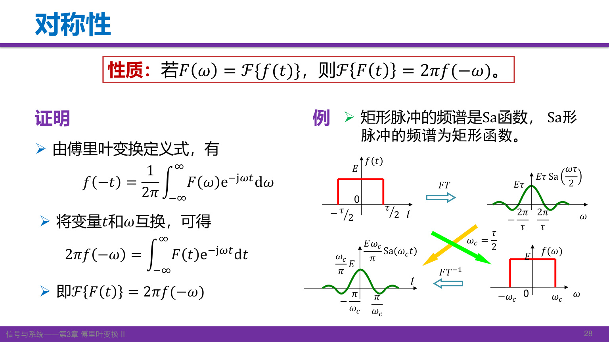

若把本课程正变换记为算子 \(\mathcal F\)，连续应用两次和四次分别得到

\[
\mathcal F^2f(t)=2\pi f(-t),\qquad
\mathcal F^4f(t)=(2\pi)^2f(t).
\]

四次后波形恢复，幅值尚有 \((2\pi)^2\) 因子。只有采用两边各 \(1/\sqrt{2\pi}\) 的对称归一化，四次才严格回到原函数。

[课堂 T26–T27](Transcript_Corrected.md#T26) · [来源](Lecture_Source_Map.md)

自测：已知 \(\delta(t)\leftrightarrow1\)，用对偶性能否得到直流的变换？

可以：\(1\leftrightarrow2\pi\delta(-\omega)=2\pi\delta(\omega)\)，因为冲激是偶分布。

## 12. 线性与矩形双脉冲

傅里叶变换是线性运算：若 \(f_i\leftrightarrow F_i\)，且 \(a_i\) 为常数，则

\[
\mathcal F\left\{\sum_i a_if_i\right\}=\sum_i a_iF_i.
\]

线性的价值在于选择容易计算的分解。考虑中心在 \(\pm T\)、各宽 \(\tau\)、高 \(E\) 的双脉冲，取 \(T>\tau/2\)。把它看成宽 \(2T+\tau\) 的大矩形，减去宽 \(2T-\tau\) 的小矩形：

\[
F(\omega)=\frac{2E}{\omega}
\left[\sin\frac{\omega(2T+\tau)}2-\sin\frac{\omega(2T-\tau)}2\right]
=2E\tau\operatorname{Sa}(\omega\tau/2)\cos(\omega T).
\]

最后一步用和差化积。它把“单脉冲形状”与“两个脉冲的间距”分别放进 Sa 包络和余弦因子。

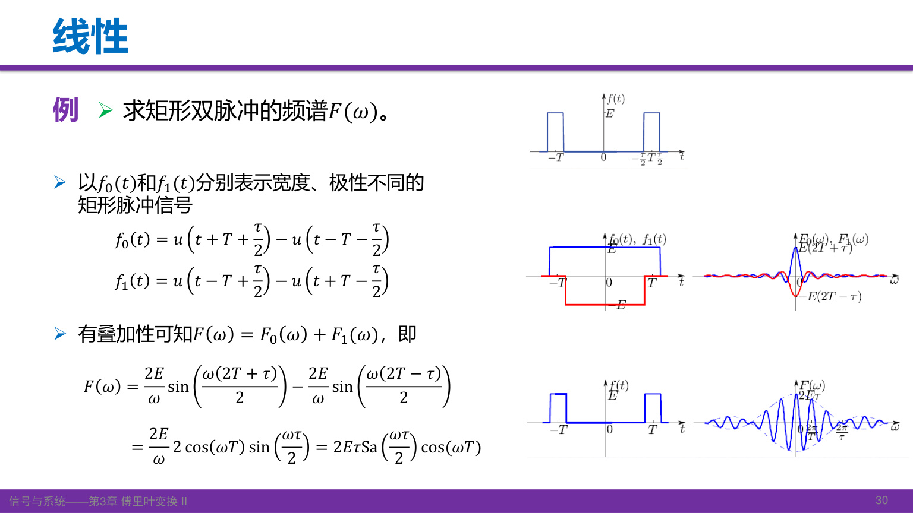

图中的负矩形用来挖去中间部分。写分段表达式时，两个矩形都必须带上幅值 \(E\)。另一种更直接的方法是使用两个平移矩形，结果应当一致。

[课堂 T28](Transcript_Corrected.md#T28) · [来源](Lecture_Source_Map.md)

自测：用面积检查双脉冲的频谱中心值。

\(F(0)=2E\tau\)，等于两个脉冲的总面积，与它们的间隔 \(T\) 无关。

## 13. 奇偶、虚实与共轭

欧拉公式把变换核拆成 \(\cos\omega t-j\sin\omega t\)。奇函数在对称区间积分为零，因此实偶信号只留下余弦积分，实奇信号只留下正弦积分：

\[
f\text{实偶}:\quad F(\omega)=2\int_0^\infty f(t)\cos\omega t\,dt,
\]
\[
f\text{实奇}:\quad F(\omega)=-2j\int_0^\infty f(t)\sin\omega t\,dt.
\]

| 时域性质 | 频域性质 |
|---|---|
| 实偶 | 实偶 |
| 虚偶 | 虚偶 |
| 实奇 | 虚奇 |
| 虚奇 | 实奇 |

任意复信号可以分成实偶、虚偶、实奇和虚奇四部分，再按线性分别变换。注意“实偶频谱”不等于“非负频谱”：矩形脉冲就是反例。

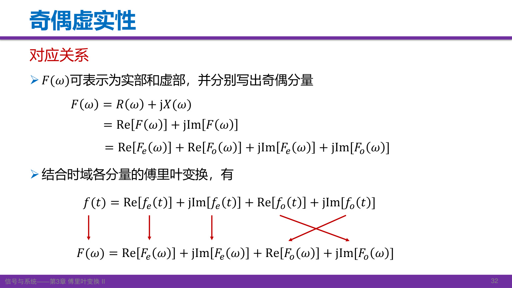

反折与共轭关系为

\[
f(-t)\leftrightarrow F(-\omega),\quad
f^*(t)\leftrightarrow F^*(-\omega),\quad
f^*(-t)\leftrightarrow F^*(\omega).
\]

以第二式为例，把 \(\int f(t)e^{j\omega t}dt\) 整体取共轭，就得到 \(f^*(t)\) 的正变换。若 \(f\) 为实信号，则 \(F(-\omega)=F^*(\omega)\)：实部为偶、虚部为奇、幅度为偶，相位可在非零处选择为奇（模 \(2\pi\)）。

[课堂 T29–T30](Transcript_Corrected.md#T29) · [来源](Lecture_Source_Map.md)

自测：为什么双边指数的相位为零，而矩形脉冲不能始终取零相位？

两者频谱都是实偶函数，但双边指数的频谱处处为正；矩形频谱有负旁瓣，需用 \(\pi\) 相位表达符号。

## 14. 尺度变换：宽度、反折与幅值

对实数 \(a\ne0\)，

\[
\boxed{f(at)\longleftrightarrow\frac1{|a|}F\!\left(\frac\omega a\right)}.
\]

令 \(v=at\)，当 \(a>0\) 时，\(dt=dv/a\)；当 \(a<0\) 时，积分上下限互换，另带来一个负号，最终前因子成为 \(1/|a|\)。频谱自变量仍保留 \(a\) 的符号，所以负尺度同时造成频谱反折。

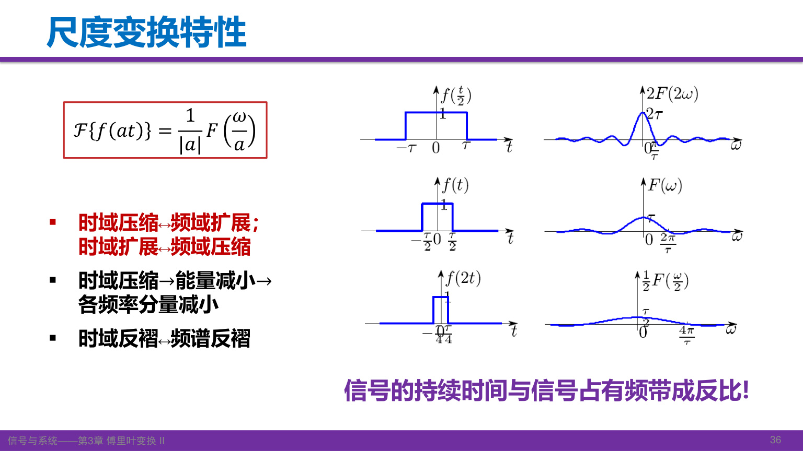

图中 \(f(2t)\) 在时间轴上压缩一半，频谱是 \(F(\omega/2)/2\)：横向展宽两倍，纵向缩为一半；\(f(t/2)\) 则相反。\(f(-2t)\) 还要在压缩时反折，频谱为 \(F(-\omega/2)/2\)。

前因子由变量代换产生，不表示时间展缩后能量保持不变。若原信号能量为 \(\mathcal E=\int|f(t)|^2dt\)，则

\[
\int|f(at)|^2dt=\frac{\mathcal E}{|a|}.
\]

在幅值不变的压缩下，持续时间减少，能量随之减少。时域和频域仍满足同一 Parseval 关系。

[课堂 T31](Transcript_Corrected.md#T31) · [来源](Lecture_Source_Map.md)

自测：\(f(-3t)\) 的变换是 \(-F(-\omega/3)/3\) 吗？

不是，应为 \(F(-\omega/3)/3\)。反折包含在自变量里，前因子取正的 \(1/|a|\)。

## 15. 时移与有限脉冲列

令 \(v=t-t_0\)，则 \(e^{-j\omega t}=e^{-j\omega t_0}e^{-j\omega v}\)，因此

\[
\boxed{f(t-t_0)\longleftrightarrow F(\omega)e^{-j\omega t_0}}.
\]

右移（延迟） \(t_0\) 不改变幅度谱，在相位上增加 \(-\omega t_0\)。乘的是复指数，增加的相位才是 \(-\omega t_0\)，二者不能混称。

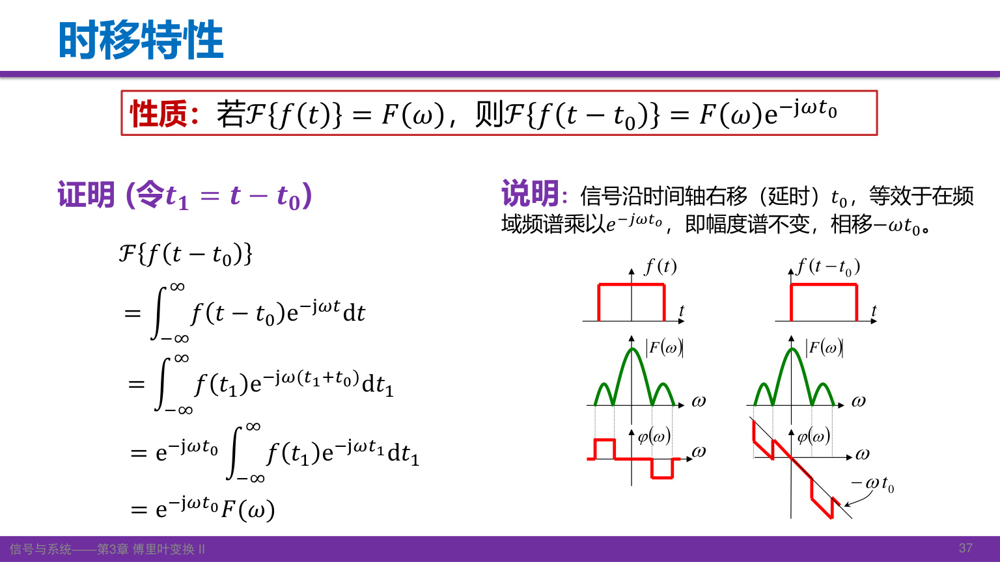

对中心在 \(-T,0,T\) 的三个相同矩形脉冲，

\[
f(t)=r_\tau(t+T)+r_\tau(t)+r_\tau(t-T),
\]
\[
F(\omega)=R_\tau(\omega)[e^{j\omega T}+1+e^{-j\omega T}]
=E\tau\operatorname{Sa}(\omega\tau/2)[1+2\cos(\omega T)].
\]

中心值 \(3E\tau\) 对应总面积。改变脉冲间隔改变余弦因子的振荡疏密；改变单脉冲宽度改变 Sa 包络。

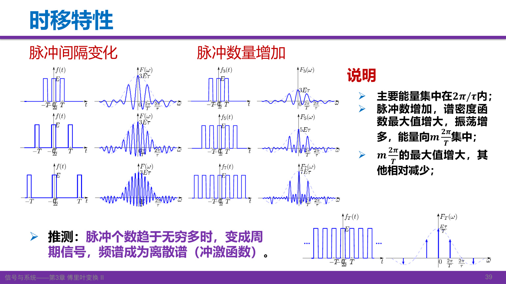

脉冲数增加时，在 \(\omega=2m\pi/T\) 处各脉冲的相位相同，叠加更强；其他位置可能部分抵消，峰之间振荡增多。双向无限重复最终形成周期信号，其傅里叶变换需用冲激线谱表示。有限脉冲列的谱仍连续，不能提前画成离散冲激。

[课堂 T32–T34](Transcript_Corrected.md#T32) · [来源](Lecture_Source_Map.md)

自测：将整个三脉冲组合再延迟2秒，频谱的模会改变吗？

不会。整个频谱乘 \(e^{-j2\omega}\)，模为1，只改变相位。

## 16. 频移、调制与余弦的冲激谱

把信号乘上复指数，有

\[
\mathcal F\{f(t)e^{j\omega_0t}\}
=\int f(t)e^{-j(\omega-\omega_0)t}dt
=F(\omega-\omega_0).
\]

频谱沿频率轴右移 \(\omega_0\)。若用实余弦调制，通过欧拉公式拆成两个复指数，就有

\[
f(t)\cos\omega_0t\longleftrightarrow
\frac12[F(\omega-\omega_0)+F(\omega+\omega_0)],
\]
\[
f(t)\sin\omega_0t\longleftrightarrow
\frac1{2j}[F(\omega-\omega_0)-F(\omega+\omega_0)].
\]

余弦形成两个各乘 \(1/2\) 的频谱副本；正弦还包含相反的复系数。这里平移、叠加的是复频谱，不是先把两个幅度谱相加。若副本重叠，应先作复数相加。

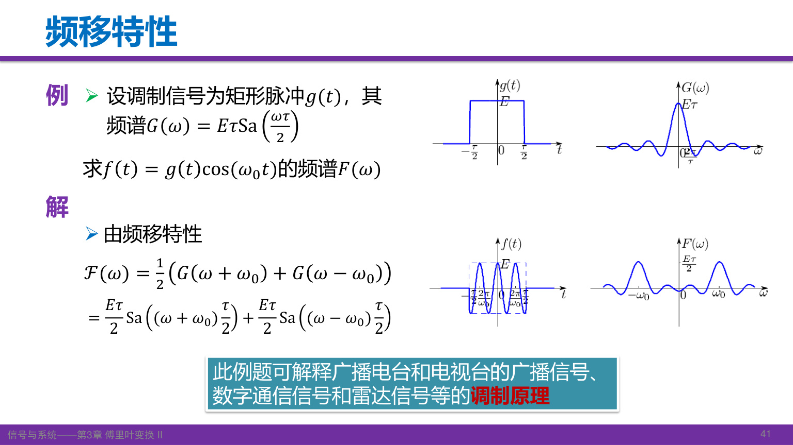

对 \(g(t)=r_\tau(t)\)，调制后

\[
F(\omega)=\frac{E\tau}{2}\operatorname{Sa}\frac{(\omega-\omega_0)\tau}{2}
+\frac{E\tau}{2}\operatorname{Sa}\frac{(\omega+\omega_0)\tau}{2}.
\]

图中原点附近的低频包络移到 \(\pm\omega_0\) 附近，这正是通信调制的基本思路。更完整的调制系统将在后续课程讨论。

从 \(1\leftrightarrow2\pi\delta(\omega)\) 出发，取 \(\omega_0>0\)，得到

\[
\cos\omega_0t\longleftrightarrow\pi[\delta(\omega-\omega_0)+\delta(\omega+\omega_0)].
\]

两根冲激的权重都是 \(\pi\)，不是普通函数的“高度”。它也说明周期信号可以在广义意义下做傅里叶变换。

[课堂 T35–T36](Transcript_Corrected.md#T35) · [来源](Lecture_Source_Map.md)

自测：如何得到 \(e^{j\omega_0t}\) 的频谱？

将常数1乘上复指数，零频冲激右移到 \(\omega_0\)，得到 \(2\pi\delta(\omega-\omega_0)\)。

## 17. 微分、时间相乘与矩

对逆变换关于 \(t\) 求导，每次指数因子都会带下一个 \(j\omega\)，得到

\[
\boxed{f^{(n)}(t)\longleftrightarrow(j\omega)^nF(\omega)}.
\]

在普通函数范围内，交换微分与积分需要相应收敛条件；也可用分部积分证明，但需处理无穷远边界项。对阶跃、冲激等则按分布导数理解，信号跳变引起的冲激项不能漏掉。

反过来，对正变换关于 \(\omega\) 求导，指数带下的是 \(-jt\)，所以

\[
\frac{dF}{d\omega}=\mathcal F\{-jtf(t)\},\qquad
\boxed{t^nf(t)\longleftrightarrow j^n\frac{d^nF}{d\omega^n}}.
\]

时域微分对应频域乘 \(j\omega\)；频域微分对应时域乘 \(-jt\)。先看对哪个变量求导，再决定乘哪个变量。

若相应矩存在，令 \(\omega=0\)，可得

\[
F^{(n)}(0)=(-j)^n\int t^nf(t)\,dt.
\]

这把时域矩与频谱原点附近的变化联系起来。课堂所说的 \(tf(t),t^2f(t)\) 是矩积分中的被积部分，矩本身还需积分。

由 \(u'=\delta\) 验证微分性质：

\[
\mathcal F\{\delta\}=j\omega\left[\operatorname{pv}\frac1{j\omega}+\pi\delta(\omega)\right]=1,
\qquad\mathcal F\{\delta'\}=j\omega.
\]

\(\omega\delta(\omega)=0\) 来自抽样性质：与任意测试函数积分都为零，不是把“0乘无穷大”当成普通乘法。

[课堂 T37–T39](Transcript_Corrected.md#T37) · [来源](Lecture_Source_Map.md)

自测：若 \(f\leftrightarrow F\)，\(t^2f(t)\) 的变换是什么？

\(-F''(\omega)\)，因为 \(j^2=-1\)。求 \(f''(t)\) 的变换则是 \(-\omega^2F(\omega)\)，两者不同。

## 18. 积分性质与零频率项

累积积分仍是时间的函数：

\[
g(t)=\int_{-\infty}^{t}f(\tau)\,d\tau=(f*u)(t).
\]

利用阶跃频谱与卷积对应相乘，可得到

\[
\boxed{G(\omega)=F(\omega)\operatorname{pv}\frac1{j\omega}+\pi F(0)\delta(\omega)}.
\]

这里假设 \(f\) 有足够衰减，使面积存在，且 \(F\) 在原点足够正则；一般广义分布之间不能不加条件地任意相乘。课件写成 \(\pi F(\omega)\delta(\omega)\)，由抽样性质等于 \(\pi F(0)\delta(\omega)\)。

也可按照课件的思路，把积分写为 \(\int f(\tau)u(t-\tau)d\tau\)，再对 \(t\) 变换。时移性质给出 \(e^{-j\omega\tau}U(\omega)\)，余下的 \(\tau\) 积分恰好是 \(F(\omega)\)。涉及阶跃时，这些交换按合适的正则化或广义意义理解。

为什么不只除以 \(j\omega\)？因为微分会消去常数，而累积积分的边界约定决定了需要补回的零频率项。例如 \(f=\delta\)，有 \(F=1\)，累积积分为 \(u\)，必须包含 \(\pi\delta(\omega)\)。当 \(F(0)=0\)，即 \(\int f(t)dt=0\)，该冲激项才消失。

在反演适用处，还有

\[
F(0)=\int f(t)dt,\qquad f(0)=\frac1{2\pi}\int F(\omega)d\omega.
\]

对有限能量脉冲，\(F(0)\) 首先是波形净面积，不是周期级数里的平均值系数。若积分上限改成 \(+\infty\)，所得是常数；常数也能做广义傅里叶变换，但已不是这里的累积积分问题。

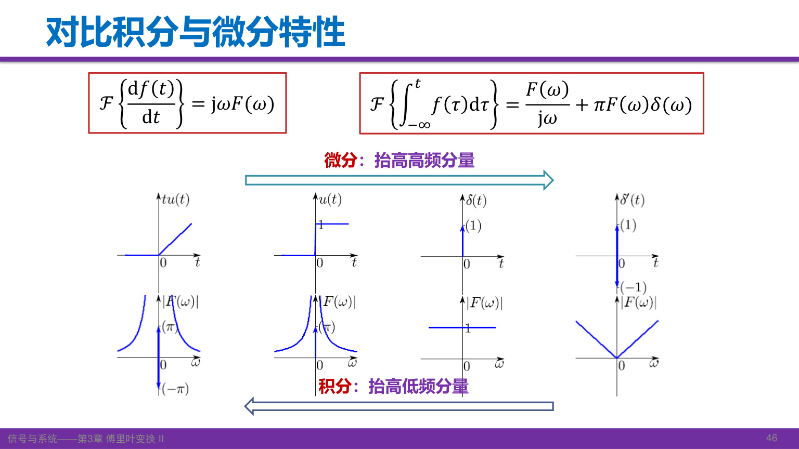

对于非零频率，微分乘 \(j\omega\)，相对强调高频；积分除以 \(j\omega\)，相对强调低频。图中的 \(tu(t)\to u(t)\to\delta(t)\to\delta'(t)\) 表示不断微分；逆向积分时，须结合边界与零频率分布项，不能只凭除法忽略它们。

[课堂 T39–T42](Transcript_Corrected.md#T39) · [来源](Lecture_Source_Map.md)

自测：一个可积实奇脉冲的累积积分为何通常没有额外零频冲激项？

实奇函数在全轴的积分为零，所以 \(F(0)=0\)。还需要满足积分性质所需的可积性与正则性条件；不能只见“奇函数”便忽略收敛问题。

## 19. 课堂作业、预习与计算检查

课件第47页布置：用 FT 的微分性质求图示三角脉冲频谱，以及教材 **3-29（1、3、4、7）**；预习 **§3.8–§3.11**，对应卷积特性、周期信号的傅里叶变换、抽样信号的傅里叶变换和抽样定理。

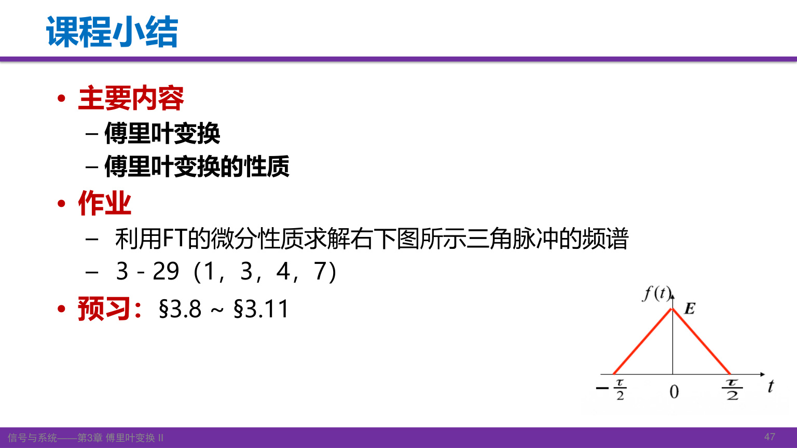

作业图的三角脉冲峰值为 \(E\)，底边端点为 \(-\tau/2,\tau/2\)，即

\[
f(t)=\begin{cases}E(1-2|t|/\tau),&|t|<\tau/2,\\0,&\text{其他}.
\end{cases}
\]

要求采用微分性质：先画一阶导数的两个矩形段，再找二阶导数在斜率跳变处的冲激权重，最后从 \((j\omega)^2F(\omega)\) 求回频谱。零频率用面积检验，避免除以 \(\omega^2\) 时漏掉原点极限。此题底宽与第6节参数不同，代公式前先辨认图上的端点。

当前第三版教材的3-29位于 **印刷179页／PDF195页**，题干为：已知 \(\mathcal F\{f(t)\}=F(\omega)\)，利用变换性质求下列信号的变换。指定小题是：

| 小题 | 本地第三版题面 | 建议先识别的运算 |
|---|---|---|
| （1） | \(tf(2t)\) | 尺度，再时间相乘 |
| （3） | \((t-2)f(-2t)\) | 反折与尺度，再线性和时间相乘 |
| （4） | \(t\dfrac{df(t)}{dt}\) | 时域微分，再时间相乘 |
| （7） | \(f(2t-5)\) | 先写成 \(f(2(t-5/2))\)，辨认实际延时 |

[教材题面原页](../../Global/Cache/10d306ff84e86b481416f9078618de2a72fb0edecc87269348c3caa143c05915/p-195.png)。课堂推荐第四版，当前第三版题面已核对；第四版对应题面尚未提供，若题面不同需按实际题目调整。

老师强调微分、积分性质在考试和后续应用中很重要，要求亲自推导并通过作业练习。课末转写提及假期交作业，但没有明确的新截止时刻；开头口头说下次课为10月9日，具体安排仍应以课程通知为准。

计算结束可以依次检查：变换约定是否一致；\(F(0)\) 是否等于面积；实信号是否满足共轭对称；时域压缩是否对应频域展宽；时移是否只改变相位；微分或积分是否漏掉冲激和零频率项。这些检查经常比重新积分更快发现错误。

[课堂要求](Transcript_Corrected.md#T43) · [来源与作业核验](Lecture_Source_Map.md)
