# 核工程原理 L01 · 从核反应到核电工程的全景

**材料边界：以80页课件为主、以已归档《核工程原理》第14稿作教材补充。无本讲录音和转写，不生成教师订正稿。** 这里完整复习资料包，不能保证80页均在L01课堂讲完。L02录音延续其中的产业、研究与数量级内容，另在L02按实际课堂顺序整理；不把后讲声音倒填成本讲授课。

正文依据课件与已注明的课堂材料编写；额外解释标为“补充推导”或“教材补充”。本版尚未经过逐项人工学术复核。

[来源、覆盖与疑点](Lecture_Source_Map.md)

## 1. 课程定位：为什么核工程原理以反应堆为中心

核工程涉及核能与核技术的工程利用，课程介绍页区分了三个重要物理基础：裂变能利用依赖中子引起的链式反应；加速器依赖带电粒子运动与加速；聚变能利用则涉及核反应、等离子体与约束。**本课程的重点是反应堆工程及其物理基础**，不能据课程标题期待在一学期里同样深入学习所有核技术。

课件把核工程设计拆成物理、热工水力、控制、结构材料和安全等关联任务。先问“中子怎样运动、产生、消失，燃料怎样变化”，随后问“释放的热怎样带走、结构怎样承受、功率怎样控制”。单个学科的可行性不能自动推出整个系统可行。

先修知识包括数学与物理基础，学习方法强调物理概念、数学描述、工程模型与数值方法连起来。公式所描述的对象、近似条件和量纲，与算出数字同等重要。例如把真实三维、时变、多能量中子运动简化为可计算模型，需要说明忽略了哪些效应，以及计算结果用于回答什么工程问题。

**教材补充：** 第14稿序言和第19页将课程主线组织为“中子学基础→可控临界系统→长期运行的多学科耦合”。这是教材的知识组织，不是从缺失的录音中恢复出的教师原话。

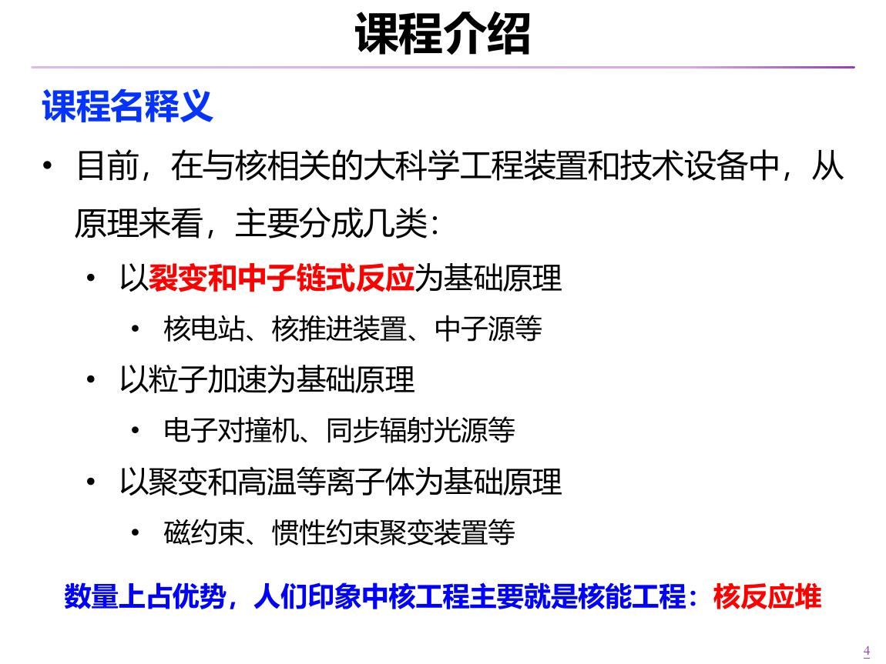

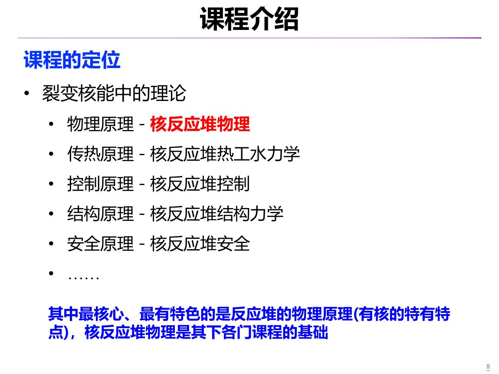

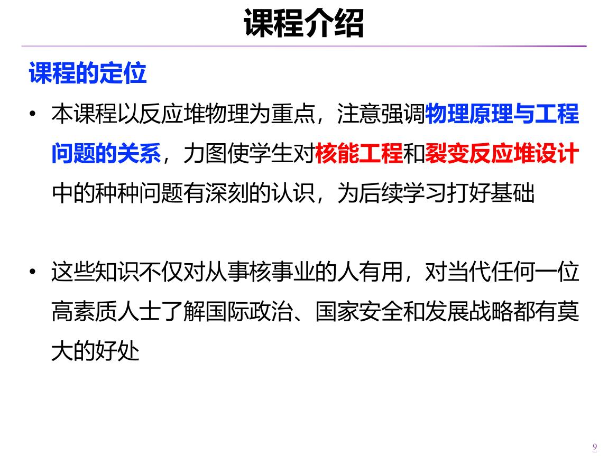

自测：物理模型显示能够持续释放能量，为什么仍不能说工程设计已经完成？

还需解决热量输运、材料与结构、控制、安全和经济性，且各部分会互相反馈。物理可行是系统可行的一部分。

[来源与覆盖](Lecture_Source_Map.md)

## 2. 学习路线、教材和课程要求

课件安排以反应堆物理为主体，再进入堆芯设计：核物理基础，中子慢化，中子扩散，临界理论，反应堆动态学，燃耗与中毒，反应性变化与控制，堆芯设计及其他内容。学习时可以把它们连成四个问题：中子从哪里来、到哪里去？什么时候能维持反应？功率如何随时间变化？长期运行如何影响材料、燃料和控制？

参考书页列出谢仲生等《核反应堆物理分析》第五版（2020）、自编教材以及 Lamarsh、Stacey、Duderstadt、Glasstone 等。**当前实际可调用的主教材是本课程 Global 中的《核工程原理 第14稿.pdf》**；不能因为课件列了书名，就假定那些版本正文都已经入库。课件只呈现课堂主线，教材提供连续解释、推导、例题和练习。

第15页提出分层学习要求，第16页说明每章约十道习题、章节测试、考试以及鼓励使用英文资料、AI工具和大作业。该资料包未给完整的期末总评分比例和所有作业截止日期，本版不推定。具体大作业条件在L02有口头材料，可从L02课堂回顾查看，不写成L01已经宣布的事项。

阅读第9页日历时注意这是一份课件中的安排，而不是档案自动同步的课程通知。它标出每周上课位置与假期，复习不必死记日历；提交、考试应回到课程当期通知核对。

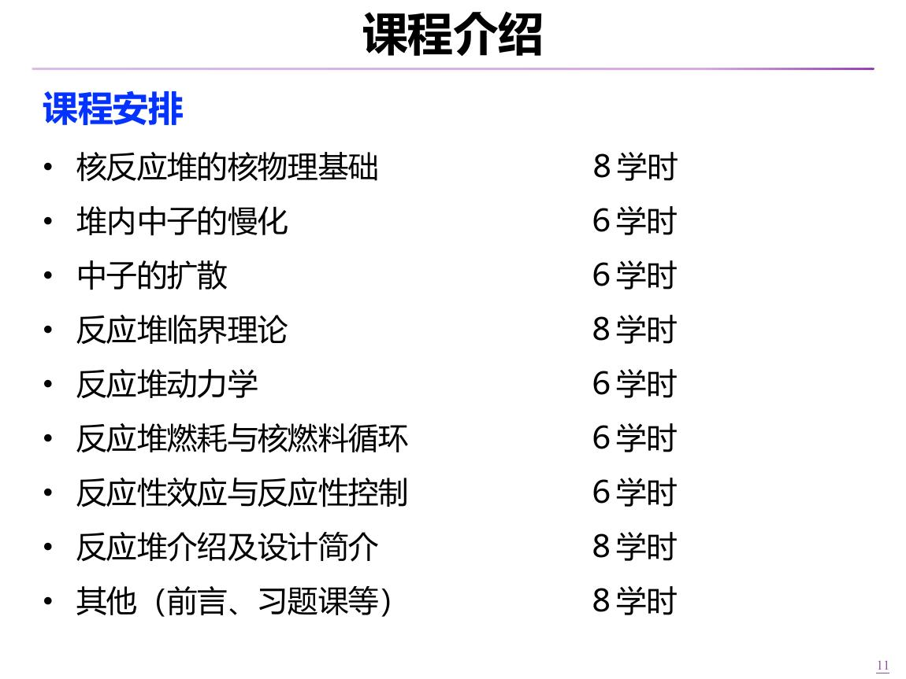

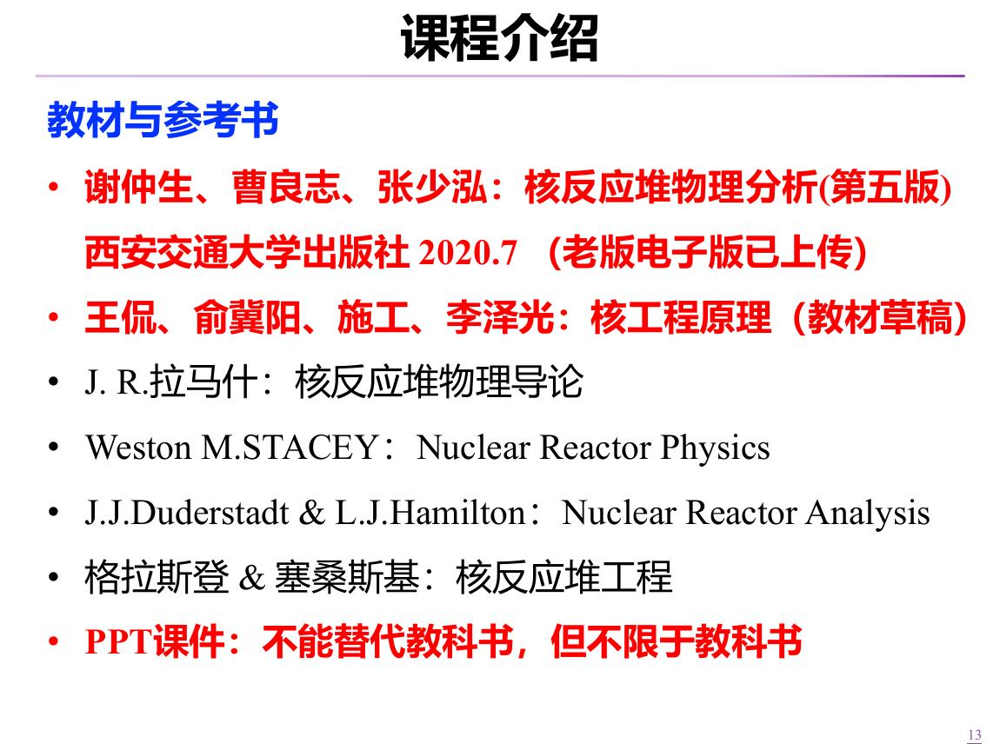

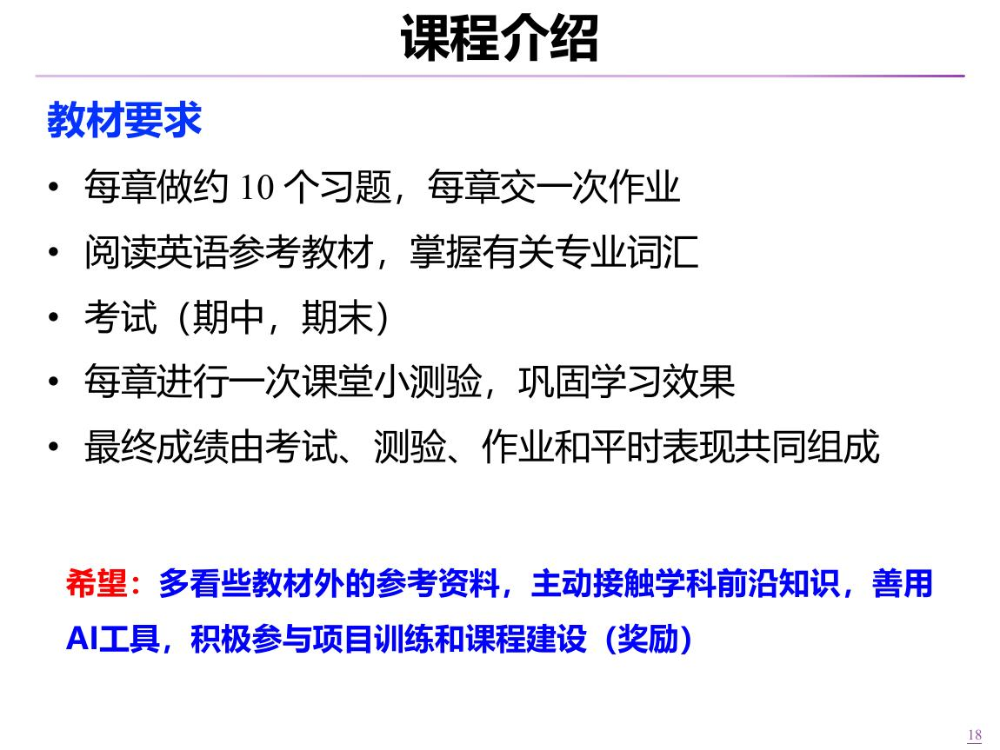

自测：这份档案里的“推荐教材”和“已归档可核查教材”有什么区别？

推荐书目只证明课件列过该书；已归档教材具有实际文件、版本、页码与可回看的原页。本版实际核查的是第14稿。

[来源与覆盖](Lecture_Source_Map.md)

## 3. 反应堆物理究竟研究什么

中子物理关注中子及其与物质的相互作用；反应堆物理把这些过程置于反应堆系统中，进一步考虑核素组成、功率和运行状态随时间变化。第11页的相交图提醒二者有关联而不是同义词。

描述堆内中子，需要同时追踪能量、空间位置、运动方向和时间。用一个仅表示“中子总数”的数字，通常不足以区分不同位置和能量的反应贡献。燃料消耗和新核素产生改变物质组成，温度变化改变材料状态及反应特性，这又反过来影响中子行为，因此课件第33页把这些变量放在一条相互影响的链条上。

第34–38页引入英文原书阅读。其主要观点是：反应堆物理属于应用物理，以基本相互作用、数学模型、实验数据和计算方法支撑对实际反应堆的理解；既研究稳态行为，也研究随时间变化的行为。原文中的产业规模和年代说明属于引用当时的背景，不更新成当前统计。复习英文时可先抓 neutron、reactor、steady state、transient、nuclear data 等术语所对应的物理对象，再读长句。

**补充解释：** “建立模型→求解→解释”的完整性很重要。得到一条中子分布曲线后，还需要说明横纵轴代表什么、哪些边界条件决定形状、它对反应功率的含义是什么；否则只有数值而没有工程判断。

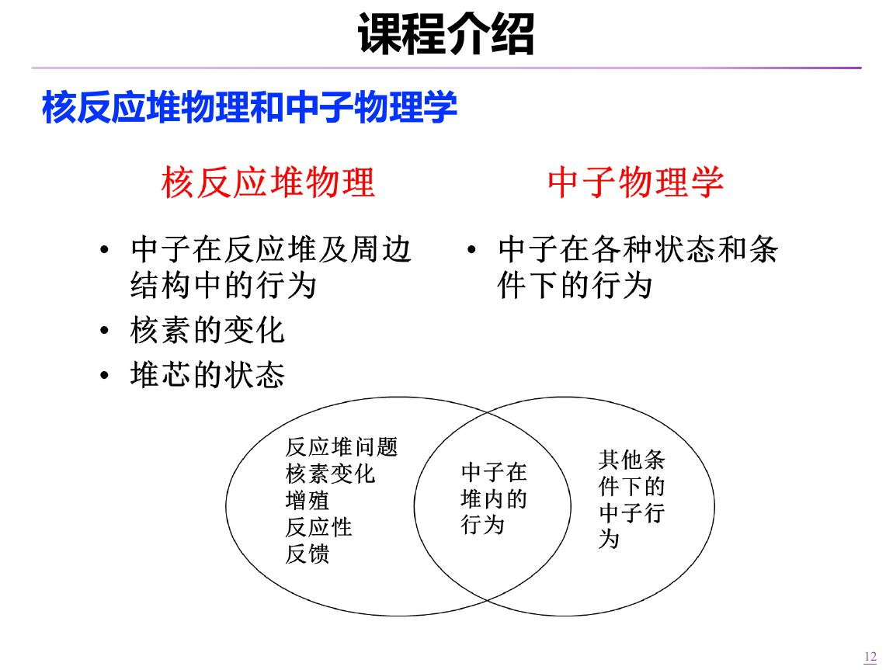

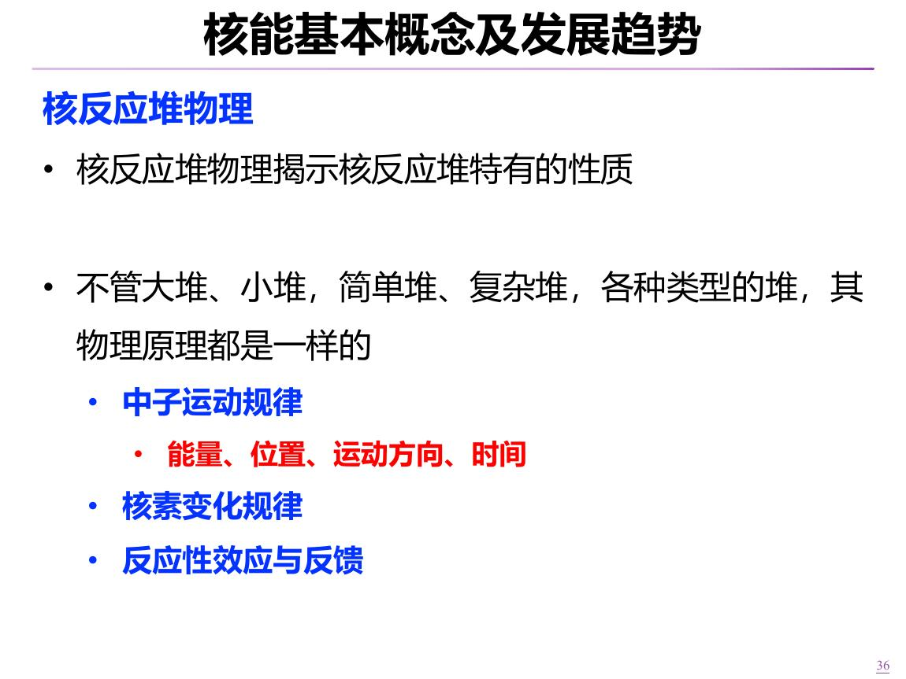

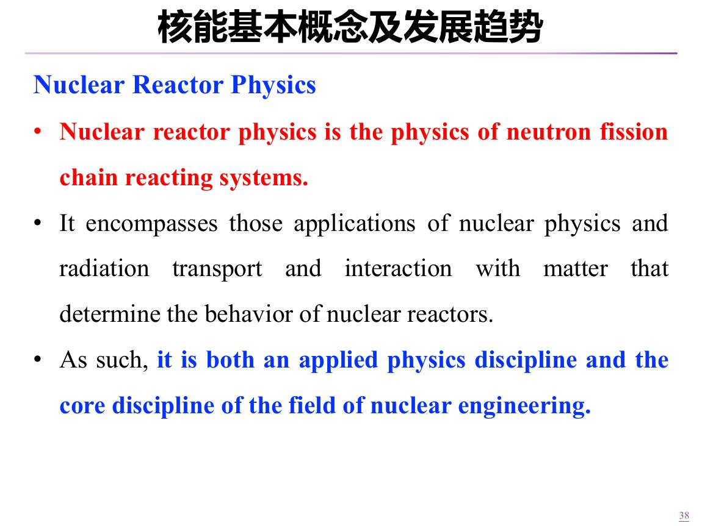

自测：中子数相同的两个系统为什么仍可能表现不同？

能量分布、空间分布、方向、材料组成及边界可能不同；中子与物质的相互作用及泄漏由这些条件共同决定。

[来源与覆盖](Lecture_Source_Map.md)

## 4. 裂变、链式反应与可控供能

第19–21页从单次裂变过渡到链式过程：某些重核发生裂变，释放能量并产生中子，其中部分中子可引起后续裂变。是否能持续，取决于中子产生、吸收与离开系统等竞争过程，而不是只看“一次反应放出多个中子”。

反应堆要实现的是可控、自持的核反应过程，并把能量与中子用于预定用途。**补充解释：** 自持表示无需让每一次后续反应都由外界单独触发；可控表示运行状态能够按要求维持和改变。它不等于不需要冷却、监测、电力支持或安全系统。

此处只建立概念联系。具体中子平衡模型、临界计算与动态控制是后续课程内容；不能用示意图代替完整系统分析。看图时沿着“上一代反应→中子→下一代反应”的箭头阅读，再问每条支路是否都一定成功，这样自然引出下一章的核反应概率和中子行为。

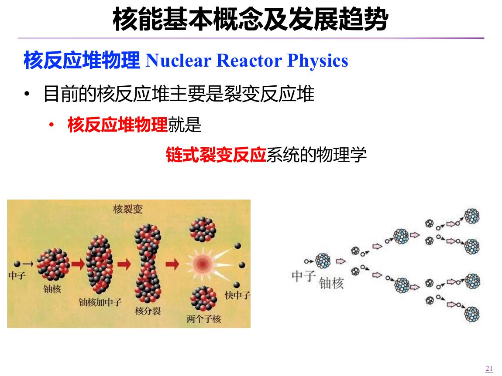

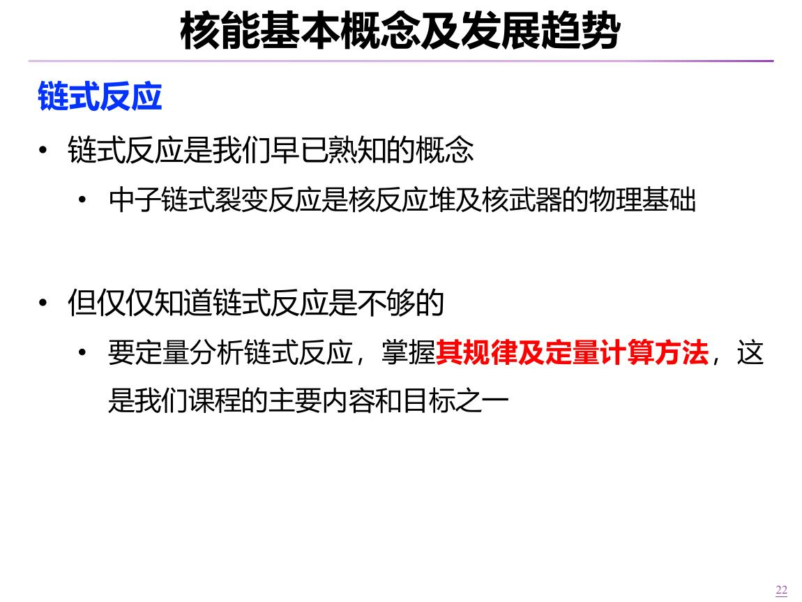

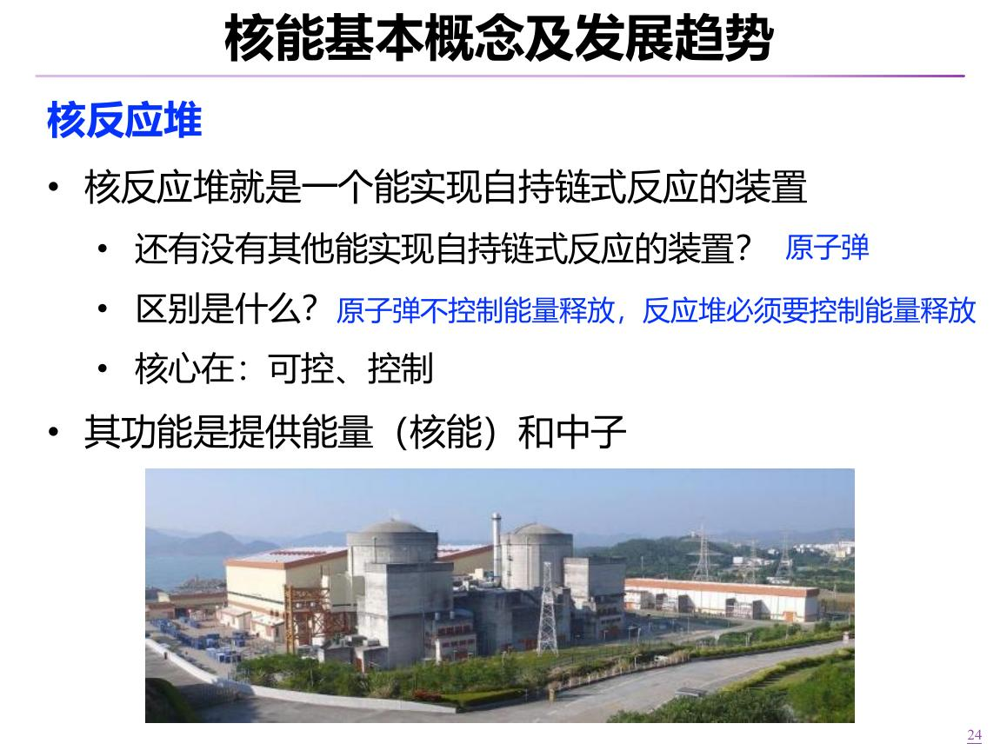

自测：一次裂变产生多个中子，为什么不保证链式过程一定持续？

有些中子会被其他过程吸收或离开系统，只有一部分引起后续裂变；必须看整体中子收支。

[来源与覆盖](Lecture_Source_Map.md)

## 5. 压水堆核电站：沿热量和工质两条线读图

第22–29页由简图推进到设备和厂房照片。压水堆示意的基本能量路线是：堆芯释放热→一回路冷却剂带走热→蒸汽发生器把热传给二回路→蒸汽推动汽轮机→发电机输出电力→剩余热经冷凝和循环冷却系统排向环境。

**教材补充（第14稿p.413–415，图12-3）：** 一回路把反应堆、主泵、蒸汽发生器和相关管道联系起来，稳压器用于维持相应压力状态；二回路包含蒸汽、汽轮机、凝汽器和给水路径。两回路在蒸汽发生器内交换热量，正常设计意图是工质分隔。循环冷却水又通过凝汽器接走二回路排出的热。图中跨过设备的是热流，不意味着三种工质混合。

“三环路压水堆”中的环路数量，通常是在数一回路的并联主冷却环路；它与示意中一回路、二回路、循环冷却水这三类系统不是一回事。第24、25页用三环路、四环路机组比较，第26页展示AP系列，是帮助认识不同工程布局，不能把图中数量错当成热力学循环级数。

核岛与常规岛也不是一、二回路的简单别名：核岛包含反应堆厂房、核辅助、燃料等设施；常规岛主要承载汽轮发电和相关系统；厂区还需要供水、辅助和配套建筑。第28页安全壳剖视与第29页堆芯/燃料组件，把厂房尺度逐步缩小到设备和燃料尺度。读照片时先辨认“厂房包设备、设备内有堆芯、堆芯由组件构成”，避免把安全壳、压力容器和燃料棒混为一物。

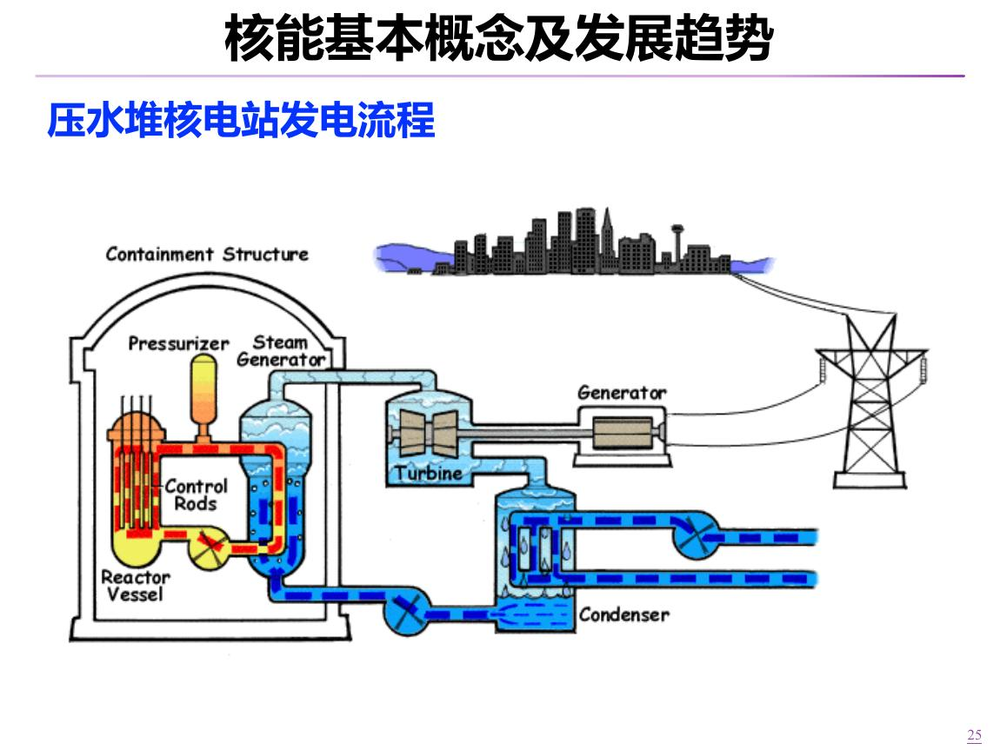

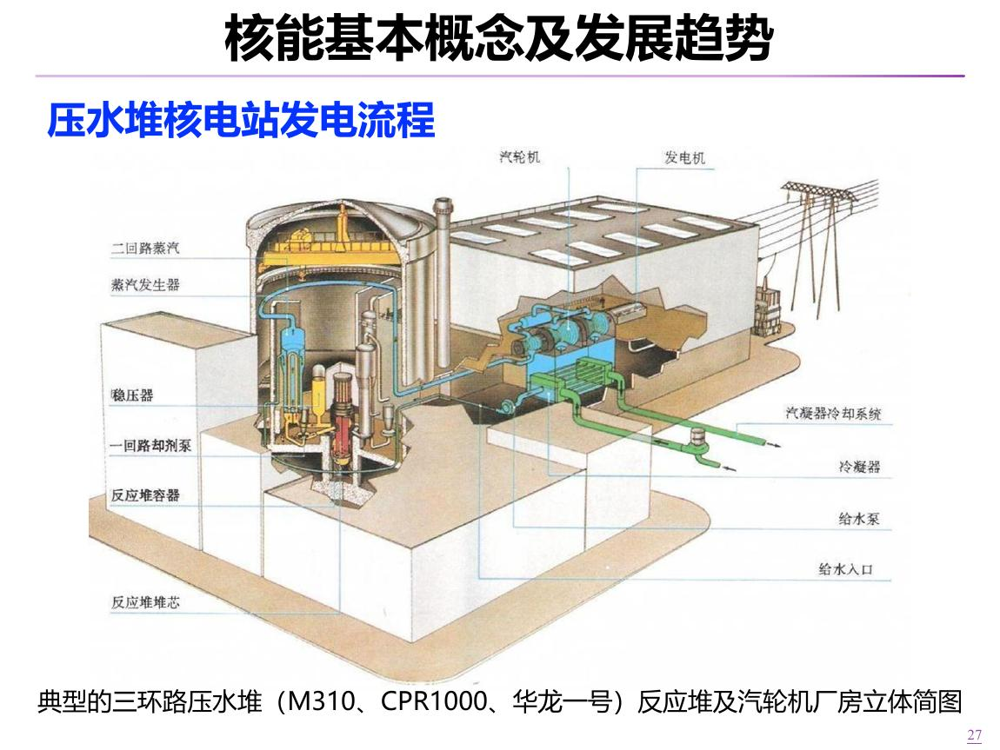

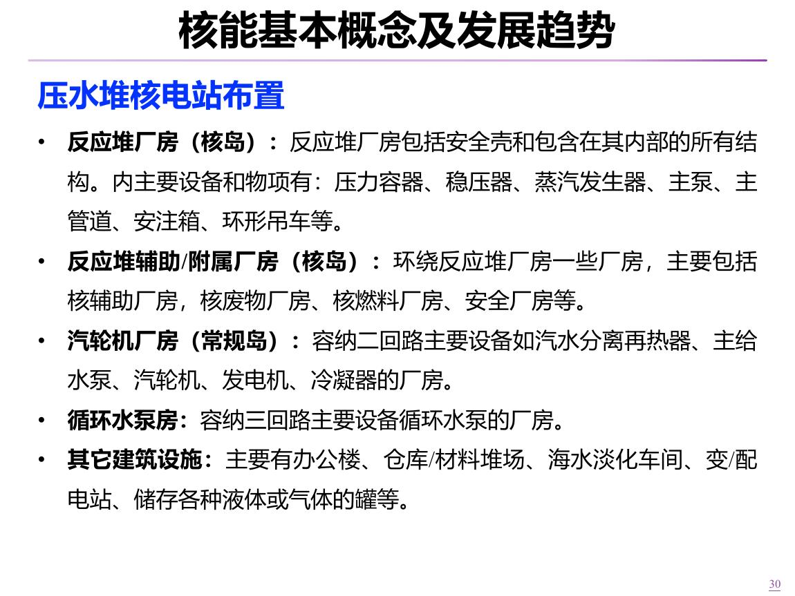

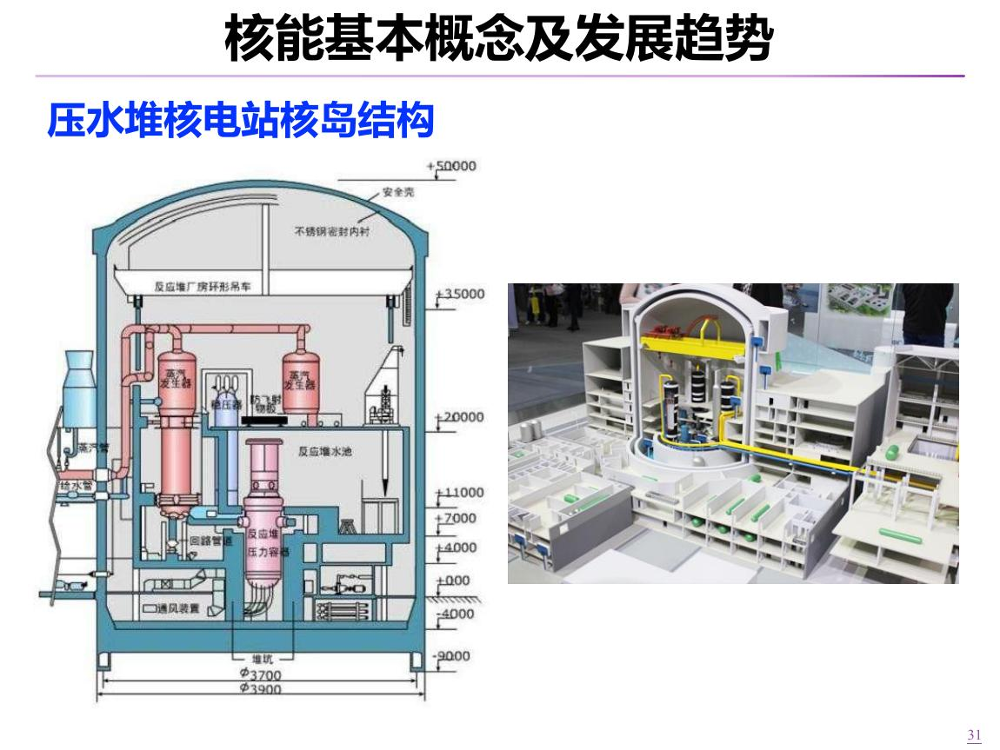

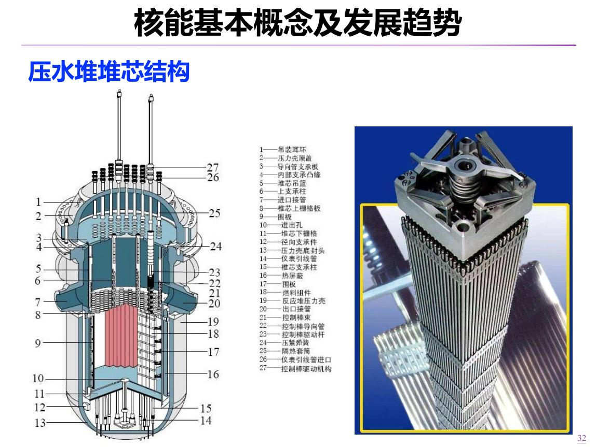

自测：“三环路”是否表示有三个串联热交换级？

不是。这里通常指一回路的并联主冷却环路数量；一回路、二回路和循环冷却水是另一种系统划分。

[来源与覆盖](Lecture_Source_Map.md)

## 6. 堆型与用途：分类轴不能互相替代

同一台反应堆可以同时有多个分类名称。按中子能谱可分热中子堆、快中子堆；按慢化剂和冷却剂，可使用轻水、重水、气体、液态金属等名称；按燃料形态又有固体、球形、溶液或熔盐等；按用途则有动力、生产、试验、研究等。分类轴不同，不能把“研究堆”和“轻水堆”当作互斥类别。

第30页华龙一号、第31页HTR-10、第32页高温气冷堆示范工程，提供了具体实例。课件中的投运、临界、满功率和试验日期是不同里程碑，不能把其中任何一个都简称为“建成时间”。特别是安全试验说明某条件下的行为，不等于无条件、无风险的承诺。

反应堆既可以利用热，也可以利用中子。前者包括发电、供热、海水淡化、推进及制氢等能源用途；后者包括同位素、材料研究、辐照、成像、医疗和基础研究等。第45页以低温供热堆、高温气冷堆和科研设施说明用途的多样性：评价一台研究堆时，不能只按发电功率衡量价值。

**教材补充：** 第14稿p.411–414提供堆型发展与压水堆概述。正文中的工程进度属于该稿写作时的状态，用于理解概念，不作为最新项目时间表。

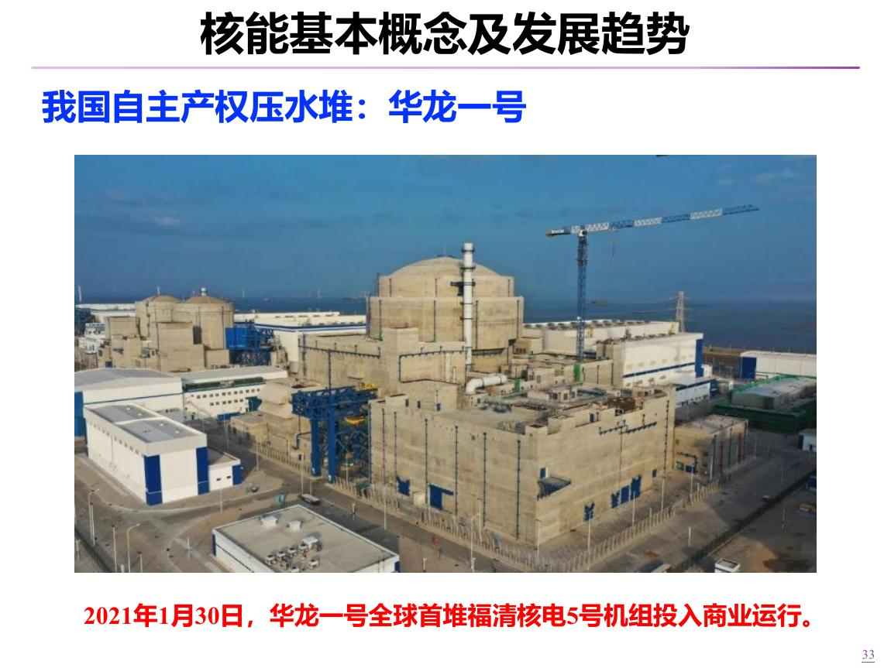

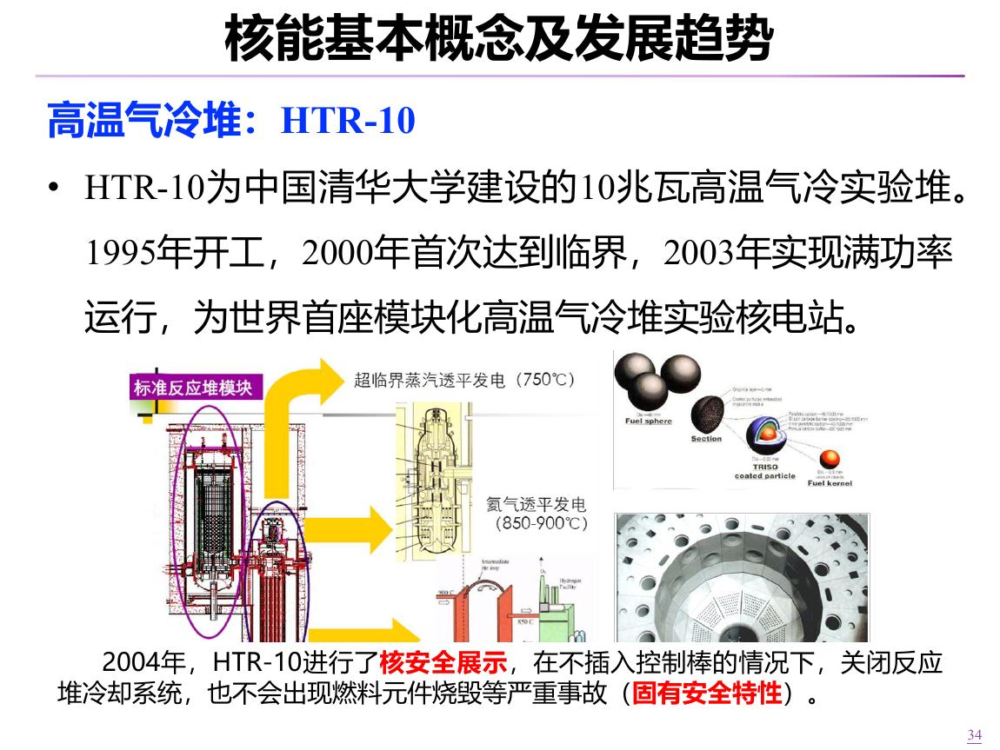

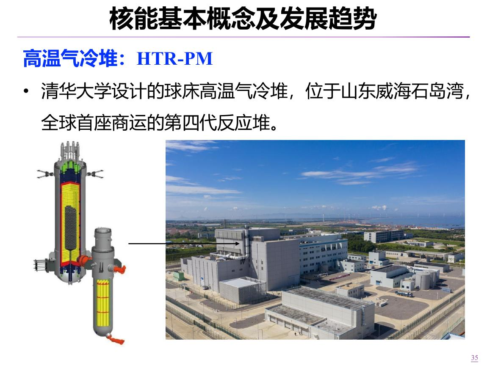

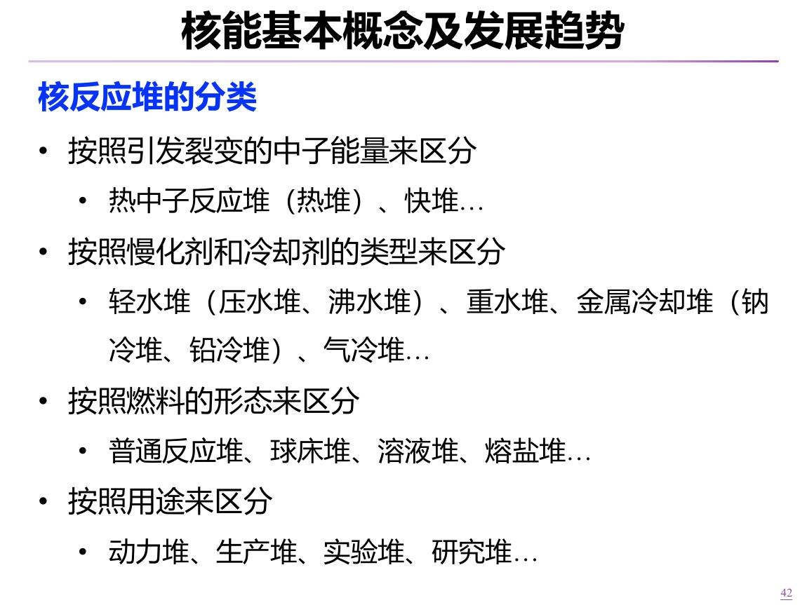

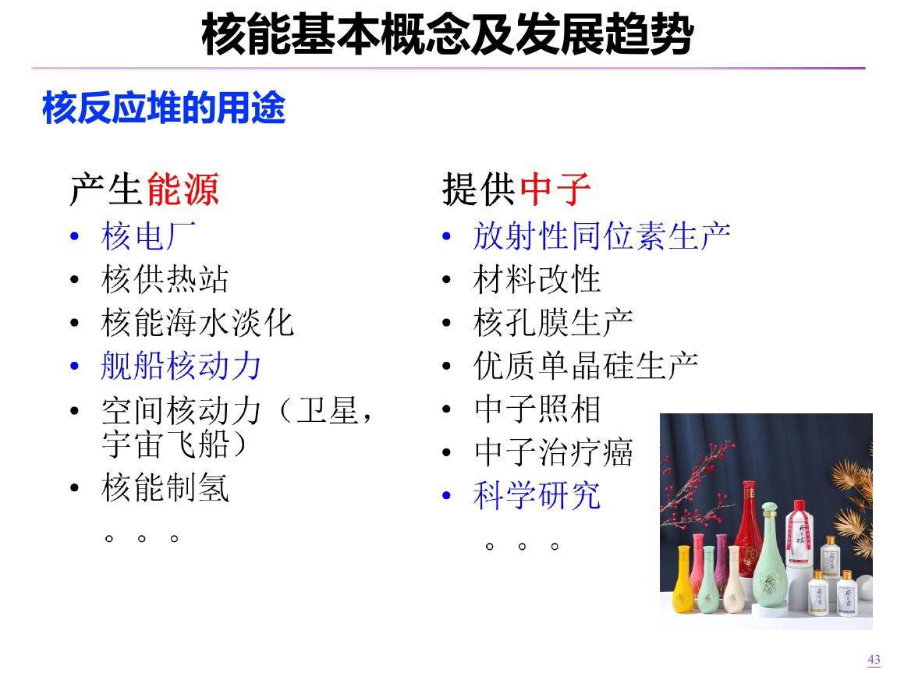

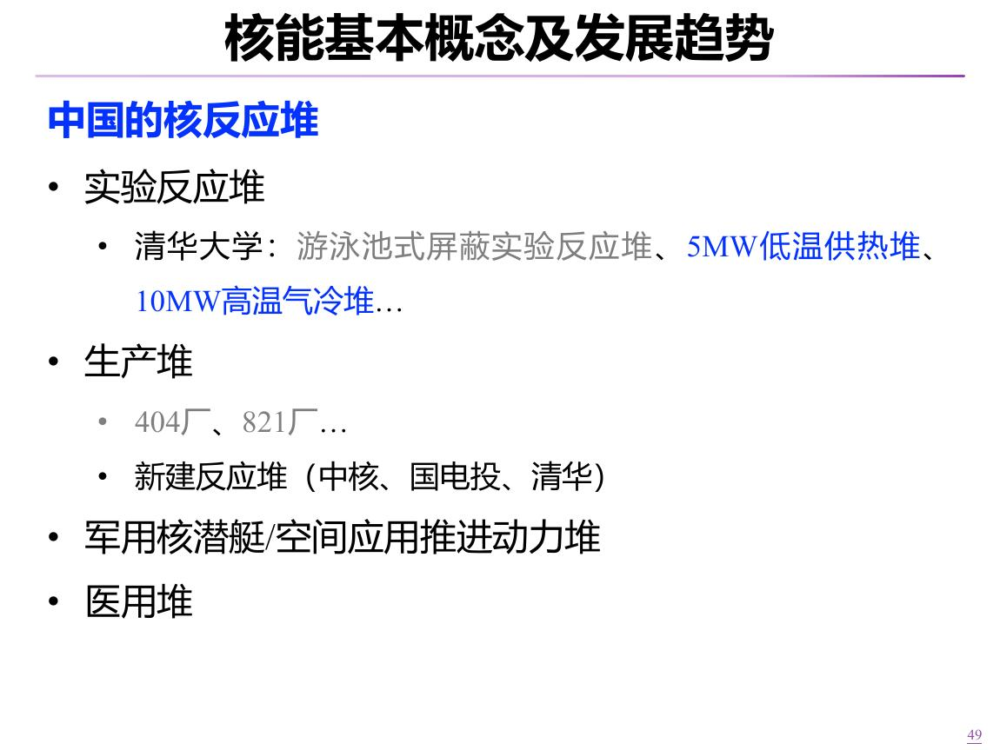

自测：热中子堆、气冷堆、研究堆分别按什么分类？

分别按中子能谱、冷却剂、用途分类。一个具体系统可同时具有这些属性。

[来源与覆盖](Lecture_Source_Map.md)

## 7. 历史与产业统计：同时看年份、单位和指标

课件第41–44页把基础发现、早期反应堆、核电站和国内研究/产业设施串起来：中子发现、裂变认识、链式反应验证，然后才有工程应用。第42–43页不同版本的概览数字出现55台和57台，因此不能取其中一个不加年份地称为“现在”。第66页地图用于识别课件所示沿海分布，不用于确认今日项目清单。

第46–65页连续给出2017–2025年数据与能源结构图。为避免把九年重复页面变成九段孤立摘要，先整理原课件核心数据，再回图看结构变化。下表按课件原值转录，未作外部统计核验；“核电占比”是发电量占比，不是装机占比。

| 年份 | 台数 | 装机容量/MWe | 发电量/亿kWh | 发电量占比 |
|---|---:|---:|---:|---:|
| 2017 | 37 | 35807.16 | 2474.69 | 3.94% |
| 2018 | 44 | 44645.16 | 2865.11 | 4.22% |
| 2019 | 47 | 48751.16 | 3481.31 | 4.88% |
| 2020 | 49 | 51027.16 | 3662.43 | 4.94% |
| 2021 | 53 | 54646.95 | 4071.41 | 5.02% |
| 2022 | 55 | 56993.34 | 4177.86 | 4.98% |
| 2023 | 55 | 57031.34 | 4333.71 | 4.86% |
| 2024 | 57 | 59753.7 | 4446.77 | 4.72% |
| 2025 | 59 | 62518.74 | 4677.19 | 4.82% |

**补充解释：** MWe是电功率，亿kWh是累计电能。发电量增长而占比下降并不矛盾：如果全社会总发电量增长更快，分子增加时分数仍可减小。机组台数增加、总装机增加和发电量增加也不是同一个指标；新机组投产月份和运行情况会影响当年发电量。

逐年饼图帮助观察煤电、水电、风电、太阳能等组成，不能把统计类别的调整当成物理能源类型突然变化。新投产与政策事件页（48、56、59）是各自年份的背景，不覆盖成当前新闻。

第64页给出的2025年利用小时“4869.85”与同页年度发电/装机数据存在明显口径疑问，保留为待确认值，不在正文用它推导可用率。年末装机与全年平均装机不同，发电量除以年末装机也不能无条件等于正式统计利用小时；但这正说明复习统计时必须先核口径。

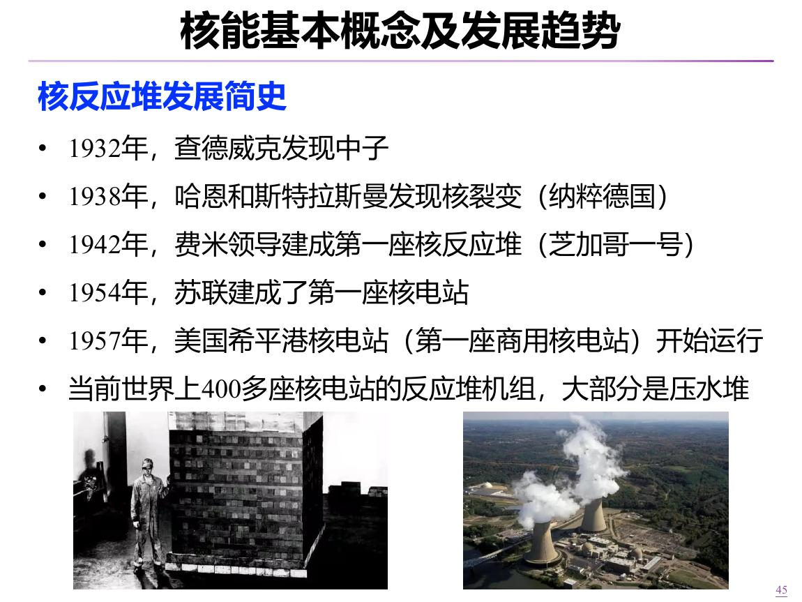

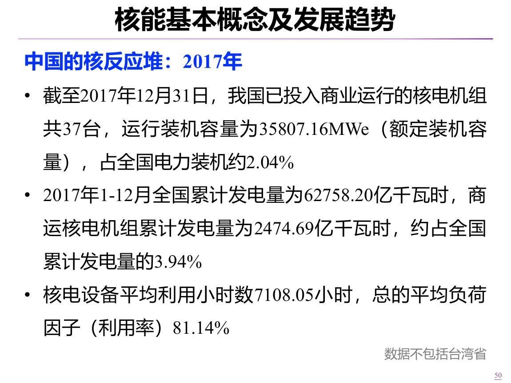

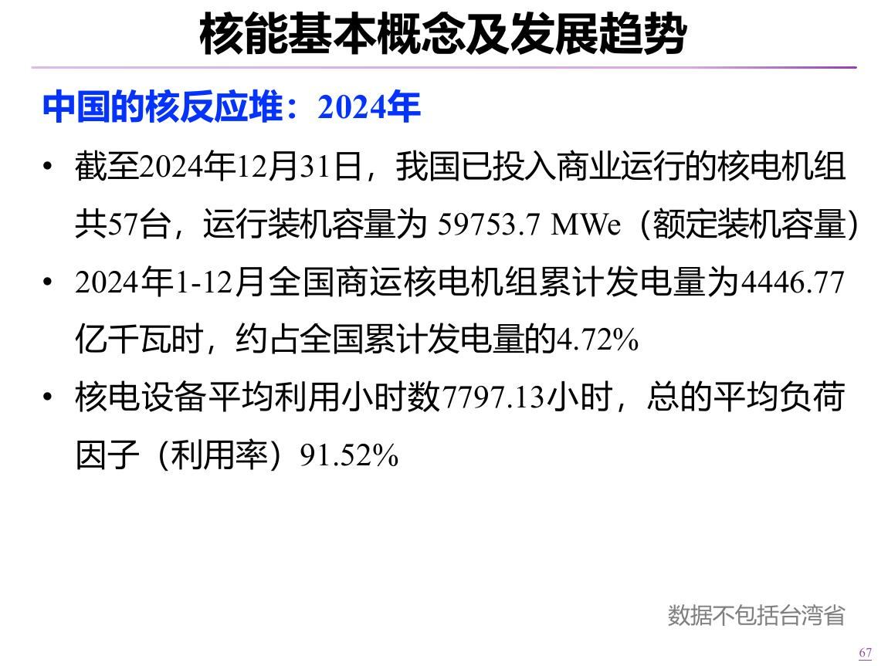

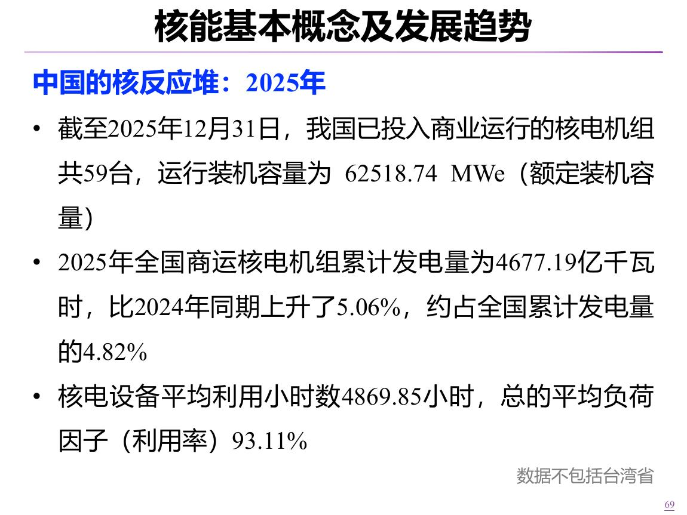

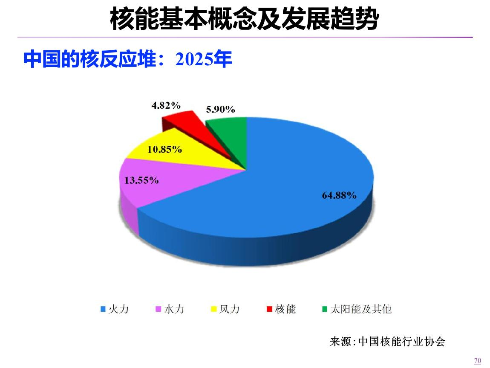

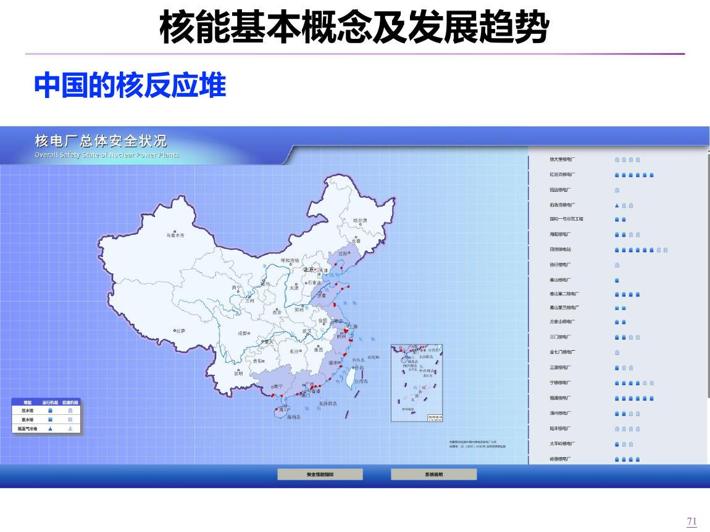

自测：发电量增加，发电占比为什么可能下降？

占比=核电发电量/全部发电量。分子增加时，只要分母增长得更快，占比仍可下降。不能把占比下降直接解释成核电发电量减少。

[来源与覆盖](Lecture_Source_Map.md)

## 8. 未来方向：用工程问题组织“小微特聚”

第67页把安全和经济性放在发展基础上：一个系统除满足物理目标，还要能被长期可靠地运用并承担合理成本。第68–76页展示的小型/微型、特殊用途、聚变、空间与移动能源等方向，适合读成一组待解决的工程问题，而不是既定的商业承诺。

高通量研究设施强调可供实验利用的中子环境；聚变系统把等离子体与包层、中子、热量和材料相联系；空间或移动能源额外受到质量、体积、环境和可靠性约束。不同应用对同一个“好设计”的要求并不相同。

第74页的多物理场示意把温度场、传热和形变联系起来。**补充解释：** 如果升温导致材料尺寸或密度改变，几何和物性变化又会影响后续能量沉积或换热，单向计算可能不足以表达反馈。所谓耦合就是把互相影响的量按模型交换并检验一致性，而不只是把几张彩色云图放在一起。

第75页提到GPU光线追踪等计算工具，第76页联系汽车、电子、AI等跨学科技术。这里的学习目的在于发现可迁移的方法，并核查它是否适合目标物理问题。硬件快不等于结果正确；某个算例的加速比也不能直接推广到所有求解任务。

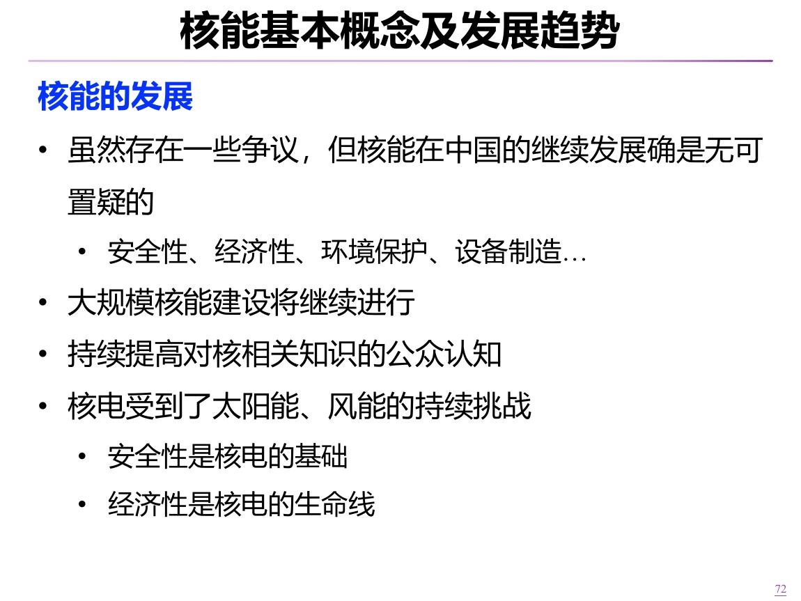

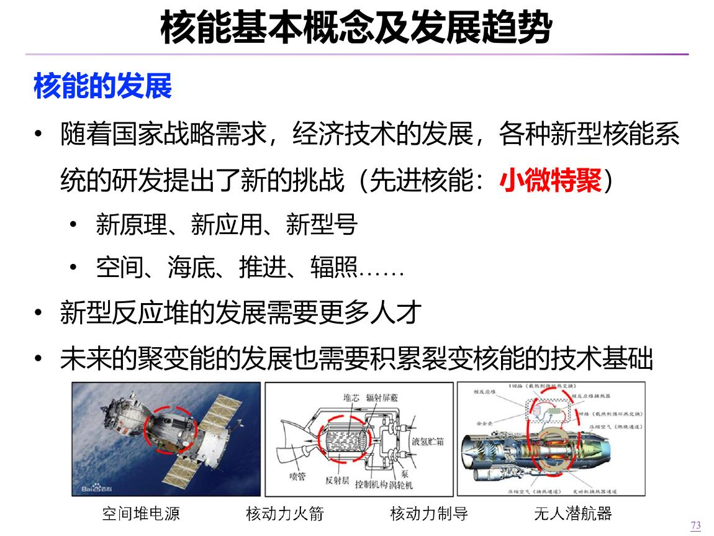

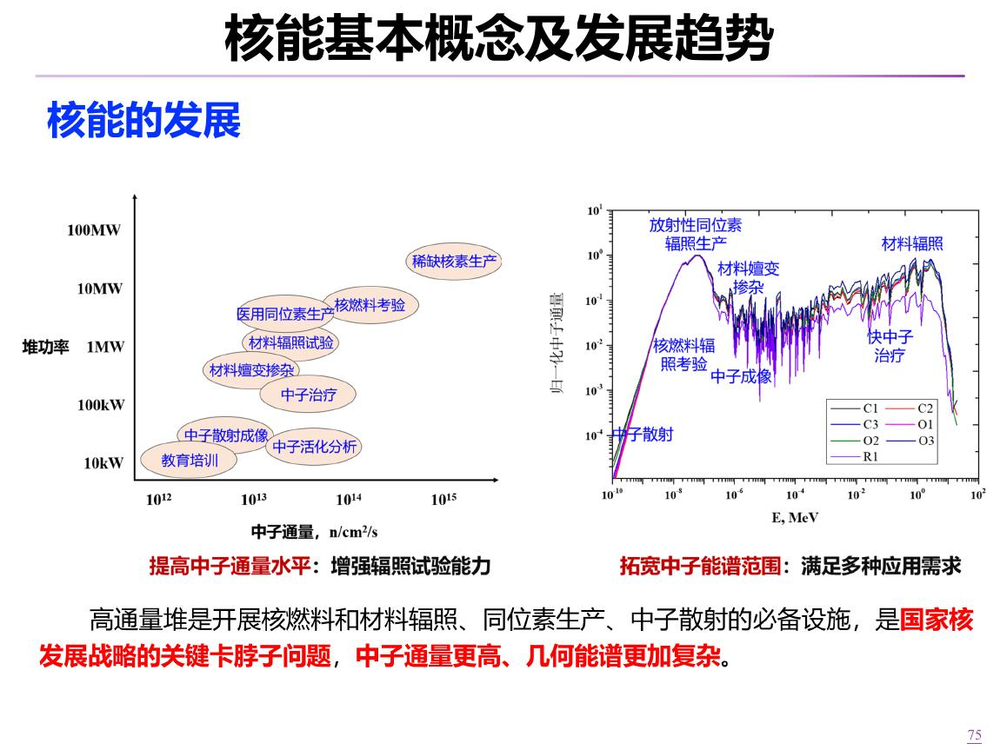

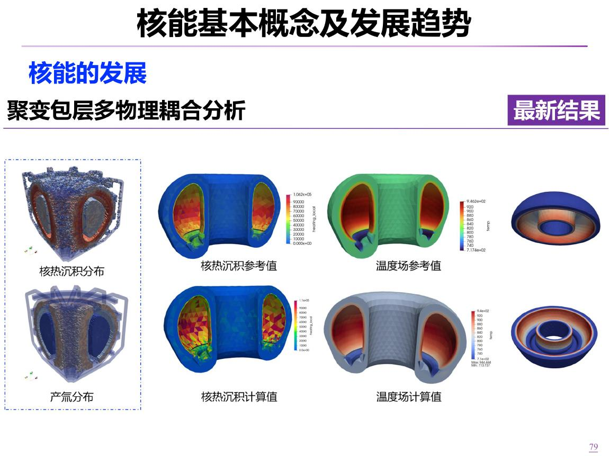

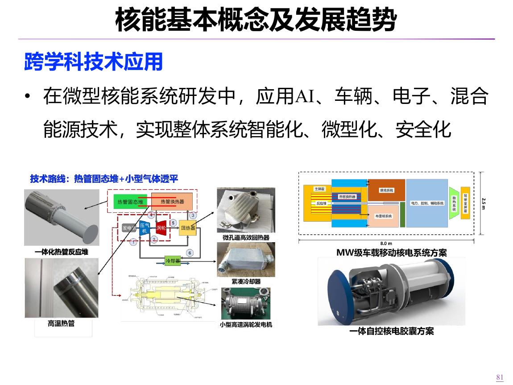

自测：多物理场“耦合”与分别算出几个场有什么不同？

耦合计算需要传递相互影响的变量并处理反馈。例如温度改变密度或几何，变化后的状态又影响能量沉积和传热。

[来源与覆盖](Lecture_Source_Map.md)

## 9. 建立数量级直觉：每个数字都带着对象和单位

第77–78页给出典型压水堆的尺度。以下是课件中的近似工程量，不是所有堆型的固定常数。

| 量 | 课件典型值 | 应如何理解 |
|---|---|---|
| 燃料/堆芯特征长度 | 约3.5–4 m | 米级工程尺度；不要与燃料棒直径混淆 |
| 二氧化铀密度 | 约10.4 g/cm³ | 材料密度；不是铀装载质量本身 |
| 单机电功率 | 200–1700 MWe | 对外发电能力的尺度 |
| 热电转换效率 | 约33% | 电功率与热功率的比 |
| 体积功率密度 | 约100 MW/m³ | 堆芯热功率除以相关堆芯体积 |
| 比功率 | 约30 W/gU | 热功率相对于铀质量 |
| 线功率密度 | 约175 W/cm | 单位燃料棒长度热功率 |
| 温度 | 燃料约2000℃，冷却剂约300℃ | 不同物体、不同位置，不可混写 |
| 压力 | 约15.5 MPa | 此课件给出的典型一回路尺度 |
| 时间 | 电站30–60年，燃料3–5年 | 设施寿命与燃料驻留时间不同 |

**补充推导：1000 MWe机组的粗估。** 若 \(\eta=0.33\)，则 \(P_{\rm th}=P_e/\eta\approx3030\) MW。用100 MW/m³估算 \(V\approx30.3\) m³；用30 W/gU估算 \(m_U\approx3.03\times10^9/30\approx1.01\times10^8\) g，即约101吨铀。这里采用均匀平均功率密度，结果只是数量级演算，不能替代真实工程参数。

反过来检查：若错把1000 MWe当成1000 MW热，估出的体积和燃料量将都少约三倍。理解功率的热/电口径，比记住“约100吨”更重要。L02有教师对这类算例的实际讲解，可以在那里听原音或看整理稿；本节算式是明确标注的编者补足。

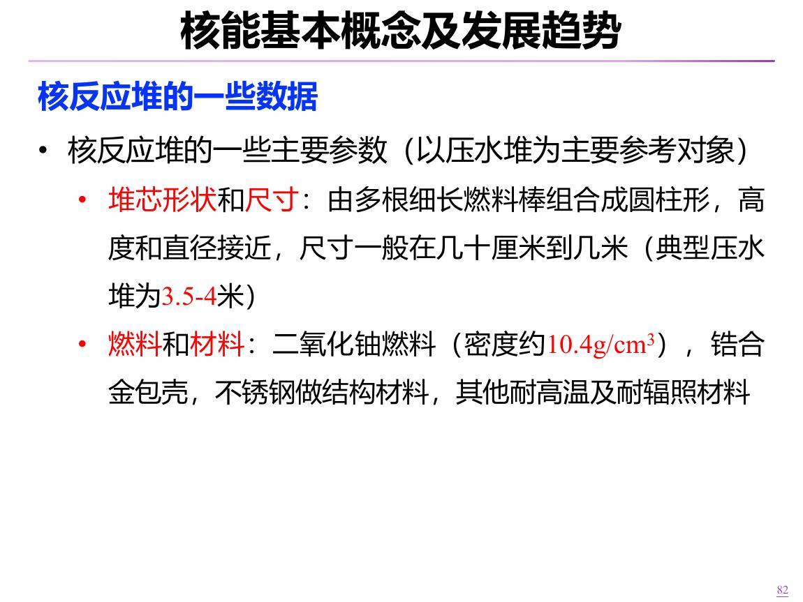

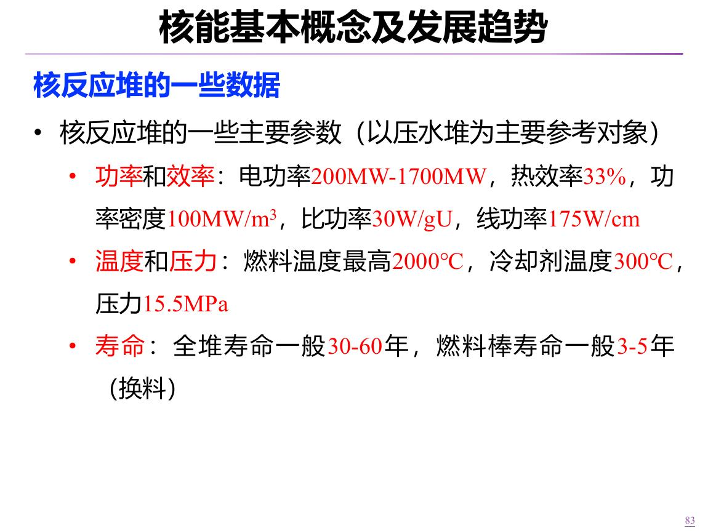

自测：30 W/gU中，gU是二氧化铀的总质量吗？

不是，gU表示铀质量。若要换算为UO₂总质量，需要相应组成关系；不要直接把材料密度与比功率分母混为一体。

[来源与覆盖](Lecture_Source_Map.md)

## 10. 本讲复习路线与当前缺口

第79页把课程收束到核工程问题与发展认识。一次完整复习应能沿“核物理机制→中子行为→反应堆→热量输送→电站系统→安全与经济→应用与计算”走通，并能读懂关键结构图、解释统计指标、完成一组单位一致的数量级估算。

本资料包没有明确的一套本讲作业题号，也没有录音可确认口头布置。本版自测为编者设计，不能替代课程作业。章节习题和可选大作业的一般要求来自课件第16页；具体任务应依据现有课程通知与L02已记录的补充说明。

教材入口：[第14稿目录与页码索引](../../Global/Textbook_Index.md)。概念卡住时可查第19页课程定位、第406页反应堆发展、第413–419页压水堆系统与布局；局部页图保存在课程Global缓存中。教材原稿也可能有错，涉及数字和公式需同时核验，不能把“出自教材”视为免检。

**尚无法恢复：** L01实际讲到第几页、教师口头举例、临场问答和强调程度。L02续讲的内容能提供后续证据，但不会反向证明L01已讲过同一内容。此处展示的是缺少录音时可读、可追溯的资料包复习方式，等待用户评价后再考虑固化。

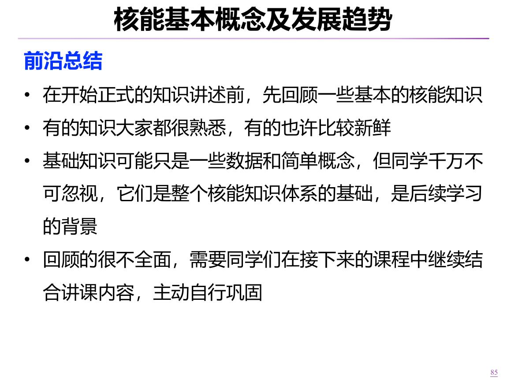

自测：读完本讲，最应避免的三种混淆是什么？

把热功率当电功率；把一回路的并联环路数量当成系统分类数量；把课件包含的页面当成有证据证明L01课堂全部讲过。

[来源与覆盖](Lecture_Source_Map.md)

