# 核工程原理 L02 · 工程数量级、核素、中子与核能来源

本讲按完整约86分钟转写重建。前半堂继续课程导论、工程例题及大作业要求，约49分钟后进入本讲344页课件的开篇，实际讲到**p.28核力与稳定性**，而非旧索引的p.25。录音已归档但尚未核听；正文与课堂回顾区分了订正、来源冲突和补充推导。

正文依据课件与已注明的课堂材料编写；额外解释标为“补充推导”或“教材补充”。本版尚未经过逐项人工学术复核。

[来源、覆盖与疑点](Lecture_Source_Map.md)

## 1. 开场续讲：核能应用与工程评价

课堂先延续导论课件，从核能发展、沿海与内陆布局、现有堆型以及未来机会讲起。教师提到装机增长和政策目标，但转写里目标年份有歧义，本讲保留为课堂背景，不把它当作已经核实的当前政策。

压水堆、重水堆、高温气冷堆、快堆从不同物理与工程条件出发。教师以秦山重水堆、清华高温气冷堆研究及后续示范为例，强调研究积累与工程应用的关系。“重水慢化更好”应区分单次碰撞降能与较低中子吸收带来的中子经济性，不能直接写成任何意义下都优于轻水。

安全与经济性共同决定工程能否被采用。供热、制氢、空间与推进等应用提出不同的温度、质量、体积和可靠性要求。课堂中的电价、价格与效率比较属于口头举例，没有统一数据口径，不据此给出投资判断或通用优劣排名。

**读图与前讲对应：** L01导论课件p.66–71展示布局、发展原则、先进用途和聚变。它们与本段主题对应，但没有精确翻页记录；下图标清来自前讲资料包，不能标作本讲PPT页码。

自测：评价不同用途的反应堆时，为什么不能只比发电功率？

用途可能是供热、研究、移动或空间能源，约束与价值指标不同；需同时考虑安全、可靠性、体积、温度、成本等。

[回到教师讲解](Transcript_Corrected.md#T01) · [来源与覆盖](Lecture_Source_Map.md)

## 2. 聚变、跨学科与计算：把研究例子读成问题

教师讨论“小微特聚”等方向，包括高通量设施、聚变包层、空间与移动电源、多物理场以及GPU计算。这里的目的在于展示核工程的跨学科范围，具体项目表现、价格和未来进度只按课堂自述保留，不扩展成普遍结论。

典型DT反应为 \({}^2\mathrm H+{}^3\mathrm H\to{}^4\mathrm{He}+n\)。聚变能利用还要处理能量回收、材料与中子作用等问题，不能只研究反应发生本身。原稿约14分钟附近提到中微子，不能把它并入上述主反应方程；本讲后段及本讲PPT p.21均给出氦和中子，可据此校正反应写法，具体原音待核听。

多物理场例子把温度、热流和形变等联系起来；GPU光线追踪启发快速几何处理，但将图形计算方法用于物理计算仍需检查精度和模型适配。教师报告的硬件成本与性能例子不是通用基准测试。

AI在课堂中被当作学习、程序开发和研究辅助工具。能生成程序只是起点，还要理解任务、核查结果和改进方法。教师强调如果报告只是粘贴现成结果，没有自己的分析，达不到研究训练的目的。

自测：为什么“程序跑通了”仍不能证明一个物理计算正确？

还要检查数学模型、边界条件、单位、数值精度、验证算例和结果解释。工具执行成功只说明完成了一次运算。

[回到教师讲解](Transcript_Corrected.md#T04) · [来源与覆盖](Lecture_Source_Map.md)

## 3. 典型压水堆数量级：先统一热与电的口径

课堂由燃料棒与堆芯尺寸过渡到功率、燃料量和寿命。典型尺度：燃料棒直径约8–9 mm，长度约4 m，堆芯特征尺度约3.5–4 m；UO₂密度约10.4 g/cm³，包壳采用低中子吸收的相应材料。转写省略密度单位，依据导论课件p.77补齐。

单机电功率举例200–1700 MW，热电转换效率约33%。体积功率密度约100 MW/m³、比功率约30 W/gU、线功率约175 W/cm，均须理解为相应的**热功率**口径。它们分别对应堆芯体积、铀质量和燃料棒长度，不能相互直接替换。

**课堂例题，补齐单位步骤：** 对1000 MWe机组，取效率0.33：
\[
P_{\rm th}=\frac{1000}{0.33}\approx3030\,\mathrm{MW};\qquad
V\approx\frac{3030\,\mathrm{MW}}{100\,\mathrm{MW/m^3}}=30.3\,\mathrm{m^3}.
\]
再用比功率计算：
\[
m_U\approx\frac{3.03\times10^9\,\mathrm W}{30\,\mathrm{W/gU}}
=1.01\times10^8\,\mathrm{gU}\approx101\,\mathrm{tU}.
\]
教师采用约三倍热电换算，因此口算约30 m³、100吨；1700 MWe按同一粗估约170吨。转写个别位置的“千瓦”与这一算例的上下文冲突，应为百万千瓦/兆瓦的相应尺度，不沿用错误单位。

燃料温度约2000℃、冷却剂约300–310℃，是不同物体/位置的典型量。压力口述约15.7 MPa、导论PPT p.78约15.5 MPa，作为近似工程量保留差异，不强改教师原话。电站寿命30–60年与燃料在堆中3–5年是不同的时间尺度。

自测：1000 MWe除以100 MW/m³为什么不能直接得出正确堆芯体积？

分子为电功率，分母按热功率定义。先除以效率换成约3030 MW热，再得约30.3 m³。

[回到教师讲解](Transcript_Corrected.md#T08) · [来源与覆盖](Lecture_Source_Map.md)

## 4. 燃耗例题：一克铀对应多少能量

课堂提出：取比功率30 W/gU，按满功率运行1500天，单位铀质量释放多少能量？这是“功率乘时间”，先不要急着把单位写成电量。

\[
E/m_U=30\,\frac{\mathrm W}{\mathrm{gU}}\times1500\,\mathrm d
=45000\,\frac{\mathrm{Wd}}{\mathrm{gU}}.
\]
因为一天24小时、一千瓦为1000瓦，
\[
45000\times24/1000=1080\,\mathrm{kWh_{th}/gU}.
\]
同一结果也可写成 \(45000\,\mathrm{MWd/tU}=45\,\mathrm{GWd/tU}\)。后一个单位常用于表述燃耗尺度，分母为铀质量。

**重要解释：** 1080 kWh是热能，不是已经发出的电能。若继续采用33%效率，理想化对应电能约 \(1080\times0.33=356.4\,\mathrm{kWh_e/gU}\)。这一步是补充换算，实际净供电还受运行与设备耗能影响。也不能据此说“一克铀全部转化成了1080度电”；这是按给定比功率和时间得到的比能量。

课堂问答中对热与电的区分容易在口头“多少度”里丢失，复习时每一步标上th/e比单记答案更可靠。讲到这里，教师也鼓励用问题检验自己是否真正理解前面的参数。

自测：30 W/gU乘1500天得到1080 kWh/gU，能直接称为发电量吗？

不能。这些参数给热能；采用33%热电转换率才粗略得到356.4 kWhe/gU。

[回到教师讲解](Transcript_Corrected.md#T11) · [来源与覆盖](Lecture_Source_Map.md)

## 5. 大作业与课堂学习要求

约38:23以后介绍可选大作业。报告可以获得相应加分，部分优秀报告进入答辩，有机会按答辩表现获得免考试安排；教师还谈到参加考试后比较成绩的方案。具体认定由课程执行，不保证交一份报告就自动免试。

同一选题通常不超过两人，编程类可到三人，但强调各自独立完成，不是把名额限制误读成小组共同交一份。可以提出自己的题目，重点是分析、方法与改进，而不是仅搜集材料或复制AI输出。

示例包含航空航天、燃料管理、功率/燃耗分布、氙效应、点堆动态、程序与AI工具等。教师希望学生说清问题、采用什么模型、结果为何可信、做了哪些自己的工作。末段点名与管理交谈不逐字保留姓名，保留了章节测试、课堂参与和师生相互了解的教学意义。

本段没有宣布一套具体的本讲教材作业题号，不从344页整章PPT或全章教材习题里自行指定。读者可把后文自测当作复习检查，不能当作课程已布置任务。

自测：同一编程选题允许三人，是否就是三人合作一份作业？

课堂强调独立完成；名额限制与合作形式不同。正式提交和评分细则仍按课程安排。

[回到教师讲解](Transcript_Corrected.md#T12) · [来源与覆盖](Lecture_Source_Map.md)

## 6. 从原子模型到核素：记号同时携带哪些信息

约49分钟后进入本章，课件目录有核物理、中子相互作用、重要核反应、链式裂变等部分，本堂只讲开篇。不能把整章344页都记成本讲课堂范围。

原子模型的历史从早期原子说、电子与原子结构到原子核模型、Bohr模型和量子认识。**教材补充（第14稿p.19–20）：** Rutherford在1911年提出有核模型，中子在1932年发现。课件历史模型旁的现代质子—中子构成图，不表示1911年已经知道中子。

核素记号 \({}^{A}_{Z}X\) 中，Z为质子数/原子序数，N为中子数，\(A=Z+N\)为质量数，X为元素符号。相同Z决定同种元素；同一元素中N不同的核素互为同位素。举例：氦-4有2质子2中子，氧-16有8质子8中子；铀-235与铀-238均有92质子，中子分别143与146。质量数是计数，不是精确质量以u为单位的数值。

丰度在本课堂指原子数分数，富集度在这里按质量分数讨论。**教材补充（p.21）：** 第14稿也提醒相关术语在不同约定中存在差异，使用资料时应写明分母。二者不能不加说明都叫“百分之几”。若一种元素仅有两种同位素，原子数分数为x、质量近似为m₁,m₂，则质量分数 \(w_1=xm_1/[xm_1+(1-x)m_2]\)；这是补充推导，说明为什么两个百分比不完全相同。

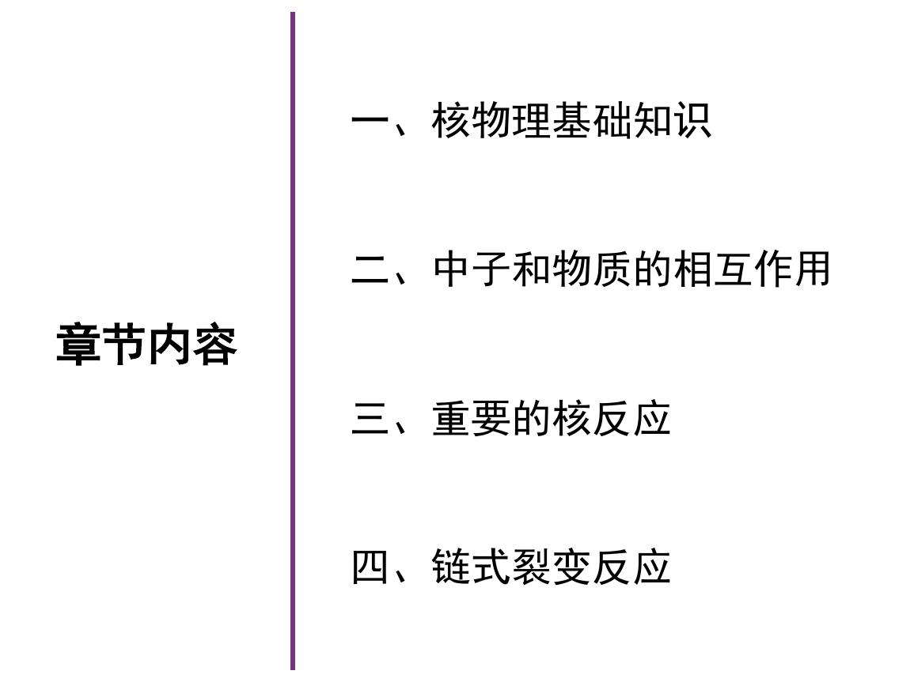

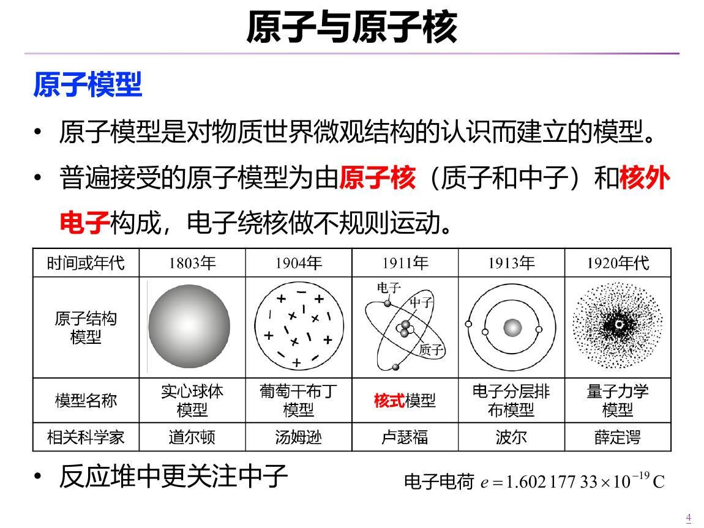

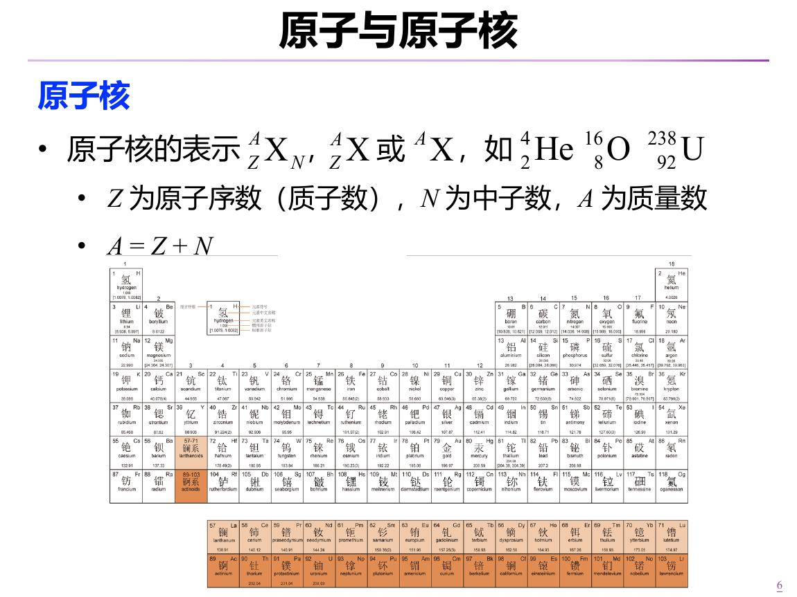

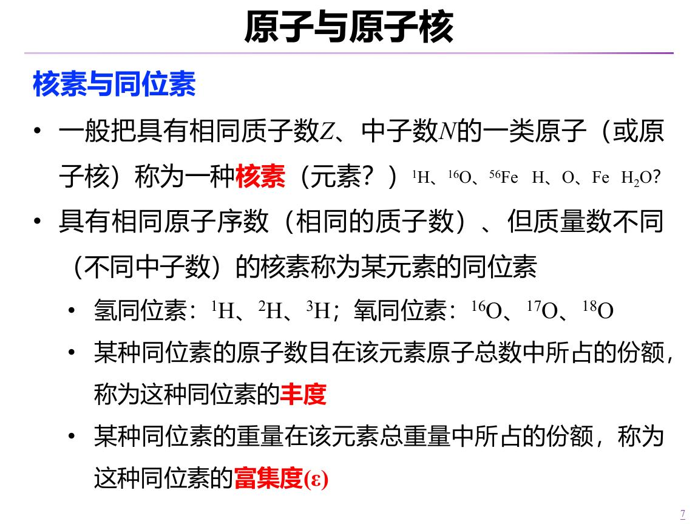

自测：铀-235与铀-238的相同点和不同点是什么？

质子数都为92，属于同一元素；中子数为143与146，属于不同核素、互为同位素。

[回到教师讲解](Transcript_Corrected.md#T15) · [来源与覆盖](Lecture_Source_Map.md)

## 7. 质量单位、核素图与核半径

原子质量单位u按碳-12原子质量的1/12定义，\(1\,\mathrm u\approx1.66\times10^{-27}\) kg，对应静能 \(1\,\mathrm u\,c^2\approx931.5\) MeV。质量与能量之间差一个 \(c^2\)，不能把“1u=931.5MeV”作为量纲完整的等式。转写初次出现“193.5”，后文和PPT一致为931.5，已订正。

核素图按Z、N排列，比元素周期表更适合同时展示同位素与衰变。课件局部图横轴N、纵轴Z：水平行中Z固定，沿水平方向改变N即同位素；斜线可体现相同A。图中黑色格表示稳定核素，其他格给半衰期或衰变信息。课堂列举工程中关心的核素，但PPT p.9将Sm-149列为放射性核素存在疑点，不能把整张列表作为已核验的放射性分类表；具体性质需独立核对。

核半径按 \(R=r_0A^{1/3}\) 粗估。本讲课件取 \(r_0=1.25\times10^{-13}\) cm=1.25 fm；教材p.24取1.20 fm并说明不同测量定义与拟合有差异。二者是近似参数差异，不静默统一成某一个教师数值。原子尺度约 \(10^{-10}\) m=\(10^{-8}\) cm，与核尺度fm不同。

**补充推导：** 球形近似下 \(V=4\pi r_0^3A/3\)，所以核子数密度 \(A/V=3/(4\pi r_0^3)\)，与A近似无关。课堂说核密度近似常数的原因就在 \(R\propto A^{1/3}\)，不是靠记几个核的密度表得到。

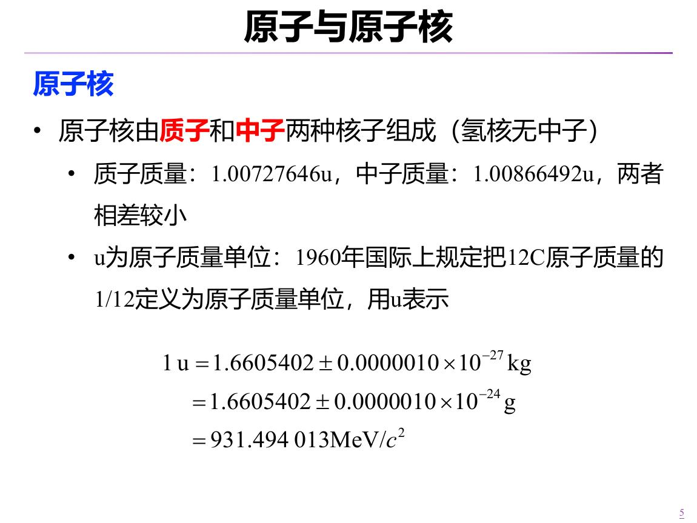

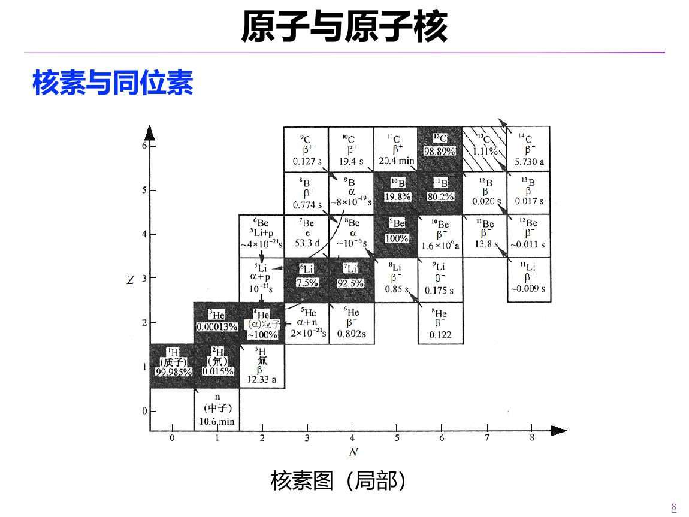

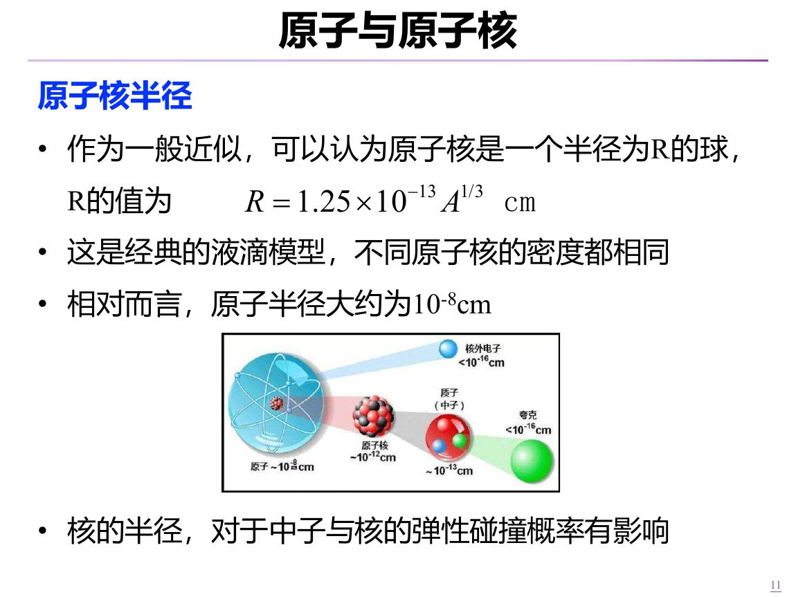

自测：核半径随A的立方根增大，为什么核子数密度仍近似不变？

体积随R³变化，因此与A成正比；A除以体积后A抵消。

[回到教师讲解](Transcript_Corrected.md#T16) · [来源与覆盖](Lecture_Source_Map.md)

## 8. 中子：动能跨度、分类与约化波长

中子不带电，质量约1.008665u；自由中子可通过β衰变成为质子、电子和反电子中微子。课堂与PPT p.12给出611 s，局部核素图及教材p.35给10.6 min，数值不一致，本版保留冲突，不选一个冒充已核实精确常数。这里的基础区别是自由中子与核内束缚中子不能混为同一寿命问题。

反应堆讨论的中子能量通常是动能，不是静止质量对应的约GeV能量。课堂采用热中子低于约1 eV、中能1 eV至0.1 MeV、快中子大于0.1 MeV的划分，热中子的一个常见代表为0.0253 eV。界线与场景/约定有关，不是自然界在1 eV处发生突变。

低能不能等同于不重要。不同能量的中子数量和发生反应的概率不同，须结合目标核与反应种类研究。原稿说能量跨度“14个数量级”，以给出的20 MeV至 \(10^{-12}\) MeV计算，比例为 \(2\times10^{13}\)，约13.3个十进制数量级，作为十几数量级的口头概括保留。

约化波长 \(\bar\lambda=\hbar/p\)，在非相对论近似 \(E=p^2/(2m_n)\) 下：
\[
\bar\lambda=\frac{\hbar}{\sqrt{2m_nE}}\approx\frac{4.55\times10^{-12}}{\sqrt{E[\mathrm{eV}]}}\,\mathrm m.
\]
E=0.01 eV时为 \(4.55\times10^{-11}\) m。普通德布罗意波长为 \(\lambda=2\pi\bar\lambda\)，不能混用。PPT p.14和转写将典型原子直径写成 \(10^{-8}\) m，与前页及教材的原子尺度不符，正文按约 \(10^{-10}\) m解释并记录单位疑点。

教师要说明的建模思想是：可采用粒子输运与碰撞描述，同时通过反应截面纳入量子效应。不能从错误长度比较推出“任何情形都不需要量子力学”；截面本身正携带相互作用的物理信息。

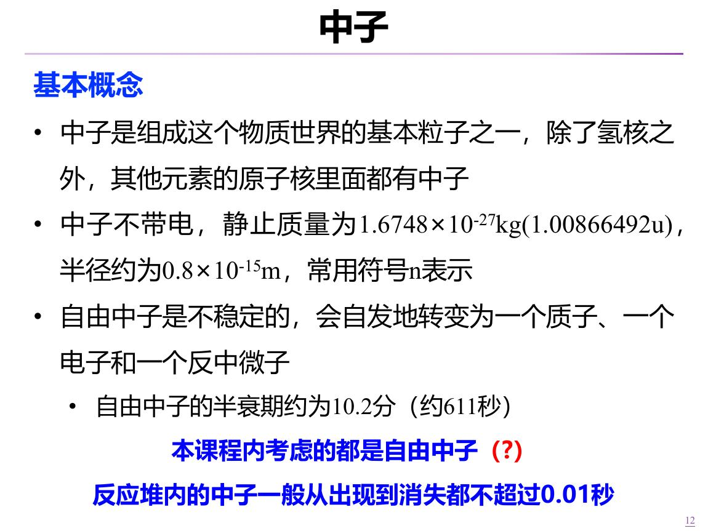

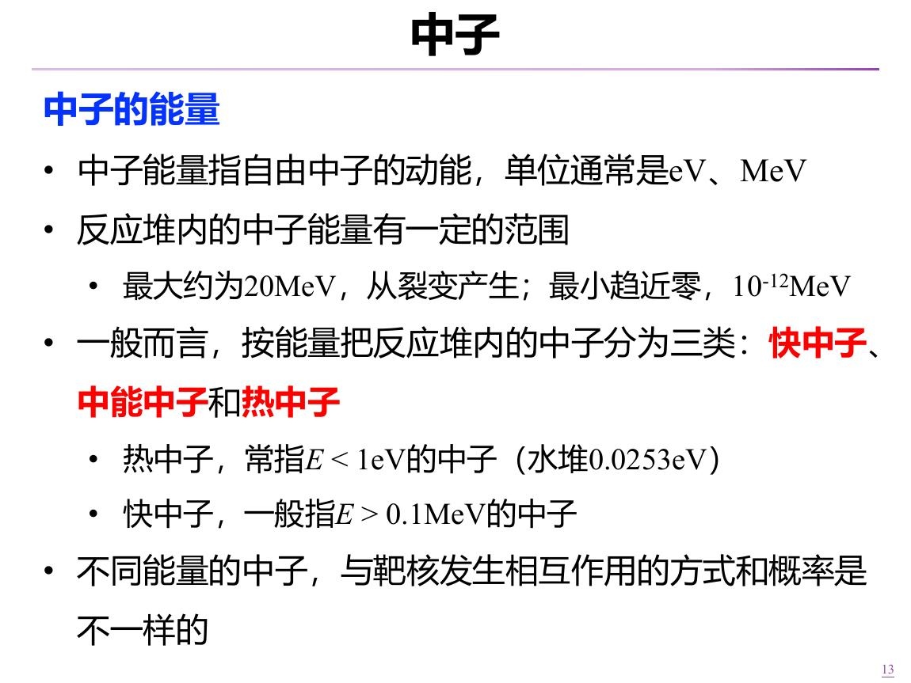

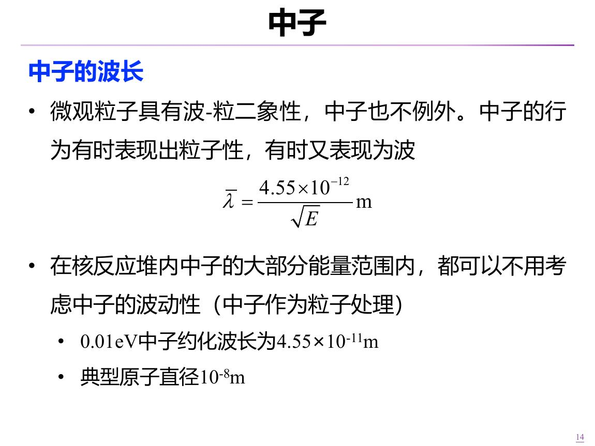

自测：约化波长公式中E写成MeV数值能直接代入吗？

不能。系数对应E以eV计；先换单位，否则平方根会带来数量级错误。

[回到教师讲解](Transcript_Corrected.md#T20) · [来源与覆盖](Lecture_Source_Map.md)

## 9. 铝-27完整例题：质量亏损到平均结合能

原子核由质子与中子组成，但其静质量不等于所有自由核子静质量的简单总和。按核质量定义：
\[
\Delta m=Zm_p+Nm_n-m_{\rm nucleus},\quad B=\Delta m c^2,\quad \bar B=B/A.
\]
形成束缚体系时释放能量；反过来要把它完全拆成自由核子，就要供给相应的能量。不是质量无故消失，而是系统能量状态变化。

**课堂例题：** 铝-27含13个质子、14个中子。课件给分离核子总质量27.2159u，核质量26.9744u：
\[
\Delta m=(27.2159-26.9744)\,\mathrm u=0.2415\,\mathrm u,
\]
\[
B=0.2415\times931.5\,\mathrm{MeV}=224.95725\,\mathrm{MeV}\approx225\,\mathrm{MeV},
\qquad \bar B=224.95725/27\approx8.33\,\mathrm{MeV/核子}.
\]
课件取近似数，末位精度不应过度解释。总结合能225 MeV与每核子8.33 MeV是同一体系的两种量，不能把后者当成拆散整个核所需能量。

**教材补充与核查提醒：** 第14稿p.25给质量亏损定义，p.26–27给比结合能。该稿p.26铀例题出现把235.043928u标为核质量并算出1736.9 MeV的情况，与同稿表中铀-235约1783.8 MeV不一致，涉及原子/核质量口径；本讲不使用该例数字校正铝例，也不因为“教材有式子”就免除量纲与口径核查。

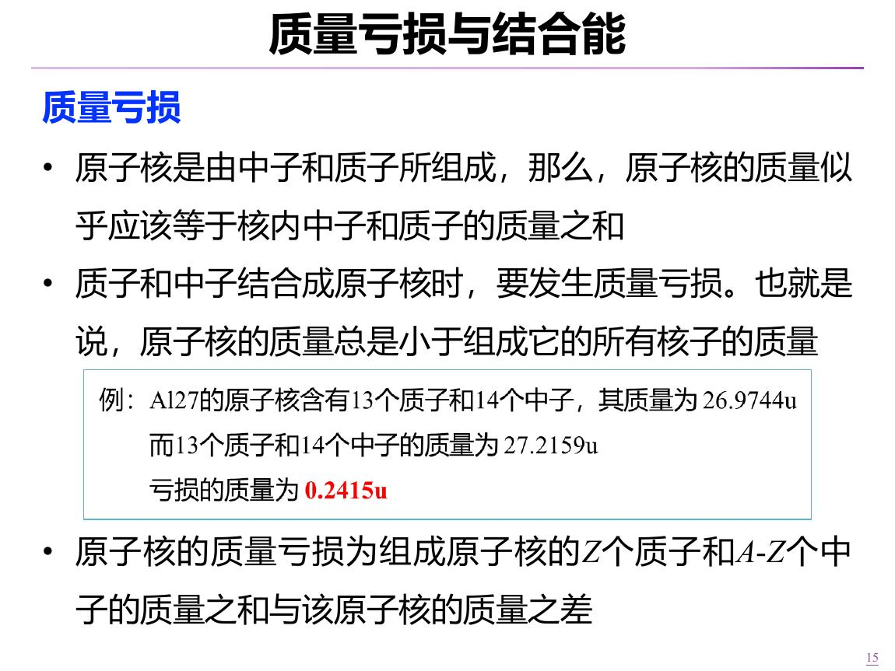

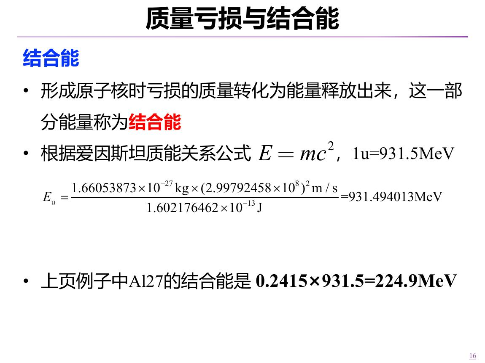

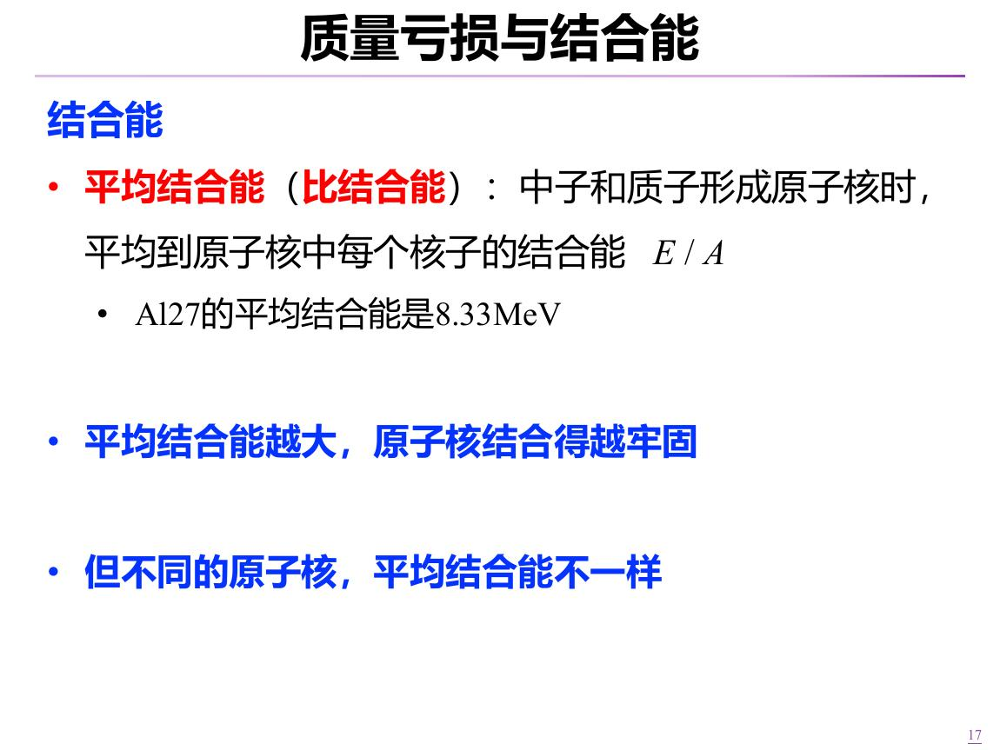

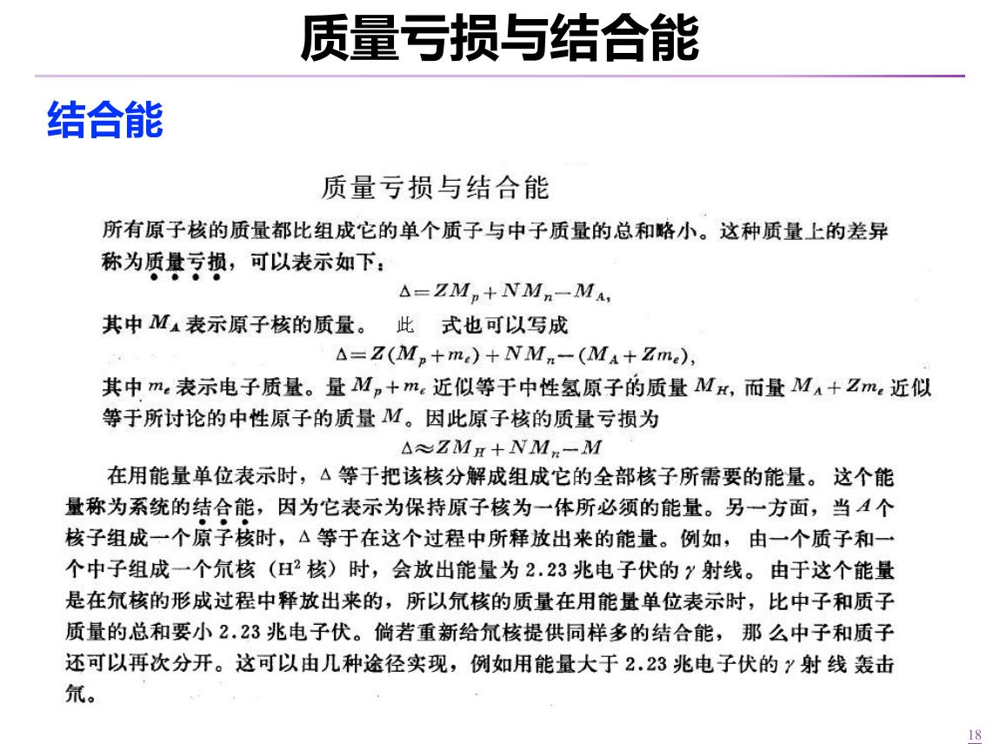

自测：用原子质量代替核质量直接放进Zmₚ+Nmₙ−m会怎样？

会把电子质量计入不一致的位置。要统一核质量，或采用电子贡献正确抵消的原子质量公式；不能混用。

[回到教师讲解](Transcript_Corrected.md#T22) · [来源与覆盖](Lecture_Source_Map.md)

## 10. 比结合能曲线：放能趋势与反应条件分开

教师建议从数据表画图寻找规律：横轴质量数A，纵轴每核子结合能。轻核部分起伏上升，中等质量附近较高，重核部分缓慢下降。图能解释为什么轻核聚变与重核裂变可能放能，但“平均结合能大”不等同于对任意衰变通道都稳定。

课堂用铁-56表示峰值位置。正文采用“铁附近的高结合区域”这一曲线尺度，不将精确峰值核素的简化表述当作查表结论。PPT/教材表格中另有若干总量和平均量不相容的项，图只用于总体趋势，具体反应计算必须回到可靠质量数据。

典型DT反应 \({}^2\mathrm H+{}^3\mathrm H\to{}^4\mathrm{He}+n+17.6\,\mathrm{MeV}\)。裂变示例在PPT p.21为 \({}^{235}\mathrm U+n\to{}^{93}\mathrm{Rb}+{}^{140}\mathrm{Cs}+3n\)，质量数236=93+140+3、电荷92=37+55；原转写“两 个氢核”据课件订为两个中等质量裂片。示例不是唯一裂变通道。

PPT p.23用近似结合能809、1176与1786 MeV作比较，差 \(809+1176-1786=199\) MeV；只是图示的粗估值，不能替代实际反应能分配。

**课堂思考题一：是不是任何轻核聚变或重核裂变都放能？** 教师要求继续思考，没有给出逐通道答案。补充推导：按反应前后完整质量账，\(Q=(\sum m_{\rm in}-\sum m_{\rm out})c^2\)，仅Q>0时为放能；趋势图不能代替具体比较，放能也不保证容易发生。

**课堂思考题二：低能中子为什么能使铀-235裂变，不必先提供整个核的结合能？** 教师提示是吸收中子形成铀-236后改变状态。补充解释：裂变并不是把所有核子完全拆开，终态仍是束缚的核；形成复合核的激发也不只由入射动能决定。因此不能把“每核子结合能”当作入射中子必须跨过的统一动能门槛。此处不提前代入本章后续尚未讲的详细裂变模型。

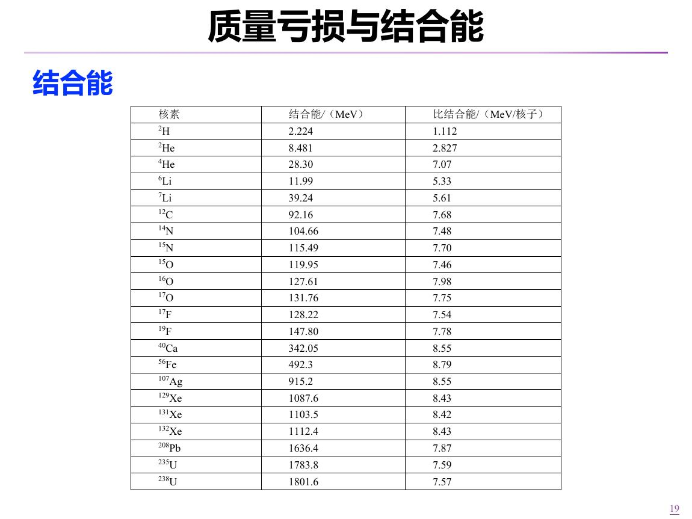

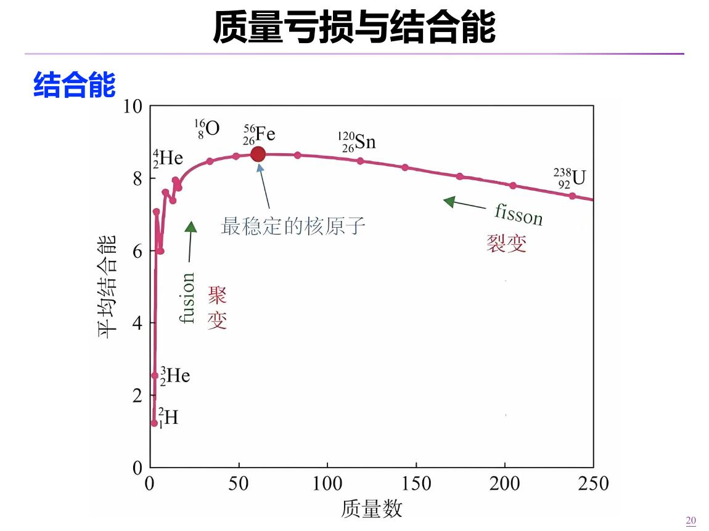

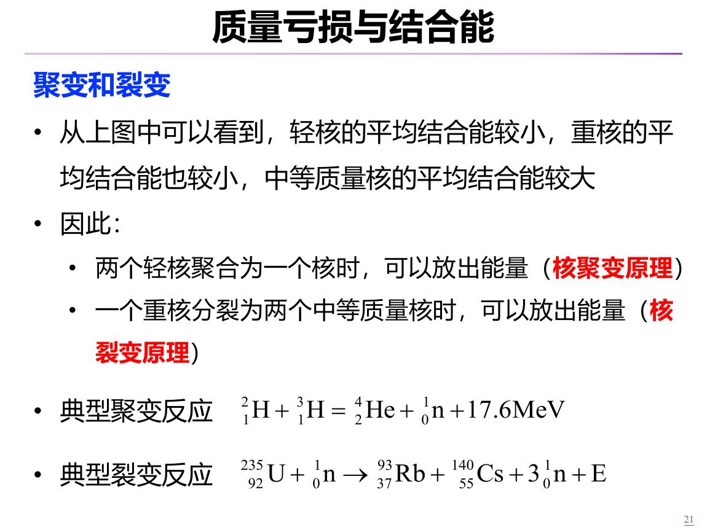

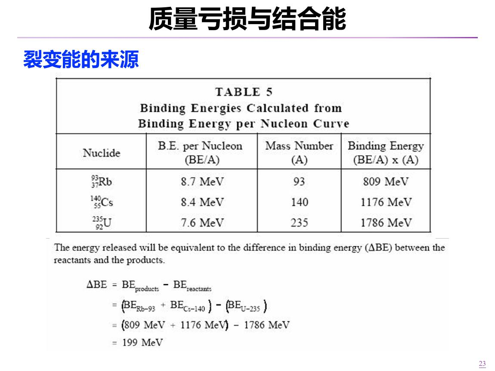

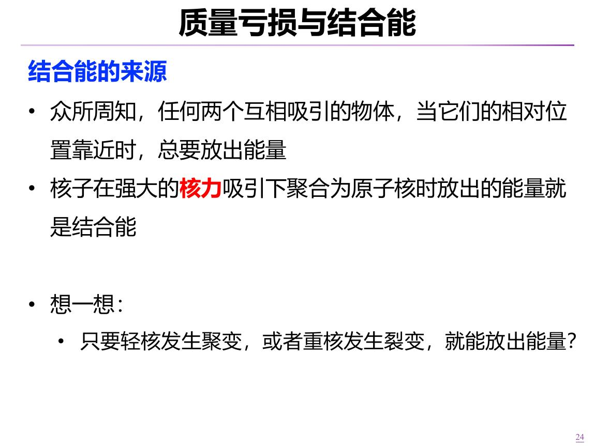

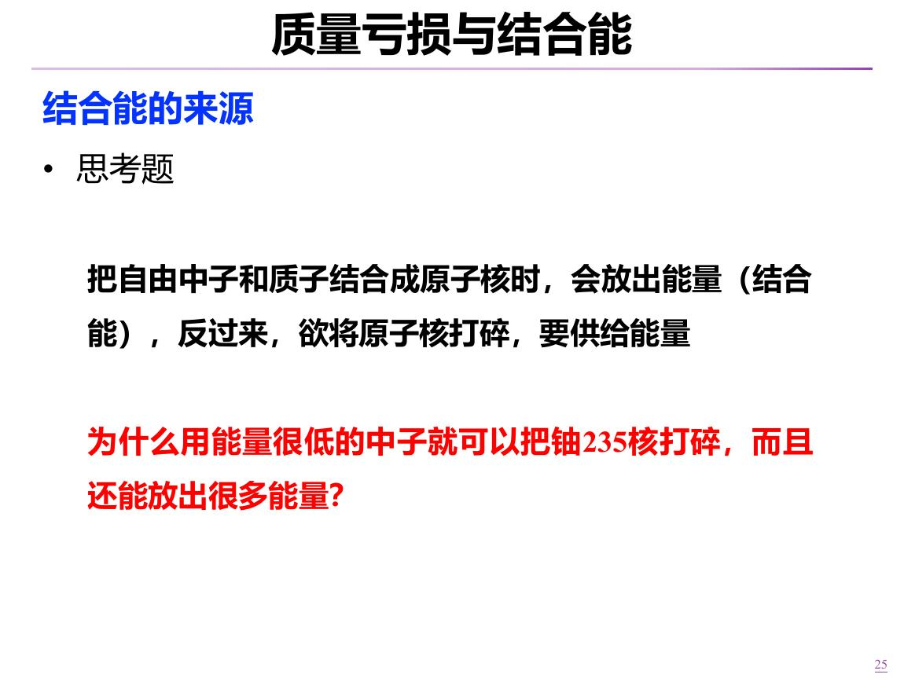

自测：放能与容易发生，是同一个判断吗？

不是。Q值决定能量收支，反应势垒、相互作用概率和具体条件决定是否能以足够速率发生。

[回到教师讲解](Transcript_Corrected.md#T23) · [来源与覆盖](Lecture_Source_Map.md)

## 11. 稳定核曲线与核力：课堂最后的读图问答

实际课堂在1:21:37后继续讲核稳定性，对应PPT p.26–28。横轴中子数N，纵轴质子数Z。若N=Z，点应落在45°线上；轻核稳定带接近这条线，较重核逐渐偏向N较大的方向。因此在这张坐标图上，重核稳定带落在N=Z线下方，而不是“中子更多所以纵坐标更高”。

有效课堂问答是观察曲线斜率和偏向：学生指出质量增加时曲线向中子轴偏，教师据此解释轻核N/Z接近1、重核约1.5的趋势。这些是近似趋势，不是给定N/Z就能唯一判断任意核素稳定的判据。PPT p.27以U-235举N/Z例，它本身并非严格稳定核，因此不能把图旁例子当成稳定性认证。

核内带正电质子之间存在库仑斥力，核子间短程吸引帮助形成束缚。课堂列核力强、力程短、近似电荷无关及饱和性：每个核子主要与邻近核子发生显著核力作用，不能与所有远处核子同样强地结合。随Z增大，需要更多中子帮助维持稳定带的结构，这是一种定性说明。

最后联系裂变：重核的中子质子比较大，分成中等质量裂片后通常偏离该质量范围的稳定带，呈富中子特征，因而会经历放射性衰变。原稿“天然都是不稳定”是课堂概括，本版用“典型初生裂片通常富中子且不稳定”说明趋势，不把近似N/Z守恒当成所有裂片性质的严格证明。

**教材补充：** 第14稿p.22–24也有核素/稳定带图，但p.23坐标横轴Z、纵轴N，与本讲p.26相反；同一趋势在两图中的“上方/下方”会改变。看图先读轴，是这节最值得留下的习惯。

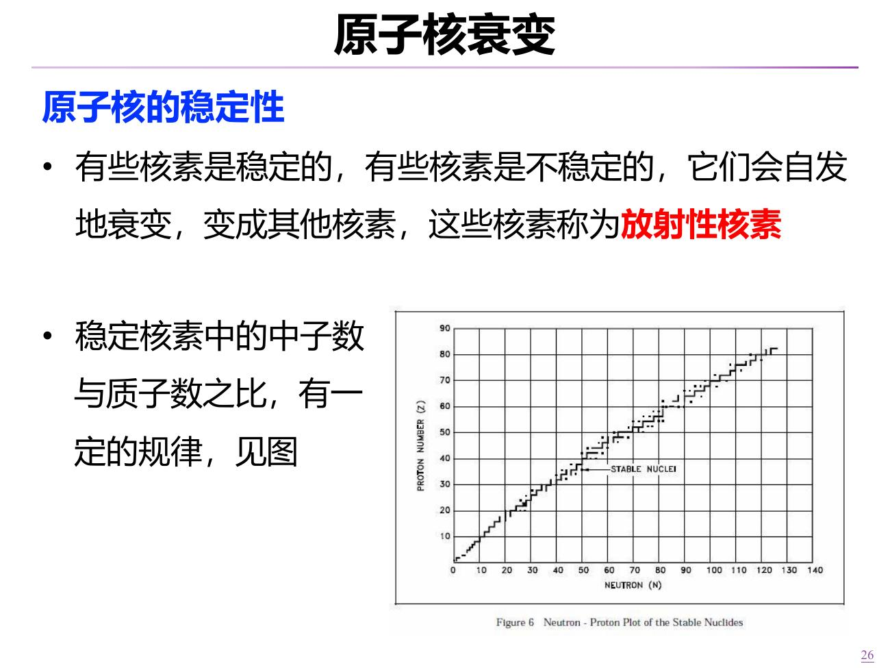

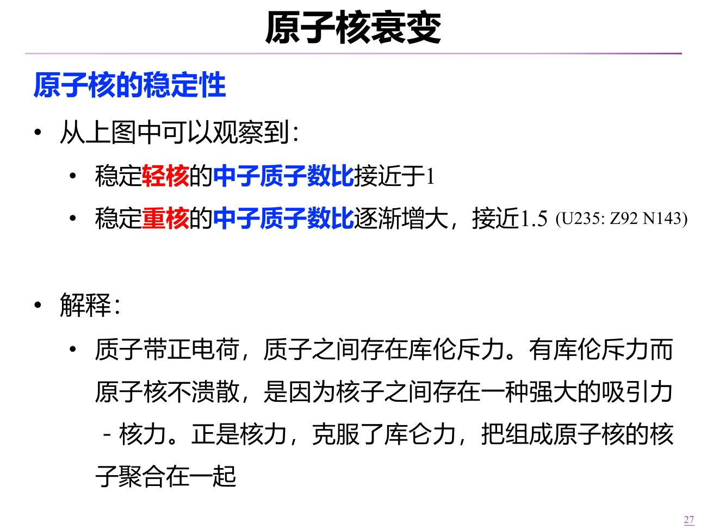

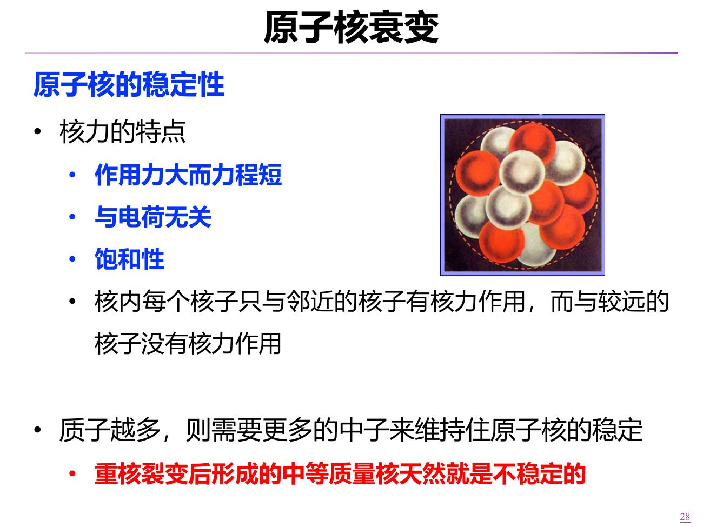

自测：教材图的稳定带在对角线上方，课堂图却在下方，是否矛盾？

先查坐标轴。教材p.23横Z纵N，本讲PPT p.26横N纵Z；互换坐标后，同一N>Z趋势会显示在另一侧。

[回到教师讲解](Transcript_Corrected.md#T25) · [来源与覆盖](Lecture_Source_Map.md)

## 12. 复习与教材入口：已经讲到哪里，尚未讲什么

本讲可以沿两条线复习。工程线：不同用途→约束与工具→热电转换→体积与燃料量→燃耗；物理线：核素记号→质量单位与核尺度→中子特征→质量亏损→比结合能→核稳定性。大作业要求单独保留，避免夹在公式里难以寻找。

教材原页：核素与丰度p.21、核素图及稳定性p.22–24、质量亏损p.25、比结合能p.26–27、中子及约化波长p.35、复合核示意p.36。**第14稿当前版的印刷页与PDF页相同**，相关页已核看并进入持久缓存；后续答疑先查索引再回页，不再从临时文件名猜测版本。

教材p.45开始第1章习题，其中第4题给“某核反应质量亏损0.01u，计算可能释放的能量”，可用作本讲公式练习的定位样例。它是教材实有题，**本次没有证据证明教师已布置此题**。这里不把全章习题自动变成本讲作业。

本章其余PPT p.29–344留给后续，不因文件已入库而算作课堂覆盖。关键待核听项包括原子尺寸单位、自由中子寿命、DT口述的中微子、铀裂变产物、变换单位及精确历史/政策数字。已给材料足以支持主线学习，尚不能证明教师每一个数字的原音与ASR相同。

[教材定位与缓存](../../Global/Textbook_Index.md) · [第14稿原题页](../../Global/Raw/核工程原理%20第14稿.pdf#page=45)

自测：为什么本章PDF有344页，本讲覆盖却只到28页？

课堂范围由转写的实际讲授确定，PDF只是整章资料包。后续页面尚未在本讲讲授，不计作本讲完成。

[来源与覆盖](Lecture_Source_Map.md)

