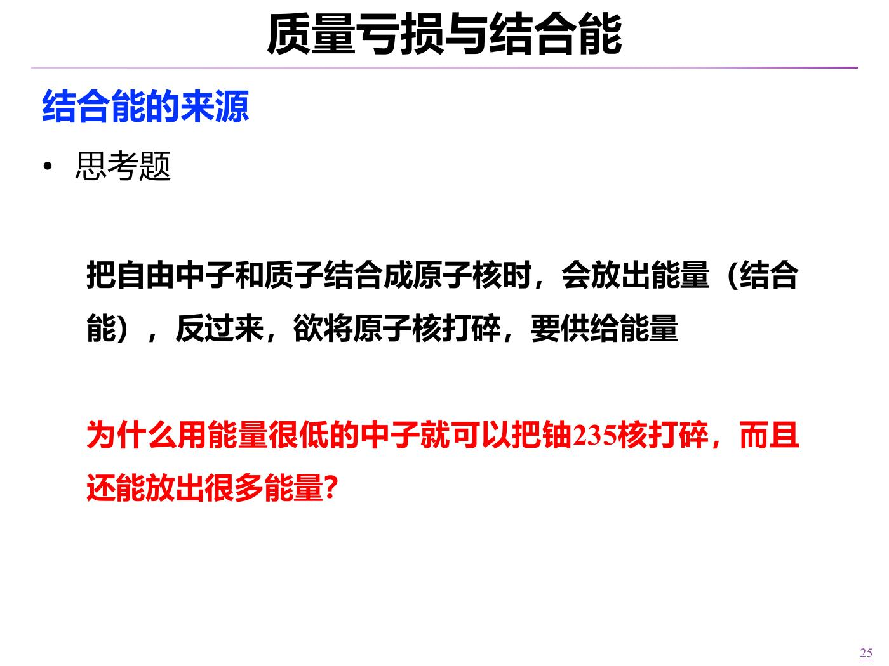
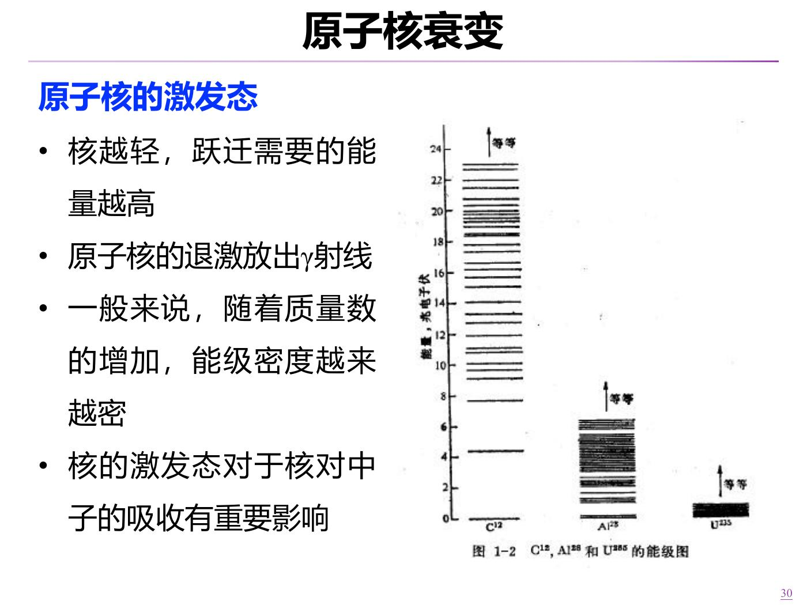
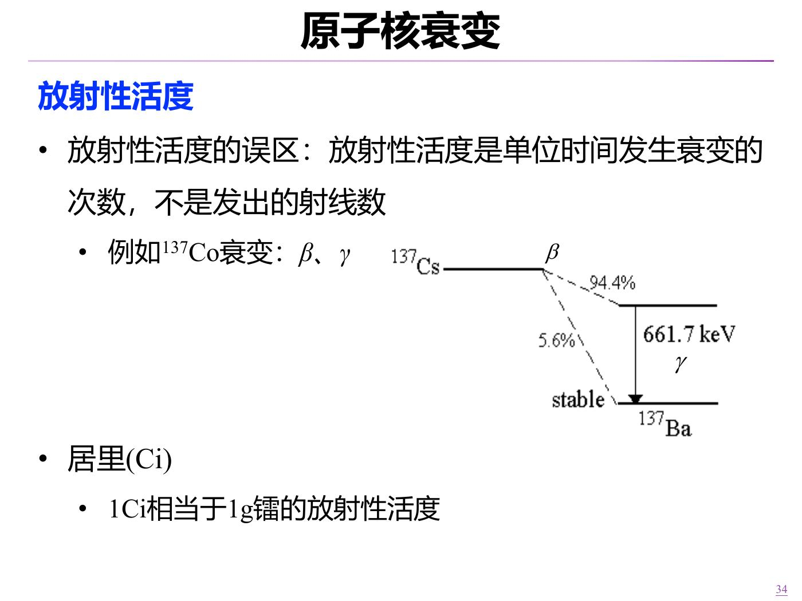
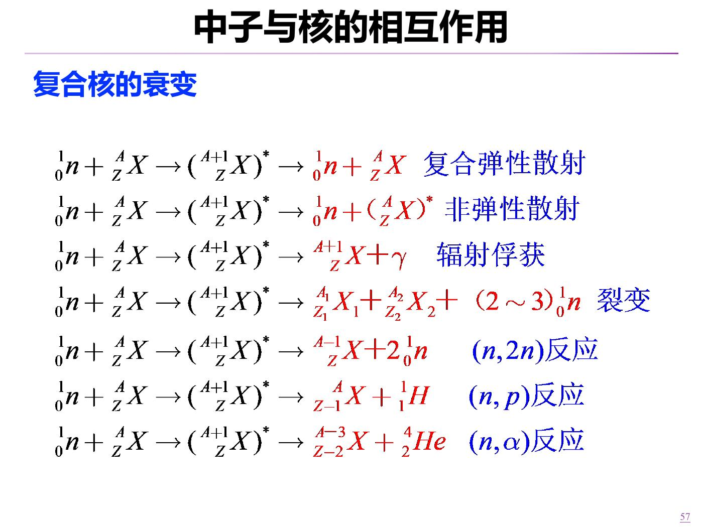
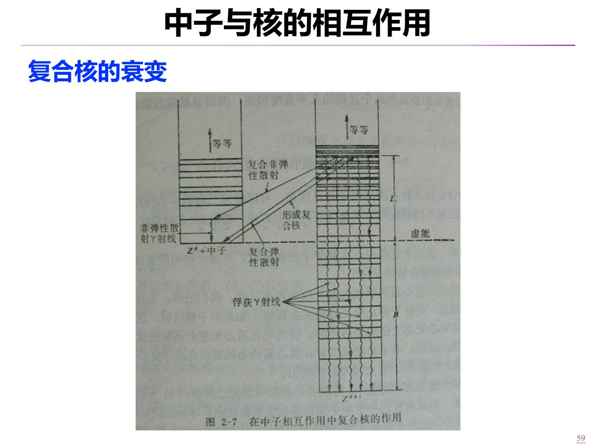
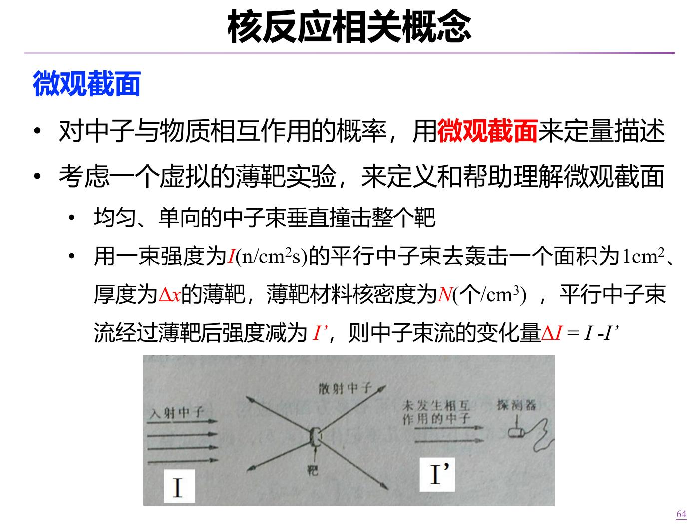
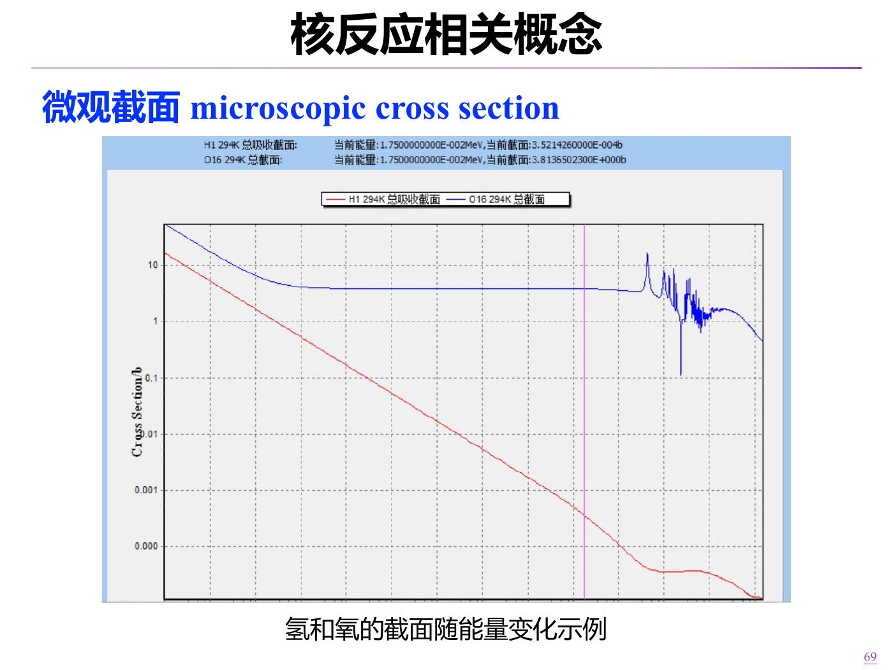
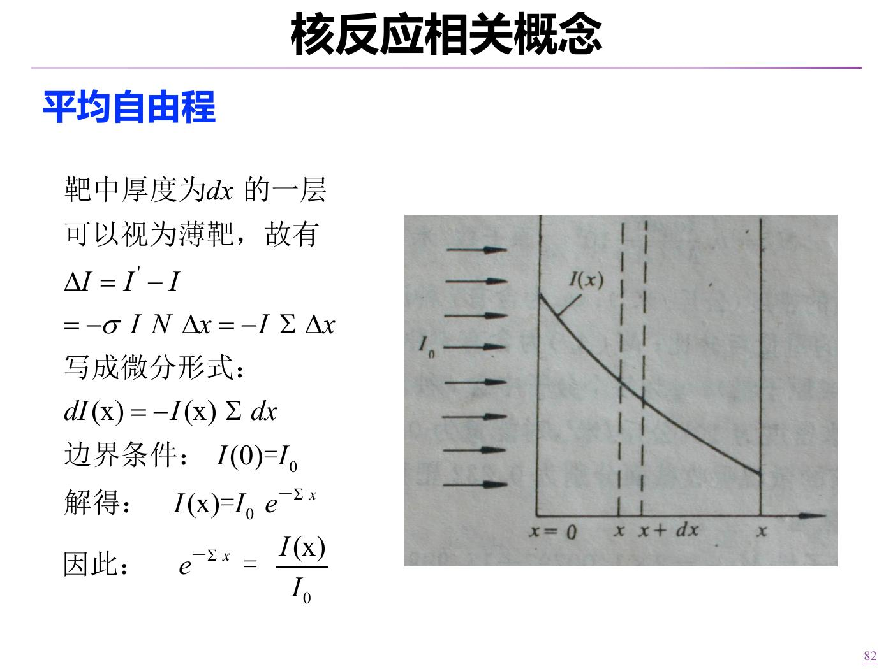

# 核物理基础续讲：衰变、中子核反应与截面

本讲依据2026年9月21日转写及配套录音整理，继续使用上一讲的《1.反应堆的核物理基础-上传版》：p.25–28为复习，p.29–85为本次主题范围。p.41、46是重复页，p.75–79是未逐题口述的补充例题；p.86及之后不列为已讲。时间仅来自转写锚点，原音尚未核听；已完成全文阅读、相关课件逐页看图与教材局部核验，状态为draft。

这一讲的主线是：先用“每单位时间的衰变概率”描述核素寿命，再用“每单位路程的碰撞概率”描述中子运动。两者都导向指数规律，但衰变常数、截面和平均自由程是不同物理量。

来源直接内容与课堂解释随主题列出；标为“补充推导／订正”的文字是编者说明，不冒充教师原话。完整的课堂顺序、问答和学习要求见[课堂回顾](Transcript_Corrected.md)，原稿冲突见[来源与订正](Lecture_Source_Map.md)。

## 1. 开场复习：低能中子为什么能诱发裂变

结合能是把自由核子组成一个核时释放的能量；反过来把这个核完全拆成自由核子，需要提供同样的能量。裂变却不是把所有核子逐个拆开，而是变为仍然结合着的裂片、若干中子等。因此，不能把原子核总结合能当作诱发裂变所需的入射动能。

课堂从中子与质子数之比、核力和核稳定性解释：核力作用强、力程短、有饱和性；重核的库仑斥力较大，稳定带通常偏向较高的中子/质子比。裂片通常偏丰中子，会继续衰变，其中有长寿命放射性产物。这里的“稳定带趋势”不能当作“每个核素都严格满足某个比值”的判据。

**教材补充与订正：**铀-235本身是长寿命放射性核素，不是严格稳定核。更完整的机制是

\[{}^{235}\mathrm U+n\longrightarrow{}^{236}\mathrm U^* .\]

复合核的激发能来自中子的质心系动能和结合进复合核所对应的中子分离能。即使入射动能很低，也不表示形成的复合核激发能很低。裂变是否发生还取决于能量条件和与其他反应道的竞争，不能由“多一个中子，所以一定裂开”推出；吸收以后也可能辐射俘获。详细反应道见[N09](#N09)。

自测：为什么无需用中子提供铀核全部结合能？

因为终态裂片仍有很大的结合能；裂变不是把核完全拆为自由核子。诱发过程应分析复合核的激发能与反应道，而不是与全部结合能简单比较。

来源：PPT25–28、55–59；G1教材PDF35–36；[T01–T02](Transcript_Corrected.md#T01)。

## 2. 基态、激发态与能级图

同一个核素可以处在不同能量状态。最低能量状态叫基态，较高的状态叫激发态。**基态不等于不发生放射性衰变**：它只是在该核素的能级序列中最低。激发态一般寿命较短；课件用碳、铝、铀的能级图展示，重核常有更密的能级。这是图示趋势，不是任意两种核素能级间隔的严格排序定律。

读图时沿纵轴比较激发能，水平线表示能级。右侧较密的线提示可能的能态较多，但**靶核的低激发能级**与**吸收中子后新形成的复合核能级**必须区分，不能用前者直接算后者的形成能量。

课堂问：同一核素从激发态退激到基态，为什么不放出一个质子或中子？答：若质子数、中子数都没变，就不是通过发射核子来完成的那条跃迁；课件讨论的是γ退激。γ也是光子。编者限定：核退激还有内转换等方式，“只能发γ”并非一般定理；γ与X射线也不能只按能量高低划界。本讲不展开这些支路。

自测：基态铀-235能否仍是放射性的？

可以。基态说明该核素内部能量最低；放射性稳定性还涉及能否转变为别的核素或核状态，两者不是同一问题。

来源：PPT29–30；G1 PDF35–37；[T03](Transcript_Corrected.md#T03)。

## 3. 指数衰变、半衰期与平均寿命

设\(N(t)\)是时刻\(t\)尚未衰变的某种母核数目，\(\lambda_d\)为衰变常数，单位\(\mathrm{s^{-1}}\)。下标d是本讲编者用来防止与自由程符号混淆的记号；课堂写作\(\lambda\)。在衰变常数不变、没有外来补充或其他移除的模型下，

\[\frac{dN}{dt}=-\lambda_d N,\qquad N(0)=N_0.\]

分离变量并积分：\(dN/N=-\lambda_d dt\)，所以\(\ln[N(t)/N_0]=-\lambda_dt\)，得到

\[N(t)=N_0e^{-\lambda_dt}.\]

负号表示数目减少；同样长的时间，减少的是相同比例，而非相同个数。常规课程模型把\(\lambda_d\)看作核素的固有参数，不因样品数量改变。

半衰期满足\(N(T_{1/2})=N_0/2\)，因而

\[T_{1/2}=\frac{\ln2}{\lambda_d}.\]

**补充推导：**平均寿命需用衰变时刻的概率密度\(f(t)=\lambda_de^{-\lambda_dt}\)加权，不是直接以\(N(t)\)当成衰变数：

\[\bar t=\int_0^\infty t\lambda_de^{-\lambda_dt}\,dt
=\left[-te^{-\lambda_dt}\right]_0^\infty+\int_0^\infty e^{-\lambda_dt}\,dt
=\frac1{\lambda_d}.\]

因此\(T_{1/2}=0.693\bar t\)，平均寿命更大。例如\(\lambda_d=0.02\,\mathrm{s^{-1}}\)，平均寿命50 s，半衰期约34.7 s。转写中直接说“\(N(t)t\)积分”的口述不完整，应以上述权重为准。

自测：经过两个半衰期还剩多少？半衰期是否表示每个核都活这么久？

还剩\(N_0/4\)。半衰期是大量同类核的统计量，单个核何时衰变是随机的。

来源：PPT31–32；[T04–T05](Transcript_Corrected.md#T04)。

## 4. 放射性活度：数衰变事件，不是数射线

单一核素样品的活度为单位时间发生的衰变数：

\[A(t)=-\frac{dN}{dt}=\lambda_dN(t),\qquad A(t)=A_0e^{-\lambda_dt}.\]

若样品含多种放射性核素，在同一时刻逐项相加：\(A_{\rm total}=\sum_i\lambda_iN_i\)。不能将不同核素的核数加在一起后随意乘一个衰变常数。

\[1\ \mathrm{Bq}=1\ \mathrm{s^{-1}},\qquad1\ \mathrm{Ci}=3.7\times10^{10}\ \mathrm{Bq}.\]

课堂以铯-137的β衰变及随后子核的γ退激说明：一次母核衰变可伴随后续射线发射，不能把β数、γ数简单相加作为铯-137的活度。若讨论包含子体的总样品活度，应另行声明计数口径。课件34、41页文字写“137Co”，但同页图明确标为137Cs，原稿18:37也有教师自我修正，正文采用铯-137。图上的分支比例仅保留为课件示意，不作为精确核数据使用。

自测：有两个核素，各自活度100 Bq和200 Bq，总活度是多少？

在同一时刻、相同计数口径下为300 Bq。探测器的计数率不一定等于300次/s，还涉及发射分支、探测效率等；本讲公式算的是衰变率。

来源：PPT33–35、41；[T06–T07](Transcript_Corrected.md#T06)。

## 5. 人体钾-40活度算例与丰度的口径

题设：体重75 kg，钾质量占0.2%，天然钾中钾-40原子丰度为0.0117%，半衰期\(1.277\times10^9\)年。这里是在复算课堂给定模型，不是对具体个人的测量结果。

先找衰变常数：

\[\lambda_K=\frac{0.693}{1.277\times10^9\times365\times86400}
\approx1.721\times10^{-17}\ \mathrm{s^{-1}}.\]

钾的总质量为\(75000\times0.002=150\) g。按课件采用40 g/mol作近似，并把丰度近似用于质量分配，

\[N_{40}\approx\frac{150\times0.000117}{40}\times6.02\times10^{23}
\approx2.641\times10^{20},\]

\[A_K=\lambda_KN_{40}\approx4.55\times10^3\ \mathrm{Bq}.\]

**课堂已提出的近似问题：**丰度是原子数比例，不能无条件当成质量比例。严格按原子丰度\(x_{40}\)计算，应先用天然钾平均摩尔质量\(\bar M_K\)求总钾原子数：

\[N_{40}=\frac{m_K}{\bar M_K}N_Ax_{40}.\]

课件用40代替平均摩尔质量是数量级估算。讲义保留约4500 Bq这一课堂结果，同时把近似条件写清，避免把近似步骤当成通用方法。

课堂另给：人体含18%碳，碳-14丰度\(1.2\times10^{-12}\)，半衰期5730年，要求课后加入碳-14计算总活度；课件给出的参考总量约7900 Bq。此题保留为作业，不在此默认代做完整解答。关键思考是：核数虽少，衰变常数却大得多，也能贡献显著活度。

自测：为什么求Bq时不能把半衰期直接代入“年”？

Bq要求每秒衰变次数，\(\lambda\)必须换成\(\mathrm{s^{-1}}\)。若保留年，算出的是每年的衰变数，单位并非Bq。

来源：PPT36–37；[T08–T10](Transcript_Corrected.md#T08)。

## 6. 碳-14断代：从活度比求时间

课堂模型假设活体植物与环境持续交换碳，初始\(^{14}\mathrm C/{}^{12}\mathrm C=1.2\times10^{-12}\)；死亡后停止交换，仅发生衰变。题设古木每克碳活度为3.5次/min，碳-14半衰期5730年。

每克活体碳的总原子数近似为\(N_A/12\)，因此

\[N_{14,0}\approx\frac{6.022\times10^{23}}{12}\times1.2\times10^{-12}
=6.022\times10^{10},\]

\[\lambda_C=\frac{0.693}{5730\times365\times24\times60}
\approx2.301\times10^{-10}\ \mathrm{min^{-1}}.\]

于是\(A_0\approx13.8\)次/min，利用\(A/A_0=e^{-\lambda_Ct}\)：

\[t=\frac{T_{1/2}}{\ln2}\ln\frac{A_0}{A}\approx1.13\times10^4\ \text{年}.\]

课件写11343年；使用13.8这一已舍入中间值会略有差别，不应强求末位一致。测得的是碳的交换停止时间，在本题理想条件下据此估计年代；实际样品污染和初始比例变化不在本算例中处理。

课堂讨论恐龙化石：经过极多半衰期，原始碳-14已少到不适合该方法，还必须判断样品是否保存待测的原始碳。不能只因为“物体古老”就套公式。关于裹尸布的历史趣谈保留在整理稿，不把未核实年代写为事实。

自测：若活度是初始的四分之一，推得年代是多少个半衰期？

两个半衰期，因为\(1/4=(1/2)^2\)。

来源：PPT38–40；[T11–T12](Transcript_Corrected.md#T11)。

## 7. 射线、丰度与铀钍的长期衰变

课件42页比较射线的物理组成：α为氦原子核，β为电子或正电子，γ为光子，中子射线为运动的中子，质子为氢原子核。带电粒子能直接电离；光子和中子主要通过产生次级带电粒子间接电离。贯穿能力依粒子能量和介质而变，课件给出的是定性比较，不能由“电离本领弱”推断生物效应小，也不能由皮肤能阻挡某些α粒子推出一般照射无害。本节不提供实际屏蔽厚度或操作方案。

### 原子数比例与质量比例

按本课程约定，铀-235丰度\(\omega\)是铀中原子数比例，富集度\(\varepsilon\)采用质量比例。忽略微量铀-234并用235、238近似摩尔质量：

\[\varepsilon=\frac{235\omega}{235\omega+238(1-\omega)},\qquad
\omega=\left[1+\frac{235}{238}\left(\frac1\varepsilon-1\right)\right]^{-1}.\]

因为235比238轻，相同的原子数份额对应稍小的质量份额。课件0.72%与0.712%是近似列值；不要当作精确互算后的全部有效数字。平均摩尔质量可写为

\[\bar M=235\omega+238(1-\omega)
=\left(\frac{\varepsilon}{235}+\frac{1-\varepsilon}{238}\right)^{-1}\ \mathrm{g/mol}.\]

这里质量份额对应调和式，原子份额对应算术式，不可互换。

### 长寿命不等于稳定

课件给铀-235、铀-238、钍-232半衰期约\(7.1\times10^8\)、\(4.5\times10^9\)、\(1.4\times10^{10}\)年，解释它们为何今天仍存在。在仅考虑自然衰变的封闭模型中，

\[\frac{N_{235}(t)}{N_{238}(t)}=
\frac{N_{235}(0)}{N_{238}(0)}e^{-(\lambda_{235}-\lambda_{238})t}.\]

因为\(\lambda_{235}>\lambda_{238}\)，铀-235比例随漫长时间减小。几十年的工程尺度上，两者自身衰变引起的变化很小；这不意味着可忽略运行中的燃耗和中子反应。

自测：已知质量份额时，能直接对235与238做算术平均吗？

不能。应先由质量除以各自摩尔质量得到物质的量，再求总质量/总物质的量，即上述调和形式。

来源：PPT42–46；[T13–T15](Transcript_Corrected.md#T13)。

## 8. 链式反应与中子收支

一次裂变会释放若干中子，但这些中子并非全部引起下一次裂变：有的泄漏，有的被非燃料材料吸收，有的在燃料中发生非裂变吸收，也会散射改变方向和能量。因此，“一次产生2–3个中子”不足以证明链式反应能够自持。

课堂给出的临界描述是每一代中子数保持不变，或稳态时中子产生率与消失率平衡：

\[\text{裂变等产生率}=\text{吸收率}+\text{泄漏率}.\]

这里强调的是反应堆内中子数的收支。散射通常不消灭中子，但会改变它的能量、位置与方向，进而影响后续吸收和泄漏。在窄束实验里散射却会移除“未碰撞束”，两个计数对象不能混淆。课件用不可控增长作形象类比，不由此把反应堆的功率增长等同于核爆炸。

自测：被散射出原方向的中子是否一定从反应堆中消失？

不是。它离开原束流方向，但可能仍在堆内继续运动。堆内总中子收支与未碰撞束流收支不同。

来源：PPT47–52；[T16–T18](Transcript_Corrected.md#T16)。

## 9. 势散射与复合核：按机制和按结果分别分类

按本讲主要机制分为势散射、复合核形成与衰变；教材35页还列直接相互作用，所以“两种机制”是课程当前简化，不是全部核反应机制的穷尽分类。

**势散射**中，中子受核表面势作用而散射，不形成复合核，靶核内能不变。中子与靶核**系统的**总动能、总动量守恒，属于弹性散射；中子自己的动能却可以传给靶核。这正是弹性散射能够慢化中子的原因。任何能量的中子均可能发生，不等于各能量发生概率相同。

**复合核**由\(n+{}^A_ZX\to({}^{A+1}_ZX)^*\)形成，随后存在多种出口。形成时“吸收进复合核”是中间过程，不意味着最终反应必定归为吸收。

| 最终反应道 | 最终余核与出射粒子 | 判别要点 |
|---|---|---|
| 复合弹性散射\((n,n)\) | 原核素回到原内能态，出射中子 | 内能不变，系统动能守恒 |
| 非弹性散射\((n,n')\) | 原核素处在激发态，出射中子 | 部分动能变成内能，有激发阈能 |
| 辐射俘获\((n,\gamma)\) | 质量数增1的核与γ | 与裂变不同的吸收道 |
| 裂变\((n,f)\) | 裂片、若干中子等 | 入射中子被吸收，同时另有中子产生 |
| \((n,2n)\) | 质量数为\(A-1\)的余核、2个中子 | 中子倍增，收支必须单独记账 |
| \((n,p)\) | 质量数\(A\)、电荷数\(Z-1\)的余核、质子 | 核子数、电荷守恒 |
| \((n,\alpha)\) | 质量数\(A-3\)、电荷数\(Z-2\)的余核、α | 同样由守恒关系判别 |

第二张图把靶核与复合核的能级并列。进入复合核的能量包含结合贡献，出口可以回到原核素，也可以形成新核或裂片。读图时先看质量数，再看星号与出口粒子，不能把所有箭头都称为同一种“退激”。

自测：弹性散射是否意味着中子能量不变？

不意味着。守恒的是中子与靶核系统的总动能；两者之间可以重新分配动能。势散射与复合弹性散射又是两种不同机制。

来源：PPT53–59；G1 PDF29、35–38；[T19–T21](Transcript_Corrected.md#T19)。

## 10. 能级宽度与寿命

复合核激发态的寿命常用能级宽度\(\Gamma\)描述：

\[\Gamma=\hbar\lambda_d,\qquad\bar t=\frac{\hbar}{\Gamma}.\]

\(\hbar\)的量纲为能量乘时间，因而\(\Gamma\)的量纲是能量；宽度越大，衰变率越大，平均寿命越短。这里的宽度是与有限寿命相关的能量展宽，**不是两个能级之间的能量差**。

不同出口对应分宽度，课件给出

\[\Gamma=\Gamma_\gamma+\Gamma_n+\Gamma_f+\Gamma_p+\Gamma_\alpha+\cdots.\]

补充推导：在各出口以常数衰变率竞争的模型中，\(\lambda_d=\sum_i\lambda_i\)，乘以\(\hbar\)就得到总宽度为分宽度之和；相应分支比\(b_i=\Gamma_i/\Gamma\)。不能仅凭“跃迁能量更大”断定某支路的概率一定更大。

自测：总宽度加倍，平均寿命如何变化？

按\(\bar t=\hbar/\Gamma\)，平均寿命减半。这里不涉及把能级差加倍。

来源：PPT60–61；[T22](Transcript_Corrected.md#T22)。

## 11. 核密度、束流强度与薄靶实验

后半堂的\(N\)改指**单位体积内的靶核数**，单位\(\mathrm{cm^{-3}}\)，不是前半堂整个样品的核数。平行束流强度\(I\)是每秒垂直穿过单位面积的中子数，单位\(\mathrm{cm^{-2}s^{-1}}\)。单位中的n仅提示“中子”，不是再乘一个中子密度。

用均匀、单向、同一能量的中子束垂直照射厚度\(\Delta x\)的薄靶，只统计透过的未碰撞束\(I'\)，把正的减少量定义为\(\Delta I=I-I'\)。在材料和中子能量给定时，入射越多、靶核密度越大、厚度越大，发生相互作用的机会越多：

\[\Delta I\approx\sigma IN\Delta x,\qquad N\sigma\Delta x\ll1.\]

“薄”是指沿厚度束流衰减很小，靶内各位置受到的入射强度近似相同，不是必须在几何上只有一层原子。

图中后方探测器统计未碰撞束；散射和吸收都会使中子退出这个统计对象。在保持总截面不变时，只改变散射/吸收的分配比例不改变未碰撞束的移除总量。课堂用连续角分布说明“恰好沿原方向”这一单点的概率为零；实际探测器有有限接收角，可能收进散射中子，因此实验条件仍需说明。

自测：为什么厚靶不能直接用全厚度乘\(N\sigma I_0\)？

因为越往后未碰撞入射束越弱，不能给各层都使用同一个\(I_0\)。应分成微元，对局部束流写微分方程。

来源：PPT62–65；[T24–T27](Transcript_Corrected.md#T24)。

## 12. 微观截面：有面积量纲的相互作用度量

从薄靶关系得到

\[\sigma\approx\frac{\Delta I/I}{N\Delta x}.\]

分子是碰撞份额，分母\(N\Delta x\)是靶核面密度，单位\(\mathrm{cm^{-2}}\)，不是无单位的核总数。所以\(\sigma\)的量纲是面积。课堂取1 cm²截面积时面密度与该面积内核数的数值关联，但量纲仍不可丢。

\[1\ \mathrm b=10^{-24}\ \mathrm{cm^2}=10^{-28}\ \mathrm{m^2}.\]

微观截面是中子与单个核相互作用概率的一种度量，不是概率本身，也不是简单几何投影面积。给出核素、反应道和中子能量，截面才有明确含义。

常用下标：总截面t、散射s、吸收a、辐射俘获γ或c、裂变f。在当前散射/吸收的简化分类中\(\sigma_t=\sigma_s+\sigma_a\)，吸收包括俘获、裂变及适用的其他吸收道。**分类边界：**PPT68把\((n,2n)\)也列入“吸收”式，属于需澄清的反应道记账口径；本讲不把它当作中子净损失，后续输运中必须计入其倍增源，不能机械套用两项损失分解。

图中红线为氢的吸收截面、蓝线为氧-16总截面，比较的是不同反应道。低能区红线随能量升高而下降，蓝线高能区出现结构，说明截面具有能量依赖。原稿“10的20兆电子伏”为误识别嫌疑，不据此设定横轴终值；本图不作精确数据读取。

自测：截面100 b能否解释为反应概率100？

不能。截面有面积单位；还要结合靶核面密度等条件，才能求无量纲概率。

来源：PPT66–69；G1 PDF47；[T28–T30](Transcript_Corrected.md#T28)。

## 13. 宏观截面与有限距离概率

宏观截面将单核性质和材料核密度结合：

\[\Sigma=N\sigma,\qquad[\Sigma]=\mathrm{cm^{-1}}.\]

它是中子在介质中每单位路程发生相互作用的概率强度。在已存活到当前位置的条件下，走过微小距离\(dx\)发生碰撞的条件概率约为\(\Sigma dx\)。这不等于走过任意有限长度都可以线性相加。

课堂用\(\Sigma_a=0.25\,\mathrm{cm^{-1}}\)提问：“1 cm吸收25%，4 cm是否全部吸收？”答案是否定的。课件73、81页的25%只相当于线性近似。均匀、恒定截面、只考虑吸收的模型给出

\[P_a(0,L)=1-e^{-\Sigma_aL}.\]

所以1 cm内约22.1%，4 cm内约63.2%，都不是简单的\(0.25L\)。完整推导见[N15](#N15)。若有散射竞争，而问题问“第一次碰撞就是吸收并发生在L以内”，补充推导为

\[P_{\text{首次吸收}}(0,L)=\int_0^L\Sigma_ae^{-\Sigma_tx}\,dx
=\frac{\Sigma_a}{\Sigma_t}(1-e^{-\Sigma_tL}).\]

这与“经历若干次散射后最终被吸收”不是同一个问题。

自测：\(\Sigma_a=0.25\)对应4 cm这个数，应如何理解？

在上述恒定截面吸收模型中，4 cm是吸收自由程的平均值，不是每个中子的固定路程或最大路程。

来源：PPT70–73、81–85；G1 PDF48、52；[T31–T32](Transcript_Corrected.md#T31)。

## 14. 核密度与宏观截面的计算

纯核素材料，质量密度\(\rho\)用g/cm³、摩尔质量\(M\)用g/mol时，

\[N=\frac{\rho N_A}{M},\qquad\Sigma_r=N\sigma_r.\]

化合物摩尔质量为\(M_c\)，每个化学式单位含\(\nu_i\)个第i种原子，则\(N_i=\nu_i\rho N_A/M_c\)。若该元素还含不同同位素，应再乘各同位素原子丰度。已知混合物的核素质量份额\(w_i\)，则\(N_i=\rho w_iN_A/M_i\)。最后对相同能量、相同反应道相加：

\[\Sigma_r=\sum_iN_i\sigma_{r,i}.\]

### 课堂例1：水中的氢核密度

\(\rho=1\,\mathrm{g/cm^3}\)，\(M_{\mathrm{H_2O}}\approx18\,\mathrm{g/mol}\)：

\[N_{\mathrm{H_2O}}=\frac{1}{18}\times6.022\times10^{23}=3.346\times10^{22}\ \mathrm{cm^{-3}},\]

\[N_H=2N_{\mathrm{H_2O}}=6.691\times10^{22}\ \mathrm{cm^{-3}},\quad N_O=N_{\mathrm{H_2O}}.\]

“氢要乘2”是本例关键。原稿先说每立方米，随后自己明确为每立方厘米，应按后者与题设一致。

### 课堂例2：纯铀-235金属的宏观总截面

题设密度19 g/cm³，摩尔质量近似235 g/mol。转写先出现“780”，随后两次出现“700”，结果是34.1 cm⁻¹；课件本段没有发现这道口述题的明确题面，因此保留数字冲突，不断言原音说了哪个数。

\[N=\frac{19}{235}\times6.022\times10^{23}=4.869\times10^{22}\ \mathrm{cm^{-3}}.\]

若取700 b，则

\[\Sigma_t=4.869\times10^{22}\times700\times10^{-24}=34.08\ \mathrm{cm^{-1}}.\]

若取780 b，则为37.98 cm⁻¹。课堂给出的34.1与700 b分支自洽。这里的700 b只是算例输入，未给定中子能量，不把它当作铀-235在所有能量下的固定总截面。

### 课件补充例题的阅读方法

p.75–79含铝、钠、NaCl、铀同位素混合物、UO₂的英文算例，录音转写没有逐题讲解证据。它们分别练习纯材料核密度、化学计量数、质量份额和化合物内同位素分配。本讲保留原页供自读，不伪造教师推导。特别是UO₂，应先辨别给出的富集度是“铀中235的质量份额”，不能误当成“整个氧化物中235的质量份额”。

自测：为什么要先把barn换成cm²？

若\(N\)用cm⁻³，必须与cm²相乘才得到cm⁻¹。漏乘\(10^{-24}\)会造成24个数量级的错误；采用以\(10^{24}\,\mathrm{cm^{-3}}\)为单位的核密度时，也要明确数值约定。

来源：PPT74–80；G1 PDF49；[T33–T35](Transcript_Corrected.md#T33)。

## 15. 指数衰减与平均自由程的完整推导

对象是均匀介质中给定能量的未碰撞中子束，宏观总截面\(\Sigma_t\)沿路程不变。把厚靶拆成薄层，在x处写

\[dI(x)=-\Sigma_tI(x)dx,\qquad I(0)=I_0.\]

这里\(dI\)是带符号的变化量，小于零；前面定义的\(\Delta I=I-I'\)是正的减少量。课件82页改用了\(I'-I\)，所以必须同时改变符号，不能只抄一个负号。

积分得

\[I(x)=I_0e^{-\Sigma_tx},\qquad S(x)=\frac{I(x)}{I_0}=e^{-\Sigma_tx}.\]

\(S(x)\)是飞过x仍未碰撞的概率。它非负、从1单调下降；原转写“负的e的负…”不能使整个指数前再出现负号。

第一次碰撞发生在\([x,x+dx]\)内，必须先存活到x，再在后一小段碰撞：

\[p(x)dx=S(x)\Sigma_tdx=\Sigma_te^{-\Sigma_tx}dx.\]

\(p(x)\)是概率**密度**，单位长度倒数；\(p(x)dx\)才是小区间概率。连续分布在一个精确点的概率为零。归一化为\(\int_0^\infty p(x)dx=1\)。

平均自由程用\(\ell\)记（课堂用\(\lambda\)，勿与衰变常数混淆）：

\[\ell=\int_0^\infty xp(x)\,dx
=\int_0^\infty x\Sigma_te^{-\Sigma_tx}\,dx
=\left[-xe^{-\Sigma_tx}\right]_0^\infty+\int_0^\infty e^{-\Sigma_tx}\,dx
=\frac1{\Sigma_t}.\]

这就是由概率分布推得的平均值，而不是用“概率累加到1”猜出来的固定碰撞位置。类似可定义\(\ell_a=1/\Sigma_a\)、\(\ell_s=1/\Sigma_s\)；在二类模型中

\[\frac1\ell=\frac1{\ell_a}+\frac1{\ell_s}.\]

不能把平均自由程直接相加。若介质不均匀或沿轨迹能量改变，需改用局部截面并重新分析，当前常系数指数式的条件就不再直接满足。

**与前半堂对照：**时间上的存活\(e^{-\lambda_dt}\)对应路程上的未碰撞存活\(e^{-\Sigma_tx}\)；平均寿命\(1/\lambda_d\)对应平均自由程\(1/\Sigma_t\)。一个单位是时间，一个单位是长度。

自测：走过一个平均自由程后，多少中子尚未碰撞？

\(S(\ell)=e^{-1}\approx36.8\%\)。已至少碰撞一次的比例约63.2%，不是100%。

来源：PPT81–85；G1 PDF48、52–53；[T36–T38](Transcript_Corrected.md#T36)。

## 16. 课后任务与本讲边界

课堂明确要求：完成含碳-14的人体活度估算；复习化合物、混合物的核密度与宏观截面计算；阅读课件中的英文材料与网络学堂希腊字母表。教师鼓励围绕不懂的知识点与AI讨论，再和课本对照，把问题、回答和自己的判断放进讨论区；参与讨论可能计入成绩。另有自愿参与课程知识图谱梳理的大作业机会，实际报名和评分规则以课堂正式通知为准。

本讲没有确认教材具体习题号。可从[教材索引](../../Global/Textbook_Index.md)定位G1 PDF45第5题（两种铀同位素丰度随时间变化），这是复习关联题，不擅自标作本次指定作业，也不默认代做。公式条件可定位G1 PDF48式(2-3)、PDF52式(2-10)–(2-12)。

课件86页是平均自由程英文例题，当前转写在推导结束后即下课，未见讲解该题证据；87页以后的中子通量密度、反应率与平均截面留待后续讲次。课堂预告不等于已经完成授课。
