# 从中子通量到堆内重要核反应

上一讲用截面和平均自由程回答了“中子走多远才发生反应”。这一讲进一步问：每单位时间、每单位体积发生多少次反应？回答需要中子通量密度，再结合不同能量的截面与能谱。后半讲沿着“散射改变中子状态、吸收改变中子收支”的线索，认识四类主要反应和若干工程上重要的核反应。

[来源与订正](Lecture_Source_Map.md)

## 1. 接上讲：截面、平均自由程与一次计算

对指定核素、反应道和中子能量，微观截面 \(\sigma\) 衡量单个靶核的反应机会，单位靶 \(1\,\mathrm b=10^{-24}\,\mathrm{cm^2}\)。材料中第 \(i\) 种靶核的核密度为 \(N_i\) 时，宏观截面为

\[\Sigma=\sum_i N_i\sigma_i,\qquad [\Sigma]=\mathrm{cm^{-1}}.\]

均匀介质、固定能量与反应道下，平均自由程 \(\lambda=1/\Sigma\)。课堂回顾的天然铀例题直接给出总宏观截面 \(0.15\,\mathrm{cm^{-1}}\)，故 \(\lambda=6.67\,\mathrm{cm}\)；此时给出的密度 \(19\,\mathrm{g/cm^3}\)无需再用。若只给微观截面，才要先由材料组成和密度求 \(N_i\)。不同反应道须使用对应的 \(\Sigma\)：裂变自由程不能用总截面代入。

自测：已知宏观总截面，还要用密度重新算一次核密度吗？

不用。\(\Sigma_t\) 已包含靶核数目的影响，总平均自由程直接是 \(1/\Sigma_t\)。

[T01](Transcript_Corrected.md#T01) · [来源](Lecture_Source_Map.md)

## 2. 中子数密度与课堂思考题

中子数密度 \(n(\mathbf r)\) 是位置 \(\mathbf r\) 附近单位体积中的**自由中子**数，常用单位 \(\mathrm{cm^{-3}}\)。它不是材料原子核的核密度 \(N\)，也不包括束缚在原子核内的中子。裂变是堆内中子的主要来源；局部数量还受吸收、泄漏、迁移和时间变化影响，不能仅凭裂变率直接确定任意位置的 \(n\)。

课堂给出无限大、均匀、无泄漏反应堆的思考题：功率密度 \(100\,\mathrm{MW/m^3}\)，每次裂变平均放出 \(2.5\) 个中子，中子平均寿命 \(0.1\,\mathrm{ms}\)，求中子密度。教师提示还需知道每次裂变释放多少可用能量，未在课上公布答案。若以 \(E_f\) 表示这一能量，稳态下可先写裂变率密度 \(q_f=P_V/E_f\)，再按题设简化模型估计 \(n\approx\bar\nu q_f\ell\)，其中 \(\ell\) 为给定中子平均寿命。实际中须区分寿命的定义及损失机制，不能把 \(0.1\,\mathrm{ms}\) 直接当作“每个中子发生一次裂变”的周期。

自测：\(n\) 与 \(N\) 分别数什么？

\(n\) 数单位体积的自由中子；\(N\) 数单位体积的靶核。前者进入 \(\phi=nv\)，后者进入 \(\Sigma=N\sigma\)。

[T02](Transcript_Corrected.md#T02) · [来源](Lecture_Source_Map.md)

## 3. 中子通量密度：单位时间的径迹长度

若这一组中子速率均为 \(v\)，中子通量密度定义为 \(\phi=nv\)。从径迹长度看，它是单位体积内的中子在单位时间走过的总路程，单位为 \(\mathrm{cm^{-2}s^{-1}}\)。不论中子朝哪个方向运动，走过的距离都加到总量中，因此 \(\phi\) 是**标量**。它与沿指定方向穿过一个实际平面的净中子流密度不同；仅看二者相似的单位容易混淆。课程沿用“中子通量密度／通量”，教材使用“中子注量率”。

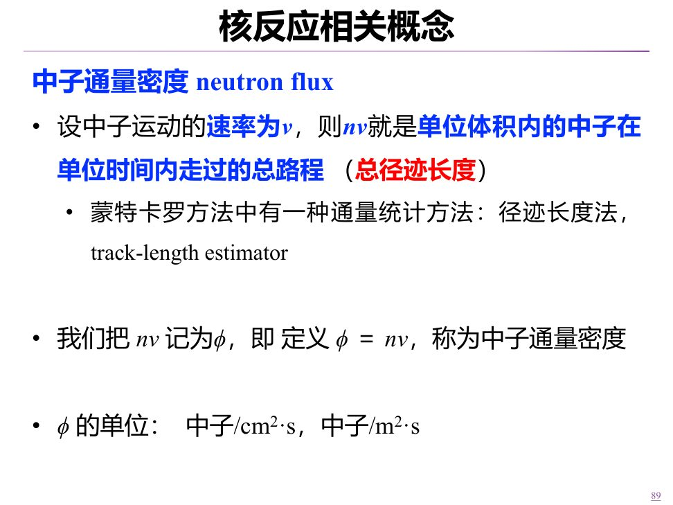

课堂算例中，\(v=2200\,\mathrm{m/s}=2.2\times10^5\,\mathrm{cm/s}\)，\(n=8\times10^8\,\mathrm{cm^{-3}}\)，所以

\[\phi=nv=1.76\times10^{14}\,\mathrm{cm^{-2}s^{-1}}.\]

这里的指数是 \(14\)；直接把 \(2200\) 当成 \(\mathrm{cm/s}\) 会少两个数量级。径迹长度统计法正是蒙特卡罗计算通量的一种方法。

自测：为什么各方向中子都有贡献，\(\phi\) 仍不是矢量？

定义累加的是每条径迹的**长度**，没有按方向投影并相减；相反方向的径迹都增加 \(\phi\)。

[T03](Transcript_Corrected.md#T03) · [来源](Lecture_Source_Map.md)

## 4. 从通量算反应率与功率

指定反应道 \(x\) 的反应率密度为 \(r_x=\phi\Sigma_x\)，单位 \(\mathrm{cm^{-3}s^{-1}}\)。它数单位体积、单位时间发生的该类反应次数。对于空间非均匀的堆芯，总反应率应积分：\(\mathcal R_x=\int_V r_x(\mathbf r)\,\mathrm dV\)。只有均匀近似下才可写成 \(\mathcal R_x=r_xV\)。若相同反应道的平均自由程为 \(\lambda_x=1/\Sigma_x\)，也有 \(r_x=\phi/\lambda_x\)。

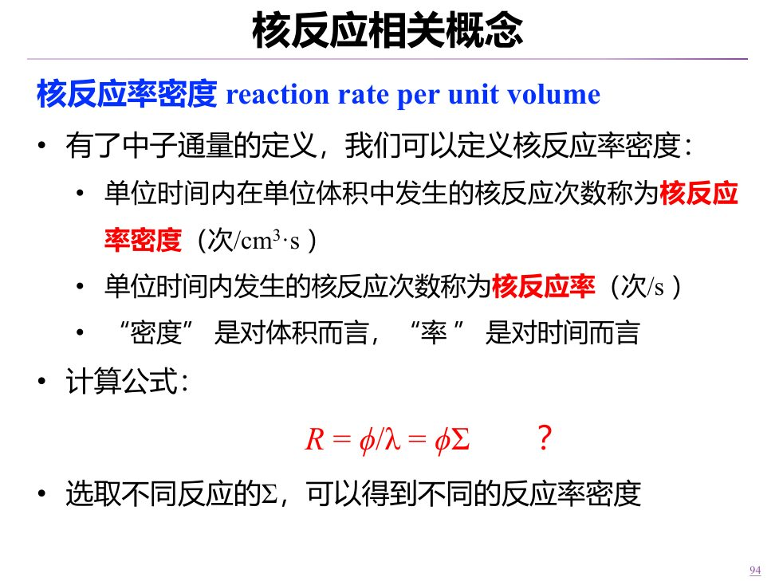

选总截面得到总反应率密度，选裂变截面得到裂变反应率密度。若以每次裂变沉积的可用能量 \(E_f\) 近似，功率密度可写为 \(P_V\approx r_fE_f\)。核数据给出相应截面；反应堆物理需要求中子通量在空间和能量上的分布，才能进一步算反应率、中子收支和功率。课堂提出“怎样提高高通量堆的通量”为课后思考，没有给出唯一方案。

自测：\(\phi\Sigma_f\) 是全堆每秒的裂变次数吗？

不是，它是局部单位体积、单位时间的裂变次数；还需对堆芯体积积分。

[T04–T05](Transcript_Corrected.md#T04) · [来源](Lecture_Source_Map.md)

## 5. 能谱与反应率等效的平均截面

堆内中子不是单能的。\(n(E)\,\mathrm dE\) 表示能量在 \(E\) 到 \(E+\mathrm dE\) 间的中子数密度，\(\phi(E)=v(E)n(E)\) 是相应的通量密度谱。两者有关联，却不是数值相同的谱：速率 \(v(E)\) 会随能量改变。总通量和某反应道的反应率密度为

\[\phi=\int_0^\infty\phi(E)\,\mathrm dE,\qquad r_x=\int_0^\infty\Sigma_x(E)\phi(E)\,\mathrm dE.\]

要用一个截面替代能量相关的 \(\Sigma_x(E)\)，平均后仍须给出相同反应率。因此定义

\[\bar\Sigma_x=\frac{\int\Sigma_x(E)\phi(E)\,\mathrm dE}{\int\phi(E)\,\mathrm dE},\qquad r_x=\bar\Sigma_x\phi.\]

积分区间必须前后一致；若只在某个能群平均，就只用该能群的通量。权重是通量谱，而不是简单按能量取算术平均。课件第 100–105 页的英文总结及宏观截面、自由程例题为课后自学。

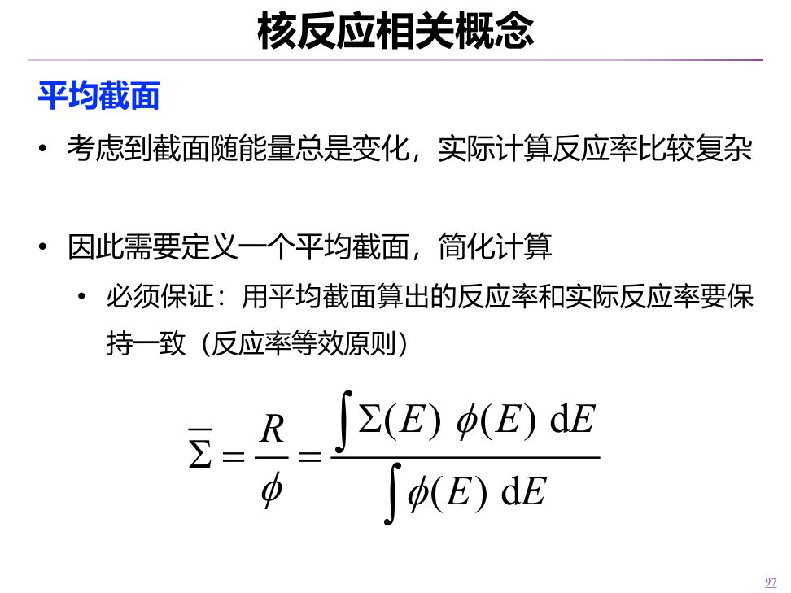

自测：为什么不能直接平均两个能量点的截面？

若两个能量段的通量不同，反应次数贡献就不同；直接算术平均通常不能保持 \(\int\Sigma(E)\phi(E)\,\mathrm dE\) 不变。

[T05–T06](Transcript_Corrected.md#T05) · [来源](Lecture_Source_Map.md)

## 6. 按反应结果分：散射和吸收

从机理看，课堂沿用上讲的**势散射**与**形成复合核的反应**。复合核形成后也可能再放出中子，因此这个机理分类不等于“散射／吸收”分类。按中子出射结果，散射包含弹性与非弹性散射；吸收包含辐射俘获、裂变、\((n,p)\)、\((n,\alpha)\) 等。对这些互斥反应道，总截面可拆为 \(\sigma_t=\sigma_s+\sigma_a\)，宏观截面也相同。这里的“吸收”按入射中子是否从原有中子群中移去分类，某些反应道还会产生次级中子，具体中子收支须逐道计算。

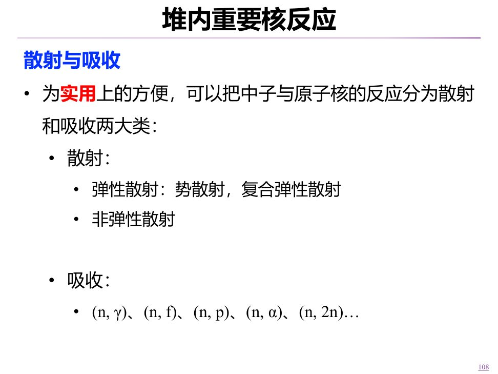

本讲重点是弹性散射、非弹性散射、辐射俘获和裂变。散射主要改变中子的方向与能量，进而改变空间分布；俘获移去中子，裂变在吸收一个入射中子后又产生新的中子，因此不能把裂变简单说成“只让中子消失”。

自测：形成复合核后又放出中子，一定属于吸收吗？

不一定。若仍有中子作为出射粒子，可能属于复合弹性散射或非弹性散射。

[T07](Transcript_Corrected.md#T07) · [来源](Lecture_Source_Map.md)

## 7. 弹性散射与裂变中子的慢化

弹性散射前后，中子与靶核**组成的系统**动量和动能都守恒，靶核内能不变。势散射可以发生在很宽的中子能区；复合弹性散射还受其形成条件影响。课堂用刚性球碰撞作直观模型。对初始近似静止的靶核，散射后的中子通常把一部分动能交给反冲核；轻核一次碰撞可能取得较多能量，重核的质量大，单次能量转移通常较小。

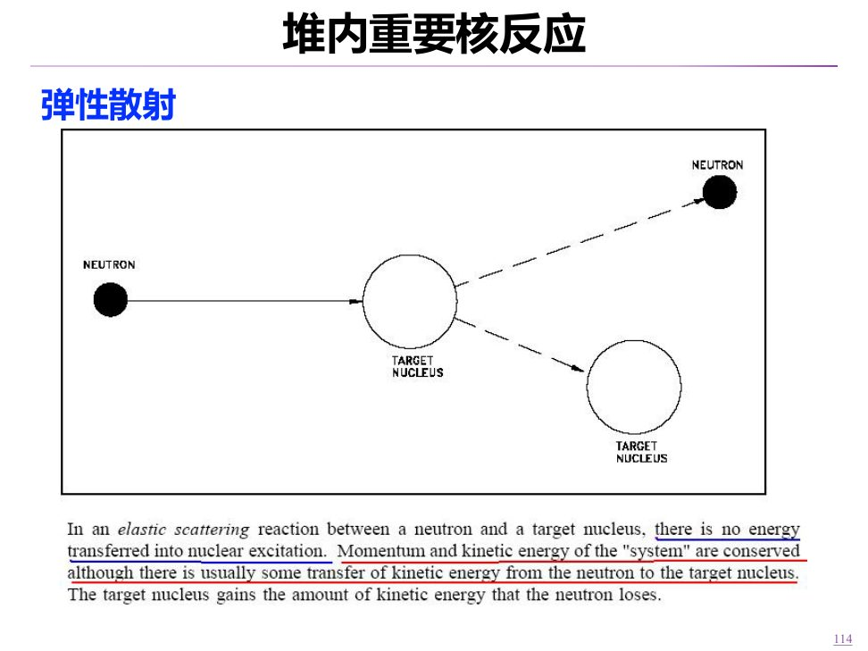

热中子指与周围介质热运动接近平衡的中子，并不是“温度很高的中子”。裂变中子经多次散射可慢化至热能区。这个过程解释了水等轻核材料为何能有效慢化，同时也提示快堆即使不专设慢化剂，仍会因燃料、结构材料和冷却剂的散射出现较低能中子。

自测：同等碰撞条件下，氢和铀哪个更容易让中子单次损失较多动能？

一般是氢。靶核质量与中子接近时，弹性碰撞可转移更大比例的动能；重核单次转移比例较小。

[T08](Transcript_Corrected.md#T08) · [来源](Lecture_Source_Map.md)

## 8. 非弹性散射：阈能、重核与快堆

非弹性散射中，入射中子与靶核作用，仍放出中子，但余核处于激发态；余核可随后发射 \(\gamma\) 射线退激。总能量和动量守恒，散射前后**动能**不单独守恒，因为一部分成为核的激发能。与弹性散射不同，它需要达到激发通道的阈能；精确阈值还要考虑反冲。课件和教材用 \(^{12}\mathrm C\) 的 4.43 MeV 与 \(^{238}\mathrm U\) 的 0.045 MeV 第一激发能作对比，说明重核较低激发能级为何使其高能中子非弹性散射更值得关注。

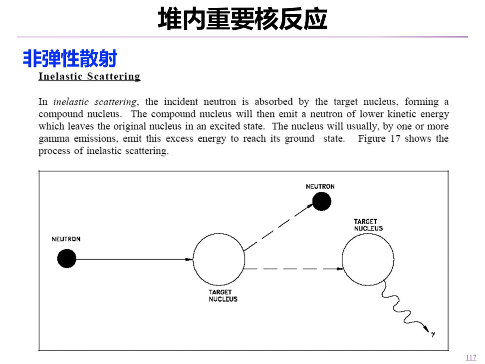

一次非弹性散射可使中子损失较多能量，但当能量降到阈能以下，该通道不能继续慢化。快堆低能中子还可能来自与氧、钠等核的弹性散射，以及堆外材料慢化后返回堆芯的中子；不能只用重核非弹性散射解释。课堂把具体来源留作开放思考。

自测：为什么非弹性散射不能独自把中子一直慢化到热能区？

中子低于相应激发通道的阈能后，该反应不能继续发生；后续能量变化还需其他反应过程。

[T09](Transcript_Corrected.md#T09) · [来源](Lecture_Source_Map.md)

## 9. 辐射俘获、活化分析与活化探测

辐射俘获 \((n,\gamma)\) 中，靶核吸收中子，形成的激发核通过发射 \(\gamma\) 射线退激。产物常具有放射性，材料由此被活化。活化既是辐射防护需要考虑的来源，也是制造同位素、分析成分和探测中子的手段。聚变和加速器场景也可能有中子及活化，课堂用它们说明不能只看最初射束的粒子种类。

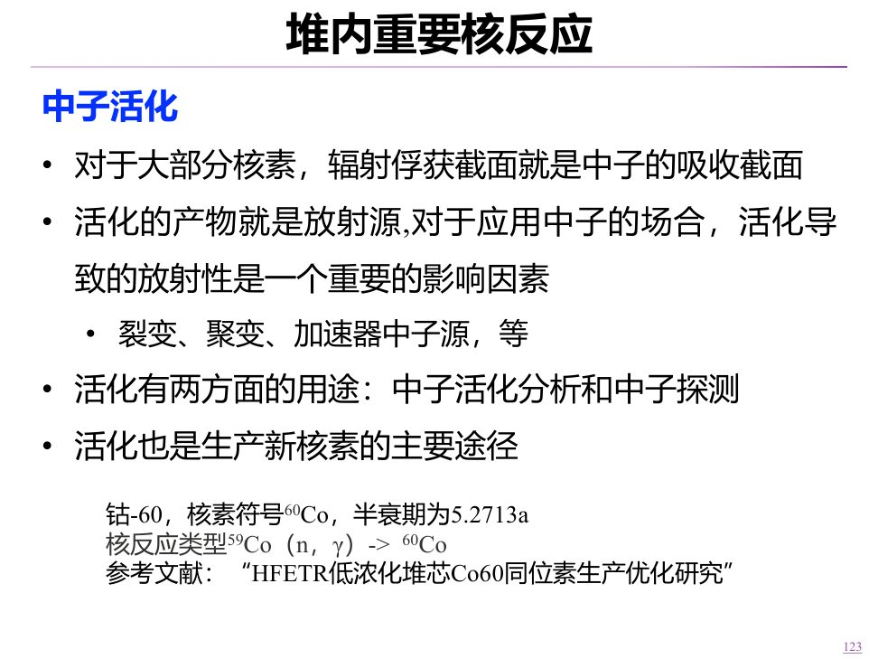

不同活化产物的特征 \(\gamma\) 射线可用于中子活化分析。课堂举了光绪头发砷含量检测的例子，并介绍由 \(^{59}\mathrm{Co}(n,\gamma)^{60}\mathrm{Co}\) 生产钴-60及其衰变热利用研究。这些工程案例说明用途，具体历史结论或项目现状不能由课堂举例替代独立核查。

用活化片探测时，照射产生率与 \(\Sigma\phi\) 相关，活化核素同时衰变。若靶核近似不耗尽，产物数密度 \(N_A\) 满足 \(\mathrm dN_A/\mathrm dt=\Sigma\phi-\lambda_dN_A\)，测得活度并结合照射、冷却、测量时间及探测效率，可反推照射处通量。课堂点名活化片、“跑兔”装置和自给能探测器，后两者的细节留课后调研。

自测：测到某活化产物的活度，为什么不能不经校准就直接等同于通量？

活度还受靶核数、截面、照射与冷却时间、衰变常数及探测效率影响，需要模型和校准才能反推 \(\phi\)。

[T10–T12](Transcript_Corrected.md#T10) · [来源](Lecture_Source_Map.md)

## 10. 裂变：易裂变核与有阈能的核

课堂将能由热中子有效诱发裂变的 \(^{235}\mathrm U\)、\(^{233}\mathrm U\)、\(^{239}\mathrm{Pu}\)、\(^{241}\mathrm{Pu}\) 称为易裂变核（fissile）；\(^{238}\mathrm U\)、\(^{232}\mathrm{Th}\)、\(^{240}\mathrm{Pu}\) 可在足够高能量等条件下裂变，属于可裂变核（fissionable）。前者也属于广义“可裂变”，两词不应作为互不相交的集合来记。

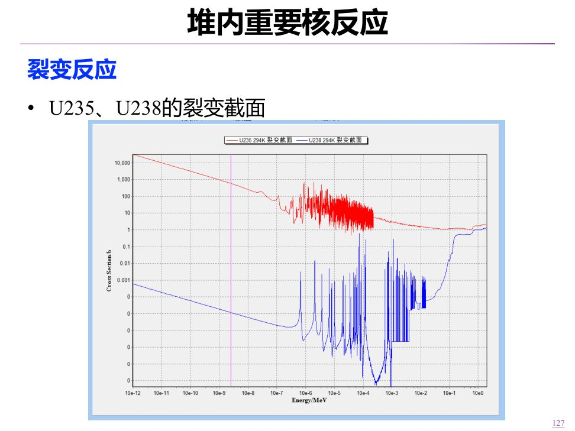

图的横轴为对数能量，纵轴为对数截面。低能端红色的铀-235裂变截面显著，蓝色铀-238裂变截面很小；铀-238在较高能量处出现明显裂变阈值。若给定同一纯铀-235金属核密度 \(N\)，两能量的裂变平均自由程分别为 \(1/[N\sigma_f(E)]\)：截面越大，自由程越短。课堂要求先用大小关系排除不合理选项，再作数值计算。裂变是否易发生，与中子吸收形成复合核得到的激发能是否足以越过裂变势垒有关；课件用“结合能与临界能”的图示作定性解释。

自测：同一种纯铀-235材料，热中子裂变截面更大时，裂变自由程怎样变化？

核密度相同，\(\lambda_f=1/(N\sigma_f)\)，所以热中子的裂变自由程更短。

[T13–T14](Transcript_Corrected.md#T13) · [来源](Lecture_Source_Map.md)

## 11. 铀-238与钍-232：俘获后转化为燃料

\(^{238}\mathrm U\) 可俘获中子成为 \(^{239}\mathrm U\)，再经两次 \(\beta^-\) 衰变，经 \(^{239}\mathrm{Np}\) 到 \(^{239}\mathrm{Pu}\)。\(^{232}\mathrm{Th}\) 的对应链为 \(^{233}\mathrm{Th}\to{}^{233}\mathrm{Pa}\to{}^{233}\mathrm U\)。终产物钚-239和铀-233都是易裂变核素。俘获本身消耗一个中子；是否实现燃料增殖还取决于整套中子收支及燃料循环，不能仅从反应链推出“所有铀-238都能转化”。

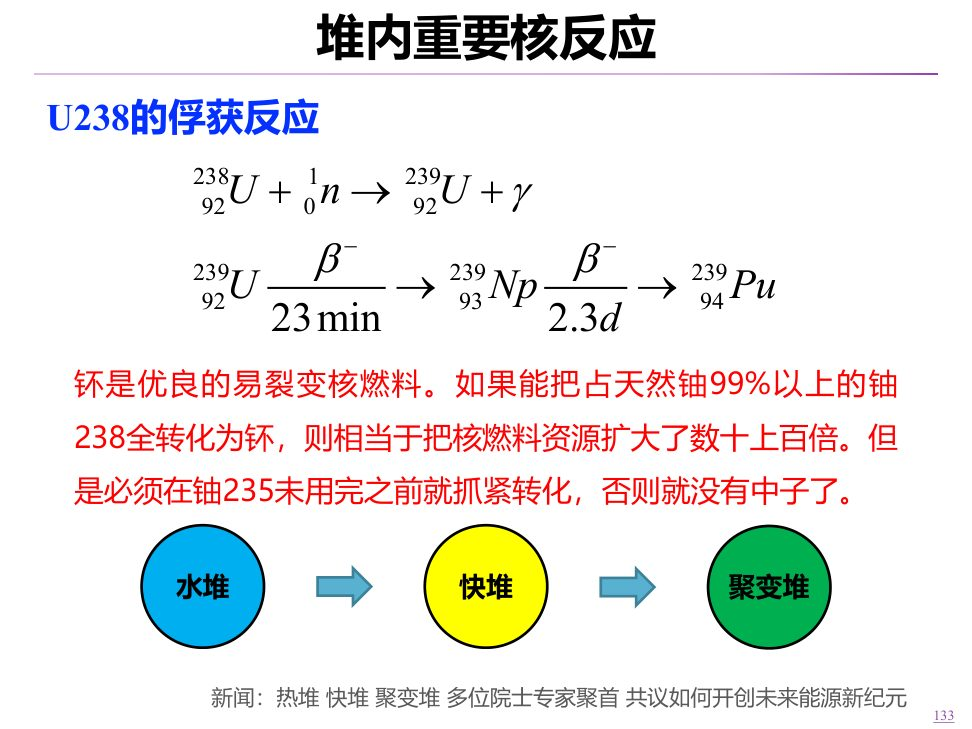

压水堆燃料中的铀-238占比高，所以其俘获与中子经济、燃料转化以及共振吸收引起的温度反馈有关。课堂以钍资源与钍基熔盐堆研究说明另一条燃料路线，并要求课后了解熔盐燃料和固体燃料配熔盐冷却剂等不同方案。项目规模、建设进度等课堂时点信息留在课堂回顾，不作为当前状态判断。

自测：钍-232俘获一个中子后会直接变成铀-233吗？

不会。先成为钍-233，再经两次 \(\beta^-\) 衰变，经过镤-233成为铀-233。

[T15–T16](Transcript_Corrected.md#T15) · [来源](Lecture_Source_Map.md)

## 12. 氢和铀-235的俘获：中子经济性

轻水中的 \(^{1}\mathrm H\) 能有效慢化中子，也能发生 \(^{1}\mathrm H(n,\gamma){}^{2}\mathrm H\)。虽然单个氢核的热中子吸收截面不算大，水中氢核多，热中子又在慢化剂中出现，合起来仍会消耗本可进入燃料并诱发裂变的中子。重水中氘的吸收较弱，因此中子经济性通常较好，但反应堆选型还涉及其他条件。

\(^{235}\mathrm U\) 吸收中子后也并非总裂变；\((n,\gamma)\) 支路生成 \(^{236}\mathrm U\)。图中红线是裂变、蓝线是俘获截面，比较时要看**给定能量区的两种反应率**，既要看截面之比，也要看该处通量。课堂用它解释把中子慢化进入有利能区的热堆设计思路；不能理解为慢化越多、任何条件下裂变率就越高。

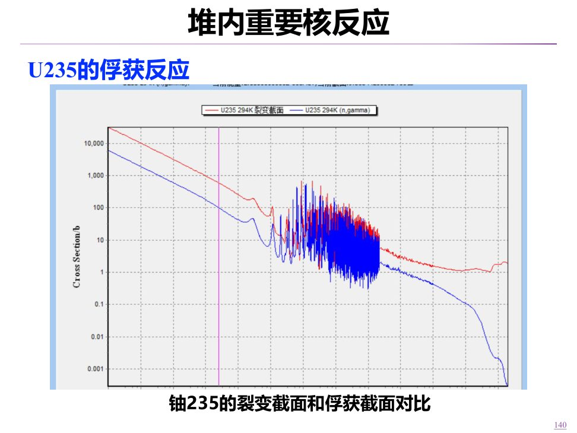

自测：铀-235吸收一个中子，能否直接记为发生一次裂变？

不能。还有俘获支路，应分别使用 \(\Sigma_f\) 和 \(\Sigma_\gamma\) 计算。

[T17–T18](Transcript_Corrected.md#T17) · [来源](Lecture_Source_Map.md)

## 13. 钠冷快堆中的钠反应

\(^{23}\mathrm{Na}(n,\gamma){}^{24}\mathrm{Na}\) 会使冷却剂活化；课件还列出 \((n,2n)\) 生成 \(^{22}\mathrm{Na}\)。钠-24半衰期约 15 小时，经 \(\beta^-\) 衰变成为镁-24。两种活化核素是钠冷快堆冷却剂放射性的重要来源。钠与水的化学反应也是工程设计必须隔离和控制的风险。

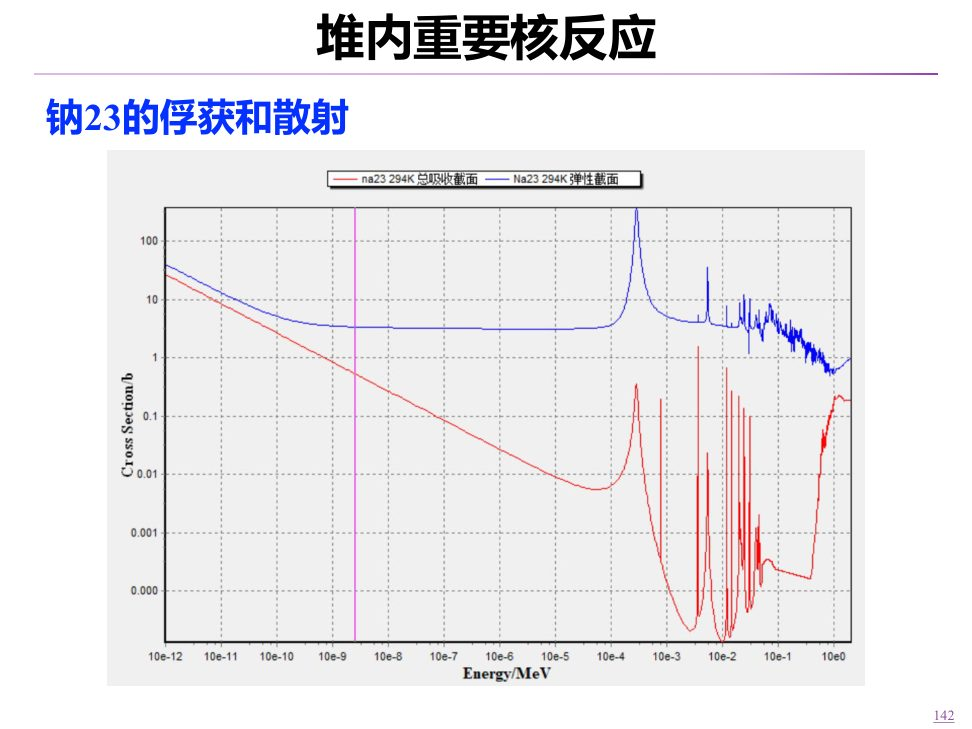

第 142 页截面图同时给出热能区和快能区数据。判断钠冷快堆内哪段反应更重要，要把 \(\Sigma(E)\) 与该堆内 \(\phi(E)\) 一起看；某能区截面很大，若那里的中子很少，对总反应率贡献仍可能有限。

自测：为什么不能只凭图上热能区截面高，就断定该区主导快堆的钠反应？

反应率是 \(\int\Sigma(E)\phi(E)\,\mathrm dE\)，还取决于快堆实际中子能谱。

[T19](Transcript_Corrected.md#T19) · [来源](Lecture_Source_Map.md)

## 14. 氧-16、氮-16和氮-14

高能中子可使 \(^{16}\mathrm O(n,p){}^{16}\mathrm N\)，课件给出约 9 MeV 阈值。氮-16半衰期约 7 秒并有高能 \(\gamma\) 辐射，是运行中水系统的重要放射性来源之一。通风、净化和负压共同控制污染物迁移；工程防护不能简化为“放置一会就没有风险”。课堂还用衰变计算说明暂存的作用。

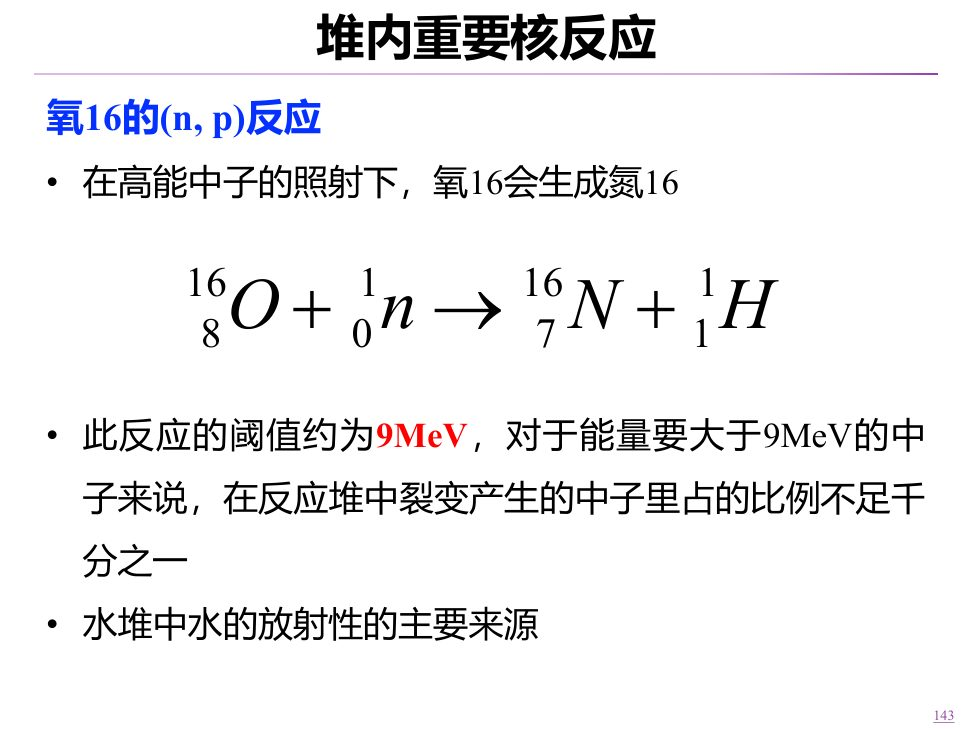

若题面活度从 \(3.3\times10^6\) 降到 \(3\,\mathrm{Bq/cm^3}\)，按同一核素单一指数衰变且忽略持续产生，\(A(t)=A_0 2^{-t/T_{1/2}}\)，所以 \(t=T_{1/2}\log_2(A_0/A)=7\log_2(1.1\times10^6)\approx140.5\,\mathrm s\)，约 2.34 分钟。实际排放仍按现场核素组成和管理要求判断。

\(^{14}\mathrm N(n,p){}^{14}\mathrm C\) 则把氮转为长寿命碳-14，是自然界碳-14的一条生成路径，也关系到含氮材料的活化。课堂以氮化铀为例讨论导热优势与核素变化带来的材料问题，并提到采用氮-15的研究思路；这里不把这一思路当作已验证的通用工程解法。

自测：氮-16活度下降六个数量级大约需几个半衰期？

\(2^{20}\approx10^6\)，约 20 个半衰期；若每个约 7 秒，就是约 140 秒。

[T20–T21](Transcript_Corrected.md#T20) · [来源](Lecture_Source_Map.md)

## 15. 硼-10、铍-9与中子源

\(^{10}\mathrm B(n,\alpha){}^{7}\mathrm{Li}\) 有较大的热中子吸收截面，可用于控制材料和中子探测；课堂还提到硼中子俘获治疗。\(^{9}\mathrm{Be}(\alpha,n){}^{12}\mathrm C\) 以及 \(^{9}\mathrm{Be}(\gamma,n){}^{8}\mathrm{Be}\) 都可产生中子，后一反应需要达到光致分解阈值。课件还列出氘的光致分解，并概览反应堆、加速器、中子发生器、自发裂变和放射性同位素中子源。不同来源的产额、能谱、成本与使用条件各异。

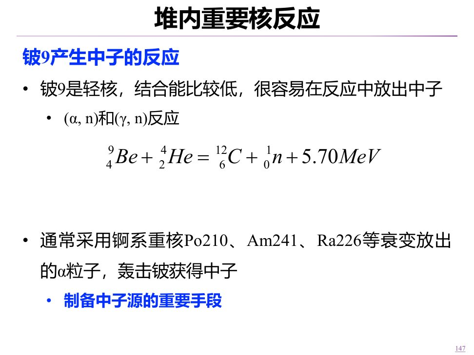

课堂末段转写把有关核素识成“氚和氦”，但课件第 147–149 页明确是铍受 \(\alpha\) 或 \(\gamma\) 作用产生中子。本讲按课件保留可确认的反应，原音具体字词列入待核听。

自测：硼-10和铍-9在上述反应中对中子数的作用有何不同？

硼-10的 \((n,\alpha)\) 反应吸收中子；铍-9的 \((\alpha,n)\) 或 \((\gamma,n)\) 反应产生中子。

[T22](Transcript_Corrected.md#T22) · [来源](Lecture_Source_Map.md)

## 课堂指定自学与思考

1. 结合课件后续内容查每次裂变平均可用能量，完成[N02](#N02)的中子密度题；明确采用的能量与平均寿命口径。
2. 阅读课件第 100–105 页的英文总结和宏观截面、自由程例题，并思考提高高通量堆通量的可行方法。
3. 思考快堆中较低能中子的来源；调研活化片、“跑兔”装置与自给能探测器。
4. 了解钍基反应堆不同燃料和冷却剂路线，使用有日期和出处的资料核对其进展。
