# 核反应截面的能量规律与裂变能量

上一讲把核反应的次数写成了“截面乘通量”。本讲先追问截面为什么不能当成一个固定数，再把裂变产生的中子、产物和能量联系起来。学完以后，应能根据截面曲线判断主要反应，区分每次裂变和每次吸收的中子产额，由裂变率计算热功率，并解释停堆后为什么还必须排热。

[来源与订正](Lecture_Source_Map.md)

## 1. 从反应率回到能谱加权

中子通量密度是单位体积内所有中子在单位时间走过的径迹总长度。单能情形下，\(\phi=nv\)，其中 \(n\) 是自由中子的数密度，\(v\) 是速率。指定反应道的反应率密度为

\[r=\Sigma\phi,\qquad \mathcal R=\int_Vr\,\mathrm dV.\]

\(r\) 的单位是每单位体积、每单位时间的反应次数；均匀时总反应率才可简写为 \(\mathcal R=rV\)。用 \(\lambda=1/\Sigma\) 理解，就是把总径迹长度除以该反应对应的平均自由程。

真实中子有不同能量，\(\Sigma(E)\) 也随能量变化。因此保持总反应率相等的平均截面为

\[r=\int_0^\infty\Sigma(E)\phi(E)\,\mathrm dE,
\qquad \bar\Sigma=\frac{\int_0^\infty\Sigma(E)\phi(E)\,\mathrm dE}{\int_0^\infty\phi(E)\,\mathrm dE}.\]

权重是通量能谱；它体现各能量中子对反应次数的贡献。分群时相应变成 \(\bar\Sigma=\sum_g\Sigma_g\Phi_g/\sum_g\Phi_g\)。改变能谱，即使核素不变，平均截面也可能改变。

自测：两个能群通量相同，宏观截面分别为0.1和0.3 cm⁻¹，平均截面是多少？

按通量等权，结果为 \(0.2\,\mathrm{cm^{-1}}\)。若两群通量不同，就不能直接取算术平均。

[T01](Transcript_Corrected.md#T01) · [来源](Lecture_Source_Map.md)

## 2. 读截面图先确认三个条件

一条截面曲线同时指定了**靶核、反应道和入射中子能量**。同为铀-235，俘获截面与裂变截面不同；同为裂变反应，铀-235与铀-238也不同。课件采用的堆内中子能量范围约为 \(10^{-5}\,\mathrm{eV}\) 到 \(20\,\mathrm{MeV}\)，跨度约12个数量级，因此图上常用对数坐标。

典型吸收截面可按趋势分成低能区的 \(1/v\) 段、中能区的共振段和高能区较小而平缓的部分。这是组织知识的方式，能区边界随核素、反应道和问题而变，不能用一个统一的分界数替代具体曲线。

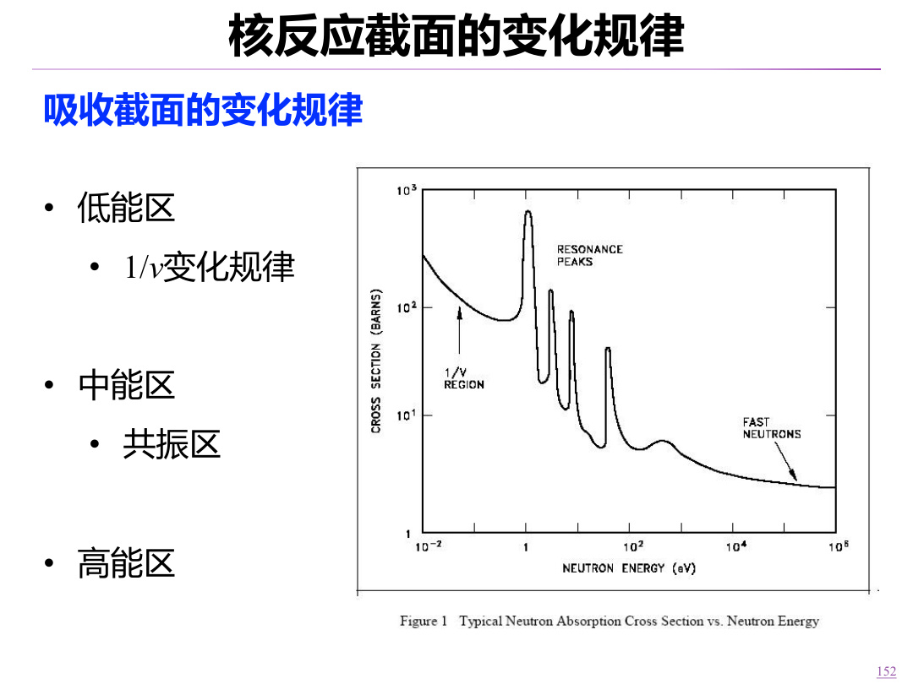

横轴是中子能量，纵轴是截面。读图既看趋势，也看坐标单位和数量级；对数横轴上相等的图像宽度代表相等的能量比，并不代表相等的能量差。

自测：看到截面曲线有一个峰，能直接断言它是裂变共振峰吗？

不能。先看曲线标注的反应道。总截面、俘获截面和裂变截面都可能有共振结构。

[T02](Transcript_Corrected.md#T02) · [来源](Lecture_Source_Map.md)

## 3. 低能吸收截面的1/v规律

在适用能区，许多核素的吸收截面近似满足 \(\sigma_a(v)v=\text{常数}\)。非相对论中子满足 \(E=m_nv^2/2\)，所以

\[\sigma_a(E)\sqrt E=\text{常数},\qquad
\sigma_a(E)=\sigma_a(E_0)\sqrt{\frac{E_0}{E}}.\]

能量降低到原来的四分之一，截面增为两倍。在双对数图上，\(\log\sigma_a=\log C-\tfrac12\log E\)，因而应看到斜率为 \(-1/2\) 的直线。课堂用“跑得慢容易被抓住”帮助形成直觉，又联系中子的波动性；这些类比不能单独推导指数，实际适用性仍由反应机制与核数据决定。

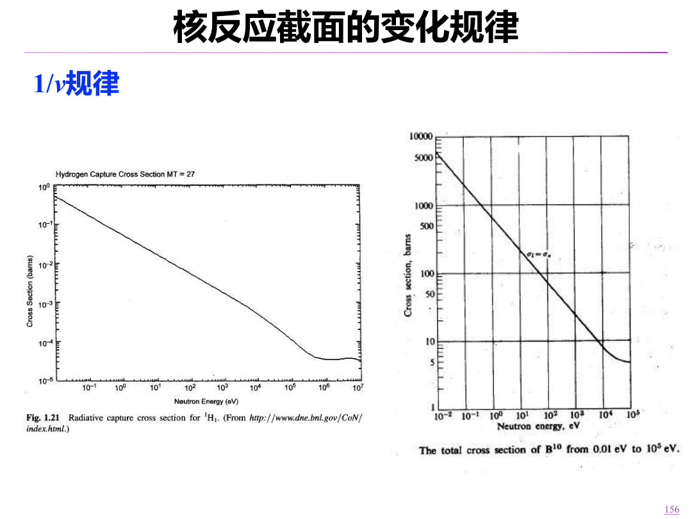

吸收不总等于辐射俘获。很多非裂变核素在低能区以俘获为主，可近似 \(\sigma_a\simeq\sigma_\gamma\)；对易裂变核素还必须计入裂变。硼-10的低能 \((n,\alpha)\) 反应也是重要吸收道，不能套用“所有带电粒子出射反应都有高阈值”的说法。

自测：1/v条件下，同一材料固定中子数密度n时，吸收反应率一定随速率降低而增大吗？

不一定。在单能模型中 \(r_a=N\sigma_a nv\)，而 \(\sigma_av\) 为常数，因此固定 \(N,n\) 时反应率不变。若固定的是通量，则截面增大会使反应率增大。要先说清固定了什么。

[T03](Transcript_Corrected.md#T03) · [来源](Lecture_Source_Map.md)

## 4. 2200 m/s基准与两个算例

热平衡中子有一个速率分布，并非所有中子都以同一速率运动。室温约293 K时，麦克斯韦速率分布的最可几速率约为2200 m/s，对应动能0.0253 eV。这个常用核数据基准满足 \(E(v_{\rm mp})=kT\)，不要把它与平均能量 \(3kT/2\) 或能量分布的众数混为一谈。温度升高，最可几速率随 \(\sqrt T\) 增大。

**速度换算。** 忽略相对论效应，由 \(v\propto\sqrt E\)，2 MeV中子的速率约为

\[v=2200\sqrt{\frac{2\times10^6}{0.0253}}
\simeq1.96\times10^7\,\mathrm{m/s}.\]

飞行时间还要看路径长。若平均自由程取5 cm，热中子飞过它需约 \(2.3\times10^{-5}\) s，而2 MeV中子只需约 \(2.6\times10^{-9}\) s；不能给各种能量统一套一个飞行时间，也不能直接将一次飞行时间当成堆内平均寿命。

**吸收截面换算。** 氢在0.0253 eV的吸收截面为0.332 b，按1/v规律换算到1 eV：

\[\sigma_a(1\,\mathrm{eV})=0.332\sqrt{0.0253/1}
\simeq0.0528\,\mathrm b.\]

计算中能量比必须使用同一种单位。课件的其他材料曲线和2200 m/s表可用于数量级比较：硼-10约3837 b、硼-11约0.005 b、氙-135约 \(2.7\times10^6\) b，说明同一元素的不同同位素也可能差别极大。精确计算须选定一致的数据版本。

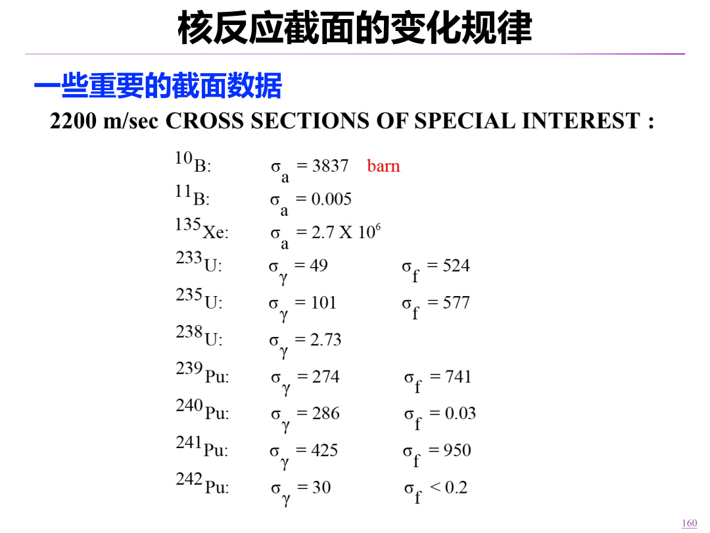

自测：将1 eV继续升到4 eV，氢的吸收截面约为多少？

在1/v近似仍适用时再除以2，得到约0.0264 b。

[T04](Transcript_Corrected.md#T04) · [T05](Transcript_Corrected.md#T05) · [来源](Lecture_Source_Map.md)

## 5. 共振峰与非1/v修正

重核或某些中等质量核的低能吸收可能偏离1/v，可引入修正因子；一个参考点此时不足以描述全部曲线。中能区的显著特征是共振：入射能量接近某些复合核能级条件时，相应反应截面大幅增大。铀-238在约6.67 eV处有很高的俘获峰，课堂材料给出的峰高约为数万b。

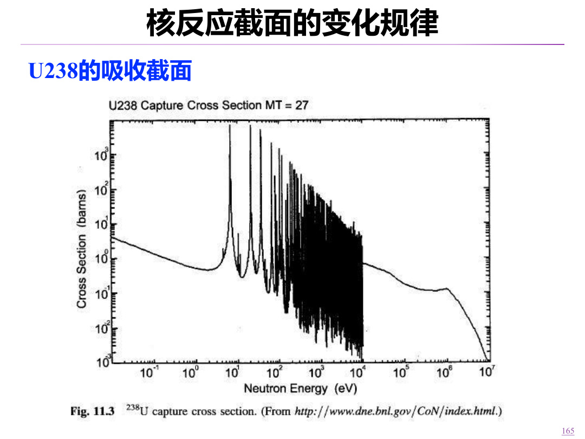

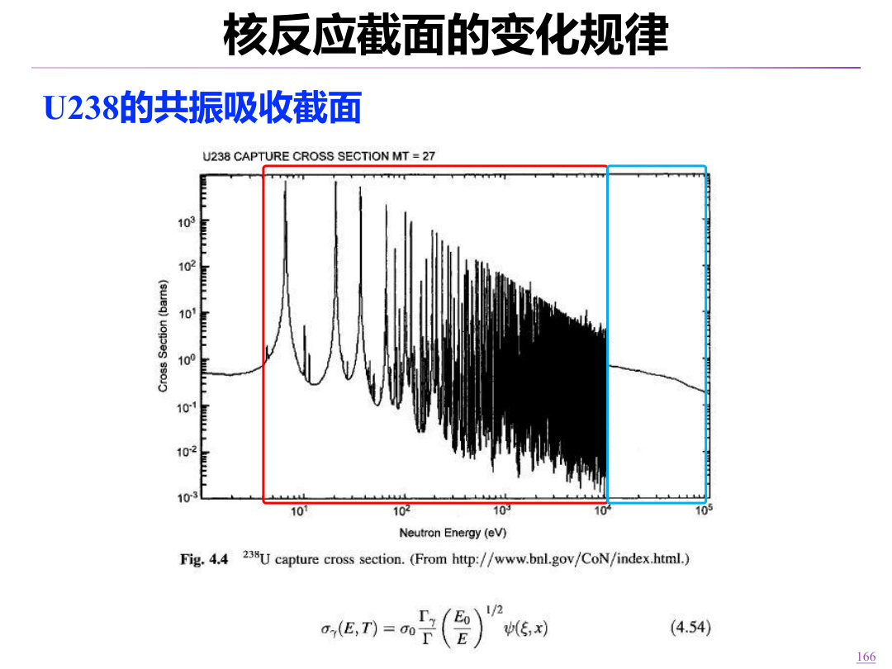

可分辨共振区可逐峰给出参数。图上画得很密、甚至发黑，不等于物理上已不可分辨；应结合能量标度、数据分辨能力和参数表示。不可分辨共振区往往使用统计参数处理，它也不等于“没有共振”。反应率依赖截面与通量的乘积，直接拿一条平滑平均线可能漏掉自屏蔽等影响。

高能区不少吸收曲线较低且相对平缓，是本讲的总体趋势，不能据此说任何核素、任何反应在高能区都单调下降。

自测：低能处一个看起来很宽的峰，实际能量宽度必然大于高能处的小峰吗？

不必然。对数横轴压缩高能端，必须读取峰左右两端实际能量再比较差值。

[T06](Transcript_Corrected.md#T06) · [T07](Transcript_Corrected.md#T07) · [来源](Lecture_Source_Map.md)

## 6. 非弹性散射和弹性散射的截面

非弹性散射需要把靶核激发，因此有阈能。重核低激发能级通常较低，堆内中子更容易打开这类反应道；轻核的阈能常较高。课件中的重核非弹性散射截面多为几个b。中子把一部分能量用于核激发，故这种反应对高能中子降能很重要，但不能把“重核阈值低”理解为每次必然比任何轻核损失更多能量。

弹性散射保持靶核内部状态不变。势散射可形成较平的背景，重核还有复合弹性散射共振；不能将所有弹性散射都视作纯几何碰撞。课件按半径 \(R=1.25\times10^{-13}A^{1/3}\,\mathrm{cm}\) 给铀-238列出约7.5 b的尺度，实际弹性散射约8.3 b。这里7.5 b对应 \(4\pi R^2\)，而几何投影面积 \(\pi R^2\) 约1.9 b，二者不能混写。

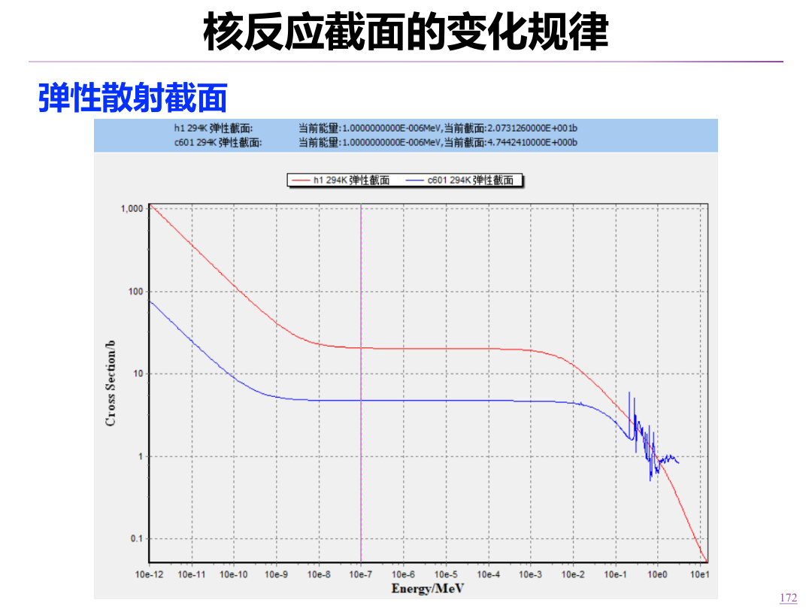

这张294 K图包含极低能端的上翘、很长一段平台及高能端的下降或结构。氢平台约20 b，碳平台约几个b；“上千b”只描述图中极低能端，不能说整段都是上千b。低能散射曲线还依赖靶核运动与材料状态，不能只凭吸收的1/v规律推断全部散射曲线。

自测：什么最直接地区分这两类散射的能量条件？

非弹性散射需要激发核内部自由度，有阈能；弹性散射本身不需要这种核激发阈能。具体曲线还须看核素和温度等条件。

[T08](Transcript_Corrected.md#T08) · [T09](Transcript_Corrected.md#T09) · [来源](Lecture_Source_Map.md)

## 7. 易裂变核素与阈能裂变

铀-235、铀-233、钚-239等易裂变核素可由热中子引发裂变。其裂变截面低能端通常较大、可近似有1/v趋势；中能区有共振；高能区数值较小、变化相对平缓。

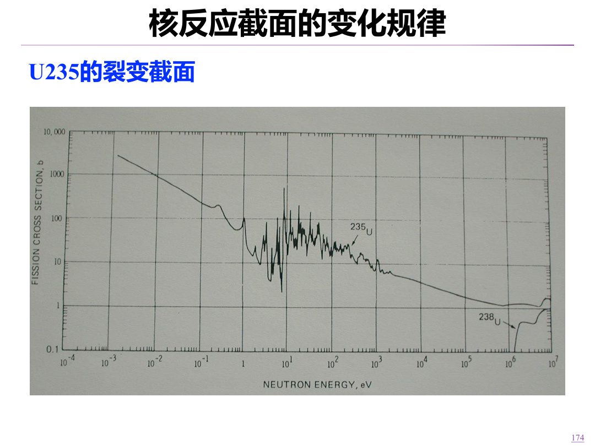

铀-238等需要较高能量才有显著裂变截面，曲线呈阈能特征。本课把它们与易裂变核素对照称为“可裂变核素”；更广义的“可裂变”也包含易裂变核素。课件第174页纵轴最低约为0.1 b，所以转写里“0.18以上才可见”的数字不能未经确认当成铀-238的精确阈能。

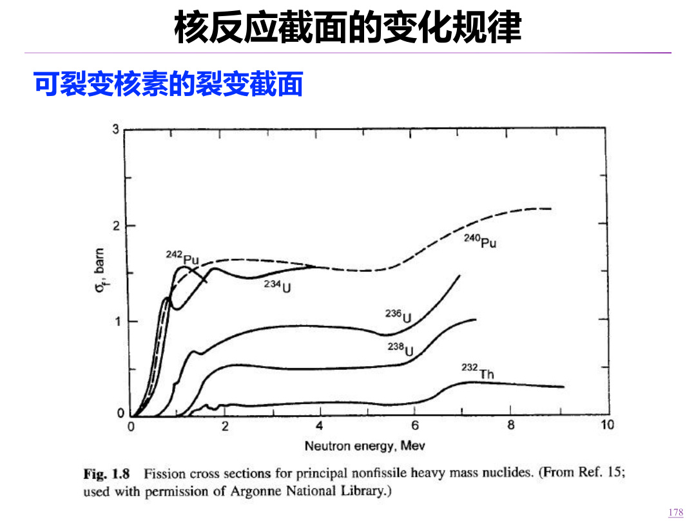

判断材料适合怎样的中子能谱，必须一起看裂变与竞争吸收，而不只看某一条裂变截面大不大。

自测：热中子能被铀238俘获，是否意味着它也能有效引起铀238裂变？

不是。俘获和裂变是不同反应道，打开裂变通道还需满足对应能量条件。

[T10](Transcript_Corrected.md#T10) · [来源](Lecture_Source_Map.md)

## 8. 核数据怎样进入计算

核数据不仅包含截面，还包括散射角分布、出射能谱、衰变常数和裂变产额。实验只能覆盖有限能量点和核素，因此需要结合实验误差、理论模型与一致性检验形成评价数据，再加工为计算程序使用的形式。

可以把使用过程分成三步：测量与理论提供信息，评价工作给出推荐数据及不确定性，处理程序根据温度、能群和输运方法生成应用库。ENDF-6和GNDS是数据表示格式，不能与某个库的版本或某个程序内部的存储格式混为一谈。相关公开入口见[来源记录](Lecture_Source_Map.md#external)。

课堂举了CENDL和ENDF等名称，并以多群库、蒙特卡罗点截面库和GPU存储优化作比较。库的体积取决于核素数、温度数、能群结构和反应道等，“10 K”“10 G”属于课堂特定示意，不能作为所有程序的固定规格。数据、物理模型和计算方法要相互匹配。

自测：把同一评价库处理成多群库后，为什么还要交代所用能谱？

群平均往往涉及能谱加权，自屏蔽处理也依赖问题条件。相同原始评价并不保证不同处理所得群常数相同。

[T11](Transcript_Corrected.md#T11) · [T12](Transcript_Corrected.md#T12) · [来源](Lecture_Source_Map.md)

## 9. ν、α、η分别在平均什么

\(\nu\) 是每次裂变平均放出的中子数，\(\alpha=\sigma_\gamma/\sigma_f\) 是俘获裂变比，\(\eta\) 是燃料核每吸收一个中子平均产生的裂变中子数。若吸收只考虑俘获和裂变，则

\[\eta=\nu\frac{\sigma_f}{\sigma_a}
=\nu\frac{\sigma_f}{\sigma_f+\sigma_\gamma}
=\frac{\nu}{1+\alpha}.\]

推导的关键是：一次吸收以 \(\sigma_f/\sigma_a\) 的概率导致裂变，裂变后平均放出 \(\nu\) 个中子，其余俘获不产生这一裂变中子收益。\(\nu\) 大不等于 \(\eta\) 一定更大，还要看俘获竞争。

课件给出随入射能量变化的近似式，\(E\) 以MeV计：

\[\nu_{235}(E)=2.416+0.133E,\qquad
\nu_{239}(E)=2.862+0.135E.\]

这是近似关系，不是逐次裂变的固定整数，也不是任意高能都适用的精确公式。相同入射能量下，该式的钚-239平均中子数比铀-235多；低能端变化很小。相邻课件表给出的值略有差异，应在同一数据组内计算。

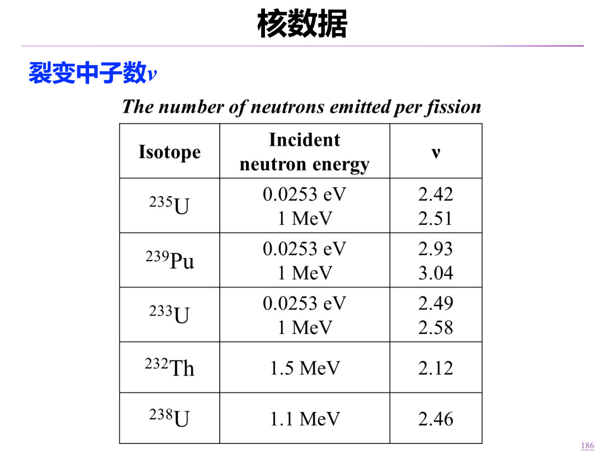

临界是整个系统中子产生与损失的平衡。实际堆中还要补偿非燃料吸收和泄漏，故燃料的 \(\eta\) 需要留出余量；\(\eta>1\) 不是充分临界条件，更不等于已经增殖。理想无额外损失的边界情形不能用“一律严格大于1”概括。

自测：若ν=2.4、α=0.2，η是多少？它能证明反应堆已经临界吗？

\(\eta=2.4/1.2=2\)。它只描述燃料吸收后的中子收益，还需考虑泄漏、其他材料吸收和能谱等，不能独立判断临界。

[T13](Transcript_Corrected.md#T13) · [T14](Transcript_Corrected.md#T14) · [T15](Transcript_Corrected.md#T15) · [来源](Lecture_Source_Map.md)

## 10. 裂变碎片、裂变产物与双峰产额

一次裂变有多种可能通道。裂变时直接形成的核是裂变碎片，它们及其后续衰变形成的核素合称裂变产物。产物不全是不稳定核，衰变链最终可到稳定核素。课堂用随机“掷骰子”说明：同样的初始条件可以产生不同碎片组合，因此需要统计平均的产额。

课件举出的两条守恒反应为

\[{}^{235}_{92}\mathrm U+n\rightarrow{}^{90}_{36}\mathrm{Kr}
+{}^{144}_{56}\mathrm{Ba}+2n+Q,\]
\[{}^{235}_{92}\mathrm U+n\rightarrow{}^{93}_{37}\mathrm{Rb}
+{}^{140}_{55}\mathrm{Cs}+3n+Q.\]

两式两侧质量数都为236、电荷数都为92。每次裂变平均产生某核素的个数称为该核素的裂变产额；质量产额 \(Y(A)\) 则把同一质量数的核素归在一起。

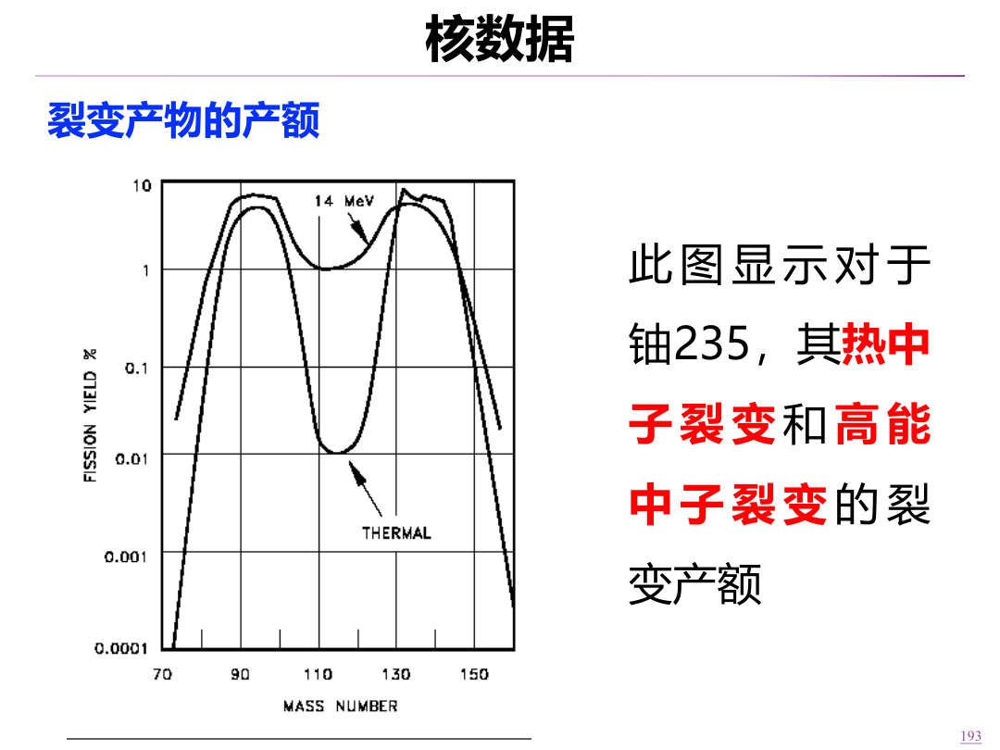

低能裂变的双峰说明非对称分裂占优势，课件示意峰在约92和144附近；不同曲线的精确峰位会变。14 MeV曲线在中间谷底明显抬高，所以图中 \(A\approx115\) 的高能裂变产额大于热中子产额。不能直接把14 MeV单能曲线当成所有快堆乏燃料的最终成分；实际成分还依赖核素、能谱、燃耗与冷却时间。

对通常两个重碎片的质量产额，\(\sum_A Y(A)\approx2\)，若用百分数则约200%。这不是对数纵轴上肉眼所见的几何面积，也不能把同一衰变链中各核素的累计产额全部相加后仍要求等于2。三分裂变修正取决于是否把额外轻粒子计入统计。

自测：为什么双峰总产额通常约200%，而非100%？

产额按“每次裂变产生多少个碎片”归一；一次通常有两个重碎片，每100次裂变约有200个，而不是只计一次事件。

[T16](Transcript_Corrected.md#T16) · [T17](Transcript_Corrected.md#T17) · [来源](Lecture_Source_Map.md)

## 11. 裂变产物与材料、放射源和环境

不同裂变核素和不同入射能量对应不同的产额曲线，因而产物组成可以帮助分析材料与辐照过程，但必须同时处理衰变、吸收和混合等影响。

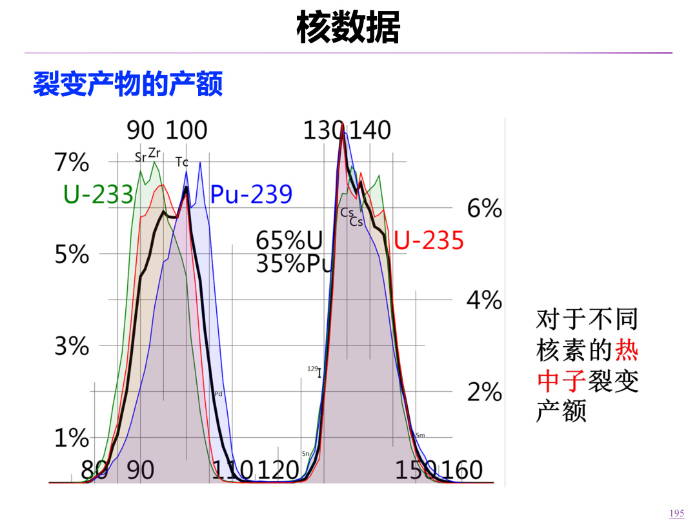

课堂问钴-60、铯-137和铱-192中，哪一种主要从裂变产物获得。用质量产额的典型范围判断，铯-137最符合；钴-60和铱-192的常用途径是中子活化，钴的例子为 \({}^{59}\mathrm{Co}(n,\gamma){}^{60}\mathrm{Co}\)。范围判断是线索，具体生产方式还需核反应与工艺依据。

裂变产物既影响中子收支和堆芯寿命，也带来衰变热与事故源项问题。例如强吸收核素会影响反应性；气态、易挥发的放射性产物在事故释放中需要特别关注。环境影响不能一概归结为裂变产物，活化产物等也可能参与；“所有放射性裂变产物自然界都不存在”也不是普遍成立的命题。

自测：为什么产额分析与堆芯寿命有关？

产物会继续衰变和吸收中子，改变材料组成与中子损失，进而改变维持链式反应的条件。

[T18](Transcript_Corrected.md#T18) · [来源](Lecture_Source_Map.md)

## 12. 每秒裂变次数怎样换成功率

一般估算取每次裂变可利用能量 \(E_f\approx200\,\mathrm{MeV}\)。用 \(1\,\mathrm{eV}=1.602\times10^{-19}\,\mathrm J\) 换算，

\[E_f\approx3.204\times10^{-11}\,\mathrm J,
\qquad \dot F=\frac{P_{\rm th}}{E_f}.\]

因此1 W热功率对应约 \(3.12\times10^{10}\) 次裂变每秒，1 MW对应约 \(3.12\times10^{16}\) 次每秒。这里的功率是热功率。

“百万千瓦核电站”通常指约1000 MW电功率。若热效率取 \(\epsilon=1/3\)，则 \(P_{\rm th}=P_e/\epsilon\approx3000\) MW，裂变率约 \(9.4\times10^{19}\,\mathrm{s^{-1}}\)，量级为 \(10^{20}\)。题目若未给热效率，精确答案要保留 \(P_e/(\epsilon E_f)\)，不能只把电功率代入热功率公式。

自测：为什么同样1000 MW电功率，效率提高后所需裂变率减少？

\(\dot F=P_e/(\epsilon E_f)\)。电功率固定时，效率越高，所需热功率越小。

[T19](Transcript_Corrected.md#T19) · [来源](Lecture_Source_Map.md)

## 13. 功率、燃料装量与中子通量

把裂变率关系代入功率式，最一般的表达应保留空间和能量积分：

\[P_{\rm th}=E_f\int_V\int_0^\infty
\Sigma_f(\mathbf r,E)\phi(\mathbf r,E)\,\mathrm dE\,\mathrm dV.\]

当有效宏观截面和通量可采用适当均匀平均时，简化为 \(P_{\rm th}=E_f\bar\Sigma_f\bar\phi V\)。固定材料、体积和能谱等条件，功率与通量成正比；如果只改变燃料核密度，\(\Sigma_f=N\sigma_f\) 变小，为保持同一功率就需提高通量。这一比例不自动适用于组成和能谱一起变化的堆。

**课堂例题。** 已知 \(\phi=3\times10^{13}\,\mathrm{cm^{-2}s^{-1}}\)、\(N=10^{20}\,\mathrm{cm^{-3}}\)、\(r_f=1.29\times10^{12}\,\mathrm{cm^{-3}s^{-1}}\)，先算

\[\Sigma_f=\frac{r_f}{\phi}=0.043\,\mathrm{cm^{-1}},\qquad
\sigma_f=\frac{\Sigma_f}{N}=4.3\times10^{-22}\,\mathrm{cm^2}=430\,\mathrm b.\]

“反应率”题设的单位含每立方厘米，因此这里实际给的是反应率密度，不应再误除一次体积。

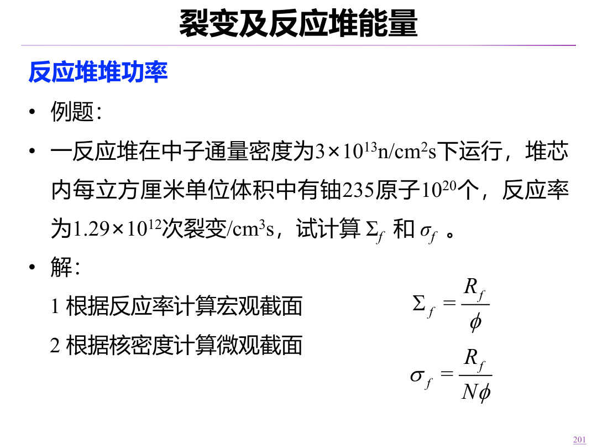

自测：上题所得430 b应直接当作2200 m/s的标准裂变截面吗？

不能。它是题设反应率与通量对应的有效截面；题设未给出单能或完整能谱，不能擅自认定为标准热截面。

[T20](Transcript_Corrected.md#T20) · [T21](Transcript_Corrected.md#T21) · [来源](Lecture_Source_Map.md)

## 14. 功率密度与燃料比功率

堆芯功率密度按堆芯体积归一，\(q_V=P_{\rm th}/V\)；燃料比功率按指定燃料质量归一，\(q_m=P_{\rm th}/M_f\)。它们都以热功率为分子，分母却不同；工程使用还要说清质量是重金属质量还是燃料化合物质量。

用课堂压水堆数量级 \(q_V\approx100\,\mathrm{MW/m^3}\)、\(q_m\approx35\,\mathrm{MW/t}\) 和3000 MW热功率估算，堆芯体积约30 m³，按课件质量口径折算燃料装量约86 t。这是数量级算例，不是所有压水堆的固定参数。

在其他条件相近、同一质量口径和能谱近似相同的前提下，富集度提高意味着每单位燃料中易裂变核更多。若保持同样燃料比功率，就能用较低通量达到同样的单位质量裂变率。

自测：比功率是“所有热量都产生于燃料内部”的意思吗？

不是。它是按燃料质量归一的系统功率指标，部分能量实际可沉积在慢化剂、冷却剂或其他材料中。

[T22](Transcript_Corrected.md#T22) · [来源](Lecture_Source_Map.md)

## 15. 200 MeV由谁携带，又在哪里变成热

裂变能来自反应前后的质量差 \(Q=\Delta mc^2\)。它先表现为碎片、中子、电子等粒子的动能以及光子和中微子携带的能量，之后通过相互作用沉积到材料中。

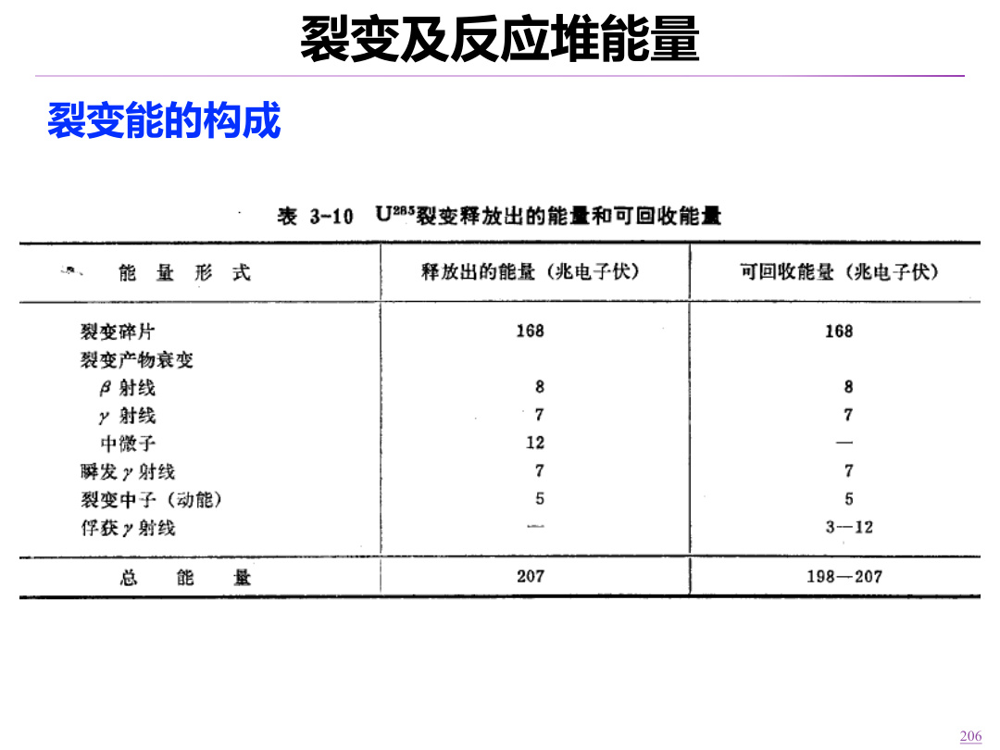

按课件的铀-235示例，碎片动能约168 MeV，裂变中子动能约5 MeV，瞬发γ约7 MeV，裂变产物衰变β约8 MeV、γ约7 MeV，中微子约12 MeV，总计约207 MeV。碎片和β射程短，主要在产生地附近沉积；中子降能将能量传给慢化剂等材料；γ射程较长，可在堆内多处沉积。裂变产物β衰变伴随的反中微子能量不能全部当成裂变瞬间释放。

中微子携带的能量基本逃逸，扣除后约195 MeV；裂变中子在材料中被俘获又释放约3–12 MeV，按课件口径得到约198–207 MeV可回收能量。这样才理解为何工程估算统一取约200 MeV，不能把“总释放207”与“可回收200”看成矛盾。

课件还给出具体核素的估算关系

\[E_f\approx1.29927\times10^{-3}Z^2\sqrt A+33.12
\quad(\mathrm{MeV/fission}).\]

由此算得铀-235约201.7 MeV、钚-239约210.6 MeV；这是经验近似。它说明两者均在200 MeV附近，而非所有核素具有完全相同能量。热功率已经扣除了基本逃逸的能量，电功率还要再乘热效率。

自测：停堆后是否还能释放上述表格中的部分能量？

能。裂变产物的β、γ衰变有时间延迟，是停堆衰变热的重要来源。

[T23](Transcript_Corrected.md#T23) · [T24](Transcript_Corrected.md#T24) · [来源](Lecture_Source_Map.md)

## 16. 用平均自由程理解中微子能量损失

课堂给定示意截面 \(\sigma=10^{-43}\,\mathrm{cm^2}\)，材料靶核数密度 \(N=10^{23}\)–\(10^{24}\,\mathrm{cm^{-3}}\)。取较大的 \(N\) 得

\[\Sigma=N\sigma=10^{-19}\,\mathrm{cm^{-1}},\qquad
\lambda=\frac1\Sigma=10^{19}\,\mathrm{cm}=10^{14}\,\mathrm{km}\approx10.6\text{ 光年}.\]

若取较小的核密度，自由程再增大十倍。课件的截面只是本题数量级输入，实际中微子截面依赖能量、粒子种类和反应道。

平均自由程极长意味着单个粒子在小探测器内发生反应的概率极小，不意味着完全探测不到。总事件率还含靶体积：均匀近似为 \(\mathcal R=N\sigma\Phi_\nu V\)。增大探测体积、增加通量或选择适当反应道，都可能增加事件数；靠近反应堆是提高某类反应堆中微子通量的办法。反应堆只是中微子源之一，太阳等也产生中微子。

自测：只增加探测器体积，会改变材料的平均自由程吗？

不会。材料和能量不变时 \(\lambda=1/(N\sigma)\) 不变，但靶总数增加，总事件率可以提高。

[T25](Transcript_Corrected.md#T25) · [T26](Transcript_Corrected.md#T26) · [来源](Lecture_Source_Map.md)

## 17. 停堆后的发热来自哪里

停堆使自持链式裂变反应受到抑制，裂变功率迅速下降；堆内已有的放射性核素仍继续衰变，所以总热源不会瞬间为零。主要的裂变产物衰变热还受到运行期间积累的种类和数量控制，因此与停堆前功率、运行历史、燃料组成和堆型有关。

课件用恒定功率运行 \(T\) 秒、停堆 \(t\) 秒后的经验式估算：

\[P_d(t,T)=4.1\times10^{11}P_0
\left[t^{-0.2}-(t+T)^{-0.2}\right]\quad\mathrm{MeV/s},\]

其中 \(P_0\) 的数值单位为W，时间数值单位为s。乘上 \(1.602\times10^{-13}\,\mathrm{J/MeV}\) 后，可把功率统一写成W：

\[\frac{P_d}{P_0}\approx0.0657
\left[t^{-0.2}-(t+T)^{-0.2}\right].\]

前式的MeV/s不能直接当作W；经验系数与规定单位绑定。该式不适用于 \(t=0\)，也不能替代完整核素清单的衰变计算或工程设计所需模型。不同教材经验式的系数与适用区间可能不同，应整式核对。

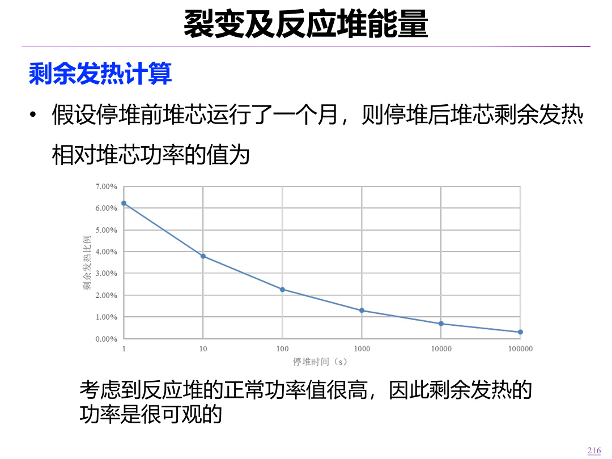

图中横轴为停堆时间的对数坐标。总功率随时间下降，但它是许多衰变链和半衰期共同作用的结果；本页经验式为幂律组合，不能直接认成一个单一指数函数。

自测：为什么两座停堆前功率相同的堆，停堆后余热可能不同？

运行时长和燃料历史不同，积累的放射性核素不同。经验式中的 \(T\) 已反映这一差别的一部分。

[T27](Transcript_Corrected.md#T27) · [T28](Transcript_Corrected.md#T28) · [来源](Lecture_Source_Map.md)

## 18. 从百分数算出余热的实际规模

百分数小不等于热功率小。对3000 MW热功率的堆，6%是180 MW；1%仍是30 MW。课堂按图把停堆一小时后的比例近似读成1%，用于后续估算。若取运行30天并严格代入上一节经验式，\(t=3600\) s时约为0.93%，与这一读图量级一致。

假设此后一分钟内功率按30 MW不变、全部传给水且无散热，从0℃加热到100℃所需热量满足

\[Q=P_d\Delta t=30\times10^6\times60=1.8\times10^9\,\mathrm J,\]
\[m=\frac{Q}{c_p\Delta T}
\approx\frac{1.8\times10^9}{4.2\times10^3\times100}
\approx4.3\times10^3\,\mathrm{kg}.\]

这说明一分钟能把约4.3 t水加热到沸点。若还要把水全部汽化，必须继续计入汽化潜热，不能把这个答案解释成“烧干4 t水”。

当功率变化时，累计能量应由 \(Q=\int P_d(t)\,\mathrm dt\) 求得。图的时间轴若是对数坐标，肉眼看到的曲线下面积不能直接等同焦耳数。

自测：若按30 MW恒定一分钟，求的是能量还是功率？

求得 \(1.8\times10^9\) J能量。瓦是焦耳每秒，功率乘时间得到能量。

[T29](Transcript_Corrected.md#T29) · [来源](Lecture_Source_Map.md)

## 19. 排热路径与本讲的工程落点

停堆解决的是链式反应控制，排热系统解决的是已积累能量和持续衰变热的导出，两者都需要。课堂用三里岛和福岛说明冷却丧失的严重后果；具体事故过程需要专门资料，不能用一句原因概括完整事件。

能动冷却依靠泵等设备，非能动排热利用重力、自然循环等驱动力。非能动不意味着不需要设备、热阱或适用条件；仍要有连续的传热路径，把热量从燃料传到最终环境。课件以华龙一号作示意，课堂又提到高温气冷堆的固体导热与外围冷却、钠冷快堆的余热换热器和自然循环。这些例子都要回答“热从哪里来、经过什么介质、最后排到哪里”。

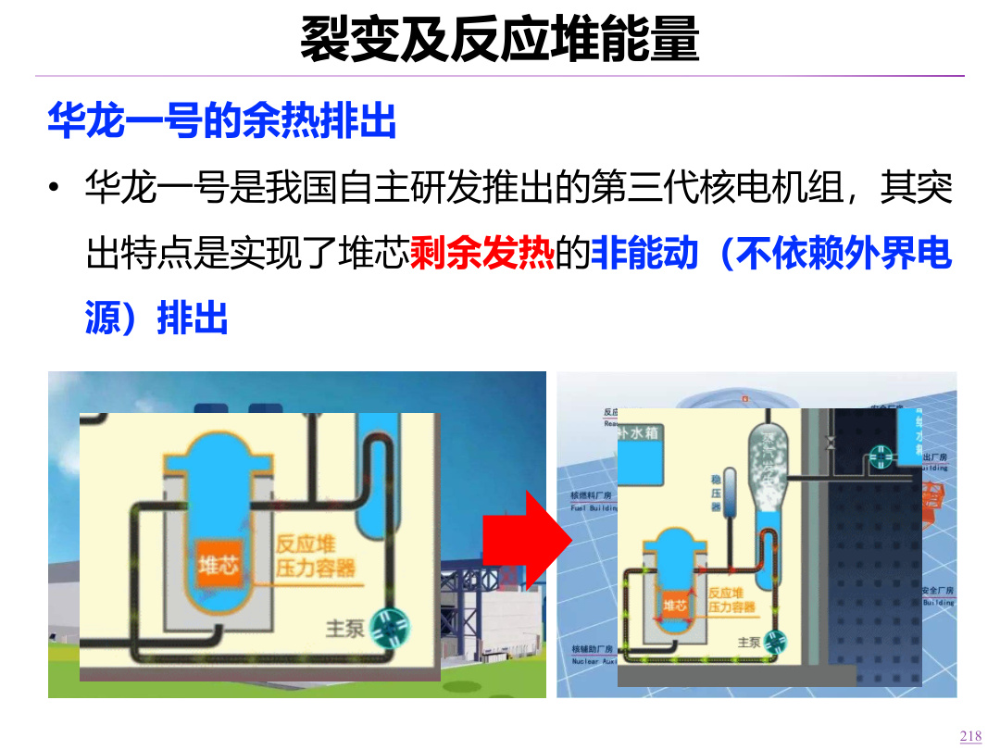

ECCS是应急堆芯冷却系统的英文缩写，是相关安全设施的一类，不能把所有余热排出系统都直接叫作ECCS。余热问题还延续到乏燃料湿法或干法储存、运输和地质处置；长寿命放射性产物不会因为燃料离堆而停止发热。

自测：没有持续裂变，为什么仍需要热阱？

已有放射性核素持续释放衰变能。没有最终吸热和散热条件，内部循环本身并不能永久带走热量。

[T30](Transcript_Corrected.md#T30) · [T31](Transcript_Corrected.md#T31) · [来源](Lecture_Source_Map.md)

## 课堂学习要求与教材练习入口

课堂建议每讲后用约10分钟整理主要知识点；本次还提出查热平衡中子的速率与能量分布、对比材料截面表、查阅非1/v修正及散射资料、了解专用核数据库和余热经验式。没有给出必须提交的统一作业题号。

可用教材第14稿[例题2-8，PDF65–66](../../Global/Raw/核工程原理%20第14稿.pdf#page=65)练习“下一次反应”与“最终吸收”的概率区别：题给俘获101 b、裂变577 b、散射13 b，分别询问下一次发生俘获和最终发生俘获的概率。后者需结合题设隐含的无泄漏、截面不随历程改变的理想化条件理解。它是本讲的配套练习入口，不是教师新布置的作业。

另可回查[教材PDF55的式(2-17)](../../Global/Raw/核工程原理%20第14稿.pdf#page=55)、[PDF65的式(2-19)](../../Global/Raw/核工程原理%20第14稿.pdf#page=65)、[PDF162–163的能量表和功率式](../../Global/Raw/核工程原理%20第14稿.pdf#page=162)。课件220页起的裂变中子能谱、缓发中子和燃料消耗留待后续课堂。
