# 聚变能源概论 L01 · 太阳为什么能发光，地球为什么不能照搬太阳

**材料边界：以44页课件为主，现已结合你拍摄的教材前三章（目录及正文1–29页）核查和补充。仍无课堂录音、转写，不生成教师订正稿。** 第1–2章用于本讲复习，第3章只按课件要求提供截面/反应率预习入口；教材补充不当作教师口头讲授。教材没有版权页，具体版次/印次待核。

[教材目录与原页](../../Global/Textbook_Index.md) · [本讲四道作业题面](#N10)

正文依据课件与已注明的课堂材料编写；额外解释标为“补充推导”或“教材补充”。本版尚未经过逐项人工学术复核。

[来源、覆盖与疑点](Lecture_Source_Map.md)

## 1. 先明确这门课要回答什么

课程关心的是：核聚变能否成为可利用的能源，以及把核反应变成能源系统要跨过哪些物理和工程环节。它要求建立初步而准确的知识体系，能判断新闻所报告的究竟是哪一种进展。无需在第一讲掌握完整等离子体理论，但必须分清“发生反应”“释放足够的能量”“工程上持续供能”。

课件开场以 NIF 点火实验、JET 放电、ITER 建设、各国政策和商业融资作为背景。读第 3 页时，柱形分别表示入射到靶的激光能和聚变能，折线是靶增益；读第 4 页时，纵轴是功率，曲线下的面积才是一次脉冲释放的能量，标注的 69 MJ 不是 69 MW。第 5–7 页属于课件收集的新闻材料，不是本档案独立核实的最新建设状态或融资统计。

**补充推导：新闻里的增益要先问分母。** 若定义 \(Q_{\rm target}=E_{\rm fusion}/E_{\rm laser,target}\)，大于 1 只比较聚变释放与到靶激光输入。整套设备还可能包括激光器、加热、电源、冷却等耗能；发电还要经过能量转换。因此这个比值不能直接当作电站向电网净输出的证明。对连续功率用 \(Q=P_{\rm out}/P_{\rm in}\)，对脉冲能量则用积分 \(E=\int P(t)\,dt\)，比较时不能混用。

第 18 页列出的课程构成为：作业 35%、期中小测 20%、期末 40%、签到与活跃度 5%；选做、纠错、讨论、自主探索加分不超过 5 分。教材为高喆《聚变能源概论》，清华大学出版社，2025。答疑安排及联系方式回到课件第 1、18 页查看；这是材料所载安排，具体执行以课程通知为准。

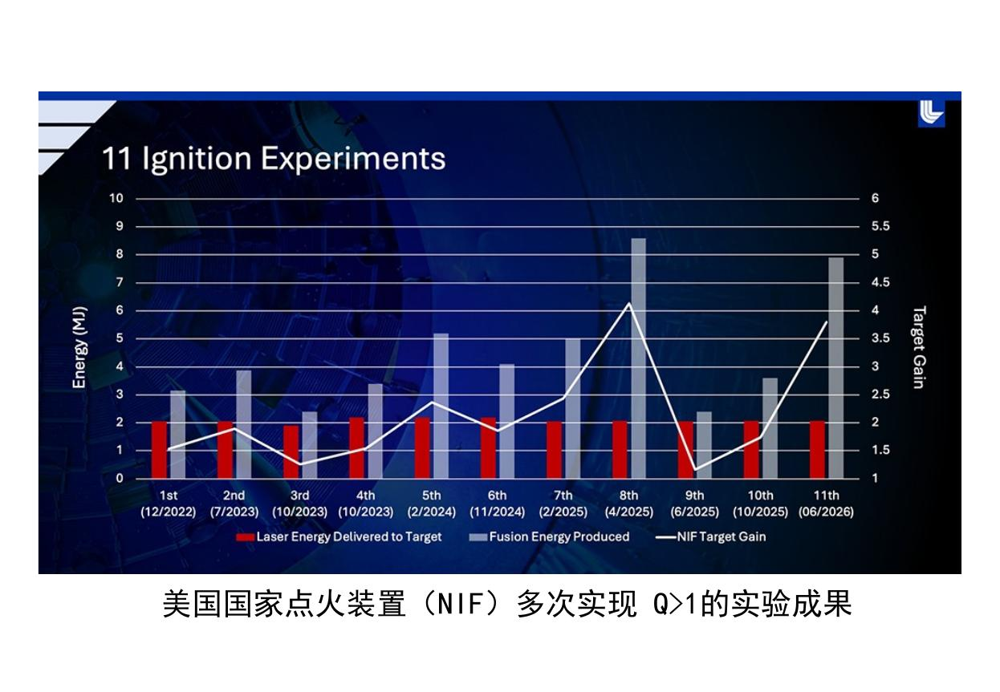

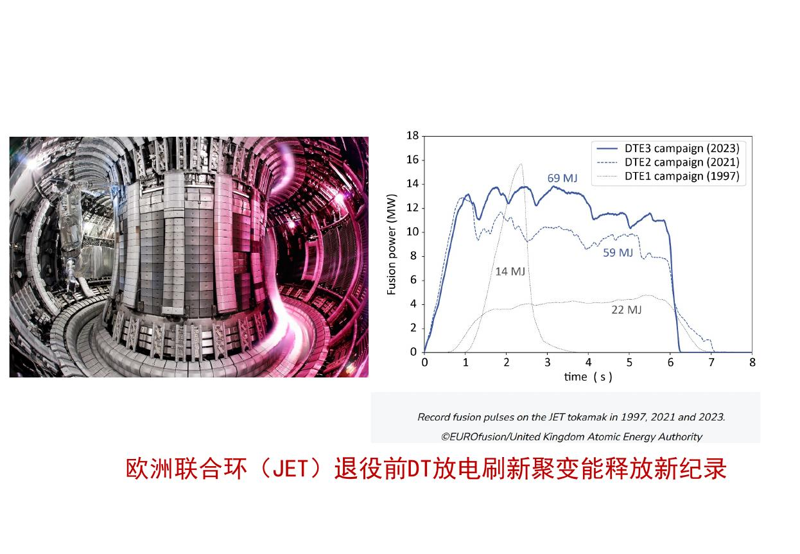

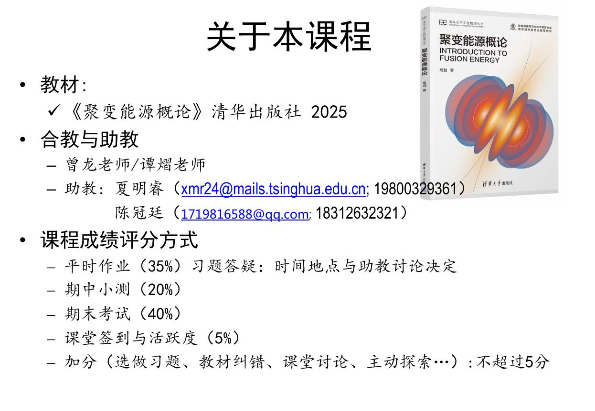

自测：一条新闻说“Q>1”，还缺哪些信息才能判断已净发电？

至少要知道 Q 的系统边界、输入输出的能量形式和时间范围，以及设备总耗电、能量转换效率和实际电力输出。不能只由靶增益推断电站净电力。

[课件来源与订正](Lecture_Source_Map.md) · [教材印刷p.1–2 / PDF第5–6页](../../Global/Raw/聚变能源概论_用户拍摄_前三章.pdf#page=5)

## 2. 能源、能量与转换：先读懂能源流图

**课件定义：** 能源是能够提供能量的资源。进一步限定为在人类文明相关的时间尺度内，能够被掌握和利用来提供可用能量的资源；不能因为某物“具有能量”就自动把它当作实用能源。

能量可以以动能、势能、化学能、内能、电磁场能等形式存在。课件第 12 页给出关于能量的多选题，图中四个选项均为绿色，但没有录音解释其判分依据。“能量是物质的一种形式”和“最终将转化为热”等表述有语境限制，复习时应抓住可量化、可转移、可转换和守恒，不把颜色本身当作严谨定义。“做功的能力”是入门描述；热力学中并非所有能量都能完全转化为有用功。

一次能源在自然界以原有形式存在，例如煤、太阳辐射；二次能源由一次能源加工转换而来，例如电力和作为能源载体的氢。**补充解释：** 氢被用作能源载体时，必须把制氢所需能量纳入来源分析；它的使用过程没有直接排碳，不等于上游无需消耗能源。

第 13 页的桑基图按“来源→转换/用能部门→有效服务与耗散”阅读，带宽代表能量流量。多个源流可以先进入发电，再进入住宅、商业和工业；右侧的耗散能不是能量凭空消失，而是没有成为所需的能源服务。图中的数字属于 2021 年美国示例，不能当作全球或本年度占比。

第 15/19 页进一步追溯来源：太阳辐射可驱动风、水循环、光合作用，进而联系水能、生物质和化石能源；潮汐、地热等分支又提示“所有能源都来自阳光”并不严谨。课件此图用于串起宏观能源与核过程，不能替代完整宇宙核合成分类。

**教材补充：评价一种能源，不只看“够不够多”。** 第1章把物理属性与社会、工程属性放在一起讨论：储能密度决定同样质量能提供多少能量，放能速率决定能够输出多少功率；资源能否获得、供给是否稳定、环境影响、安全与经济性决定能否真正使用。下面按本章归纳比较，不把书中的历史储量、成本和政策评价当作当前统计。

| 类型 | 本章强调的有利条件 | 同时需要考虑 |
|---|---|---|
| 化石能源 | 储运与转换技术成熟，便于按需使用 | 有限资源、污染与碳排放、地域分布 |
| 水能、风能、太阳能 | 可再生，利用自然能量流 | 地点、季节与时间变化，系统调节与储能 |
| 裂变能 | 单位质量释放能量高，可持续供电 | 燃料循环、余热、安全与废物处理 |
| 聚变能 | 燃料与高能量密度具有吸引力 | 放能反应不等于已实现可持续、经济的工程能源 |

**教材补充与校核：能量密度要验量纲。** 表1.1列煤约 \(2.7\times10^7\,\mathrm{J/kg}\)、铀-235约 \(8.2\times10^{13}\,\mathrm{J/kg}\)，比值约 \(3\times10^6\)，展示化学与核过程的量级差。但“提升到10m高度的水”列为 \(9.8\times10^4\,\mathrm{J/kg}\)，按 \(E/m=gh=9.8\times10=98\,\mathrm{J/kg}\) 不相符。计算采用明确的质量单位，不照抄疑似错项。

[教材印刷p.2–7 / PDF第6–11页](../../Global/Raw/聚变能源概论_用户拍摄_前三章.pdf#page=6)。

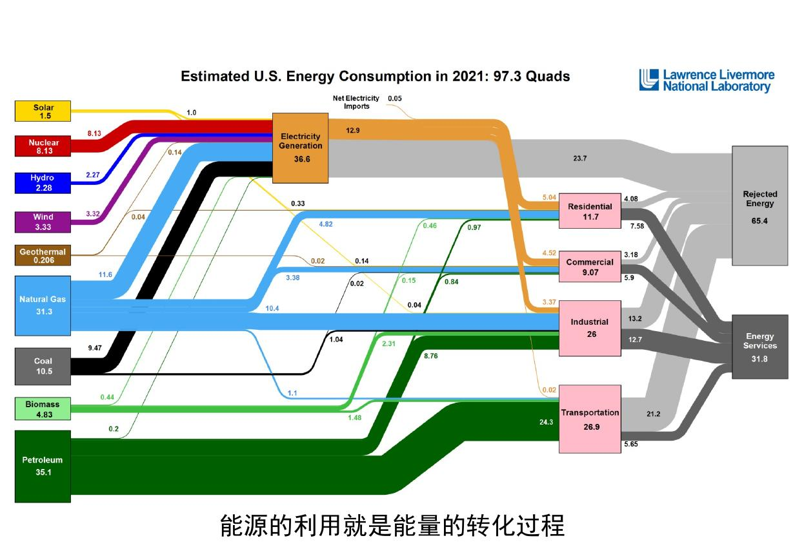

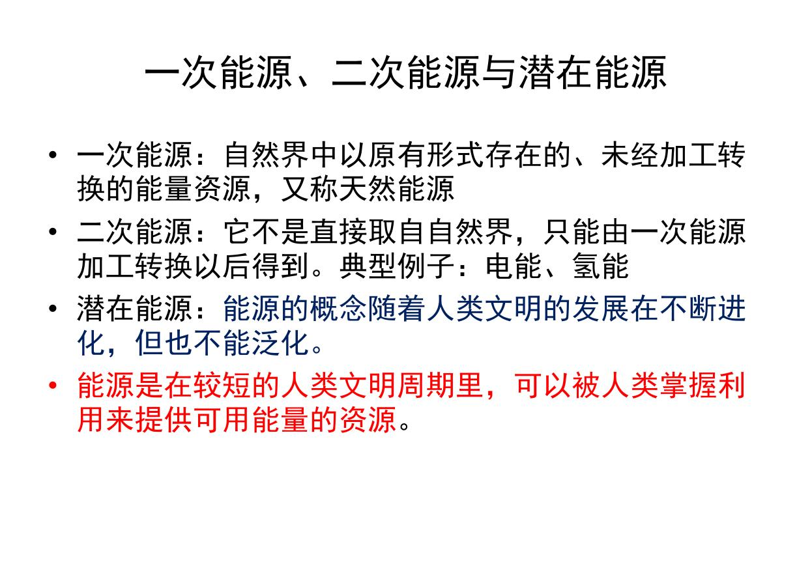

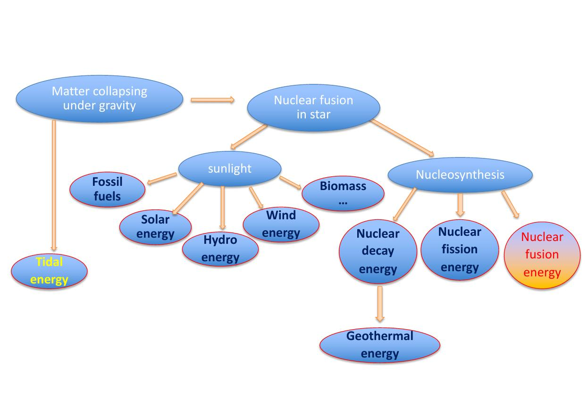

自测：电力为什么属于二次能源？能量守恒又为什么仍会有能源问题？

电力通常由一次能源转换得到。守恒并不保证资源能在需要的地点、时间、功率和成本下被利用，也不保证转换后的能量都能继续作有用功。

[课件来源与订正](Lecture_Source_Map.md) · [教材印刷p.2–7 / PDF第6–11页](../../Global/Raw/聚变能源概论_用户拍摄_前三章.pdf#page=6)

## 3. 质量亏损、结合能与“铁之谷”

用 \(Z\) 表示质子数，\(A\) 表示核子数，则中子数为 \(A-Z\)。把这些质子和中子分开放在一起，总静质量为 \(Zm_p+(A-Z)m_n\)；组成原子核后，核质量为 \(m(Z,A)\)。两者的差是质量亏损：

\[
\Delta m=Zm_p+(A-Z)m_n-m(Z,A),\qquad B=\Delta m c^2,\qquad \varepsilon=B/A.
\]

\(B\) 是把核完全拆成自由核子所需的能量，\(B/A\) 是平均每个核子的结合能。这里必须统一使用核质量；若采用原子质量，电子质量也要在反应前后正确计入或抵消。课件的“所有原子核都有正质量亏损”需限定为束缚的多核子体系，单个氢核没有内部核子间结合能。**教材核验：** [教材印刷p.11 / PDF第15页](../../Global/Raw/聚变能源概论_用户拍摄_前三章.pdf#page=15)式(2.1)–(2.3)与上述定义一致，并明确写出氢原子核例外。

第 23 页横轴为核子数，纵轴为**正的**比结合能。曲线从轻核总体上升，在铁附近有高峰，再向重核缓慢下降；第 24 页把图倒置，强调系统能量降低的“谷”。不能同时记成“结合能越大，体系能量越高越不稳定”。自由核子为参照时，结合后体系能量降低了 \(B\)。

**补充推导：** 对核子总数守恒、且质量记账一致的反应，释放能量为
\[
Q=(m_{\rm before}-m_{\rm after})c^2=B_{\rm after,total}-B_{\rm before,total}.
\]
所以轻核聚合、重核分裂都可能使总结合能增加而放能。应比较各产物的**总**结合能之和，不能把两条曲线高度直接相减当成反应能；更不能据曲线趋势断言任意轻核反应都放能。

课件标出氦核结合能约 28.3 MeV，而图上氦附近高度约 7.1 MeV/核子，两者并不矛盾：\(28.3/4\approx7.075\)。这也是检查自己有没有混淆总量与平均量的最直接例子。

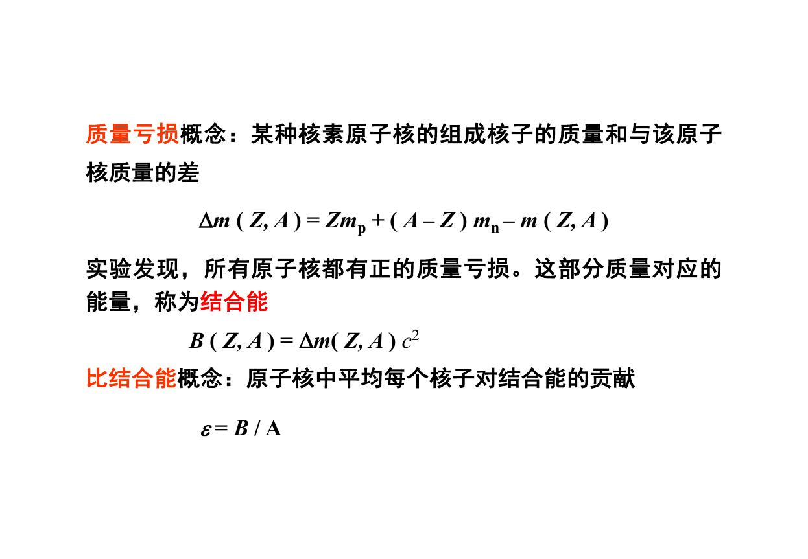

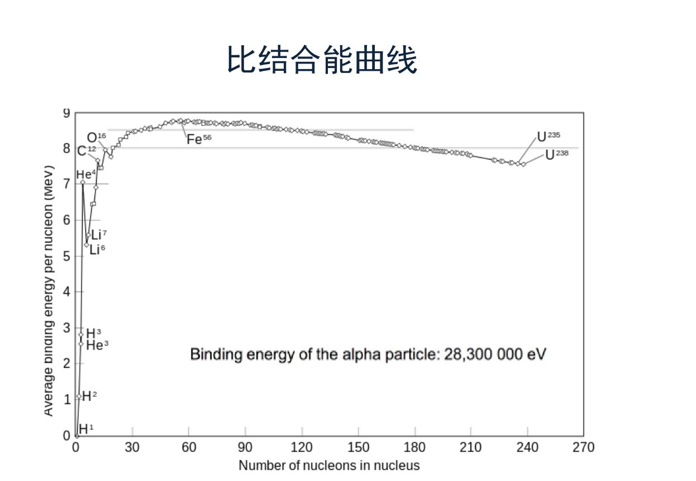

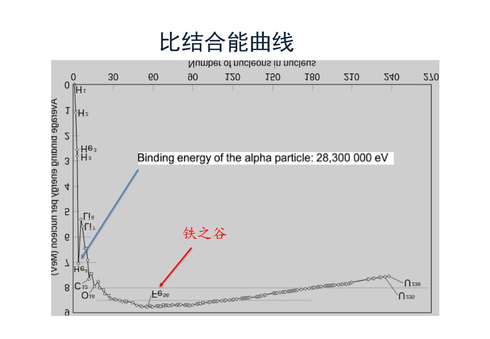

自测：氦核结合能约28.3 MeV，为什么比结合能图上不是28.3？

氦-4有4个核子，图的纵轴是平均每核子结合能，约7.075 MeV/核子。总结合能和比结合能不同。

[课件来源与订正](Lecture_Source_Map.md) · [教材印刷p.11 / PDF第15页](../../Global/Raw/聚变能源概论_用户拍摄_前三章.pdf#page=15)

## 4. 太阳能源问题：先有数量级矛盾，再寻找机制

太阳长期辐射能量，候选解释必须同时回答“储量有多少”和“以当前功率能够持续多久”。课件回顾化学燃烧、陨星供能和引力收缩等历史假说，并以太阳和地球的年龄作为约束：若一个机制只能维持远短于所需的时间，就不能作为长期主要能源的完整解释。

质量与能量的联系让人意识到，极小的质量差也可能对应巨大能量。Aston 的精密质量测量给出氢与氦的质量不满足简单整数加和，Eddington 据此讨论氢转成氦释放约 0.7% 质量所对应能量的可能性。第 27 页的 4 和 1.008 是历史说明的近似数值，不应作为现代精确质量表。

**补充推导：** 若有质量 \(m_f\) 的燃料、可释放质量份额 \(\eta_m\)，则可供能量约为 \(E=\eta_m m_f c^2\)，在功率 \(L\) 下维持时间为 \(t=E/L\)。这个算式只证明储量“可能足够”，还没有证明反应发生得足够快；这一缺口正好引出势垒、隧穿和核反应链。

第 28 页请学生调研 Rutherford 对核能前景的怀疑。缺少授课讨论，不能替老师补一个唯一答案。适当的思考方向是区分：单次核转变释放能量、用外部粒子引发反应时的能量成本、以及能否构成宏观持续过程。若写历史论证，还需查原始语境；本讲只保留问题。

**教材补充：三种早期解释分别在哪里遇到困难？** 燃烧假说的问题是总能量不足；陨星假说需要不断补入大量质量，却缺少相应的太阳质量增长和行星轨道变化证据；引力收缩可以比燃烧持续更久，但仍无法覆盖重新认识后的地球/太阳年龄尺度。教材还解释，忽略地球内部放射性热源会低估地球年龄，因而让较短的太阳供能时间一度显得可接受。

**补充推导：把“燃烧时间太短”算出来。** 为看量级，假设整个太阳质量 \(M=2\times10^{30}\,\mathrm{kg}\) 都能按煤的比能 \(q=2.7\times10^7\,\mathrm{J/kg}\) 放能，取教材题2.2的光度 \(L=3.845\times10^{26}\,\mathrm W\)，则
\[
t_{\rm chem}\sim\frac{Mq}{L}
=\frac{(2\times10^{30})(2.7\times10^7)}{3.845\times10^{26}}
\approx1.4\times10^{11}\,\mathrm s
\approx4.5\times10^3\,\mathrm{年}.
\]
这是理想化储量估计，不考虑氧化剂来源与传热细节；它已足以显示“几千年”和恒星长期存在之间的巨大差距。教材叙事、课件历史图与这段编者验算要分开识别。

[教材印刷p.4 / PDF第8页](../../Global/Raw/聚变能源概论_用户拍摄_前三章.pdf#page=8)、[教材印刷p.8–10 / PDF第12–14页](../../Global/Raw/聚变能源概论_用户拍摄_前三章.pdf#page=12)、[教材印刷p.13 / PDF第17页](../../Global/Raw/聚变能源概论_用户拍摄_前三章.pdf#page=17)。

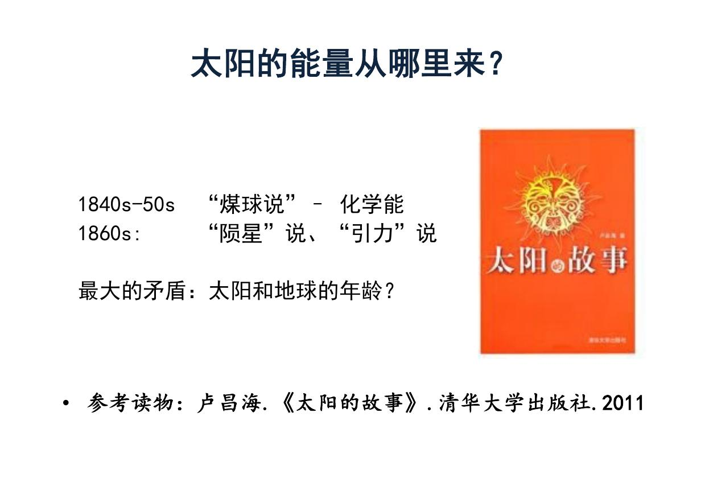

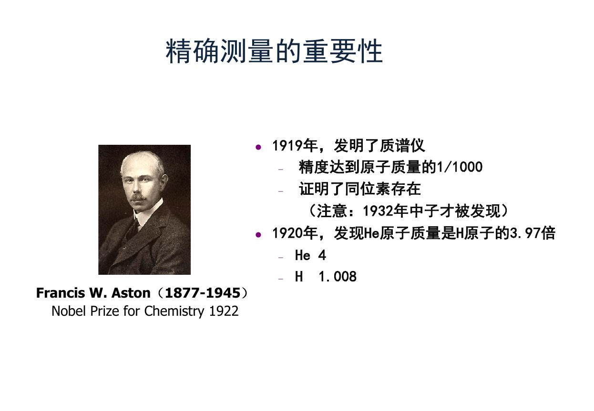

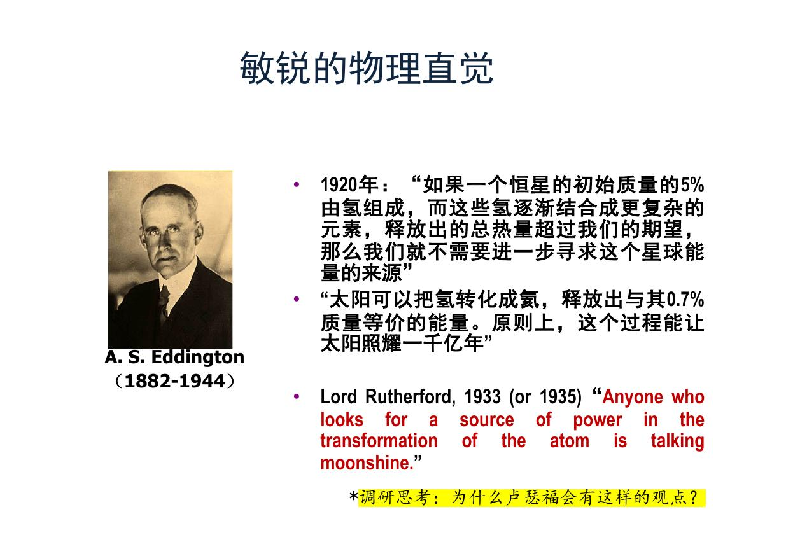

自测：证明燃料储量足够，是否就证明能够持续供能？

不能。还要有实际反应途径、足够的速率及维持条件；储量给总能量，速率决定功率。

[课件来源与订正](Lecture_Source_Map.md) · [教材印刷p.8–10 / PDF第12–14页](../../Global/Raw/聚变能源概论_用户拍摄_前三章.pdf#page=12)

## 5. 为什么高温仍需要量子隧穿

第 29 页太阳剖面图把高温反应区放在核心，外面有辐射区、对流区和较冷的光球。不能用可见表面的约 6000 K 来代表反应核心；图中核心约 \(1.4\times10^7\) K。

两个带正电的核在相距较远时受库仑排斥，只有靠近到核力作用的短距离，才可能形成更强束缚的产物。第 30 页横轴为核间距，向左表示两核靠近；曲线先升高形成势垒，再进入短程吸引区域。曲线标注的 17.6 MeV 是示意所用反应的能量尺度，不能当作 pp 链每一步的能量。

课件给出 \(1\,\mathrm{eV}\leftrightarrow11600\,\mathrm K\)。**补充推导：** 这个换算说的是 \(k_BT=1\) eV，并非温度与能量具有相同量纲。用图中核心温度估算，\(k_BT\approx1.4\times10^7/11600\approx1.21\times10^3\) eV，即约 1.2 keV，远低于图示 0.5 MeV 的势垒尺度。经典的“所有粒子翻过势垒”不能解释全部反应；能量分布的高能尾与量子隧穿共同决定发生概率。

课件随后把隧穿、发现中子、弱相互作用理论和核力认识列为理论铺垫，再引出 Bethe 的恒星能源理论。这里重点记各理论解决什么问题：隧穿解释穿越势垒的可能，弱过程联系质子向中子的转变，核反应理论组织完整反应链。**教材订正依据：** [教材印刷p.10 / PDF第14页](../../Global/Raw/聚变能源概论_用户拍摄_前三章.pdf#page=14)写汤川秀树于1935年提出核子的介子理论，与PPT第31页的1932不同；本讲正文采用教材的1935，来源记录保留原课件冲突。这是教材核对，未进一步查历史一手文献。

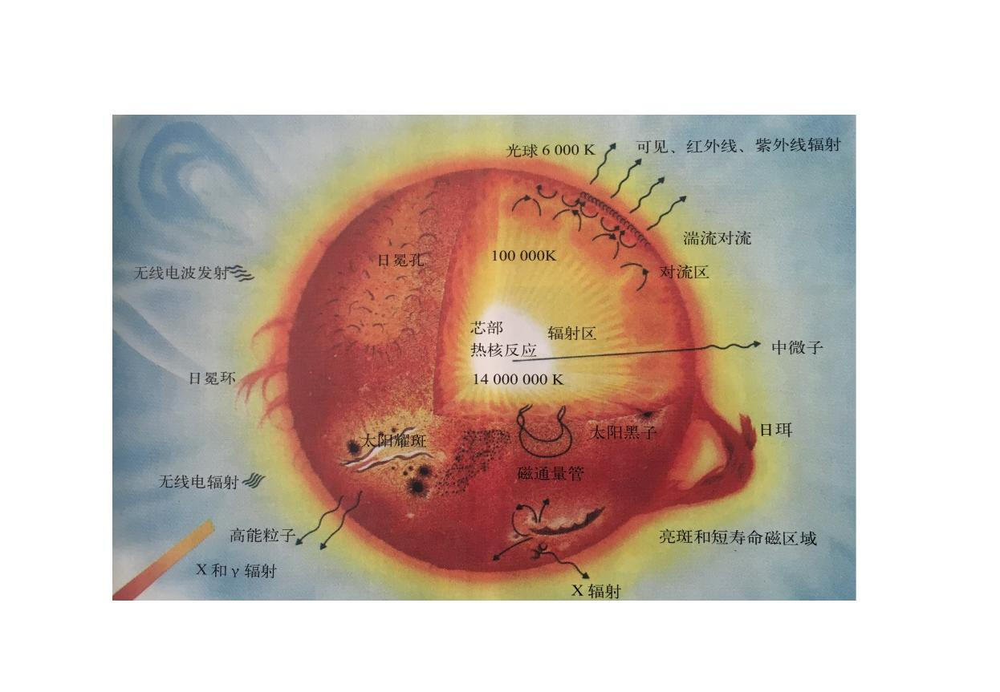

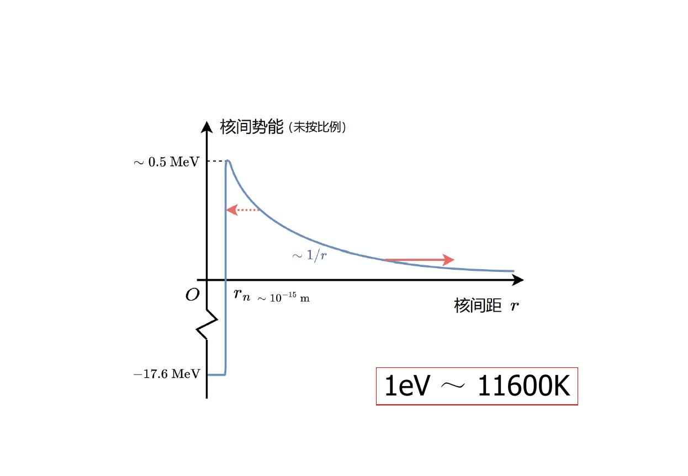

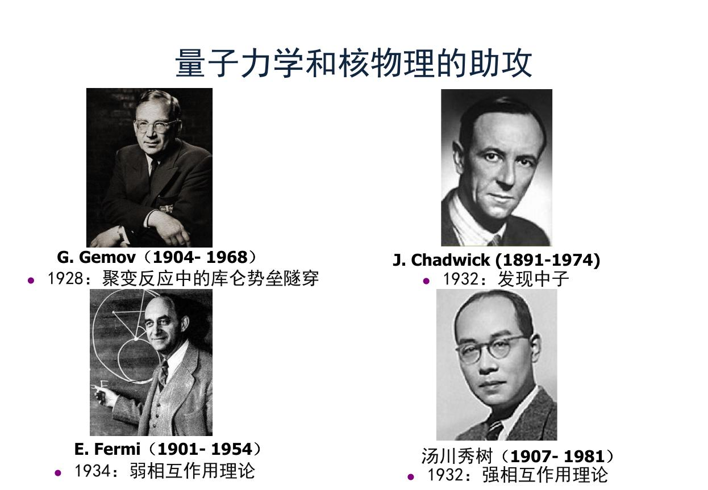

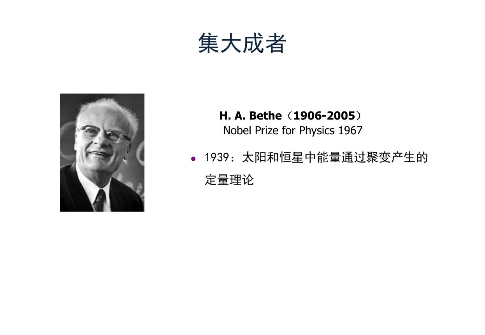

自测：太阳核心热运动能量低于图示势垒，为什么仍能有聚变？

粒子能量有分布，且量子粒子存在隧穿概率；反应率取决于分布与能量相关反应概率的共同作用。不能把kBT视为所有粒子的相同能量。

[课件来源与订正](Lecture_Source_Map.md) · [教材印刷p.9–10 / PDF第13–14页](../../Global/Raw/聚变能源概论_用户拍摄_前三章.pdf#page=13)

## 6. ppI 链：逐步数清到底消耗了几个质子

课件给出三步：

\[
p+p\rightarrow d+e^++\nu_e,\qquad
d+p\rightarrow{}^3\mathrm{He}+\gamma,\qquad
{}^3\mathrm{He}+{}^3\mathrm{He}\rightarrow{}^4\mathrm{He}+2p.
\]

\(d\) 为氘核，\(e^+\) 为正电子，\(\nu_e\) 为电子中微子，\(\gamma\) 为光子。第一步把两个质子结合为一质子一中子的氘，其中发生弱相互作用；图中单独圈出的 \(p\to n+e^++\nu_e\) 是链内转变的示意，不能当作自由质子在真空中的自发衰变方程。

**补充推导：合并反应。** 为得到最后一步所需的两个氦-3，前两步必须各发生两次。最初共投入六个质子，最后返还两个，所以净消耗四个。消去中间的两个氘和两个氦-3后，净产物是一个氦-4、两个正电子和两个中微子。课件用约 26.7 MeV 表示完整氢转氦过程的能量尺度；使用这个常见总值时包含后续正电子湮没的记账，不能把它当成裸核净反应动能的独立精确值，也不能默认所有能量都在当地沉积，因为中微子可以带走能量。

复习反应式时先检查质量数和电荷：第一步左侧电荷2，右侧氘核1加正电子1；质量数2保持。最后一步质量数6变为4+1+1，电荷4变为2+1+1。这样比只记“氢变氦”更能发现漏掉的粒子。

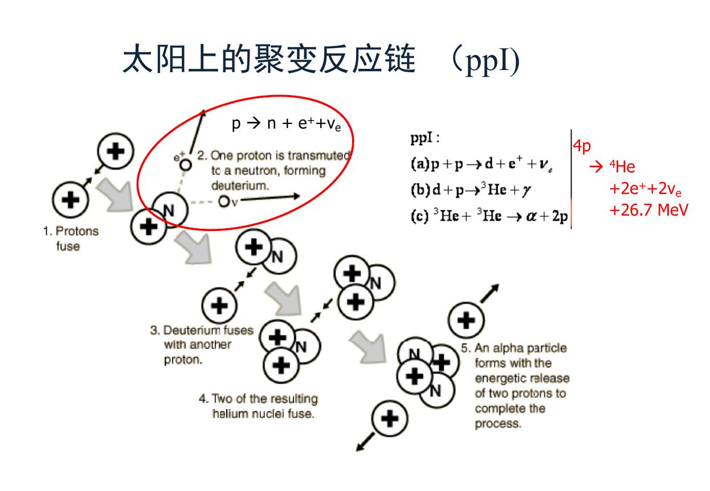

自测：为什么第三步出来两个质子，净反应仍然消耗四个质子？

前两步各重复两次，共投入6个质子；第三步返还2个，净消耗6−2=4个。氘和氦-3只是中间产物。

[课件来源与订正](Lecture_Source_Map.md) · [教材印刷p.11–12 / PDF第15–16页](../../Global/Raw/聚变能源概论_用户拍摄_前三章.pdf#page=15)

## 7. ppII、ppIII 与 CNO：不同路线，共同的净结果

pp 链并不只有一种结尾。第 34 页把 ppII、ppIII 接在氦-3已经形成之后：氦-3先与氦-4结合成铍-7。ppII 中，铍-7俘获电子变成锂-7，锂-7再与质子反应产生两个氦-4；ppIII 中，铍-7先俘获质子形成硼-8，再经正电子衰变和不稳定铍-8的分解形成两个氦-4。共同的种子氦核在净记账中抵消，整体仍对应氢转氦。

课件的温度阈值和比例是入门尺度提示。反应分支的相对强弱会随条件变化，不能理解为跨过某个温度就瞬间只剩一条路线。现已核查[教材印刷p.11–12 / PDF第15–16页](../../Global/Raw/聚变能源概论_用户拍摄_前三章.pdf#page=15)：教材同样给出ppI约85%和温度升高后分支变化的入门说明，但此处没有完整占比曲线，因此仍不把阈值写成适用于全部恒星的硬切换。

CNO 图从碳-12出发，依次经历：俘获质子成氮-13，正电子衰变成碳-13；再俘获质子成氮-14，继续俘获成氧-15；正电子衰变成氮-15，最后与质子反应回到碳-12并放出氦-4。

**补充推导：** 环路中的碳-12在末尾再生，其余碳、氮、氧核是中间环节。逐项消去中间核后，共消耗四个质子，得到一个氦-4及两次弱过程的轻子。因此这里的 CNO 起循环媒介作用，并非净消耗一个碳核来供能。CNO 路线在更大质量恒星的讨论中出现，是因为反应率对温度及物质组成有依赖；不能仅凭字母不同就判为完全不同的能量来源。

教材补充：把ppII、ppIII的分支反应写完整

共同入口为 \({}^3\mathrm{He}+{}^4\mathrm{He}\rightarrow{}^7\mathrm{Be}+\gamma\)。随后：
\[
\begin{aligned}
\mathrm{ppII}:\quad&{}^7\mathrm{Be}+e^-\rightarrow{}^7\mathrm{Li}+\nu_e,\\
&{}^7\mathrm{Li}+p\rightarrow2{}^4\mathrm{He};\\
\mathrm{ppIII}:\quad&{}^7\mathrm{Be}+p\rightarrow{}^8\mathrm{B}+\gamma,\\
&{}^8\mathrm{B}\rightarrow{}^8\mathrm{Be}^{*}+e^++\nu_e,\\
&{}^8\mathrm{Be}^{*}\rightarrow2{}^4\mathrm{He}.
\end{aligned}
\]
星号表示激发态。ppII用电子俘获，ppIII含正电子衰变，不能省略轻子的电荷记账。与形成氦-3的前段合并并计入电子/正电子后，净过程都是氢转氦；但不同分支的中微子能谱和能量沉积分配并不完全相同。

[教材印刷p.12 / PDF第16页](../../Global/Raw/聚变能源概论_用户拍摄_前三章.pdf#page=16)图2.3；式子展开与电荷核对为编者说明。

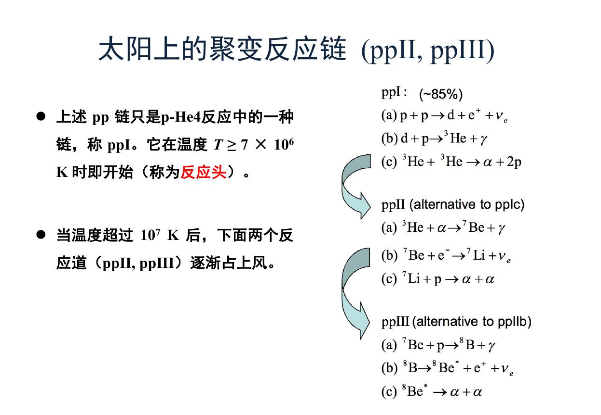

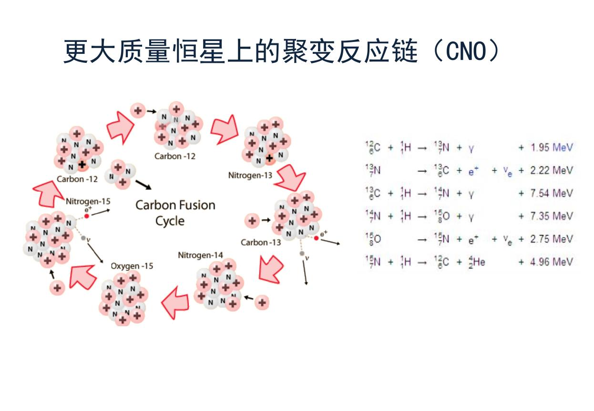

自测：CNO循环结束后碳-12去了哪里？

碳-12在最后一步重新生成，净反应中抵消。环路净消耗的是氢；中间核反应和衰变负责提供一条实现净转化的途径。

[课件来源与订正](Lecture_Source_Map.md) · [教材印刷p.12 / PDF第16页](../../Global/Raw/聚变能源概论_用户拍摄_前三章.pdf#page=16)

## 8. 怎样检验太阳模型，哪些概括不能无限推广

“可以写出放能反应”只完成模型的一部分。第 36 页列出寿命与温度、组成元素、中微子三方面检验：机制要能支持观察到的长期辐射，物质组成要允许反应发生，反应产生的可探测粒子还要与观测相符。

**补充解释：** 这些检验并非互相替代。某模型给出足够总能量，却预测完全不相容的温度或粒子产额，仍然有问题。由反应方程可预期中微子这一独立信号，构成从“能量足够”走向“具体机制受检验”的关键一步。

第 37 页以恒星分层与宇宙演化示意展望更重元素的形成，作用是把太阳能源联系到物质来源。图中也出现引力收缩、超新星和中子过程，因此正文不将“恒星中所有能量都来自聚变”“除质子外全部元素都由恒星聚变形成”作为没有例外的定律。此处应掌握的限定结论是：恒星核反应是理解恒星能源与许多元素来源的重要途径；不同演化阶段及不同核素需要分别讨论。**教材校核：** [教材印刷p.13 / PDF第17页](../../Global/Raw/聚变能源概论_用户拍摄_前三章.pdf#page=17)写“比结合能最低的铁、镍”，但[教材印刷p.11 / PDF第15页](../../Global/Raw/聚变能源概论_用户拍摄_前三章.pdf#page=15)的定义与正的比结合能曲线表明应为铁镍附近较高。原页保留，不把正结合能与负的束缚体系能量混为一谈。

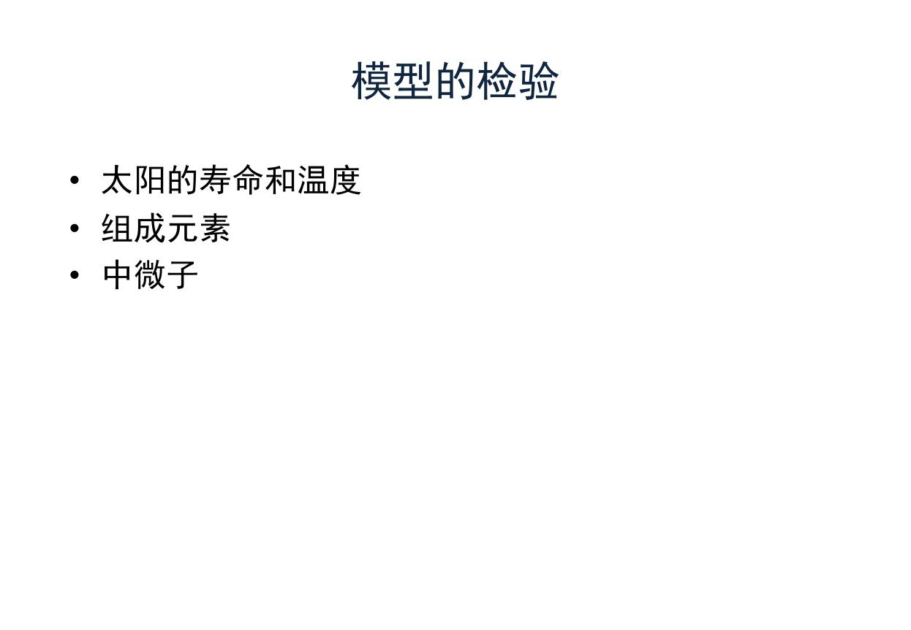

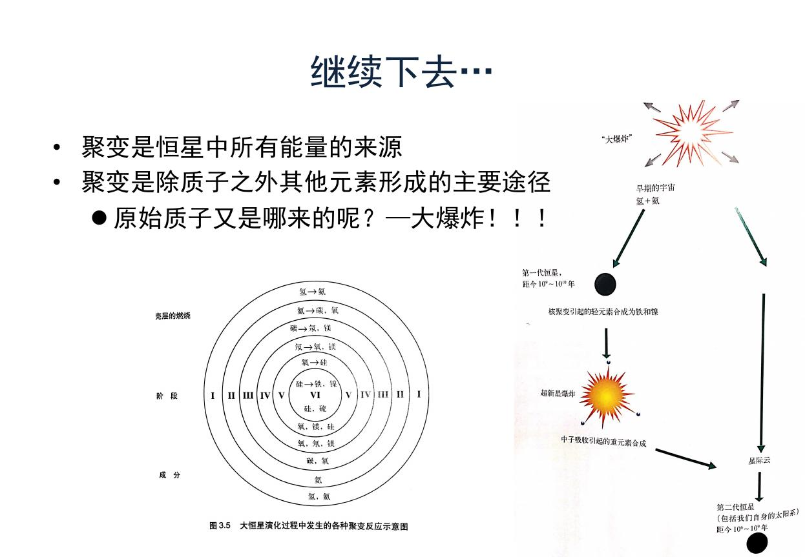

自测：为什么中微子能给太阳能源模型增加独立证据？

因为具体核反应链预言特定粒子产出。它约束反应机制本身，而不只是检查模型能量总额是否足够。

[课件来源与订正](Lecture_Source_Map.md) · [教材印刷p.10–13 / PDF第14–17页](../../Global/Raw/聚变能源概论_用户拍摄_前三章.pdf#page=14)

## 9. 地球不能原样照搬太阳：约束与功率密度是两道问题

第 39 页问题的关键语境是**原样采用太阳的引力约束和 pp 反应路线作为地面能源**。图中 A“约束条件达不到”和 C“反应缓慢、功率密度太低”显示为绿色，B、D为灰色；据原图保留 A/C 的提示，但无口头讲解可供核实。

太阳的大质量造成引力约束，内部压强梯度与引力平衡。课件给出维持氢燃烧所需最低恒星质量约太阳质量的8%，这是恒星模型尺度，不是地面容器加热到同一温度即可复制的条件。

**补充推导（数量级，不是精确恒星结构解）：** 用 \(\rho\sim M/R^3\)、\(g\sim GM/R^2\)，压强变化尺度满足 \(P/R\sim\rho g\)，从而 \(P\sim GM^2/R^4\)。再以理想气体 \(P\sim nk_BT\)、\(n\sim M/(\mu m_pR^3)\) 估计，可得 \(k_BT\sim GM\mu m_p/R\)。系数和具体分布没有求出；更不能用这个简单模型取代选做题要求考虑的电子简并压强。

pp 链第一步是很慢的弱过程。课件第 41 页用截面约 \(10^{-54}\,\mathrm{m^2}\)、核心粒子数密度约 \(10^{32}\,\mathrm{m^{-3}}\) 和十亿年量级反应等待时间说明：太阳的长寿与人造能源所需的高功率恰好是不同需求。截面要联系粒子能量，不能当作对所有温度恒定的几何面积。

**教材补充与预习：从反应概率走到功率密度。** 第3章§3.2.1把截面 \(\sigma\) 定义为概率意义上的有效面积，单位为 \(\mathrm{m^2}\)（\(1\,\mathrm b=10^{-28}\,\mathrm{m^2}\)），不是简单量出原子核半径所得的硬球面积。对于靶粒子密度 \(n_2\)、相对速度 \(v\)，每个入射粒子的反应频率为 \(\nu=n_2\sigma v\)；乘入射粒子密度 \(n_1\)，再对速度分布平均：
\[
r_{12}=n_1n_2\langle\sigma v\rangle,\qquad
[\langle\sigma v\rangle]=\mathrm{m^3/s},\qquad
[r_{12}]=\mathrm{m^{-3}s^{-1}}.
\]
**补充推导：** 上式按可区分的两群粒子计数。对同一群相同粒子，每一对会被数两遍，应写 \(r=\tfrac12n^2\langle\sigma v\rangle\)。若每次反应在所选系统内可利用的能量为 \(Q_r\)，则 \(p_V=rQ_r\)。这才把“单次放能”与“每秒每立方米放多少能”联系起来。

教材给pp过程 \(\langle\sigma v\rangle\sim2\times10^{-49}\,\mathrm{m^3/s}\)、\(n\sim10^{32}\,\mathrm{m^{-3}}\)。每个质子的反应频率 \(\nu=n\langle\sigma v\rangle\sim2\times10^{-17}\,\mathrm{s^{-1}}\)，等待时间量级为 \(\nu^{-1}\sim5\times10^{16}\,\mathrm s\)，即十亿年量级。这是给定太阳条件的估计，不是所有温度下的常数；它解释了太阳慢燃烧能长寿，却不适合直接做地面高功率能源。

预习时必须读懂的条件：薄靶、分布与温度单位

- 薄靶推导的 \(\Delta N/N\approx n\sigma h\) 要求 \(n\sigma h\ll1\)，不能把概率算到大于1；均匀介质、截面视为不变且反应移除粒子时，存活通量为 \(I(x)=I_0e^{-n\sigma x}\)。
- \(\langle\sigma v\rangle\) 按两种粒子的速度分布加权平均，\(v=|\mathbf v_1-\mathbf v_2|\)。教材式(3.19)的热平衡特式要求两种粒子都是麦克斯韦分布且同温。
- 教材从式(3.8)起把 \(k_B\) 吸收入温度，\(T\) 具有能量单位。若用开尔文温度 \(T_K\)，指数分母等位置应写 \(k_BT_K\)，不能把K数值直接放进keV公式。
- 图3.3比较分布权重与截面，提示反应贡献峰不必在 \(E=k_BT_K\)。课件要求预习这一概念，不代表第3章全部反应与推导都在L01讲完。

[教材印刷p.16–20 / PDF第20–24页](../../Global/Raw/聚变能源概论_用户拍摄_前三章.pdf#page=20)式(3.1)–(3.19)；pp速率数据见[教材印刷p.12 / PDF第16页](../../Global/Raw/聚变能源概论_用户拍摄_前三章.pdf#page=16)。薄靶不等式和同种粒子计数为补充说明。

课件第 42 页将太阳总体、核心与商业电站作数量级对比。**数值疑点：** 其“总体0.01 W/m³”和“0.0002 W/kg”不能直接视为相互等价。用同份课件的太阳质量和半径，\(\bar\rho=M/(4\pi R^3/3)\approx1406\,\mathrm{kg/m^3}\)，则 \(0.0002\bar\rho\approx0.281\,\mathrm{W/m^3}\)，与0.01不符。**新增教材核查：** [教材印刷p.13 / PDF第17页](../../Global/Raw/聚变能源概论_用户拍摄_前三章.pdf#page=17)也印有总体0.01 W/m³，所以它不是转录造成的错误。进一步用同页题2.2的光度 \(L=3.845\times10^{26}\,\mathrm W\) 和课件半径 \(R=6.966\times10^8\,\mathrm m\)，计算 \(L/(4\pi R^3/3)\approx0.27\,\mathrm{W/m^3}\)。这是全太阳球体平均功率密度的明确口径，与约0.0002 W/kg相容，与0.01不相容。原材料保留，0.01的口径/误印原因待确认；复习计算采用写清依据的约0.27，不因书和课件重复出现就消除冲突。

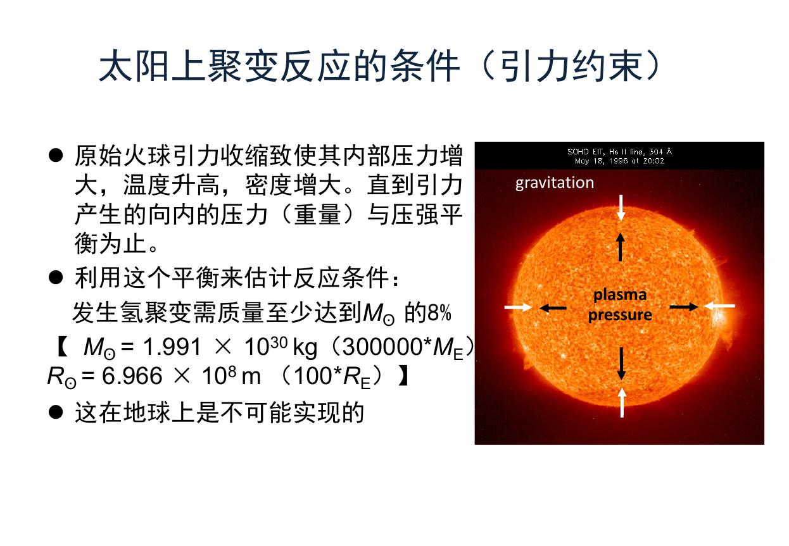

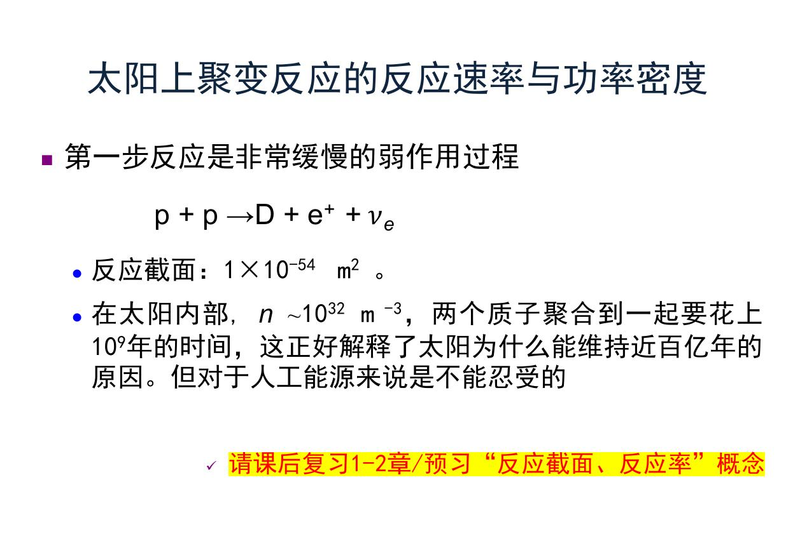

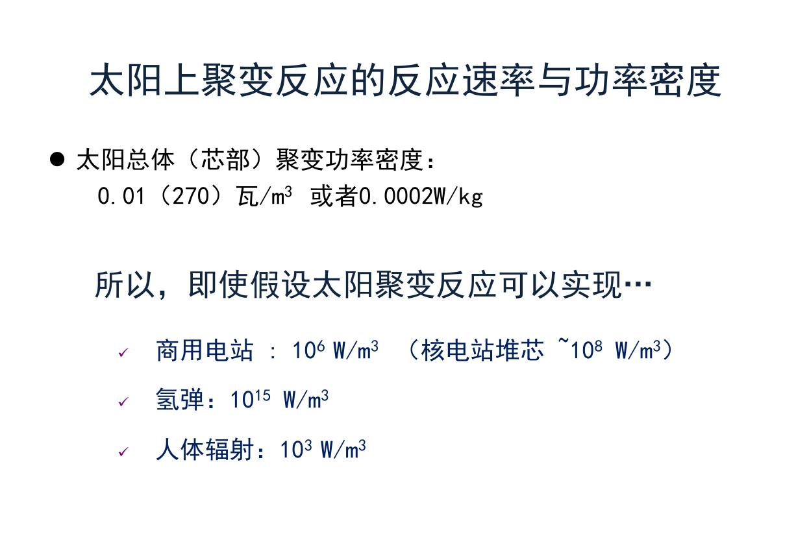

自测：太阳总功率巨大，为什么不能据此断定其单位体积功率很高？

总功率=功率密度的体积积分。太阳体积极大，总量与单位体积量必须区分；工程装置关心有限体积、成本和时间内的可用功率。

[课件来源与订正](Lecture_Source_Map.md) · [教材印刷p.12–13 / PDF第16–17页](../../Global/Raw/聚变能源概论_用户拍摄_前三章.pdf#page=16)

## 10. 课后要求与一次完整复习的落点

沿这条线复述本讲：能源需求 → 核质量差能放能 → 太阳长期辐射需要合适的储量与速率 → 隧穿和核物理使反应链成为可能 → pp/CNO把氢转成氦 → 观测检验模型 → 太阳的约束与反应率不宜原样搬到地球 → 下一讲寻找地面可用的聚变反应。

课件第 41 页要求复习教材第1–2章、预习反应截面和反应率。第44页列作业 **1.2、1.3、2.2**，**2.3为选做**，通过网络学堂提交。选做提示为温度、质量、密度/半径的关系，需考虑电子简并压强。

**教材题面已补齐：以下按你提供的实际页面整理。** 数值、假设和小问保留；选做标记及电子简并提示来自课件。这里提供题面与定位，不默认代做作业。

### 作业1.2 · 太阳能使用效率与面积

在地球表面，太阳直射时每平方米辐射功率约为1400 W。请：

1. 考虑太阳每天的照射时间、角度、天气因素、转换效率，估计一个合理的太阳能使用效率。
2. 按照每人每天消耗52 kWh能量计算，估计每人需要多大面积的太阳能提供才能满足要求。

### 作业1.3 · 海水中的氘

假设可以实现氘氘聚变，估算海水中的氘可以提供的聚变能量。

以上两题见 [教材印刷p.7 / PDF第11页](../../Global/Raw/聚变能源概论_用户拍摄_前三章.pdf#page=11)。**读题提醒：** 1.2的1400 W按“每平方米”的语义用作面积辐照功率，估算应列明效率因子；1.3未明确D-D是只计初级反应还是包含后续催化反应，计算时先说明口径，不暗换成D-T。相关反应见教材§3.5（印刷24–25页）。

展开教材原页：第1章思考题

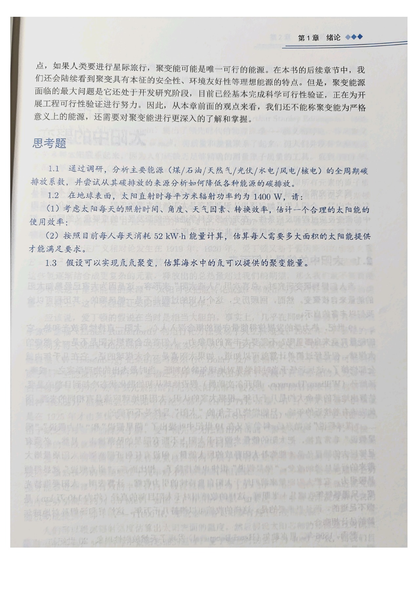

### 作业2.2 · 太阳燃料还能维持多久

天文观测表明太阳辐射的总功率（太阳的光度）为 \(3.845\times10^{26}\,\mathrm W\)。如果这些辐射能量均来自质子-质子循环（不考虑CNO循环），那么太阳现有的质量（假设全为质子）还可以维持多少年？

### 作业2.3 · 恒星质量下限（课件标为选做）

利用氢聚变的引力约束条件，估计恒星质量的下限。

以上两题见 [教材印刷p.13 / PDF第17页](../../Global/Raw/聚变能源概论_用户拍摄_前三章.pdf#page=17)。**条件提醒：** 2.2“全为质子”是题设模型，不是对真实太阳组成与可燃烧质量份额的断言；2.3考虑电子简并压强是PPT第44页提示，不能只凭本讲的理想气体量级式宣称完成。

展开教材原页：第2章思考题及约束条件

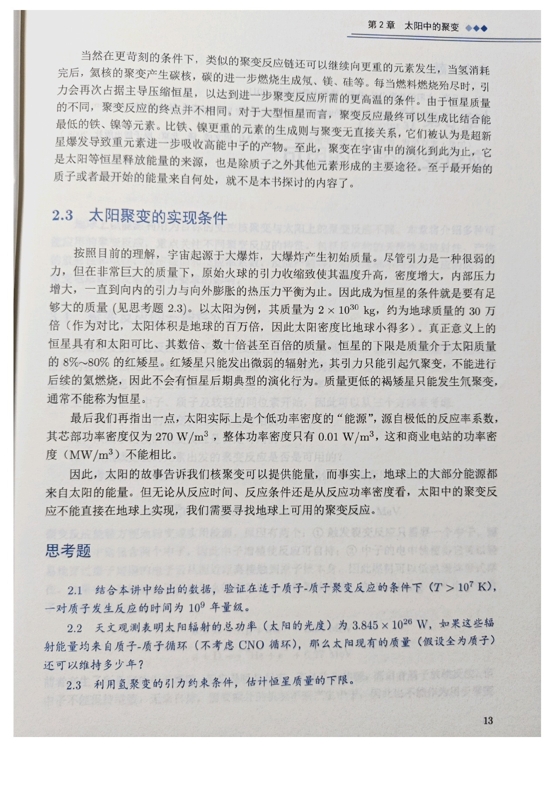

**教材阅读路线：** 本讲复习第1章（印刷1–7）和第2章（8–14）；预习§3.2.1（16–20）的截面、反应率和温度单位。第3章其余内容已归档可查，不扩充为本讲已授内容。

阅读过程中若卡在 pp 链，可回第6节逐步消去中间项；若卡在“放能却难利用”，回第5和第9节分别检查势垒、约束和速率。没有录音时，能恢复的是课件所承载的知识结构及明确的编者解释，无法保证恢复教师全部讲法。

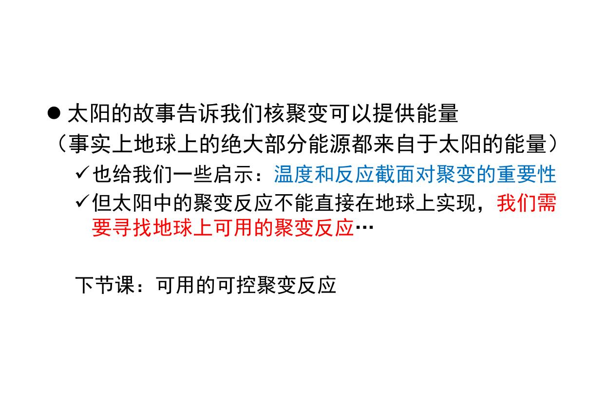

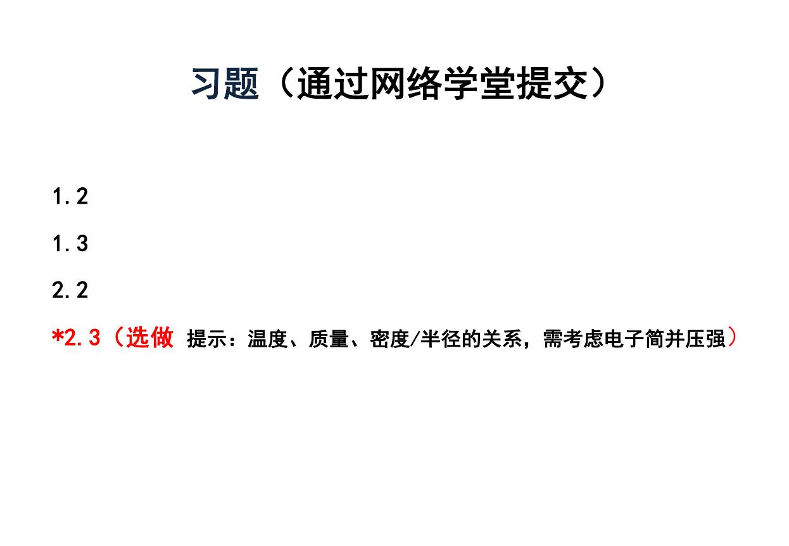

自测：本讲留给下一讲的核心问题是什么？

选取适合地面条件的核聚变反应，并进一步考虑如何获得足够反应率、实现约束和回收可用能量。

[课件来源与订正](Lecture_Source_Map.md) · [教材印刷p.7–13 / PDF第11–17页](../../Global/Raw/聚变能源概论_用户拍摄_前三章.pdf#page=11)

