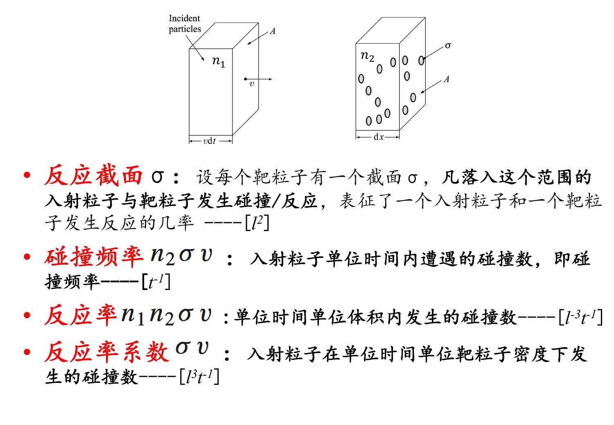
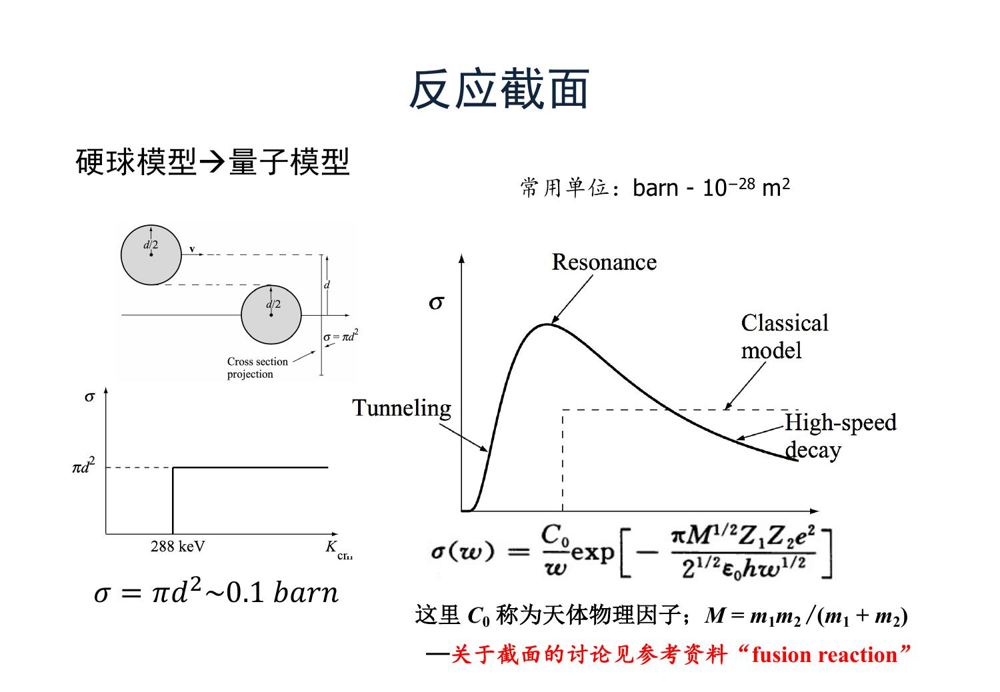
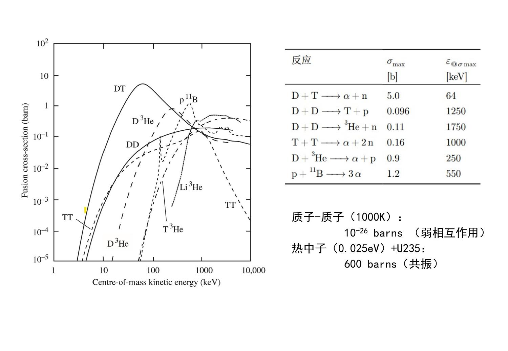
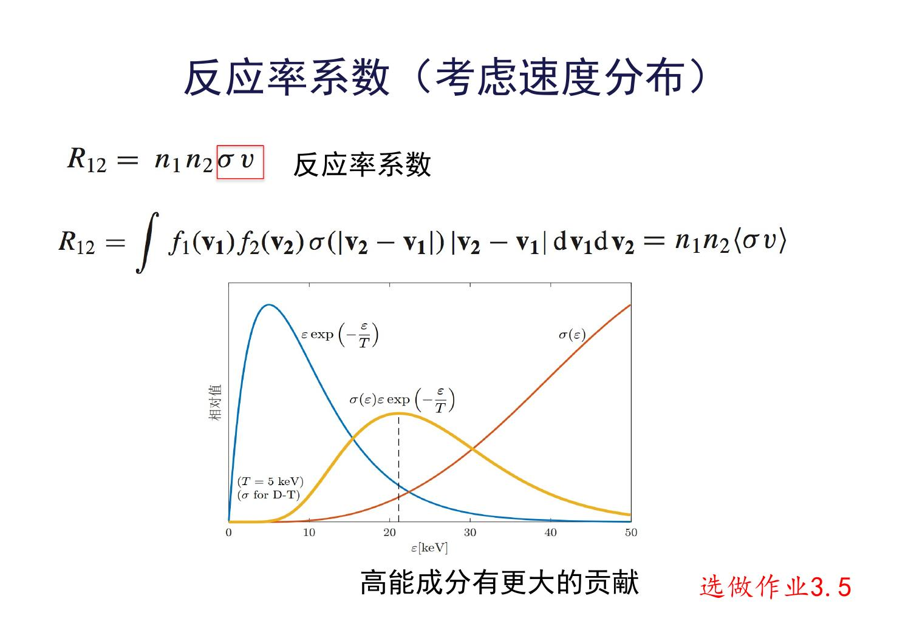
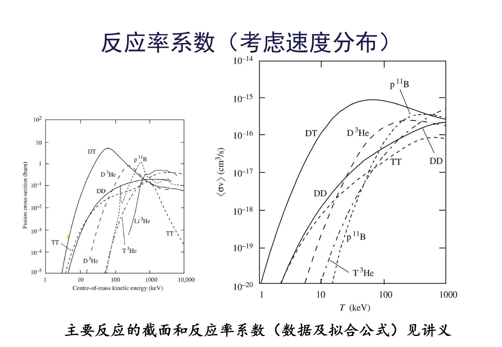
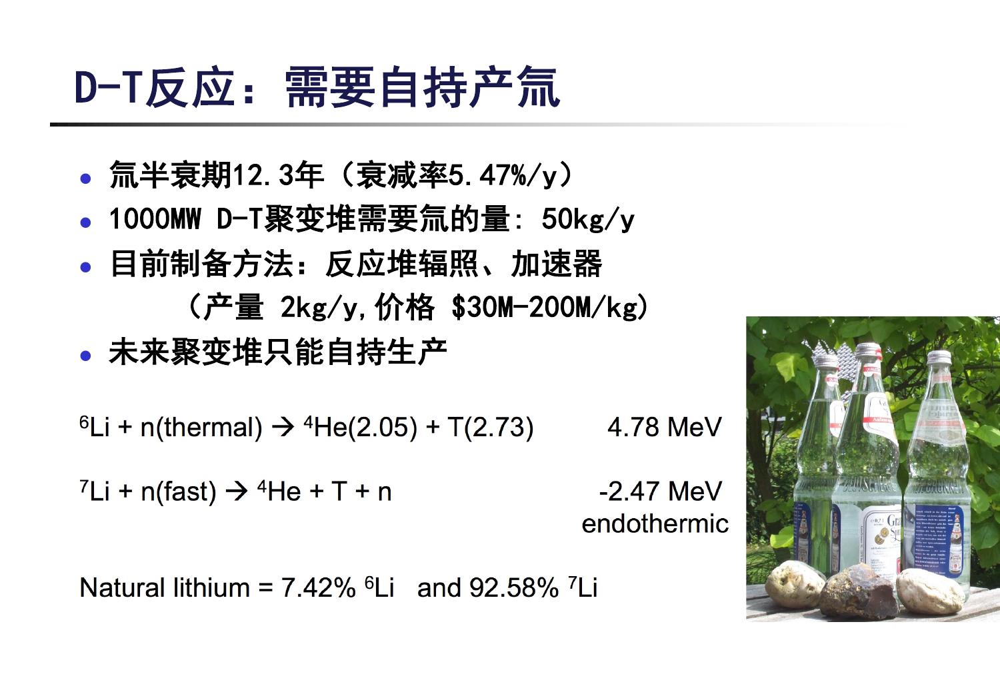
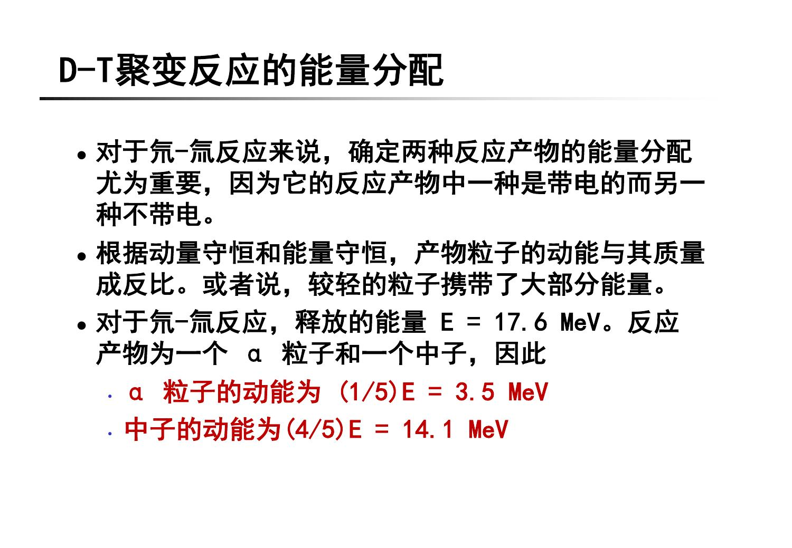
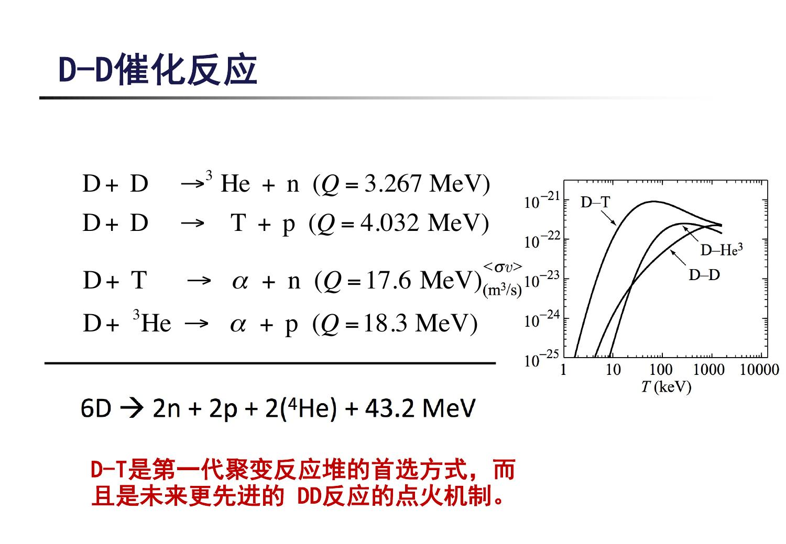
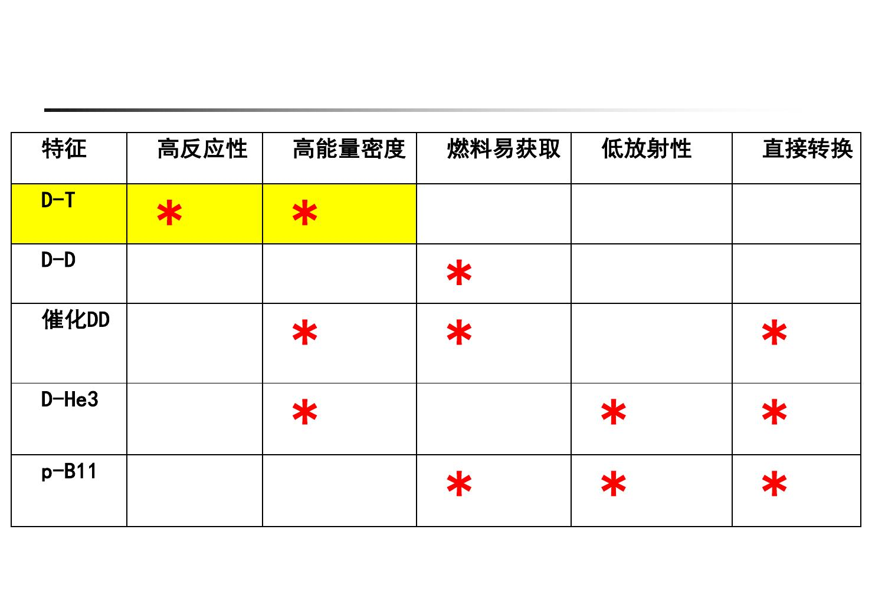
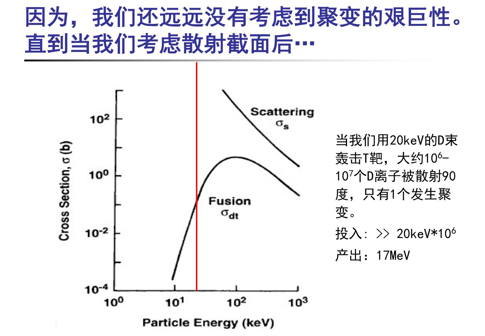

# 第二讲：可用的聚变反应

太阳能靠聚变长期发光，地球上的反应堆应选哪些反应？本讲把反应性、燃料和产物放在一起比较。从反应式走到反应率与功率密度，就能理解D–T为何优先，以及先进燃料的吸引力与困难分别在哪里。

[来源与订正](Lecture_Source_Map.md)

## 1. 从太阳的启示回到地球

太阳说明核聚变可以提供巨大总能量，却不说明太阳采用的反应适合工程利用。课堂回顾的关键是**温度、截面、反应速度与功率密度**。p–p链的第一步涉及弱相互作用，反应概率很小；太阳依靠庞大体积、密度和长期引力约束工作。地球上的装置既不能复制整颗太阳，也不能接受如此缓慢的主反应。

因此本讲寻找的是：在可争取的温度、密度与约束条件下，能以足够高反应率释放能量的核反应。课堂“只让质子和中子重新排布”是选择主聚变通道的思路，不表示整座聚变电站从燃料制备到衰变处置都没有弱相互作用。

自测：总能量大与功率密度大有什么区别？

总能量还取决于燃料总量；功率密度是单位时间、单位体积释放的能量。反应很慢的巨大天体也能有很大总功率，小型地面装置则需要更高的局部反应率。

[T01](Transcript_Corrected.md#T01) · [T05](Transcript_Corrected.md#T05) · [来源](Lecture_Source_Map.md)

## 2. 截面、碰撞频率、反应率与功率密度

图中入射粒子以相对速度\(v\)扫过靶粒子。把每个靶粒子看成有一个“有效反应面积”\(\sigma\)，是帮助理解概率的唯象图像；真实核反应截面不是核的固定几何面积，也不是无量纲概率。

先假定速度单值、靶均匀、稀薄到可以忽略多重遮挡，且讨论的是同一种指定反应通道。在\(dt\)内，一个粒子扫过体积\(\sigma v\,dt\)，其中靶粒子的期望数是\(n_2\sigma v\,dt\)。于是：

| 物理量 | 表达式 | 单位 | 问的是什么 |
|---|---|---|---|
| 截面 | \(\sigma\) | \(\mathrm{m^2}\) | 指定能量下一对粒子的有效反应面积 |
| 单粒子碰撞/反应频率 | \(\nu=n_2\sigma v\) | \(\mathrm{s^{-1}}\) | 一个入射粒子每秒发生多少次该过程 |
| 反应率密度 | \(R=n_1n_2\sigma v\) | \(\mathrm{m^{-3}s^{-1}}\) | 每立方米每秒发生多少次反应 |
| 反应率系数 | \(\sigma v\)，有分布时\(\langle\sigma v\rangle\) | \(\mathrm{m^3s^{-1}}\) | 去掉两种密度后的反应性系数 |
| 聚变功率密度 | \(S_f=RQ\) | \(\mathrm{W\,m^{-3}}\) | 每立方米每秒释放多少焦耳 |

若有速度分布，不能随便拿某个“典型速度”代替所有粒子，要用\(\langle\sigma v\rangle\)。对同种粒子，每对只能算一次，因此

\[
R_{12}=n_1n_2\langle\sigma v\rangle_{12},\qquad
R_{11}=\frac12n_1^2\langle\sigma v\rangle_{11}.
\]

薄靶中\(\Delta N/N\simeq n_2\sigma h\)。若\(n_2,\sigma\)不随位置变且每次碰撞都使粒子离开原束流，\(dI/dx=-n_2\sigma I\)，得到\(I=I_0e^{-n_2\sigma x}\)、平均自由程\(\lambda=1/(n_2\sigma)\)，故\(\nu=v/\lambda\)。这里衰减的是原束流，不能自动解释成全系统能量消失。

自测：两种不同燃料的密度同时加倍，温度不变，反应率怎样变？

在反应率系数和其他条件不变时变为4倍。仅一种密度加倍则变为2倍。若温度、分布或约束随密度改变，就必须重新评价这些条件。

[T02](Transcript_Corrected.md#T02) · [T03](Transcript_Corrected.md#T03) · [来源](Lecture_Source_Map.md)

## 3. 用太阳芯部数值串起概念

课件p.6给出的是太阳芯部**数量级估计**，不是精确太阳模型：\(\sigma\sim10^{-54}\mathrm{m^2}\)、\(\langle\sigma v\rangle\sim2\times10^{-49}\mathrm{m^3s^{-1}}\)、\(n_p\sim3\times10^{31}\mathrm{m^{-3}}\)，对应温度约\(1.4\times10^7\mathrm K\)。

将各量依次代入：

\[
\nu=n_p\langle\sigma v\rangle=6\times10^{-18}\mathrm{s^{-1}},
\quad R_{pp}=\tfrac12n_p^2\langle\sigma v\rangle=9\times10^{13}\mathrm{m^{-3}s^{-1}}.
\]

完成一条净反应链需要两次p–p第一步，所以把净链放能\(26.7\mathrm{MeV}\)归到第一步计数上时，应使用\(26.7/2\mathrm{MeV}\)，不是给每一次第一步都乘26.7：

\[
S_f\simeq9\times10^{13}\times13.35\times1.602\times10^{-13}
\simeq1.93\times10^2\mathrm{W\,m^{-3}}.
\]

这个约200 W/m³的结果与课件一致，忽略了中微子能量逃逸等精细修正。\(1/\nu\)约为数十亿年，也说明单个质子的反应等待尺度很长。不能把这一芯部估计当成太阳全体平均功率密度。

课件第18页的p–p温度标签与第6页不一致；本节各数值对应约1400万K的太阳芯部，不能用于估计1000 K时的反应。

课堂强调：数值可以查，计算可以借助工具，但必须先知道所算量的定义及量纲，才能把方法用于另一个问题。

自测：上面为什么出现两次“除以2”？

反应率中的1/2消除相同质子对的重复计数；能量中的1/2来自一条净p–p链包含两次第一步反应。二者含义不同，不能相互代替。

[T04](Transcript_Corrected.md#T04) · [来源](Lecture_Source_Map.md)

## 4. 为什么不能照搬裂变的中子链式反应

裂变的两点优势是：一个中子触发后可能产生更多中子，因而能建立链式反应；中子不带电，没有带电核之间的库仑排斥势垒。因此燃料可以先以低温固体形式存在，触发反应不要求把全部燃料加热到聚变温度。**不带电不等于不散射或不被吸收**；能否自持仍取决于中子的增殖、俘获与泄漏平衡。

课件p.8的铀裂变式包括后续β衰变产物，是示例性总过程，不能把铈、锆及6个电子都视为一次瞬发裂变的唯一产物；反中微子等未在简式列出。课堂重心是链式反应和电中性，而不是记住唯一一组裂变碎片。

对轻核，课堂用两种假设性过程作比较：把氘拆成质子和中子虽能使出射中子增多，却需供能；俘获中子形成结合更紧的核可以放能，但消耗了中子，不能靠这一反应不断补足触发中子。这说明**不能直接把这种轻核反应当作自持主能源**，不说明中子在聚变系统中没有用。

例如，中子用于锂增殖氚，增殖材料也可用于中子倍增。课堂还提到加速器驱动系统（ADS）：外源持续供给中子，与无需外源补给的自持链式反应有区别。

读课件中的假设反应时，需要区分不同步骤：p.9把\(n+D\to{}^3He+e^-+6.27\mathrm{MeV}\)列为假设性放能式。它不能当作直接的强作用俘获通道；核素电荷改变涉及弱过程，实际\(n+D\to T+\gamma\)与后续氚衰变应分开理解。

自测：“轻核＋中子不能独立作为主能源”是否意味着增殖氚反应没有价值？

不是。主能源和燃料循环辅助反应承担不同功能；辅助反应可以利用主D–T反应提供的中子生产下一轮所需氚。

[T06](Transcript_Corrected.md#T06) · [T08](Transcript_Corrected.md#T08) · [来源](Lecture_Source_Map.md)

## 5. 候选聚变反应：先认清反应物和产物

符号约定：\(p\)为质子，\(n\)为中子，\(D={}^2H\)为氘核，\(T={}^3H\)为氚核，\(\alpha={}^4He\)为氦-4核；这里讨论的是核，而非带电子的中性原子。

| 反应 | 放能Q / MeV | 直接产物的提示 |
|---|---|---|
| \(D+D\to{}^3He+n\) | 3.267 | 有中子 |
| \(D+D\to T+p\) | 4.032 | 产生放射性氚 |
| \(D+T\to\alpha+n\) | 17.6 | 带电α与中子各一个 |
| \(D+{}^3He\to\alpha+p\) | 18.3 | 主反应产物都带电 |
| \(p+{}^6Li\to{}^3He+\alpha\) | 4.022 | 要检查后续反应 |
| \(p+{}^9Be\to\alpha+{}^6Li\) | 2.125 | 要检查后续反应 |
| \(p+{}^9Be\to D+2\alpha\) | 0.652 | 放能较少 |
| \(p+{}^{11}B\to3\alpha\) | 8.664 | 主反应无中子 |

D–D两个主要通道在课程讨论范围内分支比大致相等，不能当作所有能量下严格50%/50%。D–T和D–³He形成结合牢固的α粒子，单次放能较高；比较燃料储能密度时还要除以参加反应的核子数，不能只比一行Q。

课堂还列举T–T、³He–³He、三α合成碳及硅逐步俘获α的恒星过程。一般向更重、带电数更高的核推进时，库仑障碍加大，比结合能曲线的增益也趋缓，因此更困难；这是一条趋势，不是对每一个反应的严格排序。“烧石头”是影视联想，不是地面反应堆可行性证据。课件列出的三α放能数值用于示意，精确计算应查相应核数据。

自测：只看到D–³He方程式中没有n，能否宣布该装置没有中子？

不能。方程式只描述主通道，还要检查混合燃料中D–D等伴生反应，以及产物继续参与的反应。

[T09](Transcript_Corrected.md#T09) · [T11](Transcript_Corrected.md#T11) · [来源](Lecture_Source_Map.md)

## 6. 三个评价维度：燃料、产物、产能

从反应式左边看燃料：是否天然存在、是否丰富且容易取得、是否有放射性、是否会在燃料循环或真空系统中冷凝。课堂用“极难得到的仙草”说明：只证明存在，远远不够证明有能源价值。

从右边看产物：是否稳定、有无中子、携能粒子能否受电磁场作用。中子通常先把能量转成材料中的热，再通过热循环利用；带电产物提供直接能量转换的可能性，但“可能直接转换”不等于已经实现高效率电站。

再看功率密度：

\[
S_f=n_1n_2\langle\sigma v\rangle Q.
\]

密度由约束等条件限制；反应性要同时看曲线有多高、在什么温度下够高；Q表示每次反应能贡献多少能量。反应率系数的峰值温度不是电站最优工作温度，后者还涉及加热成本、辐射、约束与压力限制。

理想反应应当兼具高反应性、高放能、天然丰富且易处理的燃料、低放射性和便于取能的产物。实际反应不能把这些要求全部满足，所以选择必然涉及权衡。

自测：某反应的峰值反应率系数更高，为什么仍可能不优先？

如果达到这一峰值需要极高温度，付出的加热与约束代价、辐射损失可能更大；燃料获得和产物处理也可能困难。

[T12](Transcript_Corrected.md#T12) · [T13](Transcript_Corrected.md#T13) · [T20](Transcript_Corrected.md#T20) · [来源](Lecture_Source_Map.md)

## 7. 从硬球截面到真实截面曲线

硬球图像用\(\sigma\sim\pi(r_1+r_2)^2\)估计接触面积，核尺度下约为0.1 b数量级，\(1\mathrm b=10^{-28}\mathrm{m^2}\)。经典示意图在能量不足时过不了势垒，达到门槛后才有几何碰撞。

真实曲线有三类读图线索：低能端仍有量子隧穿概率，但降低能量会急剧压低反应性；中间可能出现核能级共振，使截面超过简单硬球估计；高能端截面也不保证继续增长。课件用相互作用时间变短解释高能衰减，这是定性图像，不能把聚变截面和库仑散射截面混为同一条曲线。

教材给出的参数化形式为

\[
\sigma(E)=\frac{S(E)}{E}\exp\!\left(-\sqrt{\frac{E_G}{E}}\right).
\]

\(E\)是质心系相对动能，\(E_G\)表征库仑隧穿抑制，\(S(E)\)是天体物理S因子，单位为能量乘面积。平滑、无强共振的有限能区才适合把S近似为缓变值；实际数值应以数据或合适拟合为依据，不能用常数S模型抹掉共振。

自测：量子隧穿是否意味着任意低温都能得到有用功率？

不是。“概率非零”和“反应率足以超过损失”是两件事。低能端概率可能小到没有工程价值。

[T14](Transcript_Corrected.md#T14) · [来源](Lecture_Source_Map.md)

## 8. 截面比较必须先统一能量坐标

横轴是质心系动能E，纵轴是截面b，均采用对数刻度。读同一能量下的曲线高低，再比较峰值位置；不能把纵轴“更高”与横轴“更靠左”当成一回事。

| 反应 | 课件最大截面 / b | 对应质心能量 / keV |
|---|---:|---:|
| D–T | 5.0 | 64 |
| D–D → T+p | 0.096 | 1250 |
| D–D → ³He+n | 0.11 | 1750 |
| T–T | 0.160 | 1000 |
| D–³He | 0.9 | 250 |
| p–¹¹B | 1.2 | 550（课件近似值） |

课程中的数量级分组是：D–T峰高且靠低能区；D–D、T–T约0.1 b并在更高能区；D–³He、p–¹¹B约1 b。表中不同能量处的两个D–D最大值不能直接相加当作某个能量处的总截面。

p–¹¹B的峰值能量在课件中为550 keV，教材表中却为5500 keV，与其“数百千电子伏”的文字也不一致。此处用于数量级比较；精确计算前须另查该项数据。

换算能量坐标时，设粒子1入射、粒子2静止，约化质量\(\mu=m_1m_2/(m_1+m_2)\)，则

\[
E_{\rm cm}=\tfrac12\mu v^2
=\frac{m_2}{m_1+m_2}E_{\rm lab}.
\]

例如D束打静止T靶，\(E_{\rm cm}\simeq3E_{\rm lab}/5\)。因此64 keV的质心能量对应约107 keV的D束能量；若是T束打D靶，换算系数就不同。峰值截面本身不会因换坐标改变，横坐标会改变。

自测：20 keV的D束打静止T靶，对应质心能量是多少？

约12 keV。20 keV也不能直接解释为两种燃料都处于20 keV热平衡温度。

[T15](Transcript_Corrected.md#T15) · [T16](Transcript_Corrected.md#T16) · [来源](Lecture_Source_Map.md)

## 9. 速度分布为何改变反应率系数

设\(f_j(\mathbf v_j)\)满足\(\int f_j\,d^3v_j=n_j\)。令相对速度\(u=|\mathbf v_1-\mathbf v_2|\)，则不同粒子反应的系数为

\[
\langle\sigma u\rangle=
\frac1{n_1n_2}\iint f_1(\mathbf v_1)f_2(\mathbf v_2)
\sigma(u)u\,d^3v_1d^3v_2.
\]

含义是：逐对考虑相对速度，把“碰到的概率”和“单位时间扫过的长度”相乘，再按两种速度分布加权。不能用\(\langle\sigma\rangle\langle u\rangle\)替代相关的乘积平均。

下面推导常用的热平衡形式。设两种粒子同温、各向同性、无相对漂移且满足麦克斯韦分布。为避免混淆，以\(\Theta=k_BT_{\rm K}\)表示能量单位温度。

\[
f_j=n_j\left(\frac{m_j}{2\pi\Theta}\right)^{3/2}
\exp\!\left(-\frac{m_jv_j^2}{2\Theta}\right).
\]

变换到质心速度\(\mathbf V=(m_1\mathbf v_1+m_2\mathbf v_2)/(m_1+m_2)\)与相对速度\(\mathbf u=\mathbf v_1-\mathbf v_2\)。变换的雅可比绝对值为1，且

\[
m_1v_1^2+m_2v_2^2=(m_1+m_2)V^2+\mu u^2.
\]

因此质心积分可以单独归一化消去，剩下相对速度积分：

\[
\langle\sigma u\rangle
=4\pi\left(\frac{\mu}{2\pi\Theta}\right)^{3/2}
\int_0^\infty u^3\sigma(u)e^{-\mu u^2/(2\Theta)}du.
\]

再令\(E=\mu u^2/2\)，由\(u^3du=2E\,dE/\mu^2\)，得到

\[
\boxed{\langle\sigma u\rangle=
\sqrt{\frac8{\pi\mu}}\,\Theta^{-3/2}
\int_0^\infty E\sigma(E)e^{-E/\Theta}\,dE.}
\]

使用SI时E、Θ必须用J，不能把keV数值直接塞进SI质量和速度的公式。非同温、束靶或漂移分布要回到一般积分，而不是照搬最后这个同温公式。

自测：本式中为何用约化质量，而不是任意选择氘质量？

核反应取决于两粒子的相对运动。分离质心运动后，相对动能是μu²/2，故相对速度分布及能量换元都包含约化质量。

[T17](Transcript_Corrected.md#T17) · [来源](Lecture_Source_Map.md)

## 10. 高能尾部与工作温度：三个峰值不要混用

读图时分清蓝色的\(Ee^{-E/\Theta}\)、随能量上升的截面\(\sigma(E)\)和二者乘积。T=5 keV示例中，单能贡献\(E\sigma(E)e^{-E/\Theta}\)的峰落在更高能量处：高能粒子较少，但反应截面较大，两者竞争产生主要贡献能区。这里的蓝线不是完整的粒子能量概率密度，黄线也不是“所有温度下的反应率系数曲线”。

第二张图左边横轴为单对粒子的质心能量，右边横轴为整个分布的温度；右边纵轴使用\(\mathrm{cm^3/s}\)，转为\(\mathrm{m^3/s}\)应乘\(10^{-6}\)。例如\(10^{-15}\mathrm{cm^3/s}=10^{-21}\mathrm{m^3/s}\)。不能把两图横坐标机械相等。

应分清：①\(\sigma(E)\)峰值能量；②固定温度下积分被积函数的主要贡献能量；③\(\langle\sigma v\rangle(T)\)峰值温度。高能尾部让较低温度的燃料中仍有较有效的反应粒子，但不保证任意截面函数都具有同样的“左移”规律。

印刷p.22–23给出D–T在**8–25 keV附近**的拟合

\[
\langle\sigma v\rangle_{DT}\simeq1.1\times10^{-24}T_{\rm keV}^2\ \mathrm{m^3/s}.
\]

例如10 keV时约\(1.1\times10^{-22}\mathrm{m^3/s}\)。这只是有限区间近似，不能外推到任意高温去断言反应性无限增长。

自测：D–T截面在约64 keV达到最大，为什么不要求每个粒子都有64 keV？

热燃料有速度分布；反应率取加权积分，不是要求所有粒子处在最大截面能量。实际工作温度还取决于能量收支。

[T18](Transcript_Corrected.md#T18) · [来源](Lecture_Source_Map.md)

## 11. 能否从核物理上提高反应性

课堂列举核极化、核散射及强场调控。按课件，D和T自旋都沿外磁场极化时，有效反应截面可比非极化情形提高约50%。难点在于实现并维持所需极化状态；“理论上增加50%”不能自动兑换成整堆净功率增加50%。

教材所说核散射效应，是高能带电产物向燃料粒子传递能量、改变后续反应率的过程，不能简单改写成“任意高能散射都增加融合概率”。强场对隧穿与S因子的影响在材料中属于研究方向，尚需理论和实验验证。

课堂采取数量级分析：这些效应值得研究，但本课程后续基本能量平衡不会因几十个百分点的改进而失效。

自测：截面增加50%，是否足以证明某方案能净发电？

不足。还需把极化、加热和控制的代价、维持时间及各种能量损失计入。

[T19](Transcript_Corrected.md#T19) · [来源](Lecture_Source_Map.md)

## 12. D–T：先争取最高反应性

\[
D+T\to\alpha+n+17.6\ \mathrm{MeV}.
\]

本讲比较中，D–T的优势是相对较低温度下反应性最高，每个核子约释放\(17.6/5=3.52\mathrm{MeV}\)。其代价是氚需要制备、具有放射性，而且大部分能量由中子携带。因此它是课程所述第一代聚变堆的优先选择，而非所有指标最理想的反应。

氚半衰期约12.3年。按指数衰变计算，一年后剩余比例\(2^{-1/12.3}\)，一年衰减约5.48%；12.3年后剩一半，不能写成“12年就没了”。课件p.24的50 kg/y对应1000 MW装置，是量级数；需明确功率口径。

再估算一年的燃料消耗。若1000 MW指连续运行一年的**D–T聚变反应功率**，每次消耗一个T核，

\[
N=\frac{10^9(365\times86400)}{17.6\times10^6\times1.602\times10^{-19}},
\quad m_T\simeq N\times3u\simeq56\mathrm{kg}.
\]

这与课件50 kg/y同量级，但不是电功率1 GW的统一耗氚量，也不是装置内库存或燃料循环吞吐量；后两者还取决于燃烧率和回收过程。

\[
{}^6Li+n\to\alpha+T+4.78\mathrm{MeV},
\qquad{}^7Li+n\to\alpha+T+n-2.47\mathrm{MeV}.
\]

前者放热并消耗中子，后者需要快中子且吸热、出射仍有中子。完整设计要评价中子能谱、损失、材料和氚回收，不能只看Q的正负。课件天然锂丰度数字按材料值保留；氚产量与价格按授课时点理解，不能视为固定供应条件。

自测：为什么D–T有中子，仍需要专门设计增殖包层？

产生中子不等于每个中子都能被有效用于产氚。泄漏、竞争吸收和氚提取损失都会影响自持燃料循环。

[T21](Transcript_Corrected.md#T21) · [T23](Transcript_Corrected.md#T23) · [来源](Lecture_Source_Map.md)

## 13. 两体产物为什么由较轻粒子带走更多能量

在质心系中，两个产物动量大小相等、方向相反。忽略入射动能相对Q的修正，采用非相对论近似，

\[
K_a=\frac{p^2}{2m_a},\quad K_b=\frac{p^2}{2m_b},\quad K_a+K_b\simeq Q.
\]

所以\(K_a/K_b=m_b/m_a\)，并有

\[
K_a=\frac{m_b}{m_a+m_b}Q,\qquad K_b=\frac{m_a}{m_a+m_b}Q.
\]

D–T中\(m_\alpha:m_n\simeq4:1\)，故\(K_\alpha\simeq3.5\mathrm{MeV}\)、\(K_n\simeq14.1\mathrm{MeV}\)。α约占20%，在适当约束下可加热燃料；中子约占80%，通常在包层中沉积能量并参与增殖。两体公式不能直接按质量分配给p–¹¹B的三个α；实验室系中产物能量还可能依方向而变。

D–D中子支路同理：\(K_n\simeq(3/4)3.267=2.45\mathrm{MeV}\)。这与D–T的14.1 MeV中子不同，是反应诊断中有用的区别。

自测：α质量更大，为什么其动能更小？

约束条件是两体质心系动量相等，不是速度相等。固定动量时动能p²/(2m)与质量成反比。

[T24](Transcript_Corrected.md#T24) · [来源](Lecture_Source_Map.md)

## 14. D–T的放射性：燃料与材料活化分别看

D–T系统的放射性来源至少分两部分：氚本身，以及高能中子使包层和结构材料转变成放射性核素。停止主聚变反应后，中子产生会停止，但已经活化的材料仍会继续衰变，不能概括为“关机后就没有辐射”。活化产物的半衰期与成分、杂质和照射历史有关，不应一律写成十几年或几十年。

氚发出低能β辐射，外照射穿透弱，但含氚物质可经摄入、吸入等进入体内；内照射影响需要结合活度、化学形态和剂量判断。[NRC氚与辐射防护说明](https://www.nrc.gov/regulations-legislation/fact-sheets-brochures/backgrounder-on-tritium-radiation-protection-limits-and-drinking-water-standards)

自测：“低能β”为什么不等于“无需管理氚”？

穿透能力弱主要说明外照射特点；核素进入体内后仍可能造成内照射。另需考虑燃料泄漏、回收和材料中的滞留。

[T25](Transcript_Corrected.md#T25) · [T26](Transcript_Corrected.md#T26) · [来源](Lecture_Source_Map.md)

## 15. D–D：丰富的燃料不自动带来容易的反应

氘是天然稳定同位素。课件给出丰度\(1.53\times10^{-4}\)，约每7000个氢原子中有一个氘。几种制备与处理方法利用的物理差异不同：蒸馏利用同位素水的蒸气压差；电解利用不同同位素在析出氢与剩余水中的分配差；双温置换利用平衡随温度改变；金属氢化物床可用于净化及同位素处理。

若两个D–D支路等概率，平均每次放能\((3.267+4.032)/2=3.6495\mathrm{MeV}\)，参与核子数为4，平均每核子约0.91 MeV。中子支路会产生2.45 MeV中子，另一支路产生T，因此“原料没有放射性”不能推成“系统没有放射性”。

真正困难在于D–D的反应性：达到足够反应率的条件比D–T苛刻。海水燃料丰富是长期资源优势，不能替代点火、约束及经济性验证。

自测：平均每次D–D放能为什么不是3.267+4.032？

单次反应只走一个支路；支路大致等概率时应取平均。把两支路各发生一次作为一个组合过程时才相加。

[T27](Transcript_Corrected.md#T27) · [来源](Lecture_Source_Map.md)

## 16. 催化D–D：把中间产物继续烧掉

D–D生成的T和³He可以继续与D反应。保留D–D两支路和D–T，叫半催化；再让³He也与D反应，叫完全催化。这里“催化”是课程沿用名称，T与³He是会被产生、再被消耗的中间核素，不是化学意义上原样循环的催化剂。

把反应式相加，两个D–D支路各一次消耗4D，生成T、³He、p、n；再用1D烧T、1D烧³He，消去中间核素，得到

\[
6D\to2\alpha+2p+2n+43.2\mathrm{MeV}.
\]

12个核子释放约43.2 MeV，平均3.6 MeV/核子。两个中子大约携带\(2.45+14.1=16.55\mathrm{MeV}\)，中子份额约38.3%，带电产物约61.7%，与课件61.8%相符（取整差异）。

半催化净式是\(5D\to2n+p+\alpha+{}^3He+24.9\mathrm{MeV}\)。完全催化相比多利用了D–³He通道，因此单位核子放能与带电粒子能量比例更高。

课堂用“带电产物转换效率若有80%”作思想实验：\(0.618\times0.8\simeq49.4\%\)的总聚变能有望走这一转换路径。原话用60%取整得到48%；这不是实测净发电效率，还未扣除循环功率，也不免除中子的屏蔽与热管理。

理想完全燃烧、回收平衡时，可免去单独的锂增殖T需求；但“自产自销”不等于T瞬时库存为零、泄漏不必控制。课堂用火柴—引火物—煤作比喻：先由D–T加热，再达到D–D等更高温条件，是未来设想，不能写成现成升级方案。

自测：完全催化D–D为什么仍需要辐射防护？

净产物仍有中子，过程中仍产生和消耗氚，材料仍可活化。无需外部持续补氚不等于没有氚。

[T28](Transcript_Corrected.md#T28) · [T30](Transcript_Corrected.md#T30) · [来源](Lecture_Source_Map.md)

## 17. D–³He：“主反应无中子”与“反应堆无中子”

\(D+{}^3He\to\alpha+p+18.3\mathrm{MeV}\)的燃料稳定、直接产物带电，单次放能高。这使直接能量转换有吸引力。但混合燃料中的D仍会相互反应，产生中子和T，T还可能继续走D–T通道。

用反应率可以看清燃料配比的权衡：

\[
\frac{R_{DD}}{R_{D{}^3He}}
=\frac{n_D}{2n_{{}^3He}}
\frac{\langle\sigma v\rangle_{DD}}{\langle\sigma v\rangle_{D{}^3He}}.
\]

降低D相对³He的比例可以降低D–D相对主反应的份额。若在总离子数密度固定时从等份混合开始提高³He占比，\(n_Dn_{{}^3He}\)也下降，主反应功率受影响。固定总密度、电子密度还是压力，限制不同，最优配比也不同；不能省略约束条件。

³He的供给同样困难。课件“地球无储备”宜理解为可用资源极稀少，不能理解成地球完全不存在³He。教材列出D–D生产、T衰变和地外资源等来源讨论。月球采集、运输以及太空建堆在课堂属于畅想，冷环境也不自动消除装置的辐射热负荷或制冷需求。

自测：只提高³He比例而不说明其他条件，为何不能断言绝对功率一定降低？

功率由两种绝对密度的乘积决定。必须说明是固定总密度、压力等条件下改变配比，还是额外加入燃料。

[T31](Transcript_Corrected.md#T31) · [T33](Transcript_Corrected.md#T33) · [来源](Lecture_Source_Map.md)

## 18. 质子燃料与氢硼：换一种优势，也换一种困难

p–⁶Li、p–⁹Be主通道不放中子，但放能较低，次级反应可带回中子和放射性产物。例如课件列出\({}^6Li+{}^6Li\to n+\alpha+{}^7Be\)，提醒我们必须检查全部重要通道。

p–¹¹B的主反应生成三个α，燃料来自天然同位素、直接产物稳定且带电，因此被作为先进燃料讨论。但它要求更苛刻的反应条件，硼的冷凝会影响燃料与真空系统；低中子份额也不等于绝对零中子，教材明确提到微弱次级反应。

课堂提到“电子与离子等温时，氢硼没有点火温度”，作为下一讲辐射损失的预告。这一判断需在后续电子、离子同温的功率平衡模型中理解，不能推广到所有非热或非等温方案。截面峰值与点火要求是不同的问题。

³He–³He也能产生带电稳定产物，但面临³He供应与反应性限制，课堂未深入展开。“三个α作为产物”也不同于恒星中“三个α合成碳”的三α过程。

自测：氢硼无中子优势能否直接推出比D–T更容易实现？

不能。它缓解一部分产物处理困难，却带来更苛刻的温度与功率平衡问题。评价必须同时看反应性、燃料和产物。

[T34](Transcript_Corrected.md#T34) · [T36](Transcript_Corrected.md#T36) · [来源](Lecture_Source_Map.md)

## 19. 散射与轫致辐射：从“发生聚变”到“获得净能量”

表中的星号表达相对优势，不是合格认证：D–T突出反应性与放能；D–D突出燃料；催化D–D增加放能和带电份额；D–³He、p–¹¹B偏重产物电性。教材表3.3写“无须放射性屏蔽”，课件p.38改为“低放射性”；应结合伴生反应理解低放射性的含义，不能按“无需屏蔽”理解。

课堂选择D–T的逻辑是先跨过能量收支门槛。对于带电粒子，聚变以外更常发生的是库仑散射。束流打靶时，输入能量可能先转给靶、使束流减速或偏离，而没有发生聚变，所以“Q远大于单粒子入射能量”不足以证明净得能。

p.40文字说20 keV D束打T靶时，约\(10^6\)–\(10^7\)次90°散射对应一次聚变，但该页曲线在标记能区并不能直接读出这一差值。因此该比例尚不宜用于精确计算。散射截面必须说明角度阈值、坐标系、屏蔽截断以及是总截面还是输运截面。

经典两体散射可以写为：取\(\kappa=Z_1Z_2e^2/(4\pi\epsilon_0)\)，相对动能\(E=\mu v^2/2\)，碰撞参数为b，则

\[
b=\frac{\kappa}{2E}\cot\frac\chi2,
\quad b_{90}=\frac{\kappa}{2E}=\frac{\kappa}{\mu v^2},
\quad \sigma_{\chi\ge90^\circ}=\pi b_{90}^2.
\]

这适用于经典库仑两体散射的相应近似，不含所有小角散射。将\(b_{90}\)代入可得\(Z_1^2Z_2^2e^4/(16\pi\epsilon_0^2\mu^2v^4)\)。整理分母时须注意，截面中的π与碰撞参数平方中的π²约去一个因子。

**系统边界很关键**：在理想封闭的热等离子体中，弹性散射主要重新分配动能，不是每次散射都使总能量离开系统。束靶损失图像不能直接乘以散射次数当作热核装置的总损失。另一方面，带电粒子加减速会产生辐射；本讲所指过程是**轫致辐射**，与泛指温度相关的热辐射概念应加以区分。

下讲才系统建立热核聚变功率产生与损失、净能量收支。本讲的终点是知道必须做能量平衡，而非仅凭反应式证明发电成立。

自测：为什么Q大于20 keV，仍不能证明20 keV束靶聚变可以净发电？

不是每个入射粒子都会聚变；必须乘上反应概率并计入减速、散射、辐射及加速效率等。换成受约束热体系时，又必须重新定义哪些能量真正流出系统。

[T37](Transcript_Corrected.md#T37) · [T40](Transcript_Corrected.md#T40) · [来源](Lecture_Source_Map.md)

## 20. 作业与复习要求

课件p.43指定：**3.2、3.3、3.4；3.5选做**。题面见教材印刷第28–29页（PDF第32–33页）。

| 题号 | 练习内容 | 原页 |
|---|---|---|
| 3.2 | 氢硼反应能量的题设与要求见原题 | [PDF32](../../Global/Raw/聚变能源概论_用户拍摄_前三章.pdf#page=32) |
| 3.3 | 催化D–D释放能量的分配、据此设想取能方式，并与D–T比较 | [PDF32](../../Global/Raw/聚变能源概论_用户拍摄_前三章.pdf#page=32) |
| 3.4 | D–³He体系中D–D次级反应产生2.45 MeV中子；D:³He浓度比1:1、1:2、1:3时中子携能份额 | [PDF32](../../Global/Raw/聚变能源概论_用户拍摄_前三章.pdf#page=32) |
| 3.5（选做） | 参照式(3.19)，比较同温双热平衡、静止T＋热D、静止T＋单能D束、热T＋单能D束的反应率系数与温度/能量关系；束能列为5、10、20、50、100、500 keV | [PDF32](../../Global/Raw/聚变能源概论_用户拍摄_前三章.pdf#page=32)、[续页33](../../Global/Raw/聚变能源概论_用户拍摄_前三章.pdf#page=33) |

3.4题面没有直接给出反应率系数所需温度，计算前需要说明数据、温度及是否计入后续D–T的约定，不能只凭配比唯一算出数值。3.5一般情形需从速度积分出发，单能束不能无条件套同温麦氏结果。

课堂要求复习库仑散射，复习或预学轫致辐射；理解基本量纲，读懂查表的坐标系。课堂互动题强调参与与思考，不以答对率作为唯一目的。

完成数值作业还需要附录A的核数据与拟合式，当前资料未包含该附录。涉及下一讲能量平衡时，还需配合第4章；计算前应确认所用数据、分布和单位。

[T11](Transcript_Corrected.md#T11) · [T18](Transcript_Corrected.md#T18) · [T40](Transcript_Corrected.md#T40) · [来源](Lecture_Source_Map.md)
