# 热核聚变与聚变系统中的功率产生和损失

发生一次放能核反应，与建成一个能够持续输出净能量的系统，是两个层次的问题。本讲从束靶反应为什么难以获得净能量出发，解释热核聚变如何利用随机热运动，再逐项建立聚变产能、热传导和辐射损失的表达式。理解这几项之后，才能在下一讲讨论零维功率平衡、劳逊判据和点火。

全篇中，能量、功率、功率密度分别使用J、W、W/m³；表格特别标出的数值使用MW/m³。温度作为能量使用时，写清eV或keV；换算到焦耳时使用 \(1\,\mathrm{eV}=1.602176634\times10^{-19}\,\mathrm J\)。除非另有说明，\(n\) 表示电子数密度，D–T燃料等比例、完全电离且电子与离子同温。

## 1. 选择聚变反应：不同指标有不同答案

上讲的主要反应包括D–T、D–D的两个分支、D–³He和p–¹¹B。D–T每次释放17.6 MeV，D–D两个分支分别生成T+p、³He+n；D–³He和p–¹¹B的主反应产物是带电粒子。中子与锂的反应在这里承担氚增殖功能：⁶Li吸收中子生成T和α并放能；⁷Li相关反应仍放出中子，但吸收能量。不要把这两个具体反应的特点推广成“所有中子反应都如此”。

课初三道题分别比较不同指标：

| 评价问题 | 课件答案 | 物理原因 |
|---|---|---|
| 反应性最有利 | D–T，B | 在相对较低温度具有较大的反应率系数 |
| 燃料丰富性最有利 | D–D，A | 氘资源丰富，不以天然稀少的氚、³He作为主燃料 |
| 有利于提高产能发电效率 | D–³He和p–¹¹B，C、D | 带电产物为直接能量转换提供可能 |

第三题的答案是转换方式的潜在优势，并不等于这些路线已经更容易发电。中子的动能通常先转成热再通过热机发电；带电粒子有可能通过电磁方式直接取能。D–³He体系仍会有伴生D–D等反应，不能理解成实际装置绝无中子。

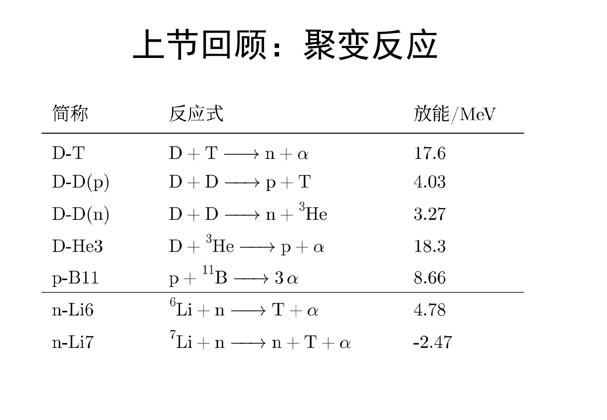

[课堂回顾T01–T03](Transcript_Corrected.md#T01) · [来源与订正](Lecture_Source_Map.md)

自测：为什么目前主要研究D–T，而不是只选带电产物反应？

聚变首先要在可实现的温度、密度和约束下产生足够反应。反应性难关尚未解决时，转换效率的潜在优势不足以抵偿更高的反应条件要求。

## 2. 聚变反应不等于聚变能源

能源系统需要比较总产出与维持运行的投入。即使某个物理环节的产出略大于投入，经过加热、电源和热电转换等环节后，系统也可能没有净电力输出。两个效率均为80%的连续环节，总效率只有64%；热电转换若只有30%–40%，更需要在前级留出余量。因此课件强调“产出远大于投入”，这是工程余量的要求，不是一个对所有系统都固定的十倍判据。

化学燃烧的点火能相对释放能量很小；裂变的链式反应使维持反应具有不同的物理机制。聚变的困难在于，维持反应物的高能状态本身可能消耗大量功率。检测到中子、氦或少量D–T反应，只能证明发生了核反应，不能单凭这一点断言实现能源增益。

这里也要分清系统边界：从高温等离子体流出的热量是等离子体的损失，却可能被外部包层收集，成为电站的热输入。后续讨论必须先说明是在给等离子体算账，还是给整座电站算账。

[课堂回顾T04](Transcript_Corrected.md#T04) · [课件PDF8](assets/public/聚变能源概论2026L3_公开版.pdf#page=8)

自测：反应释放17.6 MeV，而入射离子仅100 keV，为什么仍不能直接说赚了176倍？

只有一小部分入射离子发生聚变，其余离子的加速能及设备损耗也必须计入投入；此外还要计入取能和加热效率。

## 3. 束流能量、质心能量与温度

单个带单位电荷的离子经过电势差 \(\Delta V\)，获得的定向动能为 \(e\Delta V\)。因此100 kV对应100 keV。这个事实说明让少数粒子达到核反应所需能区在物理上并不困难；它并未说明能够经济地维持大量反应。

温度描述相对于平均流动的随机运动，不能把所有定向动能都算成温度。一个高速而能散很窄的离子束，可以具有很高的平均定向能量，而束流自身的随机能量较小。只有在相应的热分布意义下，才使用 \(k_BT\) 描述热能尺度。\(1\,\mathrm{eV}\) 对应约11600 K，10 keV对应约1.16亿K。

比较截面峰值还要核对参考系。若氚靶静止，氘束的实验室能量为 \(E_D\)，则非相对论近似下

\[
E_{\rm cm}=\frac{m_T}{m_D+m_T}E_D\simeq\frac35E_D.
\]

所以约65 keV的质心能量对应约108 keV氘束能量，两张图上约65和100 keV的峰位置可以是在表达同一能区。该峰是截面随碰撞能量的峰，不是反应率系数随温度的峰。

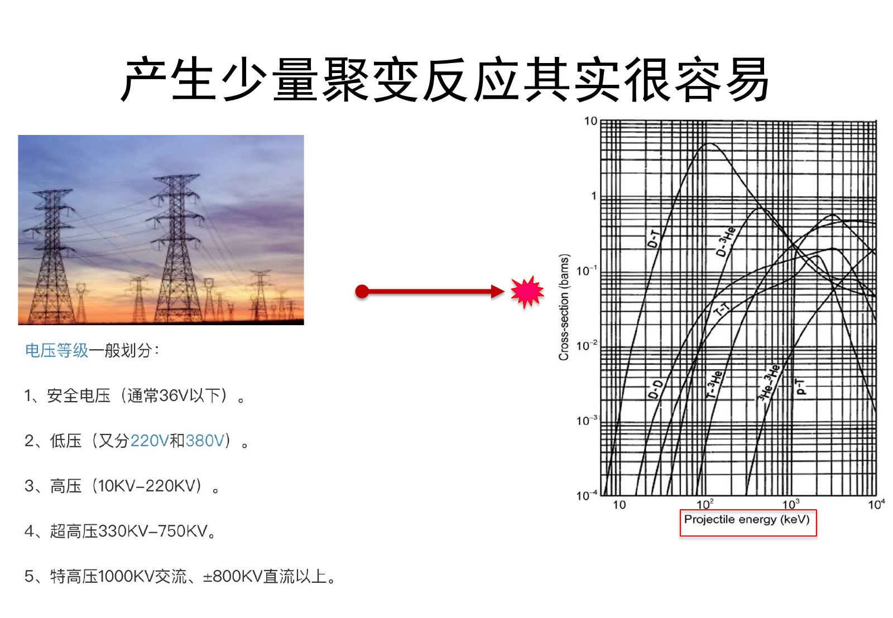

课堂以早期人工聚变和一个“用高压加速就能发电”的提案说明区别。历史例子中的D–D工作见Oliphant、Harteck和Rutherford的1934年论文记录；课件所写1932年与该记录有出入，见[来源订正](Lecture_Source_Map.md#corrections)。这些故事用于说明反应与能源的差别，不提供装置制作步骤。

[课堂回顾T05–T07](Transcript_Corrected.md#T05) · [教材第四章PDF1–2](../../Global/Textbooks/聚变能源概论_第四章_转正阅读版.pdf#page=1)

自测：给定100 keV束能，能否直接把束流说成十亿度等离子体？

不能。束能包含平均定向运动；温度对应围绕平均运动的随机能量分布。把两者直接等同会误判束靶与热核体系。

## 4. 束靶反应的主要竞争者：库仑散射

入射离子不只与靶核发生聚变，还会与电子和离子通过电磁相互作用交换能量、改变方向。固体靶的原子尺度约为 \(10^{-10}\,\mathrm m\)，几何面积的量级约为 \(10^8\) barn，远大于典型聚变截面。这只是帮助理解电子阻止效应的尺度比较，不是严格的电子碰撞截面计算。

对离子靶，先考虑经典两体库仑散射。令相对速度为 \(v\)，约化质量为 \(\mu\)，散射角为 \(\theta\)，瞄准距离为 \(b\)，并记

\[
K=\frac{Z_1Z_2e^2}{4\pi\varepsilon_0},\qquad
b_{90}=\frac{K}{\mu v^2},\qquad
\cot\frac\theta2=\frac b{b_{90}}.
\]

当 \(b=b_{90}\) 时，散射角为90°。以 \(b\le b_{90}\) 对应的大角度散射有效面积定义

\[
\sigma_{90}=\pi b_{90}^2
=\frac{Z_1^2Z_2^2e^4}{16\pi\varepsilon_0^2\mu^2v^4}.
\]

它随速度四次方的倒数变化，因此低能区库仑偏转尤其显著。“90°散射”表示原束方向被显著改变，不是总能量凭空消失。若粒子仍留在体系内，能量可转入随机运动或别的粒子；对一个依赖定向束能的方案，这仍会破坏所需的束流状态。

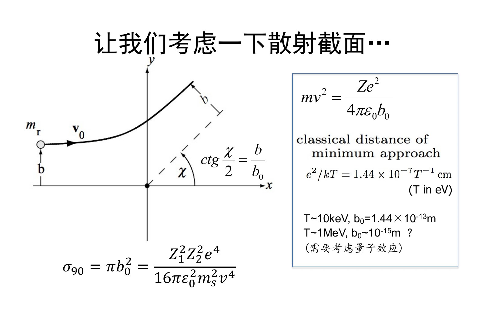

必须区分两个长度：若 \(E_{\rm rel}=\mu v^2/2\)，则 \(b_{90}=K/(2E_{\rm rel})\)；正碰时的最近距离是 \(r_{\min}=K/E_{\rm rel}=2b_{90}\)。课件把90°瞄准距离与最近接近距离的称呼、温度估算并置，不能直接当作同一个严格定义。课件给出的 \(1.44\times10^{-13}\,\mathrm m\) 代入 \(\pi b^2\) 确为约651 barn；若明确取 \(E_{\rm rel}=10\,\mathrm{keV}\)，则 \(b_{90}\simeq7.20\times10^{-14}\,\mathrm m\)，对应约163 barn。后续计算要先固定能量口径，不能混用系数。

[课堂回顾T08–T09](Transcript_Corrected.md#T08) · [课件PDF12–14](assets/public/聚变能源概论2026L3_公开版.pdf#page=12)

自测：大角度散射把定向能转成随机能，是否意味着体系总能量全部丢失？

不是。对定向束而言失去了有用的束特征；对封闭热体系而言，散射本身可以只是内部能量再分配。真正跨越系统边界的能量才计入该系统的净损失。

## 5. 多次小角散射为什么不能相互抵消

粒子遇到一个离子只偏转一点，不表示经历许多次碰撞后仍保持原方向。以独立、平均值为零的小偏转 \(\delta\theta_j\) 为例，平均偏转可以为零，但方差会累加：

\[
\left\langle\sum_j\delta\theta_j\right\rangle=0,
\qquad
\left\langle\left(\sum_j\delta\theta_j\right)^2\right\rangle
=\sum_j\langle\delta\theta_j^2\rangle.
\]

这与醉汉随机行走相同：向左、向右没有平均偏好，典型离开起点的距离仍会增加。许多小角散射共同造成速度方向的扩散和束流热化。

经典弱耦合近似中，综合不同瞄准距离的贡献会出现库仑对数。课件以德拜长度作为远端截断，以近碰撞尺度作为近端截断，写成

\[
\ln\Lambda\simeq\ln\frac{\lambda_D}{b_{\min}},\qquad
\sigma_s\sim2\ln\Lambda\,\sigma_{90}.
\]

课件示意 \(2\ln\Lambda\sim40\)。这里的 \(\sigma_s\) 是用于累计偏转的有效尺度，不等于没有截断的卢瑟福总截面；小距离端在必要时还要考虑量子效应。掌握“小偏转会累积”的图像是基本要求，完整推导是选做。

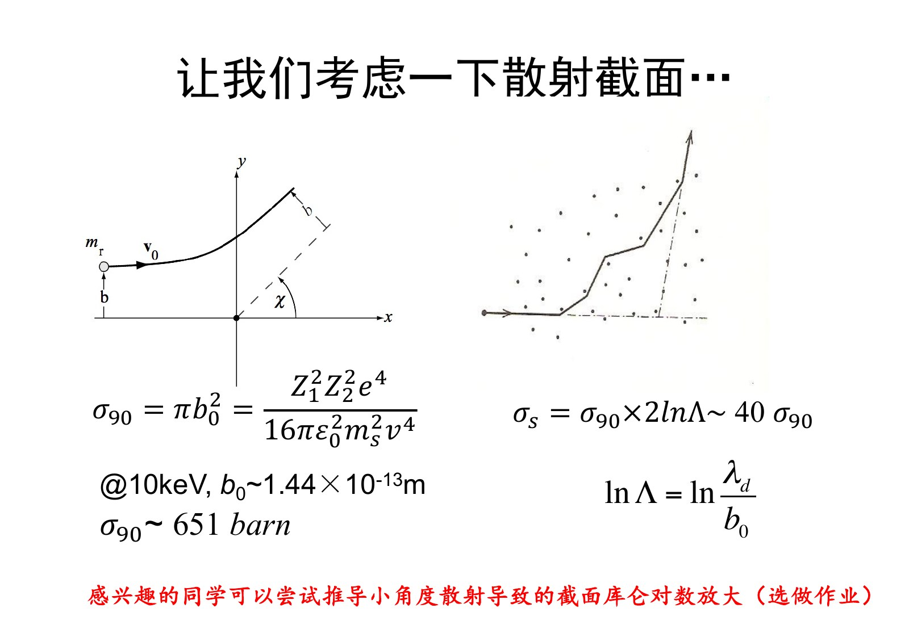

[课堂回顾T10](Transcript_Corrected.md#T10) · [课件PDF14](assets/public/聚变能源概论2026L3_公开版.pdf#page=14)

自测：平均偏转为零，为什么束流仍会展宽？

平均值只描述分布中心，方差描述分布宽度。独立小偏转的方差相加，所以中心可以不动而方向分布越来越宽。

## 6. 用一次能量核算理解束靶的困难

课件用20 keV氘束打氚靶作数量级说明：约 \(10^5\) 个氘离子发生显著散射时，至多约一个发生聚变。即使只按这些离子的束能计算，投入尺度已经是

\[
20\,\mathrm{keV}\times10^5=2\times10^9\,\mathrm{eV}=2000\,\mathrm{MeV},
\]

而一次D–T反应只释放17.6 MeV，二者之比约114。这个估算还没有计入加速效率等工程损耗，足以说明低能束靶方案不能只看“单次核反应的能量比”。课件的 \(10^5\) 是从图上读出的示例量级，不应脱离靶条件、参考系和散射定义当作普适概率。

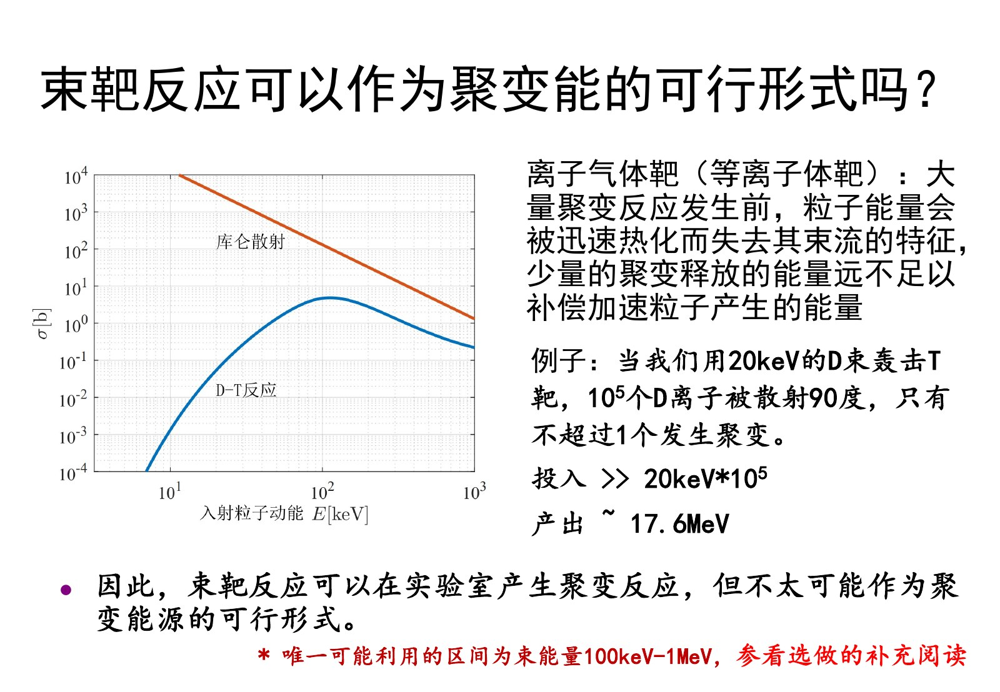

课堂没有把所有非热方案一概判为数学上不可能，而是指出某些100 keV–1 MeV能区值得进一步计算。即使简单模型出现小幅正收益，完整系统仍需扣除热化、电子阻止、维持束分布、辐射和设备效率的代价。选读论文的任务正是检查这些假设，而不是只拿曲线交点证明可发电。

ZETA例子进一步提醒：检测到聚变中子仍不足以证明已得到所期待的热核状态。定向束靶反应与近似各向同性的热分布可产生不同的中子角分布；应联合能谱、角分布和等离子体参数判断。角分布受运动学、几何及分布函数影响，不把单一判据绝对化。

[课堂回顾T11–T13](Transcript_Corrected.md#T11) · [课件PDF15–16](assets/public/聚变能源概论2026L3_公开版.pdf#page=15)

自测：为什么“中子确实来自聚变”与“已实现热核聚变能源”可以同时一真一假？

中子来源回答的是核反应是否发生；热核状态、净功率和工程收益还需要各自的证据。束靶过程也会产生真实的聚变中子。

## 7. 热核聚变利用的是热运动

Thermonuclear中的“热”首先指thermal，即粒子通过随机热运动相遇。它不仅仅是hot，即温度数值很高。对D–T而言，为获得足够反应率，热运动确实还需要高温；两个含义相关，却不能互相替代。

课堂用高尔夫球与多洞场地作比喻：定向束靶希望一个粒子击中指定目标；在被约束的热体系中，粒子本来就向各方向运动，没与这个核聚变，仍可与其他核相遇。弹性散射重新分配能量和方向，不必每次都重新建立一束完全相同的定向粒子。不过这个优势成立的前提，是粒子和热量能够被保持足够久；随机运动本身不会创造额外能量。

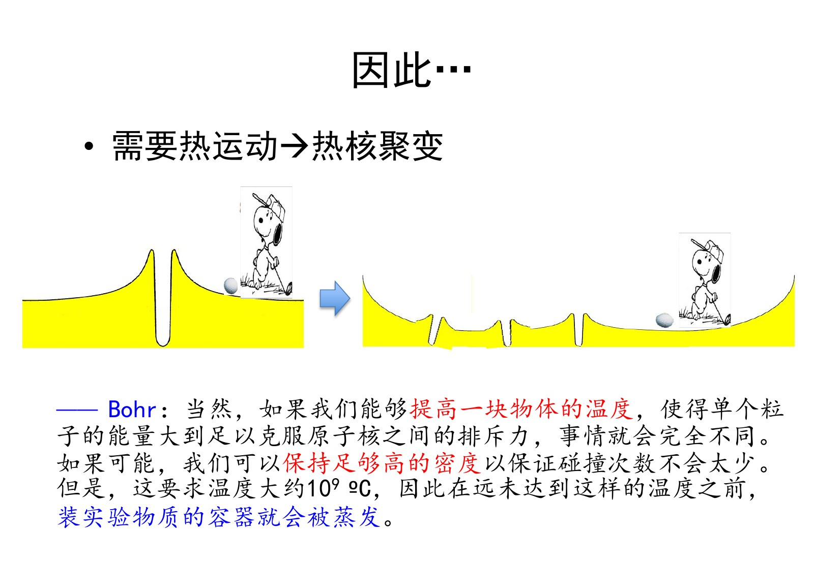

麦克斯韦分布还具有高能尾部。反应率系数是对整个相对速度分布的平均：

\[
\langle\sigma v\rangle=\int\sigma(v)v f_{\rm rel}(\mathbf v)\,d^3v.
\]

因此温度不必达到截面峰所对应的约65 keV，10–20 keV的热分布中也有较高能的相对碰撞。降低平均热能投入，同时利用高能尾部的反应，是热核方案的重要特点。但不是每个粒子都达到同一能量，也不是超过某一温度后便可不受其他约束地增益无限。

课件的商业宣传例子把“精确瞄准”直接当作优于“随机碰撞”的依据。正确评价应追问束流热化有多快、有效反应概率多大、损失如何补偿；本讲并未完成对具体企业当前技术状态的独立审查。

[课堂回顾T14–T17](Transcript_Corrected.md#T14) · [教材4.1](../../Global/Textbooks/聚变能源概论_第四章_转正阅读版.pdf#page=2)

自测：高能尾部为什么允许平均温度低于截面峰能量？

温度规定分布宽度，而不是给所有粒子同一个动能。较高相对能量的碰撞仍占一定份额，并因截面较大而显著贡献热平均反应率。

## 8. 除温度以外，还要密度和保持时间

加热使原子逐渐电离，形成自由电子和离子组成的等离子体。D–T燃料在keV量级已充分电离；高Z杂质是否完全剥离需要另行判断，不能由氢同位素的结论直接推广。

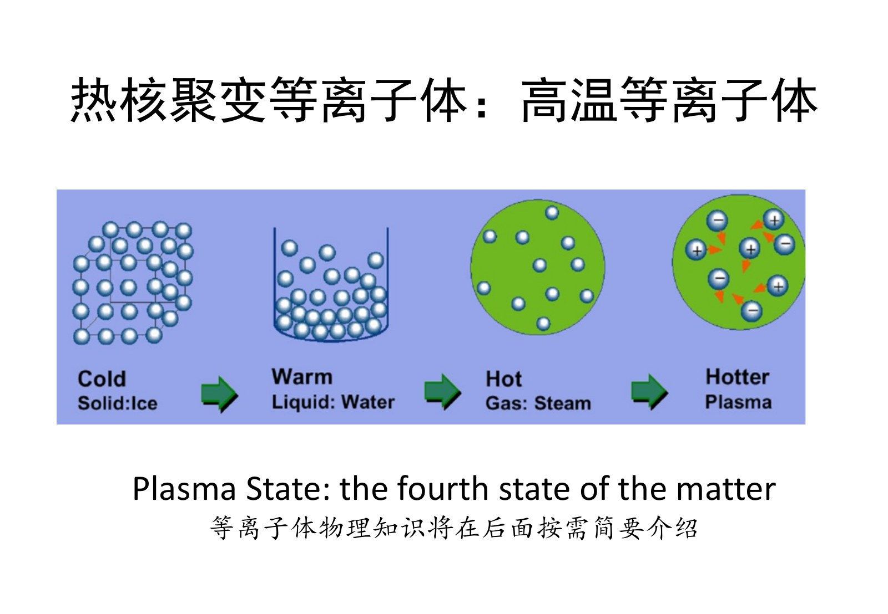

高温意味着一次相遇可能进入有利的反应能区；密度决定单位体积内相遇的机会；能量保持时间决定在冷却之前能经历多少次有效相遇。课上继续使用球与洞的比喻：洞稀疏就需要多运动一段时间，球若跑出边界或在滚动中失去足够能量，尚未反应就退出了有效过程。

因此必须同时研究粒子约束与能量约束。它们相互关联，却不是同一个时间常数。接下来先用功率平衡把“保温”这件事定量化。本讲只建立各项功率，完整的约束条件留到下一讲。

[课堂回顾T18–T19](Transcript_Corrected.md#T18) · [教材印刷32](../../Global/Textbooks/聚变能源概论_第四章_转正阅读版.pdf#page=3)

自测：温度已经达到10 keV，为什么仍不能保证成为能源？

密度过低时反应少，损失过快时来不及产生足够反应，还要核算产物能量留存与外部转换效率。

## 9. 聚变功率密度：四分之一从哪里来

不同种燃料的热核反应率为 \(n_1n_2\langle\sigma v\rangle\)，乘每次反应释放的能量 \(E_f\)，得到

\[
S_f=n_1n_2\langle\sigma v\rangle E_f.
\]

对纯D–T、固定电子密度 \(n=n_D+n_T\)，令氘的数目份额为 \(x\)，则 \(n_Dn_T=x(1-x)n^2\)。该乘积在 \(x=1/2\) 最大，因此

\[
n_D=n_T=\frac n2,\qquad S_f=\frac14n^2\langle\sigma v\rangle E_f.
\]

这里的 \(1/4\) 来自配比；它不是相同粒子反应为避免重复计数而出现的 \(1/2\)。若燃料带有不同电荷数或另有限定条件，最优配比需要重新推导，不能直接照抄。

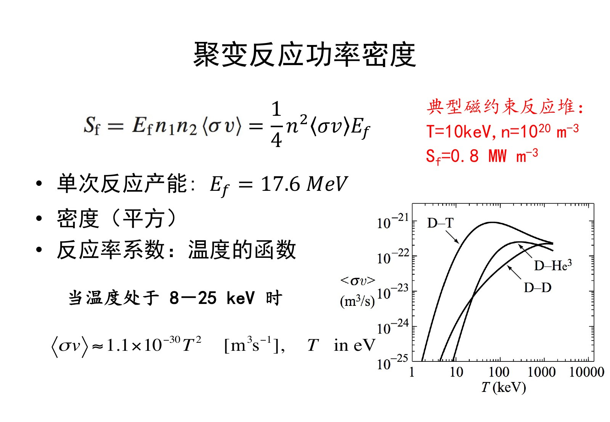

课件在8–25 keV区间使用近似

\[
\langle\sigma v\rangle\simeq1.1\times10^{-30}T_{\rm eV}^{\,2}\;\mathrm{m^3/s}.
\]

取 \(T=10\,\mathrm{keV}=10^4\,\mathrm{eV}\)，得到 \(\langle\sigma v\rangle\simeq1.1\times10^{-22}\,\mathrm{m^3/s}\)。取 \(n=10^{20}\,\mathrm{m^{-3}}\)，并将17.6 MeV换成 \(2.8198\times10^{-12}\,\mathrm J\)，有

\[
S_f=\frac14(10^{20})^2(1.1\times10^{-22})(2.8198\times10^{-12})
\simeq7.75\times10^5\,\mathrm{W/m^3}=0.775\,\mathrm{MW/m^3}.
\]

这就是课件约0.8 MW/m³的来源。量纲也吻合：\(\mathrm{m^{-6}\,m^3s^{-1}\,J=W/m^3}\)。若温度降到100 eV，已经超出拟合区间，不能机械使用平方律给出精确反应率。

[课堂回顾T20](Transcript_Corrected.md#T20) · [教材式4.2](../../Global/Textbooks/聚变能源概论_第四章_转正阅读版.pdf#page=3)

自测：保持温度、配比不变，电子密度加倍，聚变功率密度怎样变化？

增加到四倍。这是当前简化条件下的密度平方关系；并不说明约束时间及所有损失也保持不变。

## 10. 热传导：从热流到体积平均损失

热量传递的基本机制是对流、传导和辐射。“热交换”是过程的概括，不是并列的第四种机制。对流由物质整体流动携带能量；本讲最简模型避免把高温燃料直接流出系统的对流作为主要损失项。这是一项模型简化，并不意味着真实聚变等离子体没有粒子输运、排灰或边界流动。

高温芯部与较冷边界之间存在温度梯度，因而存在向外的热流。热流密度 \(\mathbf q\) 的单位是W/m²。以单一物种的能量温度 \(\Theta=k_BT_K\) 为变量时，课件所用扩散写法是

\[
\mathbf q=-\kappa\nabla\Theta=-\frac32n\chi\nabla\Theta,
\qquad [\chi]=\mathrm{m^2/s}.
\]

若改用K温标，系数中要保留 \(k_B\)；若把温度数值直接写成eV，则要同时处理eV到J的转换。电子、离子可有各自的 \(\chi\) 和热流，最后应求和。这里用一个宏观系数，是为避免在本讲展开复杂的输运理论。

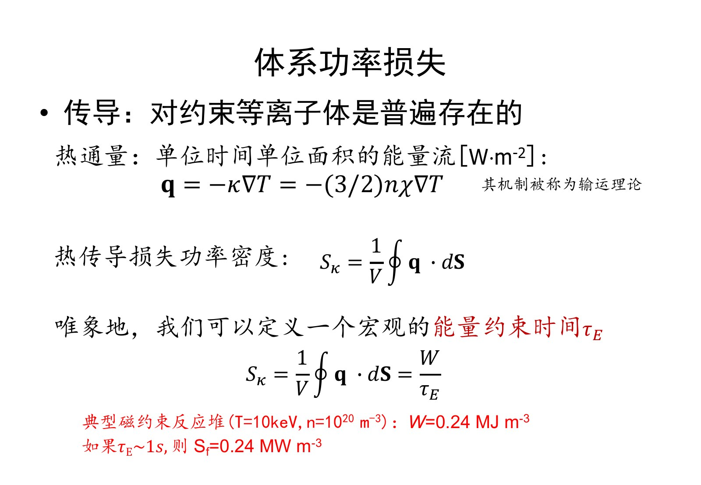

用指向体系外侧的面积元积分可得传导功率，再除以体积得到平均损失功率密度：

\[
P_\kappa=\oint_{\partial V}\mathbf q\cdot d\mathbf S,
\qquad S_\kappa=\frac{P_\kappa}{V}
=\frac1V\int_V\nabla\cdot\mathbf q\,dV.
\]

注意最后一个式子是散度的体积平均，不能在非均匀体系中直接去掉积分，写成某一点的散度。量纲上，热流W/m²乘面积得到W，再除体积得到W/m³。

如果温度变化的尺度为 \(L\)，粗略估计 \(S_\kappa\sim n\Theta\chi/L^2\)，于是保温时间的尺度约为 \(L^2/\chi\)。这只说明尺寸和输运强度为何会影响约束，具体几何系数与定标律仍需模型或实验。

[课堂回顾T21–T23](Transcript_Corrected.md#T21) · [教材式4.3–4.4](../../Global/Textbooks/聚变能源概论_第四章_转正阅读版.pdf#page=3)

自测：热扩散系数与流速为什么不能混为一谈？

流速的量纲是m/s，扩散系数是m²/s。扩散刻画随机运动造成的分布展宽，典型距离平方随时间增长。

## 11. 能量约束时间与内能的统计范围

以 \(W\) 表示体积平均热内能密度，定义

\[
S_\kappa=\frac W{\tau_E}.
\]

若只有该传导损失、没有加热，且 \(\tau_E\) 在考察过程中可近似为常数，则

\[
\frac{dW}{dt}=-\frac W{\tau_E},\qquad
W(t)=W(0)e^{-t/\tau_E}.
\]

经过一个 \(\tau_E\)，内能降至初值的 \(1/e\)，不是“降到零”，也不是“降到一半”。若温度变化使输运系数显著变化，衰减可以偏离单一指数。

保温杯的比喻很直观：同样装热水，保温性能越好，冷却越慢，约束时间越长。若用外部加热恰好补偿损失，维持内能不变，则在只有这项损失的模型中，\(\tau_E=W/S_h=U/P_h\)，其中 \(U=WV\)。有辐射或其他通道时，要写出完整平衡，不能在分母任意换成总加热功率又把 \(\tau_E\) 继续解释成只针对传导的时间。

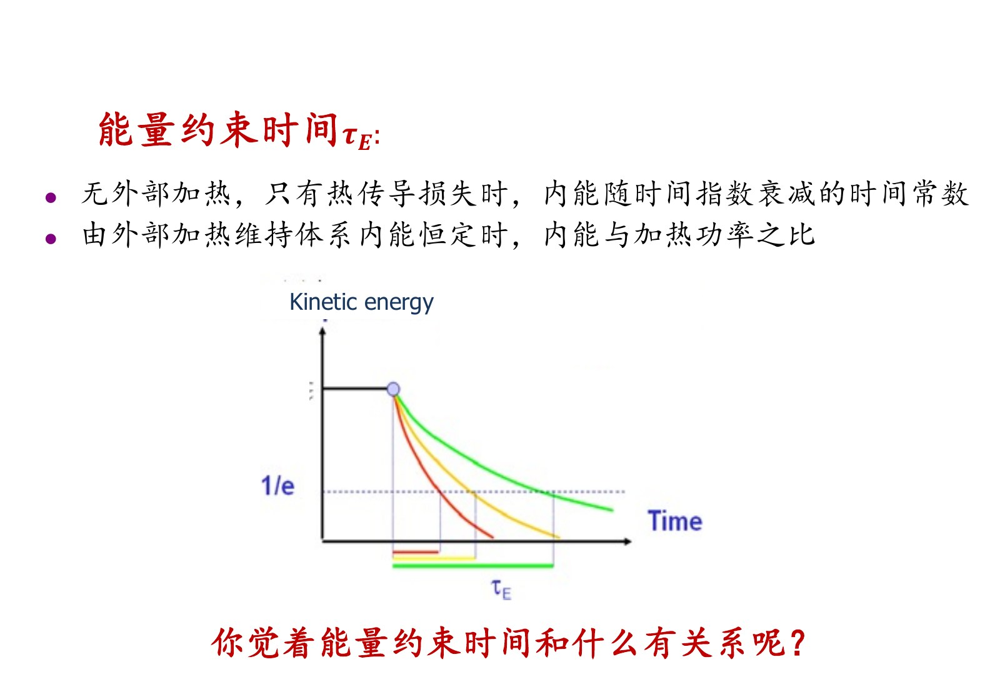

D–T的密度口径需要特别统一。对完全电离的单电荷燃料，\(n_i=n_e=n\)；同温时

\[
W_e=\frac32n\Theta,\quad W_i=\frac32n\Theta,
\quad W=W_e+W_i=3n\Theta.
\]

在10 keV、\(10^{20}\,\mathrm{m^{-3}}\) 下，每一种的内能约0.240 MJ/m³，合计约0.481 MJ/m³。若 \(\tau_E=1\,\mathrm s\)，合计传导损失约0.481 MW/m³。课件示例的0.24与单一物种数值吻合，教材式(4.4)明确把电子和离子相加；本讲做完整D–T热内能核算时采用后者，保留课件0.24为对照。

[课堂回顾T23–T25](Transcript_Corrected.md#T23) · [教材印刷32–33](../../Global/Textbooks/聚变能源概论_第四章_转正阅读版.pdf#page=3)

自测：装置维持高温1000秒，能否据此说能量约束时间也是1000秒？

不能。放电时长是实验运行多久；能量约束时间是给定状态下储能与相应损失功率的比值。持续加热可以维持很长时间，同时能量仍在很短的时间尺度上不断补入、流出。

## 12. 轫致辐射：必不可少的损失项

电子在离子库仑场中改变速度，作为加速电荷会辐射电磁波，这就是轫致辐射。Bremsstrahlung对应制动辐射。课堂的古车“轫”字故事用于帮助记忆术语；本讲学习重点是辐射由什么过程产生、与哪些参数有关。

非相对论单电子的辐射功率可写成

\[
P=\frac{e^2a^2}{6\pi\varepsilon_0c^3}
=\frac{\mu_0e^2a^2}{6\pi c}.
\]

库仑加速度的量级随 \(Z/b^2\) 增加。对碰撞过程积分、再对电子速度分布及离子种类求和，就得到热等离子体的辐射功率。课件PDF31列出了这条推导路线，课堂不要求逐项完成碰撞积分。

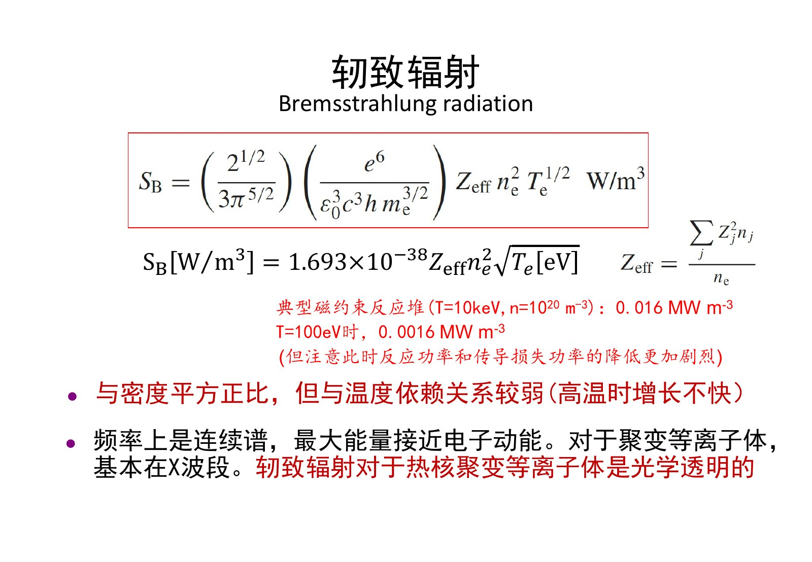

用于数值计算的式子为

\[
S_B=1.693\times10^{-38}Z_{\rm eff}n_e^2\sqrt{T_e[\mathrm{eV}]}\quad\mathrm{W/m^3},
\qquad
Z_{\rm eff}=\frac{\sum_j n_jZ_j^2}{n_e}.
\]

密度以m⁻³计。教材用keV时，系数约为 \(5.355\times10^{-37}\)；这是温度单位变换，不是两套不同物理规律。这里 \(Z_j\) 表示离子的实际电荷数，\(n_e=\sum_jn_jZ_j\)。纯完全电离D–T有 \(Z_{\rm eff}=1\)。

在本讲参数下，10 keV对应 \(S_B\simeq0.0169\,\mathrm{MW/m^3}\)，100 eV对应 \(0.00169\,\mathrm{MW/m^3}\)。温度降低100倍，它只降低10倍。相反，在适用区间内聚变反应率对温度的增长快得多，因而较低温阶段更容易受辐射约束。不要把这个趋势说成“轫致辐射高温增长很快”。

轫致辐射具有连续谱，单个电子一次发出的光子能量受该电子可用动能限制；热分布没有在 \(k_BT_e\) 处突然截断。对于本讲稀薄高温磁约束等离子体，重要辐射处在X射线等波段，常可近似为光学薄：光子产生后较容易逃逸，带走热能。这里“X”指X射线，不是微波工程的X频段。

[课堂回顾T26–T28](Transcript_Corrected.md#T26) · [教材式4.5–4.7](../../Global/Textbooks/聚变能源概论_第四章_转正阅读版.pdf#page=4)

自测：为什么仅提高密度不能自动战胜轫致辐射？

在温度、配比和有效电荷数不变时，聚变功率和轫致辐射都与密度平方成正比，二者之比不会仅因密度升高而改善。

## 13. 回旋辐射：发射功率不等于净逃逸功率

带电粒子在磁场中作回旋运动，即使速率不变，速度方向也在改变，仍有加速度并产生辐射。课件把回旋与同步辐射并列讨论；在更精细的理论中，非相对论与相对论辐射的频谱还需区别。本讲使用非相对论热电子的估算式

\[
S_C=6.21\times10^{-20}B^2n_eT_e[\mathrm{eV}]\quad\mathrm{W/m^3}.
\]

磁场以T计。它对密度为一次方，对温度为一次方，对磁场为平方。回旋基频为 \(eB/(2\pi m_e)\)，谐波写为

\[
f_\ell=\ell\frac{eB}{2\pi m_e},\qquad \ell=1,2,\ldots
\]

这里用 \(\ell\) 表示谐波序数，避免与密度 \(n\) 混淆。在6 T时基频约168 GHz，处于毫米波范围。

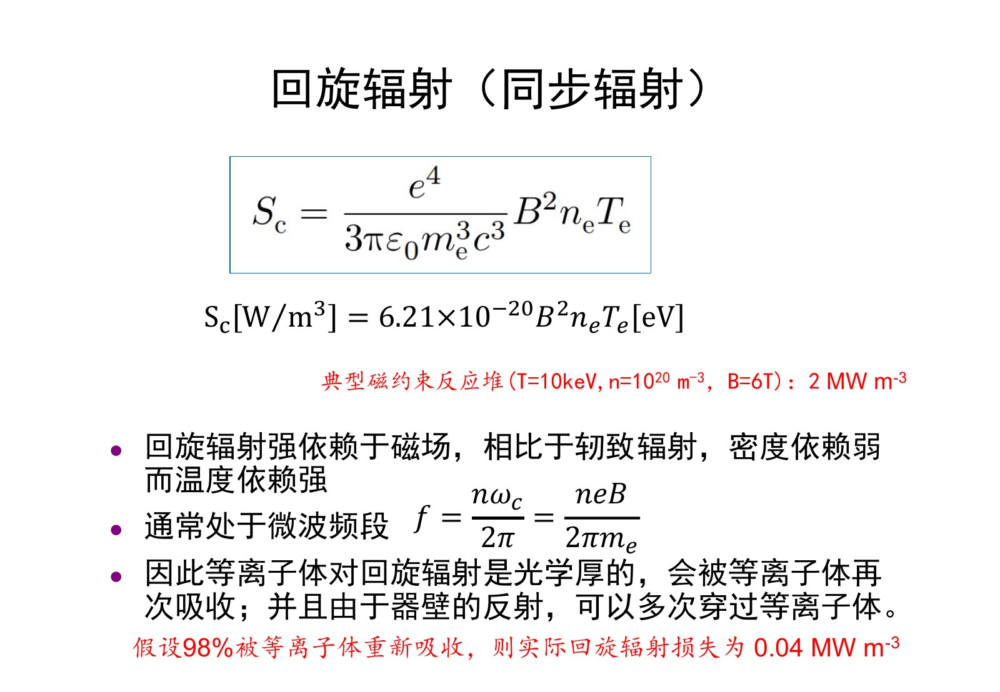

代入10 keV、\(10^{20}\,\mathrm{m^{-3}}\)、6 T，发射功率密度约2.24 MW/m³。这个数比聚变功率大，却不能立即判定体系失败，因为大量辐射可能被等离子体再次吸收，金属壁反射也会增加再穿越的机会。

若仅作示例，假设再吸收比例为98%，则净损失约为

\[
S_{C,\rm net}=(1-0.98)S_C\simeq0.0447\,\mathrm{MW/m^3}.
\]

课件PDF33把它约为0.04；PDF36表格的0.024与同一公式、参数不一致。98%也不是普适常数，实际吸收与频率、温度、密度、路径和壁面反射有关。高温或强磁场会改变损失的重要性，因此“本例较小”不等于“任何聚变路线都可忽略”。

[课堂回顾T29](Transcript_Corrected.md#T29) · [教材式4.8](../../Global/Textbooks/聚变能源概论_第四章_转正阅读版.pdf#page=4)

自测：若再吸收比例由98%降为90%，发射功率不变，净损失增加几倍？

逃逸比例由2%变成10%，净损失增为五倍。因此不能只报总发射功率，也不能忽略吸收假设。

## 14. 为什么不能直接套用黑体辐射

黑体辐射定律给出的是特定热平衡与吸收条件下的表面辐射通量：

\[
F_{bb}=\sigma_{\rm SB}T_K^4
\simeq1.03\times10^9T_{\rm eV}^{\,4}\quad\mathrm{W/m^2}.
\]

若不检查条件就代入10 keV，会得到约 \(10^{19}\,\mathrm{MW/m^2}\) 的巨大数值。但本讲稀薄磁约束等离子体并不是一个对相关频段完全吸收、以核心温度形成黑体表面的物体，因而不能将该数值作为它的真实损失。

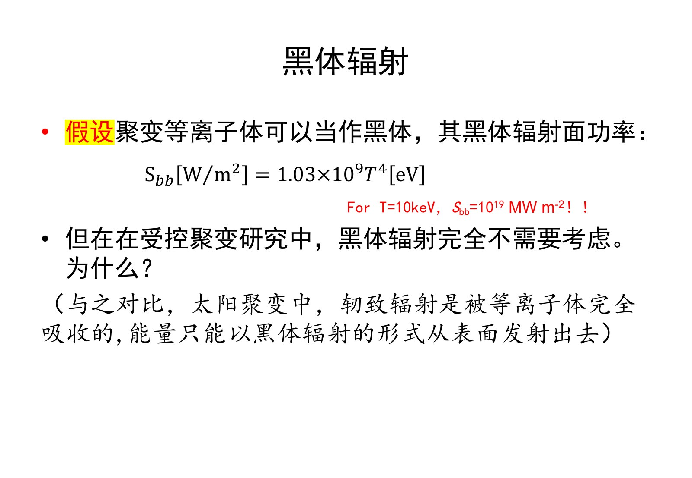

太阳内部对重要辐射很不透明，能量经多次相互作用向外输运，最终从温度低得多的光球发出近似黑体光谱；绝不是用太阳核心温度直接乘外表面积。本讲装置则需要按轫致、回旋等发射与吸收机制计算。“不套黑体公式”不代表没有电磁辐射损失，也不代表所有惯性约束或高密度等离子体都可作相同简化。

表面通量W/m²与体积功率密度W/m³还必须区分。若要比较，需结合面积、体积和辐射输运；不能只把两列数值直接相减。

[课堂回顾T30](Transcript_Corrected.md#T30) · [教材印刷33](../../Global/Textbooks/聚变能源概论_第四章_转正阅读版.pdf#page=4)

自测：为什么“温度高，所以一定按黑体辐射巨大功率”不是有效推理？

温度只是一项状态参数。使用黑体定律还要求相应的吸收、热平衡和光学厚度条件；这些条件不成立时，应使用具体辐射机制。

## 15. 线辐射与高电荷杂质

线辐射来自束缚电子在能级之间跃迁，具有特征频率。充分电离的D–T芯部没有氢同位素的束缚电子，因此这类线辐射较弱；在温度较低的边界区仍可出现。高Z杂质即使处于较高温度，也可能保留内层电子，不能照搬氢的结论。

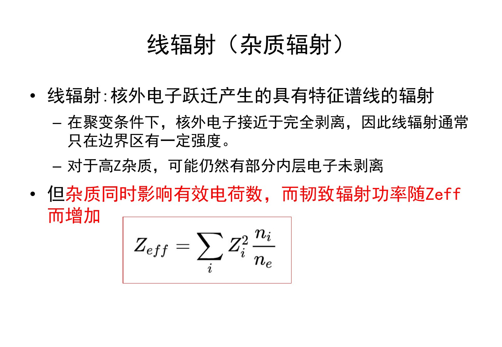

离散谱线并不自动意味着总功率小。总辐射功率取决于谱线强度及跃迁过程；多条强线也能带走显著能量。在本讲的最简纯D–T模型里略去线辐射，应归因于燃料电离状态及所选工作条件，而不是“谱线窄，所以积分一定小”。

杂质还会通过 \(Z_{\rm eff}\) 增强轫致辐射。设一种杂质的实际电荷数为 \(Z\)，其数密度为 \(n_Z\)，其余为单电荷燃料，则由准中性条件

\[
n_e=n_f+Zn_Z,\qquad
Z_{\rm eff}=1+Z(Z-1)\frac{n_Z}{n_e}.
\]

所以高电荷杂质的少量增加也可能显著提高有效电荷数。这里是 \(Z_j^2\) 进入加权求和，而 \(S_B\) 在固定电子密度、温度下与 \(Z_{\rm eff}\) 一次方成正比，不是再与 \(Z_{\rm eff}^2\) 成正比。

[课堂回顾T31](Transcript_Corrected.md#T31) · [教材印刷34上半页](../../Global/Textbooks/聚变能源概论_第四章_转正阅读版.pdf#page=5)

自测：相同电子密度、温度下，有效电荷数从1升到2，轫致辐射增加几倍？

增加到两倍。不可把定义内部的离子电荷平方，再错误地变成公式外的有效电荷数平方。

## 16. 将各项放在同一张功率表中

以下统一采用纯D–T、\(n_e=n_i=10^{20}\,\mathrm{m^{-3}}\)、\(T_e=T_i\)、\(\tau_E=1\,\mathrm s\)、\(B=6\,\mathrm T\)、\(Z_{\rm eff}=1\)，回旋辐射示例取98%再吸收。传导项使用教材的电子、离子合计内能。改变温度但固定约束时间和吸收比例只是对比参数依赖的思想实验，并非真实装置的完整运行路径。

| 体积功率密度 | 10 keV（MW/m³） | 100 eV时如何变化 |
|---|---:|---|
| 聚变 \(S_f\) | 0.775，约0.8 | 已超出平方拟合区间，须重新查反应率；课件给出远小于高温值的示意 |
| 传导 \(S_\kappa\)，电子＋离子 | 0.481 | 0.00481；按固定约束时间线性缩放 |
| 轫致 \(S_B\) | 0.0169 | 0.00169；温度降低100倍而此项只降低10倍 |
| 回旋总发射 \(S_C\) | 2.24 | 0.0224；固定磁场时线性缩放 |
| 回旋净损失 \(0.02S_C\) | 0.0447 | 0.000447；以相同吸收假设作比较 |

课件PDF36保留了课堂原表，可用于对照；其中传导0.24是单物种数值，回旋0.024与PDF33不一致，不能把两列作为一套已经统一的精确数据使用。

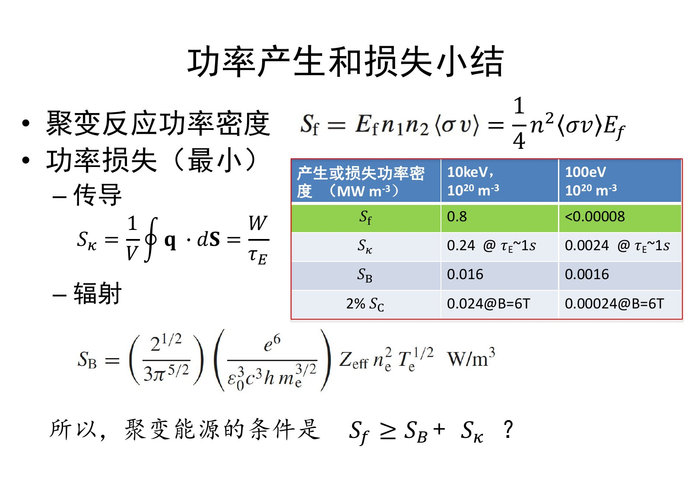

在这个示例下，传导是主要损失；轫致与回旋净损失较小，但后两者为何较小有不同原因：轫致的发射本身较小，回旋则是总发射大而假设再吸收强。低温时聚变反应骤弱，轫致相对变得重要；高温、强磁场或杂质增加时，原先略去的项需要重新检查。

[课堂回顾T32](Transcript_Corrected.md#T32) · [来源中的复算与数值冲突](Lecture_Source_Map.md#corrections)

自测：哪一项主要因为“再次吸收”而从大数值变成较小净损失？

回旋辐射。轫致辐射在本讲光学薄近似下，产生的辐射较容易逃逸；两项不能使用相同的忽略理由。

## 17. 为什么总聚变功率大于损失仍未回答点火

若直接比较 \(S_f\) 与 \(S_B+S_\kappa\)，漏掉了“聚变能量是否留在等离子体内”这一问题。D–T反应中，约3.5 MeV由α粒子携带，约14.1 MeV由中子携带。理想情况下α粒子有助于自加热，而中子通常离开等离子体，在外部结构中沉积能量。

用最简D–T图像承接下一讲，忽略其他项时可写为

\[
\frac{dW}{dt}=S_{h,\rm ext}+S_\alpha-S_\kappa-S_B,
\qquad S_\alpha\simeq\frac{3.5}{17.6}S_f\simeq\frac15S_f.
\]

这里仍假设α能量充分沉积。零外加热的点火要求自加热足以补偿损失；有外加热的稳态则可由两者共同补偿。按前面的10 keV示例，α功率约0.154 MW/m³，不能因总聚变0.775大于某些损失便认定已经点火。

从电站边界看，传导和辐射带出的热量又可能被回收，聚变能量也需经过转换效率才能变成电力。因此“等离子体点火”“科学增益”“净电力输出”要分别定义。这正是本讲末尾问题的用意，详细劳逊判据及增益公式属于下一讲，不作为本次已授内容展开。

[课堂回顾T33](Transcript_Corrected.md#T33) · [教材4.3作为衔接](../../Global/Textbooks/聚变能源概论_第四章_转正阅读版.pdf#page=5)

自测：为什么不能把17.6 MeV全部当作D–T等离子体的自加热？

大部分由中子携带并离开等离子体；带电α粒子的份额才有机会直接沉积于等离子体，而且还需检查其约束与沉积效率。

## 18. 本讲作业与复习顺序

课件PDF38列出的必做题为教材4.1。原题在印刷50／第四章PDF21，要求分别讨论D–T与D–³He两组参数下的聚变、轫致和回旋辐射功率，并说明回旋辐射再吸收怎样影响功率平衡。

| 原题参数 | D–T | D–³He |
|---|---|---|
| 密度 \(n\) | \(10^{20}\,\mathrm{m^{-3}}\) | \(10^{20}\,\mathrm{m^{-3}}\) |
| 磁场 | 6 T | 6 T |
| 温度 | 10 keV | 100 keV |

做题前先按教材本章约定辨认 \(n\) 是电子密度，再说明燃料配比以及是否假设电子、离子同温。D–³He两种离子的电荷数不同，不能照搬D–T的 \(n_D=n_T=n_e/2\) 和 \(Z_{\rm eff}=1\)。D–T的8–25 keV拟合更不能用到100 keV的D–³He。题面未逐一写明这些附加约定，所需D–³He反应率宜使用课程认可数据并记录来源；教材附录A目前尚未入库。本页仅保留题目与计算条件检查，不默认代做整题。

- [教材4.1原页](../../Global/Textbooks/聚变能源概论_第四章_转正阅读版.pdf#page=21)
- 选做：由经典库仑散射出发，推导多次小角散射对有效偏转的增强。
- 补充阅读：K-F Liu and A. W. Chao, *Accelerator based fusion reactor*, Nuclear Fusion **57**, 084002 (2017)，对加速器驱动聚变方案作评价；本次仅登记课件书目，未声称阅读论文全文。

建议复习时依次回答：束靶为什么受散射限制；热运动改变了什么；为什么还需要密度与保温时间；各功率项分别如何随密度、温度和磁场变化；最后明确功率是在什么系统边界上统计。能把这些连接起来，才适合进入下一讲的零维平衡。

[课件作业页](assets/public/聚变能源概论2026L3_公开版.pdf#page=38) · [来源与订正](Lecture_Source_Map.md)
